# 常考数据结构及比较

[TOC]

## 基本操作

### SkipList

一个跳表，应该具有以下特征：

1. 一个跳表应该有几个层（level）组成；
2. 跳表的第一层包含所有的元素；
3. 每一层都是一个有序的链表；
4. 如果元素x出现在第i层，则所有比i小的层都包含x；
5. 第i层的元素通过一个down指针指向下一层拥有相同值的元素；
6. 在每一层中，-1和1两个元素都出现(分别表示INT_MIN和INT_MAX)；
7. Top指针指向最高层的第一个元素。

构建有序链表
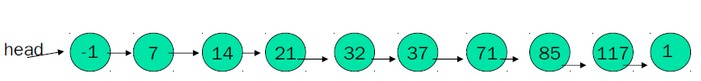
的一个跳跃表如下： 
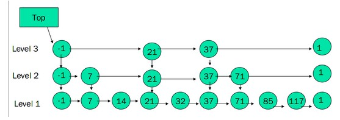

Skip List构造步骤：

- 给定一个有序的链表。
- 选择连表中最大和最小的元素，然后从其他元素中按照一定算法（随机）随即选出一些元素，将这些元素组成有序链表。这个新的链表称为一层，原链表称为其下一层。
- 为刚选出的每个元素添加一个指针域，这个指针指向下一层中值同自己相等的元素。Top指针指向该层首元素
- 重复2、3步，直到不再能选择出除最大最小元素以外的元素。

 **查找**

  目的：在跳跃表中查找一个元素x
  在跳跃表中查找一个元素x，按照如下几个步骤进行：

1. 从最上层的链（Sh）的开头开始
2. 假设当前位置为p，它向右指向的节点为q（p与q不一定相邻），且q的值为y。将y与x作比较
        (1) x=y 输出查询成功及相关信息
        (2) x>y 从p向右移动到q的位置
        (3) x<y 从p向下移动一格
3.  如果当前位置在最底层的链中（S0），且还要往下移动的话，则输出查询失败

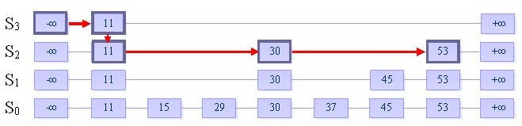 

**插入**

目的：向跳跃表中插入一个元素x

   首先明确，向跳跃表中插入一个元素，相当于在表中插入一列从S0中某一位置出发向上的连续一段元素。有两个参数需要确定，即插入列的位置以及它的“高度”。

   关于插入的位置，我们先利用跳跃表的查找功能，找到比x小的最大的数y。根据跳跃表中所有链均是递增序列的原则，x必然就插在y的后面。

   而插入列的“高度”较前者来说显得更加重要，也更加难以确定。由于它的不确定性，使得不同的决策可能会导致截然不同的算法效率。为了使插入数据之后，保持该数据结构进行各种操作均为O(logn)复杂度的性质，我们引入随机化算法（Randomized Algorithms）。

我们定义一个随机决策模块，它的大致内容如下：

- 产生一个0到1的随机数r   r ← random() 
- 如果r小于一个常数p，则执行方案A， if r<p then do A 否则，执行方案B     else do B 
- 初始时列高为1。插入元素时，不停地执行随机决策模块。如果要求执行的是A操作，则将列的高度加1，并且继续反复执行随机决策模块。直到第i次，模块要求执行的是B操作，我们结束决策，并向跳跃表中插入一个高度为i的列。


   我们来看一个例子：
   假设当前我们要插入元素“40”，且在执行了随机决策模块后得到高度为4
   步骤一：找到表中比40小的最大的数，确定插入位置

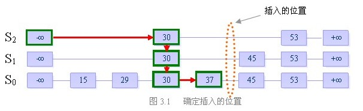
步骤二：插入高度为4的列，并维护跳跃表的结构 
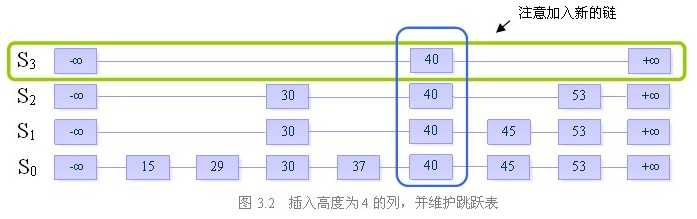

**删除**

目的：从跳跃表中删除一个元素x

删除操作分为以下三个步骤：

- 在跳跃表中查找到这个元素的位置，如果未找到，则退出 
- 将该元素所在整列从表中删除 
- 将多余的“空链”删除 

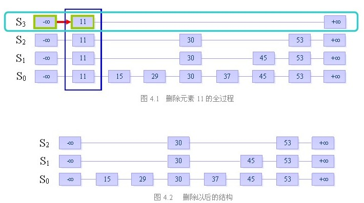

### AVL&&红黑

#### 二叉搜索树

​    二叉搜索树又被称为二叉排序树，那么它本身也是一棵二叉树，那么满足以下性质的二叉树就是二叉搜索树：

​    1、若左子树不为空，则左子树上左右节点的值都小于根节点的值

​    2、若它的右子树不为空，则它的右子树上所有的节点的值都大于根节点的值

​    3、它的左右子树也要分别是二叉搜索树

​    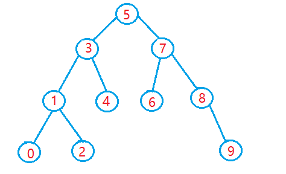

-----------

**二叉搜索树的插入**

   1、搜索

​    插入之前我们先来说说它的搜索，像上图这样的一棵二叉搜索树，我们要查找某一个元素是很简单的。因为它的节点分布是有规律的，所以查找一棵元素只需要如下的步骤就可以了：

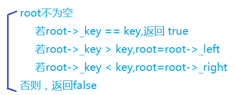

​    2、插入

​    由于二叉搜索树的特殊性质确定了二叉搜索树中每个元素只可能出现一次，所以在插入的过程中如果发现这个元素已经存在于二叉搜索树中，就不进行插入。

​    否则就查找合适的位置进行插入。

第一种情况：_root为空

   直接插入，return  true；

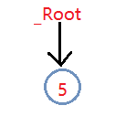

第二种情况：要插入的元素已经存在

​    如上面所说，如果在二叉搜索树中已经存在该元素，则不再进行插入，直接return  false；

第三种情况：能够找到合适位置

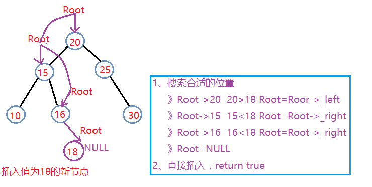

-------------

**二叉搜索树的删除**

​    对于二叉搜索树的删除操作，主要是要理解其中的几种情况，写起来还是比较简单的。

当然一开始还是需要判断要删除的节点是否存在于我们的树中，如果要删除的元素都不在树中，就直接返回false；否则，再分为以下四种情况来进行分析：

- 要删除的节点无左右孩子

- 要删除的节点只有左孩子

- 要删除的节点只有右孩子

- 要删除的节点有左、右孩子

 

删除方法解释：

   对于第一种情况，我们完全可以把它归为第二或者第三种情况，就不用再单独写一部分代码进行处理；

   》如果要删除的节点只有左孩子，那么就让该节点的父亲结点指向该节点的左孩子，然后删除该节点，返回true；

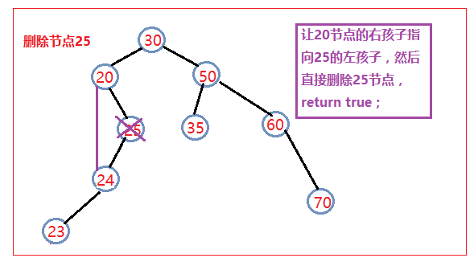

   》如果要删除的节点只有右孩子，那么就让该节点的父亲结点指向该节点的右孩子，然后删除该节点，返回true；

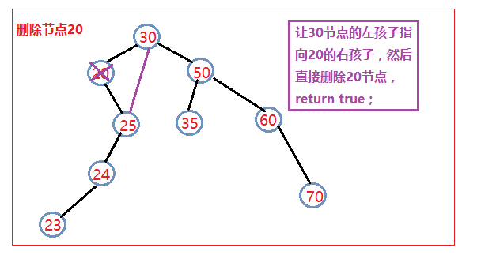

​     对于上面这两种情况我们还应该在之前进行一个判断，就是判断这个节点是否是根节点，如果是根节点的话，就直接让根节点指向这个节点的左孩子或右孩子，然后删除这个节点。

​    》最后一种也是最麻烦的一种就是要删除的节点的左右孩子都存在。此时我们的删除方法如下：

​      1、找到该节点的右子树中的最左孩子（也就是右子树中序遍历的第一个节点）

​      2、把它的值和要删除的节点的值进行交换

​      3、然后删除这个节点即相当于把我们想删除的节点删除了，返回true；

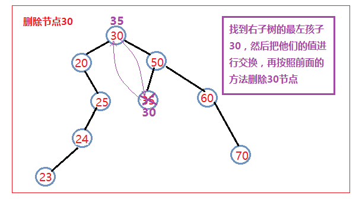

> 因为二叉搜索树的性质，即可以在每个比较之后将数据规模变为原来的一半，因此平均情况下每一个操作都可以在`o(lgn)`的时间内完成，即花费时间与树的高度成正比。但在最坏的情况下，二叉搜索树就退化为一个链表，此时的时间复杂度退化到了`o(n)`。但很多改进版的二叉查找树可以使树高为`o(lgn)`，如SBT，AVL树，红黑树等

#### AVL

**平衡二叉树（AVL树）**是一种特殊的二叉搜索树，只是在二叉搜索树上增加了对"平衡"的需求。

  假如一棵二叉搜索树，按照“1,2,3,4,5”的顺序插入数据，会发现二叉树甚至变成了一个线性的链表状结构，这样查找数据的时间复杂度就会达到O(n)，为了优化这一点，使二叉查找树时间复杂度保持O(log n)的级别，我们就需要调整树的插入方式，使之保持住树的结构。

  

  这里引入一个定义：

​    平衡因子：二叉树的某个节点的**左子树与右子树高度之差**称为结点的**平衡因子**。

  

而平衡二叉树就是要保证平衡因子绝对值不能超过1。也就是**左子树高度比右子树高度最多大1**。

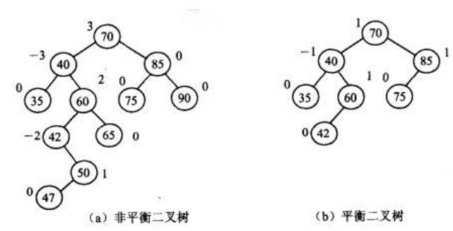


**0x01、平衡二叉树的C语言实现**

首先定义平衡二叉树，这和定义二叉搜索树有些不同，定义的结构体必须加上当前子树的高度。也就是这样：

```
struct node{
    int data;    //数据域
    int height;  //当前子树高度
    node* lchild, *rchild;        //左右孩子
};
```


这样定义的好处是方便上一节点计算平衡因子。

计算平衡因子之前我们先定义计算高度的函数，直接返回root->height即可。如果root为NULL，说明是叶子节点，返回0即可

```
int getHeight(node* root){
    return root == NULL ? 0 : root->height;
}
```


接着我们计算平衡因子，即左子树比右子树高了多少：

```
int getBalanceFactor(node* root){
    return getHeight(root->lchild) - getHeight(root->rchild);
}
```


当我们执行了插入操作，二叉树发生改变的时候，我们需要重新计算高度。

某节点的高度值等于左右子树高度值最大的，加上1。（这是高度值的定义）

更新高度值：

```
void updateHeight(node* root){
    root->height = max(getHeight(root->lchild), getHeight(root->rchild)) + 1;
}
```


**0x02、平衡二叉树的查找**

  AVL树的查找与一般二叉搜索树的查找方法一样。代码如下：

```
void search(node* root, int data){
    if(!root) return;    //查找失败
    if(root->data == data)//找到了
        printf("%d", root->data);
    if(root->data > data) //大了，访问左节点
        search(root->lchild, data);
    else search(root->rchild, data);
}
```


**0x03、平衡二叉树的插入操作**

  平衡二叉树的插入操作较为复杂，我们为了保持二叉树的平衡状态，就要在二叉树失衡的时候对二叉树进行旋转。

  常见的旋转方式有**LL型（单次右旋）、RR型（单次左旋）、LR型（先左旋，再右旋）、RL型（先右旋，再左旋）**

  下面我们进行详细介绍：


**1、LL型（单次右旋）**


假设一棵平衡二叉树再插入数据后，成了这个样子：


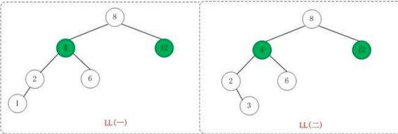


图中的 4 和 12 的高度分别是 3 和 1 ，高度差为 2 ，此时，二叉树不平衡了。对于这种由**根节点的左子树的左子树****造成平衡因子为2的失衡，我们要使用LL型旋转**，即单次右旋，使其平衡。


正确的旋转方式是：使原二叉树的 根节点(K2) 的 左孩子(k1) 做为 新根节点，新根节点(k1) 原来的 右子树(Y) ，做为 原来的根节点(K2) 的左子树


如果记不住的话可以按照这个思路来记忆：

既然左边高度比右边高，就让左子树的根节点称为新根，这样高度就减小了1，我们把左子树K1"揪起来"，让原根节点k2"掉下去"，这样K1就多了一个孩子，而X小于K1，K2大于K1，Y大于K1且Y小于K2，这样把Y"拽下来"插到K2的左边，仍然符合二叉搜索树的规则，而且还处理好了K1的关系，多么完美！


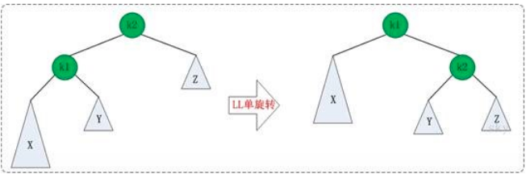

转转后，K1和K2（新根与原来的根）的高度发生了变化，而XYZ（三个子树）没有发生变化，所以我们只需要更新K1和K2的高度值即可。

用C语言实现，就是：

```
void LLrotation(node* &root){
    node* temp = root->lchild;    //让temp=K1
    root->lchild = temp->rchild;    //让root的左节点变为Y
    temp->rchild = root;    //让新根K1的右节点指向K2
    //以上，旋转完毕
    updateHeight(temp);    //更新新根的节点高度
    updateHeight(root);    //更新老根的节点高度
    root = temp;    //把树的根换成我们定义的新根
}
```


**2、RR型（单次左旋）**


假设一棵二叉树插入数据后的状态：

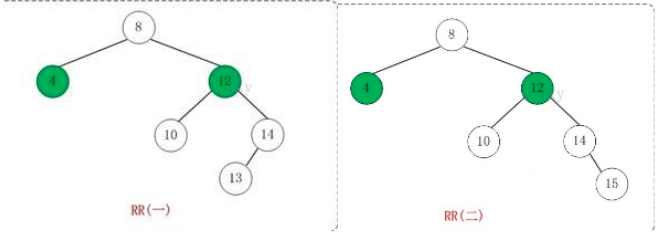

很显然，失衡了。平衡因子为-2。对于这种**根节点的右子树的右子树**造成平衡因子为-2的失衡，我们采用RR旋转，即单次左旋。


单次左旋的思路就是单次右旋倒过来想，我们先将原根节点的右节点K2当做新根，将K2的左子树当做原根K1的右子树。

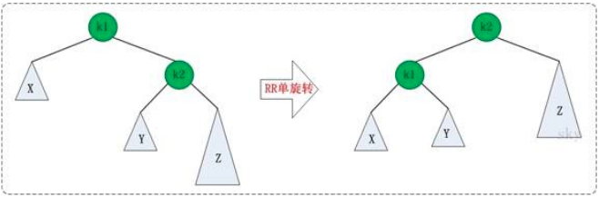

同样的，只有K1和K2的高度发生了变化，所以我们只需要更新K1和K2的高度即可。

C语言实现：

```
void RRrotation(node* &root){
    node* temp = root->rchild;    //另temp=K2
    root->rchild = temp->lchild;    //旧根的右节点为新根的左节点
    temp->lchild = root;    //新根的右节点等于旧根
    //以上，旋转完毕
    updateHeight(temp);    //更新节点高度
    updateHeight(root);
    root = temp;    //重赋值
}
```


**3、LR型（先单次左旋，后单次右旋）**


一棵二叉树，插入数据后形成了这个鬼样子

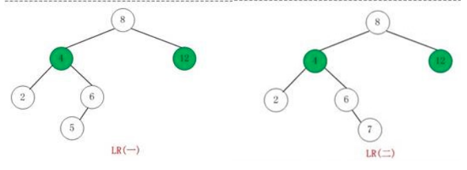

4的高度为3； 而12的高度为1，平衡因子即高度差为2，这是由于**根节点的左子树的右子树**造成了平衡因子为2的失衡，通常采用LR型旋转，即先左旋，后右旋。


先左旋，也就是让K3的左孩子单次左旋，以K1为根节点，进行单次左旋，使得K2成为根节点，K1成为K2的左节点，K2原来的左节点B成为K1的右节点。这样就完成了单次左旋

接着对左旋后的二叉树，以K3为根节点，进行单次右旋，让K3的左节点K2成为新根，K2的右孩子C成为K3的左孩子，让K3做K2的右孩子。


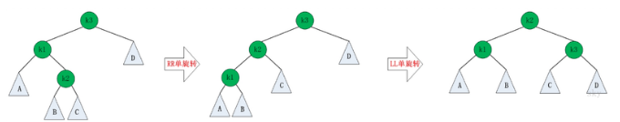

这里K1、K2、K3的高度均发生了变化，ABCD的高度没有发生变化。

说起来很麻烦，其实实现起来很简单。因为我们有了前面LL旋转和RR旋转的基础，直接对子树操作即可。

C语言实现：

```
void LRrotation(node* &root){
    RRrotation(root->lchild);    //先对根节点的左孩子单次左旋
    LLrotation(root);
}
```


**4、RL型（先单次右旋，后单次左旋）**


二叉树数据插入后：

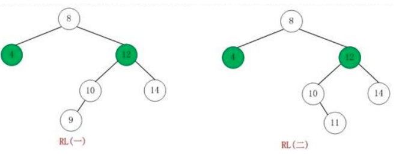

此时的状态是：由于**根节点的右节点的左子树**造成了平衡因子为-2的失衡，我们通常采用RL型旋转，即先单次右旋，后单次左旋。

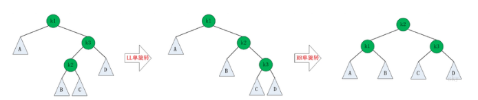

其实就是把LR倒过来啦，不做详细解释了。

C语言实现：

```
void RLrotation(node* &root){
    LLrotation(root->rchild);    //先对根节点的左孩子单次左旋
    RRrotation(root);
}
```


写了这么多，总结一下吧。根据这个表格进行判断AVL树以何种旋转类型保持平衡：

| **树型**           | **判定条件**                       | **调整方法**                             |
| ------------------ | ---------------------------------- | ---------------------------------------- |
| **LL**（单次右旋） | BF(root) = 2；BF(root->lchild) = 1 | 对root单次右旋                           |
| **RR**（单次左旋） | BF(root) =-2；BF(root->rchild) =-1 | 对root单次左旋                           |
| **LR**（先左后右） | BF(root) = 2；BF(root->lchild) =-1 | 对root->lchild进行左旋，再对root进行右旋 |
| **RL**（先右后左） | BF(root) =-2；BF(root->rchild) = 1 | 对root->rchild进行右旋，再对root进行左旋 |

*BF代表平衡因子

**0x04、二叉平衡树的插入**

还记得二叉搜索树是怎样插入数据的吗？

```
void insert(node* &root, int data){
    if(root == NULL){
        root = new node;
        root->data = data;
        root->lchild = root->rchild = NULL;
    }
    if(root->data <= data)
        insert(root->rchild, data);
    else insert(root->lchild, data);
}
```


这段代码是不考虑平衡关系的插入代码。我们要做的是在这串代码上稍加修改，使之能及时通过旋转，保证平衡关系。


我们的思路是：沿用上面代码进行插入，插入后更新树的高度，接着判断平衡因子，根据平衡因子判断四种类型的旋转，最后执行旋转。


C语言实现：

```
void insert(node* &root, int data){
    if(root == NULL){    //插入位置
        root = new node;
        root->data = data;
        root->lchild = root->rchild = NULL;
        root->height = 1;    //由于插入的时候是叶子节点，所以初始高度为1
        return;
    }
    if(root->data > data){    //节点数据大，往左插入
        insert(root->lchild, data);    //继续递归寻找插入位置
        updataHeight(root);        //因为插入了一个节点，所以树根的高度会发生变化
        if(getBalanceFactor(root) == 2)    //根节点平衡因子为2
            if(getBalanceFactor(root->lchild) == 1) //根节点左孩子平衡因子为1，根据表格，采用LL型
                LLrotation(root);
            else if(getBalanceFactor(root->lchild) == -1)   //根节点左孩子平衡因子为-1，LR型
                LRrotation(root);
    }
    else{    //节点数据小，往右插入
        insert(root->rchild, data);
        updataHeight(root);
        if(getBalanceFactor(root) == -2){
            if(getBalanceFactor(root->rchild) == -1) //RR型
                RRrotation(root)
            else if(getBalanceFactor(root->rchild) == 1)//RL型
                RLrotation(root);
        }
    }
}
```

这里往左插入后，只需要判断平衡因子是否为2，是因为如果树之前是平衡的，往左插入的时候，不可能造成平衡因子为-2，只有往右插入的时候才会是-2，所以判断平衡因子 是否为-2就多余了。

#### 红黑树

**什么是红黑树**

红黑树本质上是一种二叉查找树，但它在二叉查找树的基础上额外添加了一个标记（颜色），同时具有一定的规则。这些规则使红黑树保证了一种平衡，插入、删除、查找的最坏时间复杂度都为 O(logn)。

它的统计性能要好于平衡二叉树（AVL树），因此，红黑树在很多地方都有应用。比如在 [Java](http://lib.csdn.net/base/javaee) 集合框架中，很多部分(HashMap, TreeMap, TreeSet 等)都有红黑树的应用，这些集合均提供了很好的性能。

由于 TreeMap 就是由红黑树实现的，因此本文将使用 TreeMap 的相关操作的代码进行分析、论证。

**黑色高度**

从根节点到叶节点的路径上黑色节点的个数，叫做树的黑色高度。

**红黑树的 5 个特性**

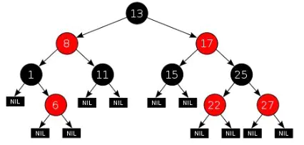

红黑树在原有的二叉查找树基础上增加了如下几个要求：

1. 每个节点要么是红色，要么是黑色；
2. 根节点永远是黑色的；
3. 所有的叶节点都是是黑色的（注意这里说叶子节点其实是上图中的 NIL 节点）；
4. 每个红色节点的两个子节点一定都是黑色；
5. 从任一节点到其子树中每个叶子节点的路径都包含相同数量的黑色节点；

注意：
性质 3 中指定红黑树的每个叶子节点都是空节点，而且并叶子节点都是黑色。但 Java 实现的红黑树将使用 null 来代表空节点，因此遍历红黑树时将看不到黑色的叶子节点，反而看到每个叶子节点都是红色的。

性质 4 的意思是：从每个根到节点的路径上不会有两个连续的红色节点，但黑色节点是可以连续的。
因此若给定黑色节点的个数 N，最短路径的情况是连续的 N 个黑色，树的高度为 N - 1;最长路径的情况为节点红黑相间，树的高度为 2(N - 1) 。

性质 5 是成为红黑树最主要的条件，后序的插入、删除操作都是为了遵守这个规定。

红黑树并不是标准平衡二叉树，它以性质 5 作为一种平衡方法，使自己的性能得到了提升。

**红黑树的左旋右旋**

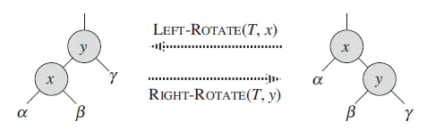

红黑树的左右旋是比较重要的操作，左右旋的目的是调整红黑节点结构，转移黑色节点位置，使其在进行插入、删除后仍能保持红黑树的 5 条性质。

比如 X 左旋(右图转成左图)的结果，是让在 Y 左子树的黑色节点跑到 X 右子树去。

我们以 Java 集合框架中的 TreeMap 中的代码来看下左右旋的具体操作方法：

**指定节点 x 的左旋 (右图转成左图)：**

```
 //这里 p 代表 x
private void rotateLeft(Entry p) {
    if (p != null) {
        Entry r = p.right; // p 是上图中的 x，r 就是 y
        p.right = r.left;       // 左旋后，x 的右子树变成了 y 的左子树 β 
        if (r.left != null)         
            r.left.parent = p;  //β 确认父亲为 x
        r.parent = p.parent;        //y 取代 x 的第一步：认 x 的父亲为爹
        if (p.parent == null)       //要是 x 没有父亲，那 y 就是最老的根节点
            root = r;
        else if (p.parent.left == p) //如果 x 有父亲并且是它父亲的左孩子，x 的父亲现在认 y 为左孩子，不要 x 了
            p.parent.left = r;
        else                            //如果 x 是父亲的右孩子，父亲就认 y 为右孩子，抛弃 x
            p.parent.right = r;
        r.left = p;     //y 逆袭成功，以前的爸爸 x 现在成了它的左孩子
        p.parent = r;
    }
}
```

可以看到，x 节点的左旋就是把 x 变成 右孩子 y 的左孩子，同时把 y 的左孩子送给 x 当右子树。

简单点记就是：左旋把右子树里的一个节点（上图 β）移动到了左子树。

**指定节点 y 的右旋（左图转成右图）：**

```
private void rotateRight(Entry p) {
    if (p != null) {
        Entry l = p.left;
        p.left = l.right;
        if (l.right != null) l.right.parent = p;
        l.parent = p.parent;
        if (p.parent == null)
            root = l;
        else if (p.parent.right == p)
            p.parent.right = l;
        else p.parent.left = l;
        l.right = p;
        p.parent = l;
    }
}
```

同理，y 节点的右旋就是把 y 变成 左孩子 x 的右孩子，同时把 x 的右孩子送给 x 当左子树。

简单点记就是：右旋把左子树里的一个节点（上图 β）移动到了右子树。

了解左旋、右旋的方法及意义后，就可以了解红黑树的主要操作：插入、删除。

**红黑树的平衡插入**

红黑树的插入主要分两步：

- 首先和二叉查找树的插入一样，查找、插入
- 然后调整结构，保证满足红黑树状态
  - 对结点进行重新着色
  - 以及对树进行相关的旋转操作

红黑树的插入在二叉查找树插入的基础上，为了重新恢复平衡，继续做了插入修复操作。

**插入后调整红黑树结构**

红黑树的第 5 条特征规定，任一节点到它子树的每个叶子节点的路径中都包含同样数量的黑节点。也就是说当我们往红黑树中插入一个黑色节点时，会违背这条特征。

同时第 4 条特征规定红色节点的左右孩子一定都是黑色节点，当我们给一个红色节点下插入一个红色节点时，会违背这条特征。

因此我们需要在插入黑色节点后进行结构调整，保证红黑树始终满足这 5 条特征。

**调整思想**

前面说了，插入一个节点后要担心违反特征 4 和 5，数学里最常用的一个解题技巧就是把多个未知数化解成一个未知数。我们这里采用同样的技巧，把插入的节点直接染成红色，这样就不会影响特征 5，只要专心调整满足特征 4 就好了。这样比同时满足 4、5 要简单一些。

染成红色后，我们只要关心**父节点是否为红**，如果是红的，就要把父节点进行变化，让父节点变成黑色，或者换一个黑色节点当父亲，这些操作的同时不能影响 不同路径上的黑色节点数一致的规则。

> 注：插入后我们主要关注插入节点的父亲节点的位置，而父亲节点位于**左子树或者右子树的操作是相对称的**，这里我们只介绍一种，即插入位置的父亲节点为左子树。

**【插入、染红后的调整有 2 种情况：】**

**情况1.父亲节点和叔叔节点都是红色：**


假设插入的是节点 N，这时父亲节点 P 和叔叔节点 U 都是红色，爷爷节点 G 一定是黑色。

红色节点的孩子不能是红色，这时不管 N 是 P 的左孩子还是右孩子，只要同时把 P 和 U 染成黑色，G 染成红色即可。这样这个子树左右两边黑色个数一致，也满足特征 4。

但是这样改变后 G 染成红色，G 的父亲如果是红色岂不是又违反特征 4 了？
这个问题和我们插入、染红后一致，因此需要以 爷爷节点 G 为新的调整节点，再次进行调整操作，以此循环，直到父亲节点不是红的，就没有问题了。

**情况2.父亲节点为红色，叔叔节点为黑色：**


假设插入的是节点 N，这时父亲节点 P 是红色，叔叔节点 U 是黑色，爷爷节点 G 一定是黑色。

红色节点的孩子不能是红色，但是直接把父亲节点 P 涂成黑色也不行，这条路径多了个黑色节点。怎么办呢？

既然改变不了你，那我们就此别过吧，我换一个更适合我的！

我们怎么把 P 弄走呢？看来看去，还是右旋最合适，通过把 爷爷节点 G 右旋，P 变成了这个子树的根节点，G 变成了 P 的右子树。

右旋后 G 跑到了右子树上，这时把 P 变成黑的，多了一个黑节点，再把 G 变成红的，就平衡了！

上面讲的是插入节点 N 在父亲节点 P 的左孩子位置，如果 N 是 P 的右孩子，就需要多进行一次左旋，把情况化解成上述情况。


N 位于 P 的右孩子位置，将 P 左旋，就化解成上述情况了。

**根据 TreeMap 的代码来验证这个过程：**

下面是 TreeMap 在插入后进行调整的代码，可以看出来跟我们分析的一致。

```
private void fixAfterInsertion(Entry x) {
    x.color = RED;  //直接染成红色，少点麻烦

    //这里分析的都是父亲节点为红色的情况，不是红色就不用调整了
    while (x != null && x != root && x.parent.color == RED) {
        if (parentOf(x) == leftOf(parentOf(parentOf(x)))) { // 插入节点 x 的父亲节点位于左孩子    
            Entry y = rightOf(parentOf(parentOf(x)));  // y 是 x 的叔叔节点
            if (colorOf(y) == RED) {    //如果 y 也是红色，只要把父亲节点和 y 都变成黑色，爷爷节点变成红的，就 Ok 了
                setColor(parentOf(x), BLACK);
                setColor(y, BLACK);
                setColor(parentOf(parentOf(x)), RED);
                x = parentOf(parentOf(x));
            } else {    //如果叔叔节点 y 不是红色，就需要右旋，让父亲节点变成根节点，爷爷节点去右子树去，然后把父亲节点变成黑色、爷爷节点变成红色
                    //特殊情况：x 是父亲节点的右孩子，需要对父亲节点进行左旋，把 x 移动到左子树
                if (x == rightOf(parentOf(x))) {
                    x = parentOf(x);
                    rotateLeft(x);
                }
                setColor(parentOf(x), BLACK);
                setColor(parentOf(parentOf(x)), RED);
                rotateRight(parentOf(parentOf(x)));
            }
        } else {    //和上面对称的操作
            Entry y = leftOf(parentOf(parentOf(x)));
            if (colorOf(y) == RED) {
                setColor(parentOf(x), BLACK);
                setColor(y, BLACK);
                setColor(parentOf(parentOf(x)), RED);
                x = parentOf(parentOf(x));
            } else {
                if (x == leftOf(parentOf(x))) {
                    x = parentOf(x);
                    rotateRight(x);
                }
                setColor(parentOf(x), BLACK);
                setColor(parentOf(parentOf(x)), RED);
                rotateLeft(parentOf(parentOf(x)));
            }
        }
    }
    root.color = BLACK;
}
```

**红黑树的平衡删除**

红黑树的插入平衡需要好好理解下，如果前面没有理解，删除后的调整平衡更加难懂，前方高能，请注意！

红黑树的删除也是分两步：

1. 二叉查找树的删除
2. 结构调整

**删除后的结构调整**

根据红黑树的第 5 个特性：

如果当前待删除节点是红色的，它被删除之后对当前树的特性不会造成任何破坏影响。
而如果被删除的节点是黑色的，这就需要进行进一步的调整来保证后续的树结构满足要求。

这里研究的是删除黑色节点的情况。

**调整思想**

为了保证删除节点父亲节点左右两边黑色节点数一致，需要重点关注父亲节点没删除的那一边节点是不是黑色。如果删除后父亲节点另一边比删除的一边黑色节点多，就要想办法搞到平衡，具体的平衡方法有如下几种方法：

1. 把父亲节点另一边（即删除节点的兄弟树）其中一个节点弄成红色，也少一个黑色
2. 或者把另一边多的黑色节点转过来一个

删除节点在父亲节点的左子树还是右子树，调整方式都是对称的，这里以当前节点为父节点的左孩子为例进行分析。

**【删除后的调整主要分三步】：**

**第一步：**

- 兄弟如果是红的，说明孩子都是黑的

   

  【旋转的情况 1 】

  - 把兄弟搞成黑的
  - 父亲搞成红的
  - 左旋转父亲（嘿嘿，兄弟给我分一个黑孩子）
  - 接下来对比旋转后的兄弟

**第一步解释：**

这一步的目的是将兄弟节点变成黑的，转变成第二步两种情形中的某一种情况。

在做后续变化前，这棵树还是保持着原来的平衡。

**第二步，有两种情况：**

情况1 ：**兄弟节点的孩子都是黑色**

- 把兄弟搞成红的
- continue 下一波（这个子树搞完了，研究父亲节点，去搞上一级树，进入第三步）

**第二步情况 1 解释：**

这里将兄弟节点变成红色后，从它的父节点到下面的所有路径就都统一少了 1 个，同时也不影响别的特征，但是把兄弟节点变红后，如果有父亲节点也是红的，就可能违反红黑树的特征 4，因此需要到更高一级树进行鉴别、调整。

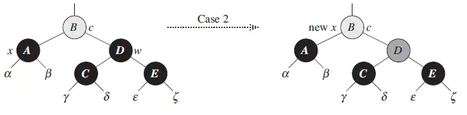

情况2 ：**兄弟节点的孩子至多有一个是黑的**

- 把不是黑的那个孩子搞黑

   

  【旋转的情况 2 】

  - 兄弟搞红
  - 兄弟右旋转
  - 以后对比旋转后的兄弟

- 把兄弟涂成跟父亲一样的颜色 **【旋转的情况 3 】**

- 然后把父亲搞黑

- 把兄弟的右孩子搞黑

- 父亲节点左旋

- 研究根节点，进入第三步

**第二步情况 2 解释：**

旋转的情况 2 是将兄弟节点的左右孩子都移动到右边，方便后续操作，如下图所示：


旋转的情况 3 将兄弟的孩子移到左边来，同时黑色的父亲变到了左边（总之就是让左边多些黑色节点），如下图所示：

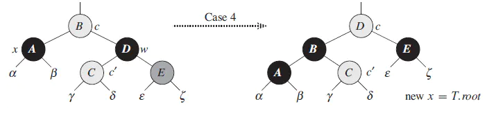

**第三步：**

- 如果研究的不是根节点并且是黑的，重新进入第一步，研究上一级树；
- 如果研究的是根节点或者这个节点不是黑的，就退出
  - 把研究的这个节点涂成黑的。

**第三步解释：**

第三步中选择根节点为结束标志，是因为在第二步中，有可能出现我们正好给删除黑色节点的子树补上了一个黑色节点，同时不影响其他子树，这时我们的调整已经完成，可以直接设置调整节点 x = root，等于宣告调整结束。

因为我们当前调整的可能只是一棵树中间的子树，这里头的节点可能还有父节点，这么一直往上到根节点。当前子树少了一个黑色节点，要保证整体合格还是不够的。

这里需要在代码里有一个保证。假设这里 B 已经是红色的了。那么调整结束，最后对 B 节点，也就是调整目标 x 所指向的这个节点涂成黑色。这样保证前面亏的那一个黑色节点就补回来了。

前面讨论的这4种情况是在当前节点是父节点的左子节点的条件下进行的。如果当前节点是父节点的右子节点，则可以对应的做对称的操作处理，过程也是一样的。

其中具体旋转方向根据调整节点在父节点的左/右位置决定。

**根据 TreeMap 的代码来验证这个过程：**

```
private void fixAfterDeletion(Entry x) {
    while (x != root && colorOf(x) == BLACK) {
        if (x == leftOf(parentOf(x))) {
            Entry sib = rightOf(parentOf(x));

            //左旋，把黑色节点移到左边一个
            if (colorOf(sib) == RED) {
                setColor(sib, BLACK);
                setColor(parentOf(x), RED);
                rotateLeft(parentOf(x));
                sib = rightOf(parentOf(x));
            }

            if (colorOf(leftOf(sib))  == BLACK &&
                colorOf(rightOf(sib)) == BLACK) {
                setColor(sib, RED);
                x = parentOf(x);
            } else {
                if (colorOf(rightOf(sib)) == BLACK) {
                    setColor(leftOf(sib), BLACK);
                    setColor(sib, RED);
                    rotateRight(sib);
                    sib = rightOf(parentOf(x));
                }
                setColor(sib, colorOf(parentOf(x)));
                setColor(parentOf(x), BLACK);
                setColor(rightOf(sib), BLACK);
                rotateLeft(parentOf(x));
                x = root;
            }
        } else { //处理的节点在 右边，相同逻辑，只不过旋转的方向相反
            Entry sib = leftOf(parentOf(x));

            if (colorOf(sib) == RED) {
                setColor(sib, BLACK);
                setColor(parentOf(x), RED);
                rotateRight(parentOf(x));
                sib = leftOf(parentOf(x));
            }

            if (colorOf(rightOf(sib)) == BLACK &&
                colorOf(leftOf(sib)) == BLACK) {
                setColor(sib, RED);
                x = parentOf(x);
            } else {
                if (colorOf(leftOf(sib)) == BLACK) {
                    setColor(rightOf(sib), BLACK);
                    setColor(sib, RED);
                    rotateLeft(sib);
                    sib = leftOf(parentOf(x));
                }
                setColor(sib, colorOf(parentOf(x)));
                setColor(parentOf(x), BLACK);
                setColor(leftOf(sib), BLACK);
                rotateRight(parentOf(x));
                x = root;
            }
        }
    }

    setColor(x, BLACK);
}
```

当调整的节点属于父亲节点的左子树时，调整方法对应的流程图如下：

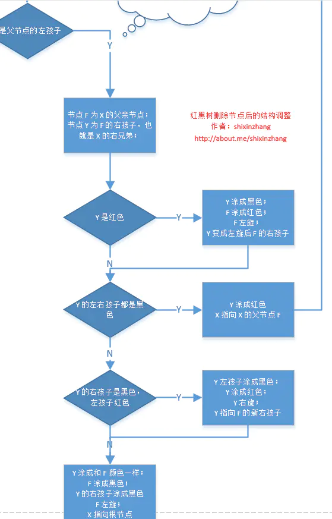

当调整的节点属于父亲节点的右子树时，调整方法也类似，旋转的方向相对称。

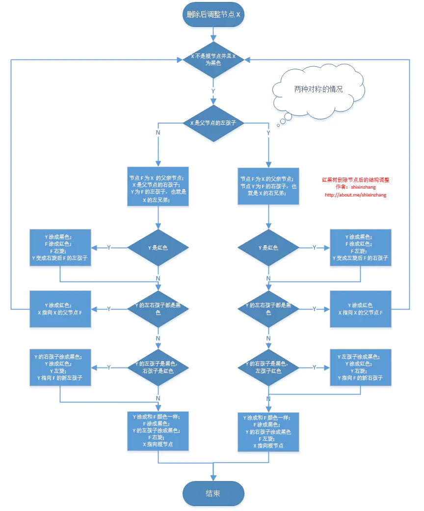

### B树

B树也称B-树,它是一颗多路平衡查找树。我们描述一颗B树时需要指定它的阶数，阶数表示了一个结点最多有多少个孩子结点，一般用字母m表示阶数。当m取2时，就是我们常见的二叉搜索树。

一颗m阶的B树定义如下：

1）每个结点最多有m-1个关键字。

2）根结点最少可以只有1个关键字。

3）非根结点至少有Math.ceil(m/2)-1个关键字。

4）每个结点中的关键字都按照从小到大的顺序排列，每个关键字的左子树中的所有关键字都小于它，而右子树中的所有关键字都大于它。

5）所有叶子结点都位于同一层，或者说根结点到每个叶子结点的长度都相同。

[](https://images2018.cnblogs.com/blog/834468/201804/834468-20180406232632321-1557309284.png)

上图是一颗阶数为4的B树。在实际应用中的B树的阶数m都非常大（通常大于100），所以即使存储大量的数据，B树的高度仍然比较小。每个结点中存储了关键字（key）和关键字对应的数据（data），以及孩子结点的指针。**我们将一个key和其对应的data称为一个记录**。**但为了方便描述，除非特别说明，后续文中就用key来代替（key, value）键值对这个整体**。在数据库中我们将B树（和B+树）作为索引结构，可以加快查询速速，此时B树中的key就表示键，而data表示了这个键对应的条目在硬盘上的逻辑地址。

**B树的插入操作**

插入操作是指插入一条记录，即（key, value）的键值对。如果B树中已存在需要插入的键值对，则用需要插入的value替换旧的value。若B树不存在这个key,则一定是在叶子结点中进行插入操作。

1）根据要插入的key的值，找到叶子结点并插入。

2）判断当前结点key的个数是否小于等于m-1，若满足则结束，否则进行第3步。

3）以结点中间的key为中心分裂成左右两部分，然后将这个中间的key插入到父结点中，这个key的左子树指向分裂后的左半部分，这个key的右子支指向分裂后的右半部分，然后将当前结点指向父结点，继续进行第3步。

下面以5阶B树为例，介绍B树的插入操作，在5阶B树中，结点最多有4个key,最少有2个key

------

a）在空树中插入39

此时根结点就一个key，此时根结点也是叶子结点

------

b）继续插入22，97和41

[](https://images2018.cnblogs.com/blog/834468/201804/834468-20180406232639538-1500322324.png)

根结点此时有4个key

------

c）继续插入53

[](https://images2018.cnblogs.com/blog/834468/201804/834468-20180406232643024-803862278.png)

插入后超过了最大允许的关键字个数4，所以以key值为41为中心进行分裂，结果如下图所示，分裂后当前结点指针指向父结点，满足B树条件，插入操作结束。当阶数m为偶数时，需要分裂时就不存在排序恰好在中间的key，那么我们选择中间位置的前一个key或中间位置的后一个key为中心进行分裂即可。

[](https://images2018.cnblogs.com/blog/834468/201804/834468-20180406232646553-550588616.png)

------

d）依次插入13，21，40，同样会造成分裂，结果如下图所示。

[](https://images2018.cnblogs.com/blog/834468/201804/834468-20180406232714654-717185244.png)

------

e）依次插入30，27, 33 ；36，35，34 ；24，29，结果如下图所示。

[](https://images2018.cnblogs.com/blog/834468/201804/834468-20180406232718059-1454315021.png)

------

f）插入key值为26的记录，插入后的结果如下图所示。

[](https://images2018.cnblogs.com/blog/834468/201804/834468-20180406232722072-2101780219.png)

当前结点需要以27为中心分裂，并向父结点进位27，然后当前结点指向父结点，结果如下图所示。

[](https://images2018.cnblogs.com/blog/834468/201804/834468-20180406232727483-1657363165.png)

进位后导致当前结点（即根结点）也需要分裂，分裂的结果如下图所示。

[](https://images2018.cnblogs.com/blog/834468/201804/834468-20180406232735788-403419538.png)

分裂后当前结点指向新的根，此时无需调整。

------

g）最后再依次插入key为17,28,29,31,32的记录，结果如下图所示。

[](https://images2018.cnblogs.com/blog/834468/201804/834468-20180406232742794-343445338.png)

------

在实现B树的代码中，为了使代码编写更加容易，我们可以将结点中存储记录的数组长度定义为m而非m-1，这样方便底层的结点由于分裂向上层插入一个记录时，上层有多余的位置存储这个记录。同时，每个结点还可以存储它的父结点的引用，这样就不必编写递归程序。

一般来说，对于确定的m和确定类型的记录，结点大小是固定的，无论它实际存储了多少个记录。但是分配固定结点大小的方法会存在浪费的情况，比如key为28,29所在的结点，还有2个key的位置没有使用，但是已经不可能继续在插入任何值了，因为这个结点的前序key是27,后继key是30,所有整数值都用完了。所以如果记录先按key的大小排好序，再插入到B树中，结点的使用率就会很低，最差情况下使用率仅为50%。

 

**B树的删除操作**

删除操作是指，根据key删除记录，如果B树中的记录中不存对应key的记录，则删除失败。

1）如果当前需要删除的key位于非叶子结点上，则用后继key（这里的后继key均指后继记录的意思）覆盖要删除的key，然后在后继key所在的子支中删除该后继key。此时后继key一定位于叶子结点上，这个过程和二叉搜索树删除结点的方式类似。删除这个记录后执行第2步

2）该结点key个数大于等于Math.ceil(m/2)-1，结束删除操作，否则执行第3步。

3）如果兄弟结点key个数大于Math.ceil(m/2)-1，则父结点中的key下移到该结点，兄弟结点中的一个key上移，删除操作结束。

否则，将父结点中的key下移与当前结点及它的兄弟结点中的key合并，形成一个新的结点。原父结点中的key的两个孩子指针就变成了一个孩子指针，指向这个新结点。然后当前结点的指针指向父结点，重复上第2步。

有些结点它可能即有左兄弟，又有右兄弟，那么我们任意选择一个兄弟结点进行操作即可。

下面以5阶B树为例，介绍B树的删除操作，5阶B树中，结点最多有4个key,最少有2个key

------

a）原始状态

[](https://images2018.cnblogs.com/blog/834468/201804/834468-20180406232752206-912030342.png)

------

b）在上面的B树中删除21，删除后结点中的关键字个数仍然大于等2，所以删除结束。

[](https://images2018.cnblogs.com/blog/834468/201804/834468-20180406232757867-616298444.png)

------

c）在上述情况下接着删除27。从上图可知27位于非叶子结点中，所以用27的后继替换它。从图中可以看出，27的后继为28，我们用28替换27，然后在28（原27）的右孩子结点中删除28。删除后的结果如下图所示。

[](https://images2018.cnblogs.com/blog/834468/201804/834468-20180406232802141-205923916.png)

删除后发现，当前叶子结点的记录的个数小于2，而它的兄弟结点中有3个记录（当前结点还有一个右兄弟，选择右兄弟就会出现合并结点的情况，不论选哪一个都行，只是最后B树的形态会不一样而已），我们可以从兄弟结点中借取一个key。所以父结点中的28下移，兄弟结点中的26上移,删除结束。结果如下图所示。

[](https://images2018.cnblogs.com/blog/834468/201804/834468-20180406232807512-453871893.png)

------

d）在上述情况下接着32，结果如下图。

[](https://images2018.cnblogs.com/blog/834468/201804/834468-20180406232815746-1461337715.png)

当删除后，当前结点中只key，而兄弟结点中也仅有2个key。所以只能让父结点中的30下移和这个两个孩子结点中的key合并，成为一个新的结点，当前结点的指针指向父结点。结果如下图所示。

[](https://images2018.cnblogs.com/blog/834468/201804/834468-20180406232825385-1019850877.png)

当前结点key的个数满足条件，故删除结束。

------

e）上述情况下，我们接着删除key为40的记录，删除后结果如下图所示。

[](https://images2018.cnblogs.com/blog/834468/201804/834468-20180406232835261-354192121.png)

同理，当前结点的记录数小于2，兄弟结点中没有多余key，所以父结点中的key下移，和兄弟（这里我们选择左兄弟，选择右兄弟也可以）结点合并，合并后的指向当前结点的指针就指向了父结点。

[](https://images2018.cnblogs.com/blog/834468/201804/834468-20180406232842439-531453423.png)

同理，对于当前结点而言只能继续合并了，最后结果如下所示。

[](https://images2018.cnblogs.com/blog/834468/201804/834468-20180406232848657-2062660750.png)

合并后结点当前结点满足条件，删除结束。

### B+树

**B+树的定义**

[](https://images2018.cnblogs.com/blog/834468/201804/834468-20180406232853119-1460626460.png)

各种资料上B+树的定义各有不同，一种定义方式是关键字个数和孩子结点个数相同。这里我们采取维基百科上所定义的方式，即关键字个数比孩子结点个数小1，这种方式是和B树基本等价的。上图就是一颗阶数为4的B+树。

除此之外B+树还有以下的要求。

1）B+树包含2种类型的结点：内部结点（也称索引结点）和叶子结点。根结点本身即可以是内部结点，也可以是叶子结点。根结点的关键字个数最少可以只有1个。

2）B+树与B树最大的不同是内部结点不保存数据，只用于索引，所有数据（或者说记录）都保存在叶子结点中。

3） m阶B+树表示了内部结点最多有m-1个关键字（或者说内部结点最多有m个子树），阶数m同时限制了叶子结点最多存储m-1个记录。

4）内部结点中的key都按照从小到大的顺序排列，对于内部结点中的一个key，左树中的所有key都**小于**它，右子树中的key都**大于等于**它。叶子结点中的记录也按照key的大小排列。

5）每个叶子结点都存有相邻叶子结点的指针，叶子结点本身依关键字的大小自小而大顺序链接。

 

**B+树的插入操作**

1）若为空树，创建一个叶子结点，然后将记录插入其中，此时这个叶子结点也是根结点，插入操作结束。

2）针对叶子类型结点：根据key值找到叶子结点，向这个叶子结点插入记录。插入后，若当前结点key的个数小于等于m-1，则插入结束。否则将这个叶子结点分裂成左右两个叶子结点，左叶子结点包含前m/2个记录，右结点包含剩下的记录，将第m/2+1个记录的key进位到父结点中（父结点一定是索引类型结点），进位到父结点的key左孩子指针向左结点,右孩子指针向右结点。将当前结点的指针指向父结点，然后执行第3步。

3）针对索引类型结点：若当前结点key的个数小于等于m-1，则插入结束。否则，将这个索引类型结点分裂成两个索引结点，左索引结点包含前(m-1)/2个key，右结点包含m-(m-1)/2个key，将第m/2个key进位到父结点中，进位到父结点的key左孩子指向左结点, 进位到父结点的key右孩子指向右结点。将当前结点的指针指向父结点，然后重复第3步。

下面是一颗5阶B树的插入过程，5阶B数的结点最少2个key，最多4个key。

------

a）空树中插入5

[](https://images2018.cnblogs.com/blog/834468/201804/834468-20180406232856515-1989097703.png)

------

b）依次插入8，10，15

[](https://images2018.cnblogs.com/blog/834468/201804/834468-20180406232859746-1983069652.png)

------

c）插入16

[](https://images2018.cnblogs.com/blog/834468/201804/834468-20180406232903956-296813367.png)

插入16后超过了关键字的个数限制，所以要进行分裂。在叶子结点分裂时，分裂出来的左结点2个记录，右边3个记录，中间key成为索引结点中的key，分裂后当前结点指向了父结点（根结点）。结果如下图所示。

[](https://images2018.cnblogs.com/blog/834468/201804/834468-20180406232907805-1210471622.png)

当然我们还有另一种分裂方式，给左结点3个记录，右结点2个记录，此时索引结点中的key就变为15。

------

d）插入17

[](https://images2018.cnblogs.com/blog/834468/201804/834468-20180406232911666-589419211.png)

------

e）插入18，插入后如下图所示

[](https://images2018.cnblogs.com/blog/834468/201804/834468-20180406232915173-859633380.png)

当前结点的关键字个数大于5，进行分裂。分裂成两个结点，左结点2个记录，右结点3个记录，关键字16进位到父结点（索引类型）中，将当前结点的指针指向父结点。

[](https://images2018.cnblogs.com/blog/834468/201804/834468-20180406232919602-1261506387.png)

当前结点的关键字个数满足条件，插入结束。

------

f）插入若干数据后

[](https://images2018.cnblogs.com/blog/834468/201804/834468-20180406232924458-602071692.png)

------

g）在上图中插入7，结果如下图所示

[](https://images2018.cnblogs.com/blog/834468/201804/834468-20180406232932420-897395371.png)

当前结点的关键字个数超过4，需要分裂。左结点2个记录，右结点3个记录。分裂后关键字7进入到父结点中，将当前结点的指针指向父结点，结果如下图所示。

[](https://images2018.cnblogs.com/blog/834468/201804/834468-20180406232938704-1997149607.png)

当前结点的关键字个数超过4，需要继续分裂。左结点2个关键字，右结点2个关键字，关键字16进入到父结点中，将当前结点指向父结点，结果如下图所示。

[](https://images2018.cnblogs.com/blog/834468/201804/834468-20180406232943232-17049271.png)

当前结点的关键字个数满足条件，插入结束。

 

**B+树的删除操作**

如果叶子结点中没有相应的key，则删除失败。否则执行下面的步骤

1）删除叶子结点中对应的key。删除后若结点的key的个数大于等于Math.ceil(m-1)/2 – 1，删除操作结束,否则执行第2步。

2）若兄弟结点key有富余（大于Math.ceil(m-1)/2 – 1），向兄弟结点借一个记录，同时用借到的key替换父结（指当前结点和兄弟结点共同的父结点）点中的key，删除结束。否则执行第3步。

3）若兄弟结点中没有富余的key,则当前结点和兄弟结点合并成一个新的叶子结点，并删除父结点中的key（父结点中的这个key两边的孩子指针就变成了一个指针，正好指向这个新的叶子结点），将当前结点指向父结点（必为索引结点），执行第4步（第4步以后的操作和B树就完全一样了，主要是为了更新索引结点）。

4）若索引结点的key的个数大于等于Math.ceil(m-1)/2 – 1，则删除操作结束。否则执行第5步

5）若兄弟结点有富余，父结点key下移，兄弟结点key上移，删除结束。否则执行第6步

6）当前结点和兄弟结点及父结点下移key合并成一个新的结点。将当前结点指向父结点，重复第4步。

注意，通过B+树的删除操作后，索引结点中存在的key，不一定在叶子结点中存在对应的记录。

下面是一颗5阶B树的删除过程，5阶B数的结点最少2个key，最多4个key。

------

a）初始状态

[](https://images2018.cnblogs.com/blog/834468/201804/834468-20180406232947400-1567033079.png)

------

b）删除22,删除后结果如下图

[](https://images2018.cnblogs.com/blog/834468/201804/834468-20180406232954830-219884109.png)

删除后叶子结点中key的个数大于等于2，删除结束

------

c）删除15，删除后的结果如下图所示

[](https://images2018.cnblogs.com/blog/834468/201804/834468-20180406232959965-1316994866.png)

删除后当前结点只有一个key,不满足条件，而兄弟结点有三个key，可以从兄弟结点借一个关键字为9的记录,同时更新将父结点中的关键字由10也变为9，删除结束。

[](https://images2018.cnblogs.com/blog/834468/201804/834468-20180406233005979-1876471897.png)

------

d）删除7，删除后的结果如下图所示

[](https://images2018.cnblogs.com/blog/834468/201804/834468-20180406233010241-2135973119.png)

当前结点关键字个数小于2，（左）兄弟结点中的也没有富余的关键字（当前结点还有个右兄弟，不过选择任意一个进行分析就可以了，这里我们选择了左边的），所以当前结点和兄弟结点合并，并删除父结点中的key，当前结点指向父结点。

[](https://images2018.cnblogs.com/blog/834468/201804/834468-20180406233019407-1044051627.png)

此时当前结点的关键字个数小于2，兄弟结点的关键字也没有富余，所以父结点中的关键字下移，和两个孩子结点合并，结果如下图所示。

[](https://images2018.cnblogs.com/blog/834468/201804/834468-20180406233024613-583960048.png)

### LSM

**关于LSM树**

LSM树，即日志结构合并树(Log-Structured Merge-Tree)。其实它并不属于一个具体的数据结构，它更多是一种数据结构的设计思想。大多NoSQL数据库核心思想都是基于LSM来做的，只是具体的实现不同。

**LSM树诞生背景**

传统关系型数据库使用btree或一些变体作为存储结构，能高效进行查找。但保存在磁盘中时它也有一个明显的缺陷，那就是逻辑上相离很近但物理却可能相隔很远，这就可能造成大量的磁盘随机读写。随机读写比顺序读写慢很多，为了提升IO性能，我们需要一种能将随机操作变为顺序操作的机制，于是便有了LSM树。LSM树能让我们进行顺序写磁盘，从而大幅提升写操作，作为代价的是牺牲了一些读性能。

**关于磁盘IO**

磁盘读写时涉及到磁盘上数据查找，地址一般由柱面号、盘面号和块号三者构成。也就是说移动臂先根据柱面号移动到指定柱面，然后根据盘面号确定盘面的磁道，最后根据块号将指定的磁道段移动到磁头下，便可开始读写。

整个过程主要有三部分时间消耗，查找时间(seek time) +等待时间(latency time)+传输时间(transmission time) 。分别表示定位柱面的耗时、将块号指定磁道段移到磁头的耗时、将数据传到内存的耗时。整个磁盘IO最耗时的地方在查找时间，所以减少查找时间能大幅提升性能。

**LSM树原理**

LSM树由两个或以上的存储结构组成，比如在论文中为了方便说明使用了最简单的两个存储结构。一个存储结构常驻内存中，称为C0 tree，具体可以是任何方便健值查找的数据结构，比如红黑树、map之类，甚至可以是跳表。另外一个存储结构常驻在硬盘中，称为C1 tree，具体结构类似B树。C1所有节点都是100%满的，节点的大小为磁盘块大小。

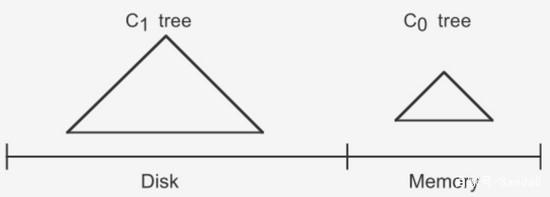

**插入步骤**

大体思路是：插入一条新纪录时，首先在日志文件中插入操作日志，以便后面恢复使用，日志是以append形式插入，所以速度非常快；将新纪录的索引插入到C0中，这里在内存中完成，不涉及磁盘IO操作；当C0大小达到某一阈值时或者每隔一段时间，将C0中记录滚动合并到磁盘C1中；对于多个存储结构的情况，当C1体量越来越大就向C2合并，以此类推，一直往上合并Ck。

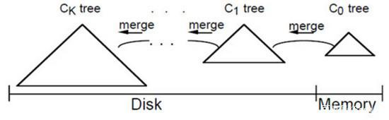

**合并步骤**

合并过程中会使用两个块：`emptying block`和`filling block`。

从C1中读取未合并叶子节点，放置内存中的emptying block中。从小到大找C0中的节点，与emptying block进行合并排序，合并结果保存到filling block中，并将C0对应的节点删除。不断执行第2步操作，合并排序结果不断填入filling block中，当其满了则将其追加到磁盘的新位置上，注意是追加而不是改变原来的节点。合并期间如故宫emptying block使用完了则再从C1中读取未合并的叶子节点。C0和C1所有叶子节点都按以上合并完成后即完成一次合并。

**关于优化措施**

在实际项目中其实有很多优化策略，而且有很多针对LSM树优化的paper。比如使用布隆过滤器快速判断key是否存在，还有做一些额外的索引以帮助更快找到记录等等。

## 插入操作

向LSM树中插入

A E L R U

，首先会插入到内存中的C0树上，这里使用AVL树，插入“A”，先向磁盘日志文件追加记录，然后再插入C0，

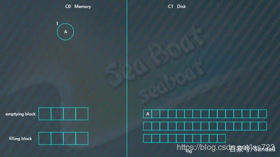

插入“E”，同样先追加日志再写内存，

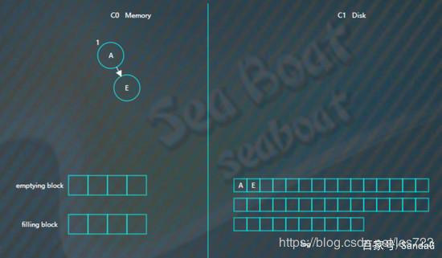

继续插入“L”，旋转后如下，


插入“R”“U”，旋转后最终如下。


假设此时触发合并，则因为C1还没有树，所以emptying block为空，直接从C0树中依次找最小的节点。filling block长度为4，这里假设磁盘块大小为4。

开始找最小的节点，并放到filling block中，

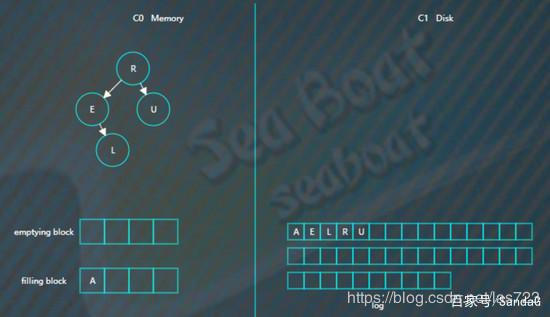

继续找第二个节点，

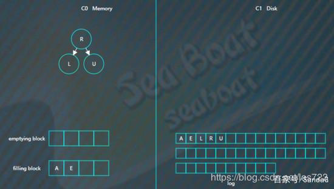

以此类推，填满filling block，


开始写入磁盘，C1树，

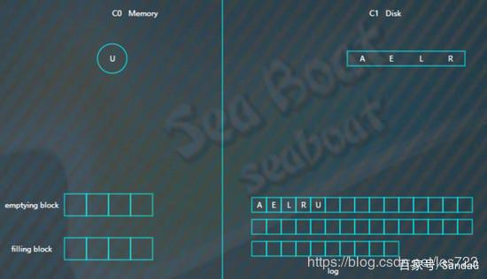

继续插入

B F N T

，先分别写日志，然后插入到内存的C0树中，

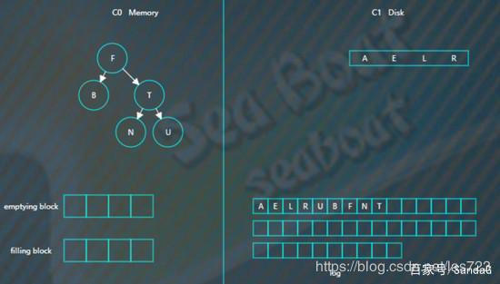

假如此时进行合并，先加载C1的最左边叶子节点到emptying block，

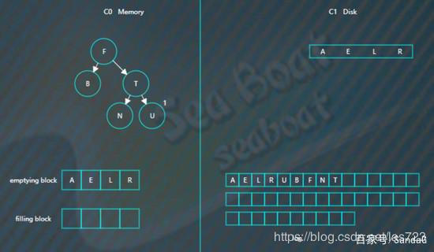

接着对C0树的节点和emptying block进行合并排序，首先是“A”进入filling block，

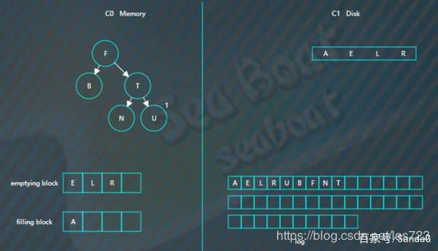

然后是“B”，

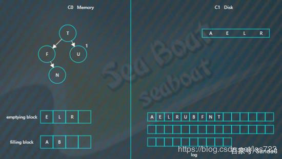

合并排序最终结果为，

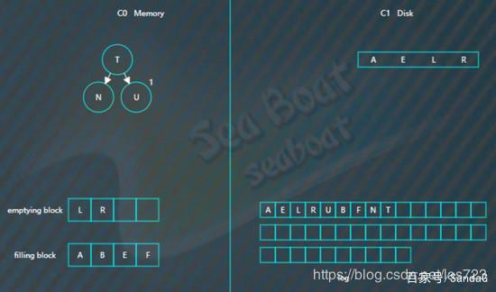

将filling block追加到磁盘的新位置，将原来的节点删除掉，

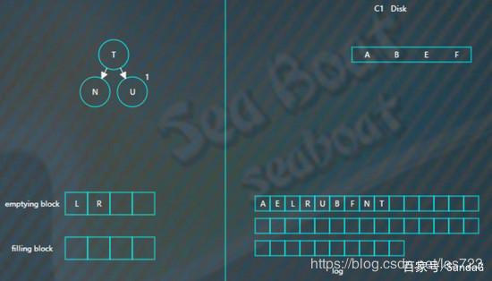

继续合并排序，再次填满filling block，

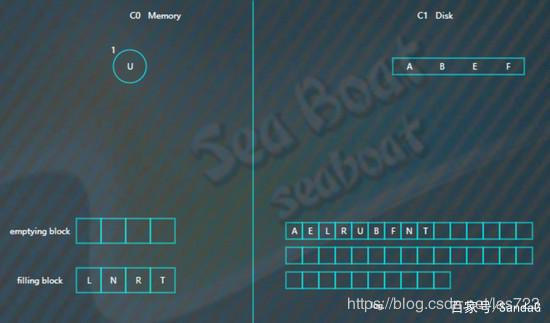

将filling block追加到磁盘的新位置，上一层的节点也要以磁盘块（或多个磁盘块）大小写入，尽量避开随机写。另外由于合并过程可能会导致上层节点的更新，可以暂时保存在内存，后面在适当时机写入。


## 查找操作

查找总体思想是先找内存的C0树，找不到则找磁盘的C1树，然后是C2树，以此类推。

假如要找“B”，先找C0树，没找到。


接着找C1树，从根节点开始，

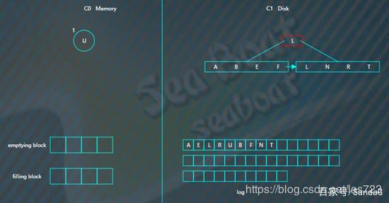

找到“B”。

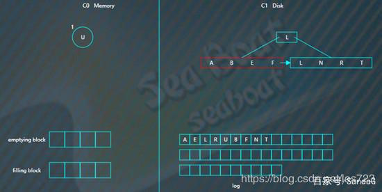

## 删除操作

删除操作为了能快速执行，主要是通过标记来实现，在内存中将要删除的记录标记一下，后面异步执行合并时将相应记录删除。

比如要删除“U”，假设标为#的表示删除，则C0树的“U”节点变为，

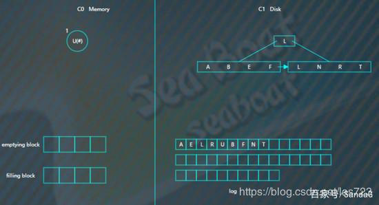

而如果C0树不存在的记录，则在C0树中生成一个节点，并标为#，查找时就能在内存中得知该记录已被删除，无需去磁盘找了。比如要删除“B”，那么没有必要去磁盘执行删除操作，直接在C0树中插入一个“B”节点，并标为#。

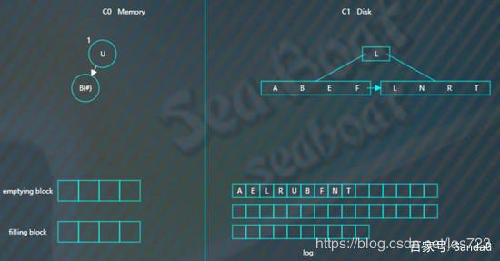

 

假如对写操作的吞吐量比较敏感，可采用日志策略（顺序读写，只追加不修改）来提升写性能。存在问题：数据查找需要倒序扫描，花费很多时间。比如，预写日志WAL，WAL的中心概念是数据文件（存储着表和索引）的修改必须在这些动作被日志记录之后才被写入，即在描述这些改变的日志记录被刷到持久存储以后。如果我们遵循这种过程，我们不需要在每个事务提交时刷写数据页面到磁盘，因为我们知道在发生崩溃时可以使用日志来恢复数据库：任何还没有被应用到数据页面的改变可以根据其日志记录重做（这是前滚恢复，也被称为REDO）。使用WAL可以显著降低磁盘的写次数，因为只有日志文件需要被刷出到磁盘以保证事务被提交，而被事务改变的每一个数据文件则不必被刷出。

其只是提高了写的性能，对于更为复杂的读性能，需要寻找其他的方法，其中有**四种方法来提升读性能**：

- 二分查找: 将文件数据有序保存，使用二分查找来完成特定key的查找。
- 哈希：用哈希将数据分割为不同的bucket
- B+树：使用B+树 或者 ISAM 等方法，可以减少外部文件的读取
- 外部文件： 将数据保存为日志，并创建一个hash或者查找树映射相应的文件。

所有的四种方法都可以有效的提高了读操作的性能（最少提供了O(log(n)) )，但是，却丢失了日志文件超好的写性能，上面这些方法，都强加了总体的结构信息在数据上，数据被按照特定的方式放置，所以可以很快的找到特定的数据，但是却对写操作不友善，让写操作性能下降。更糟糕的是，当需要更新hash或者B+树的结构时，需要同时更新文件系统中特定的部分，这就是造成了比较慢的随机读写操作，这种随机的操作要尽量减少。

既要保证日志文件好的写性能，又要在一定程度上保证读性能，所以LSM-Tree应运而生。

下面块为引用https://www.cnblogs.com/yanghuahui/p/3483754.html，进行对比

> 讲LSM树之前，需要提下**三种基本的存储引擎**，这样才能清楚LSM树的由来：
>
> 1. 哈希存储引擎  是哈希表的持久化实现，支持增、删、改以及随机读取操作，但不支持顺序扫描，对应的存储系统为key-value存储系统。对于key-value的插入以及查询，哈希表的复杂度都是O(1)，明显比树的操作O(n)快,如果不需要有序的遍历数据，哈希表就是your Mr.Right
> 2. B树存储引擎是B树[（关于B树的由来，数据结构以及应用场景可以看之前一篇博文）](http://www.cnblogs.com/yanghuahui/p/3483047.html)的持久化实现，不仅支持单条记录的增、删、读、改操作，还支持顺序扫描（B+树的叶子节点之间的指针），对应的存储系统就是关系数据库（Mysql等）。
> 3. LSM树（Log-Structured Merge Tree）存储引擎和B树存储引擎一样，同样支持增、删、读、改、顺序扫描操作。而且通过批量存储技术规避磁盘随机写入问题。当然凡事有利有弊，LSM树和B+树相比，LSM树牺牲了部分读性能，用来大幅提高写性能。

**LSM树（Log Structured Merge Tree，结构化合并树）**的思想非常朴素，就是将对数据的修改增量保持在内存中，达到指定的大小限制后将这些修改操作批量写入磁盘（由此提升了写性能），是一种基于硬盘的数据结构，与B-tree相比，能显著地减少硬盘磁盘臂的开销。当然凡事有利有弊，LSM树和B+树相比，LSM树牺牲了部分读性能，用来大幅提高写性能。

读取时需要合并磁盘中的历史数据和内存中最近的修改操作,读取时可能需要先看是否命中内存，否则需要访问较多的磁盘文件（存储在磁盘中的是许多小批量数据，由此降低了部分读性能。但是磁盘中会定期做merge操作，合并成一棵大树，以优化读性能）。LSM树的优势在于有效地规避了磁盘随机写入问题，但读取时可能需要访问较多的磁盘文件。

代表数据库：nessDB、leveldb、hbase等

核心思想的核心就是放弃部分读能力，换取写入的最大化能力，放弃磁盘读性能来换取写的顺序性。极端的说，基于LSM树实现的HBase的写性能比Mysql高了一个数量级，读性能低了一个数量级。

## 数据库中的定位(使用场景)以及优缺点对比

### SkipList

### AVL&&红黑

### B树

### B+树

### LMS

## 高并发下加锁

### SkipList

### AVL&&红黑

### B树

### B+树

### LMS