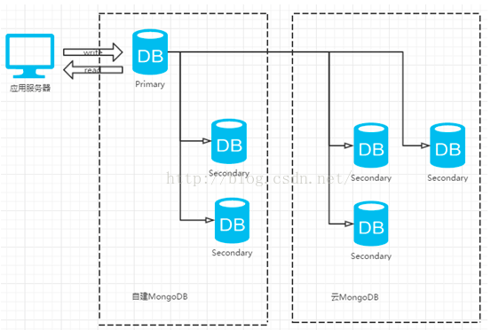
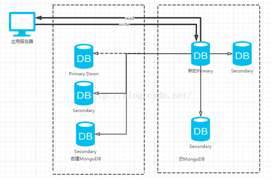

迁移到云数据库

一般MongoDB的迁移上云的策略都是通过副本集的高可用性来实现，不过需要首先保证网络的连通性（这一点一般云计算厂商都会负责或协助打通）。通过将云DB作为自建DB的Secondary节点，当两边的数据达到完成一致，确认数据正常后，手工做一次高可用的切换，使得服务整理从自建DB切换到云DB。当切换完成后，云DB可成功选举成为新的Primary节点，这时即可在新的Primary节点上rs.remove移除自建DB节点，从而实现了MongoDB上云的平滑迁移。下面已自建的MongoDB是三个节点组成的副本集为例，现在想迁移到云上，步骤如下

1     打通目标库和源库之间的网络，这一步不做详细讨论，简单地说，假如源库本身就布置是在云服务商所在的云主机上，那么一般来说同一账户下的资源，网络已经是打通了的；假如是从其他IDC机房迁移到云MongoDB上，可以通过做一次代理的方式实现网络互通。

2     建立源DB和目标DB的副本集，以源库作为主节点，目标库作为从节点，并将目标DB的IP添加到副本集连接字符串的url中，这里还需要注意的是保证账户鉴权方式的统一和副本集名称的统一。假设源DB为三个节点的副本集，现在想迁移到云上，那么需要做成的副本集结构图如下

> Mongodb复制集里的Secondary会从Primary上同步数据，以保持副本集所有节点的数据保持一致，数据同步主要包含2个过程：
>
> 1. initial sync
> 2. replication （oplog sync）
>
> 先通过init sync同步全量数据，再通过replication不断重放Primary上的oplog同步增量数据。
>
> ## initial sync
>
> Secondary启动后，如果满足以下条件之一，会先进行initial sync
>
> 1. Secondary上oplog为空，比如新加入的空节点
> 2. local.replset.minvalid集合里_initialSyncFlag标记被设置。当initial sync开始时，同步线程会设置该标记，当initial sync结束时清除该标记，故如果initial sync过程中途失败，节点重启后发现该标记被设置，就知道应该重新进行initial sync。
> 3. BackgroundSync::_initialSyncRequestedFlag被设置。当向节点发送resync命令时，该标记会被设置，此时会强制重新initial sync。
>
> ### initial sync同步流程
>
> 1. minValid集合设置_initialSyncFlag
> 2. 获取同步源当前最新的oplog时间戳t0
> 3. 从同步源Clone所有的集合数据
> 4. 获取同步源最新的oplog时间戳t1
> 5. 同步t0~t1所有的oplog
> 6. 获取同步源最新的oplog时间戳t2
> 7. 同步t1~t2所有的oplog
> 8. 从同步源读取index信息，并建立索引
> 9. 获取同步源最新的oplog时间戳t3
> 10. 同步t2~t3所有的oplog
> 11. minValid集合清除_initialSyncFlag，initial sync结束
>
> ## replication (sync oplog)
>
> initial sync结束后，Secondary会建立到Primary上local.oplog.rs的tailable cursor，不断从Primary上获取新写入的oplog，并应用到自身。
>
> Tailable cursor每次会获取到一批oplog，Secondary采用多线程重放oplog以提高效率，通过将oplog按照所属的namespace进行分组，划分到多个线程里，保证同一个namespace的所有操作都由一个线程来replay，以保证统一namespace的操作时序跟primary上保持一致（如果引擎支持文档锁，只需保证同一个文档的操作时序与primary一致即可）。
>
> ## 同步场景分析
>
> **1. 副本集初始化**
>
> 初始化选出Primary后，此时Secondary上无有效数据，oplog是空的，会先进行initial sync，然后不断的应用新的oplog
>
> **2. 新成员加入**
>
> 因新成员上无有效数据，oplog是空的，会先进行initial sync，然后不断的应用新的oplog
>
> **3. 有数据的节点加入**
>
> 有数据的节点加入有如下情况：
>
> 1. 该节点与副本集其他节点断开连接，一段时间后恢复
> 2. 该节点从副本集移除（处于REMOVED）状态，通过replSetReconfig命令将其重新加入
> 3. 其他? 因同一个副本集的成员replSetName配置必须相同，除非有误配置，应该不会有其他场景
>
> 此时，如果该节点最新的oplog时间戳，比所有节点最旧的oplog时间戳还要小，该节点将找不到同步源，会一直处于RECOVERING而不能服务；反之，如果能找到同步源，则直接进入replication阶段，不断的应用新的oplog。
>
> 因oplog太旧而处于RECOVERING的节点目前无法自动恢复，需人工介入处理（故设置合理的oplog大小非常重要），最简单的方式是发送resync命令，让该节点重新进行initial sync。

3     当数据完全一致后，人为地将旧主库关闭，并将Mongodb云数据库中的一个Secondary节点提升为新的Primary节点，提升完成后的结构图如下

4     确认业务正常，数据没有问题后，在MongoDB云数据库的Primary节点中挨个删除自建DB的数据节点，并将连接url去掉之前源DB的IP和端口信息即可
