### MongoDB读写流程

MongoDB是个主从架构的数据库，以BSON文档的形式存数据库，BSON和JSON格式很像，额外加了些自己的东西，并以二进制编码存储。所以会涉及到序列化的问题，存储形式是双向链表（忘了在哪里看到的，如果不对可以和我说）。集群的话有三种架构模式，一般情况下做sharding，涉及到primary，secondary，mongos，还有configServer。这篇主要介绍一下MongoDB的读写流程，和备份机制。

primary：主库

secondary：从库，复制主库的数据

configServer：metadata管理器

mongos：相当于路由，把读写请求分发到主库上面。

## 写

写的参数有这么几个 {w: <value>, j: <boolean>, wtimeout: <number> }

**w**：请求确认传播到多少个mongod实例里,或者用指定tags的mongod实例。

**j** ：请求确认写操作写到了日志里。如果W=0,J=1，J的优先级高，表明会写到日志里。就是强制写日志。

**wtimeout** ：指定超时时间，防止写操作无限期阻塞。

对于不同的参数，其实相当于会更改MongoDB的一致性。比如说**w**参数，默认是1，就是请求确认到一个mongodb实例或者一个副本集里的一个主节点。意味着你的写请求，是会写到一个mongodb实例的，如果是2，就是要写入2个实例。一般是用“majority”，就是超过半数n/2+1的节点要求写成功。

不同的存储引擎写入的方式是不一样的，这个后面说。

## 读

读的参数有3个，“local”,“majority”,“linearizable”。

“local”是默认的。查询返回最新数据，不保证数据被副本集里的多数派写入。比如回滚。

"majority"，返回多数派的结果，需要使用WiredTieg数据引擎。

"linearizable"，线性一致性，只要当读操作返回结果，所有后序的读应该能返回同样的结果，或者后面写入的结果。

怎么理解linearizable？用stack overflow上的回答来解释。

假设，有一个3节点副本集，A是主节点，B和C是从节点。

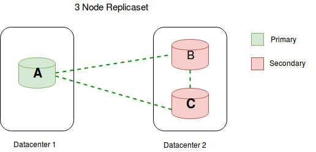

有两个用户Alice和Bob,要在“users” collection上，执行一些操作。比如有个document如下：

`{"_id": 100234,"name": "Katelyn"}`
在T0时刻

\1. Alice连接到A，执行下面操作
db.users.find({"_id":100234}); --> with read concern 'majority'

返回：

> { "_id" : 100234, "name" : "Katelyn" }

返回结果没有问题，B和C这时发现A停止回应了（可能网络原因），B和C开始选举。

在T1时刻

因为选举，B成为了新的主节点，这时在很短的时间内，A觉得自己应该降级为从节点，但是还在作为主节点提供服务。

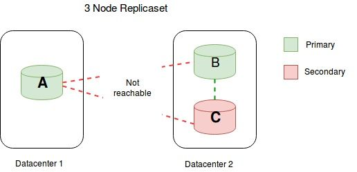

在T2时刻

Bob连接到B（主节点），执行下面操作

db.users.update( {"_id":100234}, {$set: {name:"Sansa"} } ); --> with write concern 'majority'.

把Katelyn改成了Sansa，B确认写成功。

在T3时刻

Alice连接A，执行下面操作

db.users.find({"_id":100234}); --> read concern 'majority'

返回结果：

> { "_id" : 100234, "name" : "Katelyn" }

虽然这里用的是读majority，但是返回结果已经过时了，Bob的写操作对Alice是不可见的。

如果用的是线性一致性linearizable，读的时候，mongodb实例会先去检查这个primary，确认能看到多数派节点。还是上面的例子，应该会检查A节点，发现A节点并不能和多数派去通信了，所以A不再是主节点了，需要从新的主节点B里获取数据，连接B，确认B能看到多数派，然后返回结果。这肯定会带来性能开销，所以会比majority慢一些。

更多的线性一致性的设置细节，看另一篇MongoDB。


写的情况分storage engine：WiredTiger Strorage Engine和MMAPv1 Storage Engine

MongoDB在2.2时，提供的是数据库级别(database)的锁，MongoDB在MMAPv1（2.6.12版本）下支持集合(collection-level)级别的锁，在MongoDB 3.2版本后面，默认用WiredTiger，支持document-level的锁和压缩。

## 1. WiredTiger Storage Engine

**持久性：**当关机重启一台或多台机器，写操作还在，就是持久的。对单mongod实例来说，一个写操作被写进日志文件后就是持久的。对于副本集来说，一个写操作被写进了大多数的节点日志时是持久的。

## 1.1 Document Level Concurrency

WiredTiger用document-level的写一致性。多个客户端可以修改一个collection的不同documents。对于大多数读写操作，WiredTiger用乐观一致性（延迟检查直到发生冲突，然后暂停重试其中一个操作）。WiredTiger只用了intent locks在全局，数据库，集合层。当引擎检查到2个操作冲突，其中一个会引起写冲突，让MongoDB重新执行那个操作透明的。

一些全局操作，典型的短生命周期涉及多个数据库的，仍然需要“instance-wide” lock。一些别的比如删除集合，需要额外的数据库锁。

## 1.2 Snapshots and Checkpoints

WiredTiger用MultiVersion Concurrency Control (MVCC) 多版本一致性控制。一个操作开始的时候，WiredTiger提供一个事物数据的point-in-time快照。一个快照显示一个一致的内存数据视图（内存里数据的一个拷贝）。

当写磁盘时，WiredTiger把快照里的所有数据用一致性方法写入磁盘，这可能影响到所有的数据文件。当前持久数据作为数据文件中的一个检查点。检查点保证数据文件里的数据一致并包括最新的检查点，检查点可以被用来当作恢复点。

MongoDB配置WiredTiger来创建检查点每隔60S或者日志文件到2GB。

当创建一个新的检查点时，之前的检查点仍然有效。这样，MongoDB终止或者创建新检查点时碰到错误，重启，仍然可以恢复到上一个可用的检查点。

当WiredTiger的metadata表在原子级别更新操作成新检查点时，这个检查点就可用并永久。当新的检查点可用，老的检查点就被释放了。

使用WiredTiger，即使没有日志，MongoDB也可以从最新检查点恢复；如果要恢复检查点之后的操作，需要用日志。

## 1.3 Journal

Jorunal是一个连续的，二进制事物log，当节点挂点时来恢复数据库到一个有效的状态。日记先把数据写到日记文件里再写到数据文件里。Journal文件是预分配，在dbpath目录下，WiredTigerLog.<sequence>，sequence从0000000001开始。

日志文件对每个写操作都有记录，每个记录有个独一的标识符。

日志文件最大差不多100MB，大了就创建新文件。最小的日志记录是128B，如果记录小于128B，就不压缩这条记录。

WiredTiger 自动除去旧的日志文件，只维护那些从上个检查点开始需要维护的文件。

这个日志叫write-ahead log。
如果MongoDB在两个检查点之间退出了，只能用log来恢复。

\1. 查询数据文件找到上个检查点。

\2. 在日志文件里找符合检查点的记录。

\3. 应用那些从上个检查点开始日志文件里的操作。
WiredTiger为每个客户端引发的写操作都创建一个日志记录。日志记录包括因初始化写引起的任何内部写操作。比如，一个集合的更新可能导致索引的修改；WiredTiger创建一单条日志记录包括更新操作和索引修改。

MongoDB配置WiredTiger用内存缓存存储日志记录。线程之间协调配合，分配和拷贝他们负责的部分到缓存里。所有的日志记录到128KB就被存到缓存里。（比如多个线程在写数据，每次写数据都会生成日志，每条日志记录最小128B，当到了128KB，就被放到缓存里，然后把缓存里的内容持久化到磁盘上。）

然后通过以下步骤把缓存里的日志记录写到磁盘上（在3.2版本，每隔50毫秒）

1. MongoDB每60s或者日志达到2GB创建一个检查点。
2. 如果write concern “j: true”，WiredTiger强制同步WiredTiger日志文件。
3. MongoDB日志文件大小限制在100MB，每到100MB就创建一个新的，当创建新的，WiredTiger就同步之前的日志文件。（有可能之前的日志已经被写到数据文件了，或者生成check point了，就不需要再记录在日志里了，所以这里需要检查同步之前的日志）

## 2. MMAPv1 Storage Engine

当写操作发生，MongoDB更新内存视图。如果开启了日志，MongoDB把内存改变先写到磁盘日志里。为了确保所有修改持久化到硬盘，默认的，记录所有数据到磁盘日志上。写日志比写数据文件更频繁。

MMAPv1默认配置下，MongoDB每60S写一次数据文件，大约每100毫秒写一次日志文件。这些是写操作到数据文件或日志的最大值，很多时候会比这更频繁，这些是理论最大值。

在mongod实例退出却没能把所有修改刷进硬盘时，日志允许MongoDB能从数据文件成功恢复数据。

MongoDB存储层有数据集的两个内部视图：私有视图，用来写日志文件，共享视图，用来写数据文件。

\1. MongoDB先把写操作应用到私有视图上。

\2. 每100毫秒，MongoDB把这些私有视图上的更改写到硬盘上的日志文件里。用group commits把写记录一次写到日志文件上。把这些提交组合起来可以减小对日志的性能影响，因为这些在提交时会阻塞所有的写。写日志时，是原子性的，确保磁盘上的文件一致性。

\3. 当一个日志提交，MongoDB把这从日志应用到共享视图里。

\4. 最后，MongoDB把这些改变从共享视图写到数据文件里。默认的每隔60秒，MongoDB让操作系统把共享视图写进数据文件。操作系统可以选择以更高的频率比如少于60秒把共享视图写到磁盘，特别是当系统可用内存较小的时候。

当MongoDB把写操作写到数据文件里，它就知道哪个日志文件被刷新了。一旦一个日志文件只包含更新过的写操作，就不在需要恢复，MongoDB可以回收它建新的日志文件。一旦日志操作被应用到共享视图并写到磁盘，MongoDB让操作系统重新映射共享视图到私有视图来节省物理RAM。MongoDB规律性的让操作系统重新映射共享视图到私有视图来节省空间。

私有视图的意义在于写日志，如果没有私有视图，直接把数据写到共享视图上，那节点挂了，内存里的数据就丢了。或者当节点写了一半时，挂了，没法进行回滚了。

在dbPath目录下，会创建一个目录叫“journal”，其下包括j._<sequence>文件，sequence从0开始增加，和一个lsn文件，记录mongodb最后一次更改数据文件的信息。

journal文件包换write ahead logs，每一个日志条目描述了数据文件中写操作改变的bytes。日志文件是只增加的的文件。当一个日志文件超过1GB，mongodb创建一个新的日志文件，如果用storage.smallFiles设置，限制日志文件大小为128MB。

当mongodb把所有写操作应用到数据文件中，就可以回收日志文件了。除非每秒写了很多数据，一般jorunal目录只包含两个或三个日志文件。

一个干净的关闭，移除日志目录下的所有文件。一个脏的关闭会再日志目录下留下文件，当mongodb恢复一致性状态时，需要从文件里恢复。

只在MMAPv1中，MongoDB可以预先抓取内存页和索引来提高复制效率。

**Record Storage Characteristics**

所有的记录连续存在磁盘上，当一个文档变大，超过分配的记录，MongoDB必须分配一个新的记录。新的分配需要mongodb移动文档，更新索引，相比于更新本地文档花费更多的时间。mongodb用2的n次冥分配空间来存储记录，当文档增大时还有位置，减少重新分配地址这种情况。

两种分配策略：

- Power of 2 Sized Allocations

MMAPv1中，每个记录大小是2的n次方，（32,64,128,256,512.。。。2MB）。如果大于2MB，就以2MB倍数来分，比如4MB,6MB。

适用于经常插入、更新和删除的

- exact fit allocations

适合没有更新和删除的


## 3. Replica Set

Primary是接受写操作的唯一成员。MongoDB把写操作应用到primary上，然后记录它们到primary的**oplog**上面。Secondary拷贝这些log然后应用到他们的数据集上。副本集里的所有成员都可以接受读操作，但是默认是把读操作发给primary。

Secondary维护primary数据集的一份拷贝。Secondary应用primary的oplog以异步进程的方式到自己的数据集上。

oplog的实际存储形式是用的MongoDB里的capped collection（封顶集合），一个有上线大小的集合，和环形缓冲区类似，当集合满了之后，覆盖集合里最老的文档。它保证插入顺序，这样，查询就不需要索引来返回文档的插入顺序。没有额外的索引消耗，封顶集合可以支持更高的吞吐量。

Oplog存储所有修改了数据库数据的操作，所有副本集成员都有一份oplog的拷贝。

为了促进复制，所有副本集成员对其它成员发送心跳（pings）。任何成员可以从别的成员里引入oplog记录。

每个操作在oplog里是冥等的。即oplog操作产生一样的结果，不管是应用了一次或者多次到数据库。

当第一次创建副本集成员时，MongoDB以默认大小创建一个oplog。

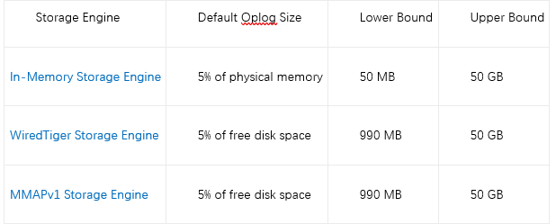

副本集数据同步分两种情况：1是从头开始同步，完全备份，2是增量同步，增量备份。

**Initial Sync** 从另一个成员里拷贝所有数据

\1. 拷贝所有数据库除了local数据库。mongd扫描每个集合然后插入数据到自己数据。当文档拷贝的时候Initial sync建立所有集合索引。在拷贝数据的时候，Initial sync拉取最新的oplog记录。确保目标成员的local数据库有足够的空间存这些oplog记录。

\2. 应用所有改变到数据集。从源头用oplog，mongod更新数据到最新状态的副本。

当initial sync完成，成员从“STARTUP2”变成“SECONDARY”。

initial sync有重试机制来避免网络或者操作错误。

**增量备份**

在initial sync，Secondary成员连续的复制数据。Secondary应用primary的oplog以异步进程的方式到自己的数据集上。Secondary不从延迟成员或者隐藏成员那里同步数据。

如果有这个[members[n\].buildIndexes](https://link.zhihu.com/?target=https%3A//docs.mongodb.com/manual/reference/replica-configuration/%23rsconf.members%5Bn%5D.buildIndexes)，设置为true的可以拷贝，false的不行。

MongoDB用多线程来进行批量写提供并发性。MongoDB把批操作按照namespace（MMAPv1）或者document id（WiredTiger）分组，同步时每个组用不同线程。

当批处理时，MongoDB阻塞所有读操作，此时访问secondary的读取查询不会返回结果。

只在MMAPv1中，MongoDB可以预先抓取内存页和索引来提高应用oplog记录的效率。（因为存储引擎实现的机制不一样，上面有讲）

-----

**读过程**

生成语法树 （matchExpression）；
逻辑优化过程：由MatchExpression 生成 CanoncalQuery；
生成查询计划： 由CanoncalQuery生成QuerySolution和 MultiPlanStage；
生成PlanExecutor；
执行计划

**写过程**

MongoDB在写入前，首先需要与服务器进行连接再发送请求，服务端的处理流程如下：

    Mongod在启动时会创建一个PortMessageServer对象，其调用setupSockets为mongod配置的每个地址创建一个socket，并bind地址，然后调用initAndListen监听所有的地址，调用select等待监听fd上发生的链接时间，调用accept系统接受新的连接请求，并为每个连接创建一个线程，执行handleIncomingMsg方法。
    
    handleIncomingMsg会创建一个新的Client对象，并不断调用recv从连接上读取请求，并将请求反序列化为Message对象，并调用MyMessageHandler::process方法处理请求。
    
    MyMessageHandler::process会调用assembleResponse方法，从Message对象里获取请求类型,根据请求类型进行相应的处理。如果是dbInsert，会调用receivedInsert处理，再调用database类的接口定位对应的Collection对象，然后调用insertDocement往集合写入文档。

​    接下来解释一下MongoDB的存储引擎


    从MongoDB 3.0之后引入的WiredTiger弥补了MMAP存储引擎自身的天然缺陷(耗费磁盘空间和内存空间且难以清理，更致命的是库级别锁)。
    
    WiredTiger通过MVCC实现文档级别的锁，这样就允许了多个客户端请求同时更新一个集合内的不同文档。
    
    回归主题，上文说到调用insertDocement来写文档，那么存储引擎的处理过程就是，先写journal日志，然后通过多版本并发控制（MVCC）。操作开始之时，WiredTiger 提供了一个时间点快照。快照提供了内存数据的一致性视图，这样就能修改该文档内容。

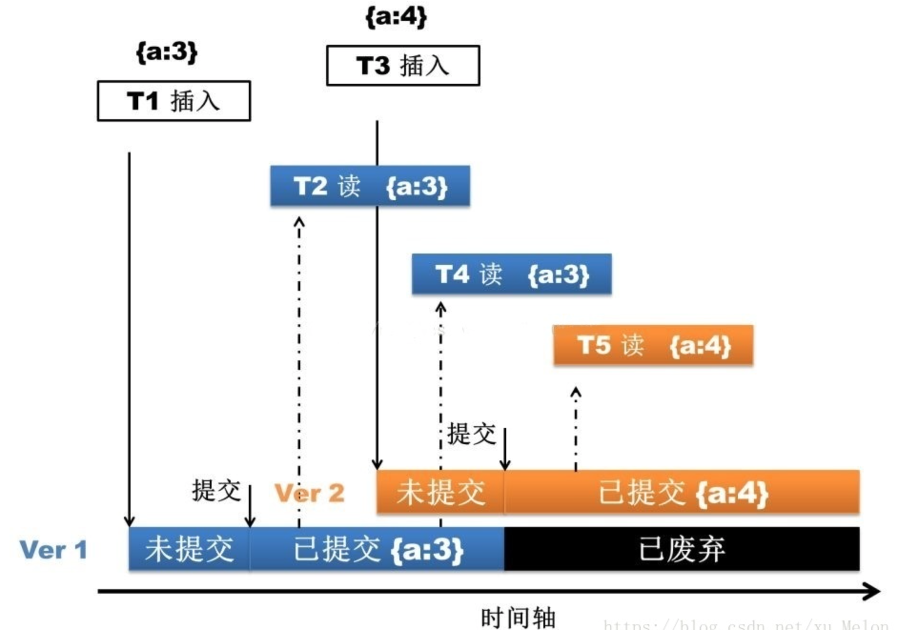

    都知道NoSQL快，其实上文并没有体现，关键快在，MongoDB修改的是内存的文档，接着就直接返回了。接下来就有必要了解一下这过程的详细信息。

   Mongo使用了内存映射技术 － 写入数据时候只要在内存里完成就可以返回给应用程序，而保存到硬体的操作则在后台异步完成。先了解一下Memeory-Mapped Files

1. 内存映射文件是OS通过mmap在内存中创建一个数据文件，这样就把文件映射到一个虚拟内存的区域。
2. 虚拟内存对于进程来说，是一个物理内存的抽象，寻址空间大小为2^64
3. 操作系统通过mmap来把进程所需的所有数据映射到这个地址空间(红线)，然后再把当前需要处理的数据映射到物理内存(灰线)
4. 当进程访问某个数据时，如果数据不在虚拟内存里，触发page fault，然后OS从硬盘里把数据加载进虚拟内存和物理内存
5. 如果物理内存满了，触发swap-out操作，这时有些数据就需要写回磁盘，如果是纯粹的内存数据，写回swap分区，如果不是就写回磁盘。

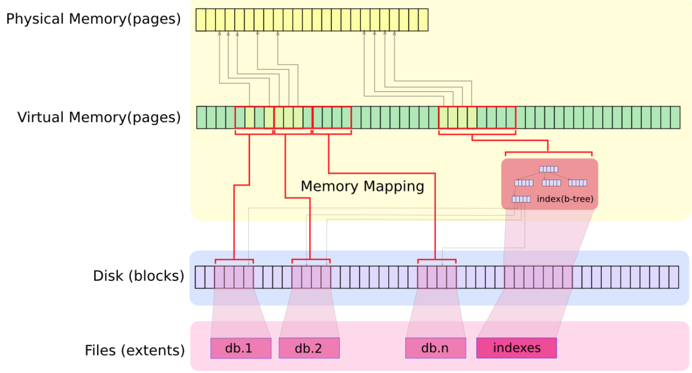


MongoDB的存储模型

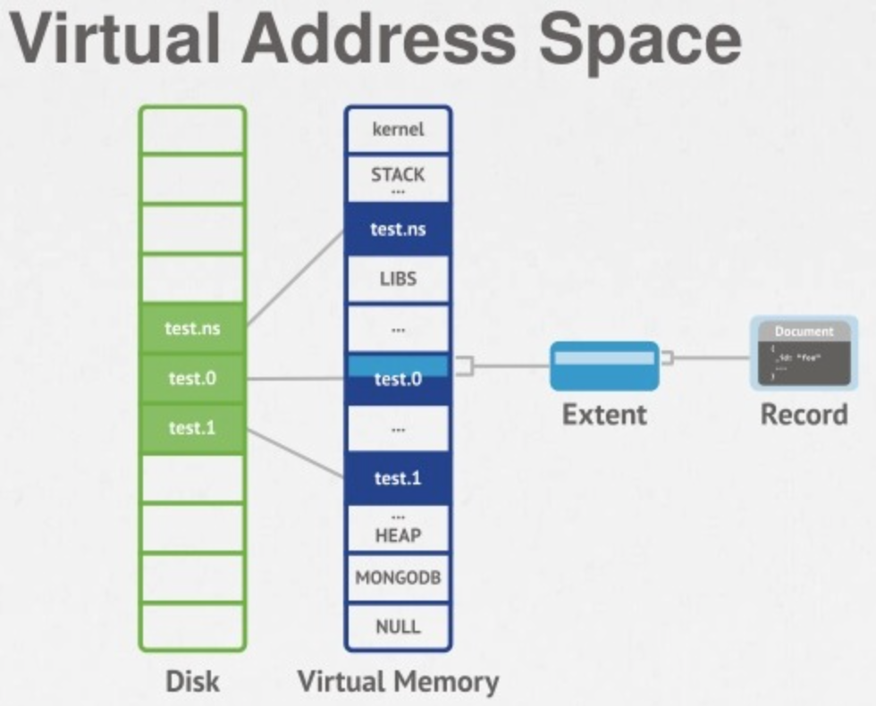

    MongoDB把文档写进内存之后就返回了，那么接下来的数据的一致性问题、持久化问题，就由上文点到的journal日志来实现了。默认情况下mongodb每100毫秒往journal文件中flush一次数据，默认每隔60秒，MongoDB请求操作系统将Shared view刷新输出到磁盘，此外，journal日志还可以用来做备份容灾。
    
    这样Mongo的一次数据写入过程才算完成。


### 事务实现原理解析

WiredTiger从被MongoDB收购到成为MongoDB的默认存储引擎的一年半得到了迅猛的发展，也逐步被外部熟知。WiredTiger（以下简称WT）是一个优秀的单机数据库存储引擎，它拥有诸多的特性，既支持BTree索引，也支持LSM Tree索引，支持行存储和列存储，实现ACID级别事务、支持大到4G的记录等。WT的产生不是因为这些特性，而是和计算机发展的现状息息相关。

  现代计算机近20年来CPU的计算能力和内存容量飞速发展，但磁盘的访问速度并没有得到相应的提高，WT就是在这样的一个情况下研发出来，它设计了充分利用CPU并行计算的内存模型的无锁并行框架，使得WT引擎在多核CPU上的表现优于其他存储引擎。针对磁盘存储特性，**WT实现了一套基于BLOCK/Extent的友好的磁盘访问算法**，使得WT在数据压缩和磁盘I/O访问上优势明显。**实现了基于snapshot技术的ACID事务，snapshot技术大大简化了WT的事务模型，摒弃了传统的事务锁隔离又同时能保证事务的ACID**。WT根据现代内存容量特性实现了一种基于Hazard Pointer 的LRU cache模型，充分利用了内存容量的同时又能拥有很高的事务读写并发。

  在本文中，我们主要针对WT引擎的事务来展开分析，来看看它的事务是如何实现的。说到数据库事务，必然先要对事务这个概念和ACID简单的介绍。

# 一、多文档事务的基本概念

## 1、多文档事务

  **多文档事务，可以理解为关系型数据库的多行事务**。在关系型的事务支持中，大家几乎无一例外**支持同一事务内操作的原子性，即要么全部提交，要么全部回滚**。这个同一事务内可以有多个操作，针对于多个表，或者是同一个表内的多行数据。

## 2、多文档分布式事务

  **传统的关系型数据库的事务是针对单节点的，而分布式系统有多个节点，一个事务里可能会操作多个节点**。

# 二、事务与复制集以及存储引擎之间的关系

## 1、事务与复制集

  复制集配置下，MongoDB 整个事务在提交时，会**记录一条 oplog**（oplog 是一个普通的文档，所以目前版本里事务的修改加起来不能超过文档大小 16MB的限制），**包含事务里所有的操作，备节点拉取oplog，并在本地重放事务操作**。事务 oplog 包含了**事务操作的 lsid，txnNumber**，以及事务内所有的操作日志（applyOps字段）。

## 2、事务与存储引擎

  WiredTiger 很早就支持事务，在 3.x 版本里，MongoDB 就通过 WiredTiger 事务，来保证一条修改操作，对数据、索引、oplog 三者修改的原子性。但实际上 MongoDB 经过多个版本的迭代，才提供了事务接口，**核心难点就是时序问题**。

  MongoDB 通过 oplog 时间戳来标识全局顺序，而 WiredTiger 通过内部的事务ID来标识全局顺序，在实现上，2者没有任何关联。这就导致在并发情况下， MongoDB 看到的事务提交顺序与 WiredTiger 看到的事务提交顺序不一致。

  为解决这个问题，WiredTier 3.0 引入**事务时间戳（transaction timestamp）机制**，应用程序可以通过 WT_SESSION::timestamp_transaction 接口显式的给 WiredTiger 事务分配 commit timestmap，然后就可以**实现指定时间戳读**（read “as of” a timestamp）。有了 read “as of” a timestamp 特性后，在重放 oplog 时，备节点上的读就不会再跟重放 oplog 有冲突了，不会因重放 oplog 而阻塞读请求，这是4.0版本一个巨大的提升。

```cpp
/*
 * __wt_txn_visible --
 *  Can the current transaction see the given ID / timestamp?
 */
static inline bool
__wt_txn_visible(
    WT_SESSION_IMPL *session, uint64_t id, const wt_timestamp_t *timestamp)
{
    if (!__txn_visible_id(session, id))
        return (false);

    /* Transactions read their writes, regardless of timestamps. */
    if (F_ISSET(&session->txn, WT_TXN_HAS_ID) && id == session->txn.id)
        return (true);

#ifdef HAVE_TIMESTAMPS
    {
    WT_TXN *txn = &session->txn;

    /* Timestamp check. */
    if (!F_ISSET(txn, WT_TXN_HAS_TS_READ) || timestamp == NULL)
        return (true);

    return (__wt_timestamp_cmp(timestamp, &txn->read_timestamp) <= 0);
    }
#else
    WT_UNUSED(timestamp);
    return (true);
#endif
}
123456789101112131415161718192021222324252627282930
```

  从上面的代码可以看到，**在引入事务时间戳之后，在可见性判断时，还会额外检查时间戳，上层读取时指定了时间戳读，则只能看到该时间戳以前的数据**。而 MongoDB 在提交事务时，会将 oplog 时间戳跟事务关联，从而达到 MongoDB Server 层时序与 WiredTiger 层时序一致的目的。

# 三、WiredTiger事务的实现原理

## 1、WT事务的构造

  知道了基本的事务概念和ACID后，来看看WT引擎是怎么来实现事务和ACID的。要了解实现先要知道它的事务的构造和使用相关的技术，**WT在实现事务的时使用主要是使用了三个技术：snapshot(事务快照)、MVCC (多版本并发控制)和redo log(重做日志)**，为了实现这三个技术，它还定义了一个基于这三个技术的事务对象和全局事务管理器。事务对象描述如下：

```
wt_transaction{
	transaction_id:    本次事务的全局唯一的ID，用于标示事务修改数据的版本号
	snapshot_object:   当前事务开始或者操作时刻其他正在执行且并未提交的事务集合,用于事务隔离
	operation_array:   本次事务中已执行的操作列表,用于事务回滚。
	redo_log_buf:      操作日志缓冲区。用于事务提交后的持久化
	State:             事务当前状态
}
1234567
```

## 2、WT的多版本并发控制

  **WT中的MVCC是基于key/value中value值的链表**，这个链表单元中存储有当先版本操作的事务ID和操作修改后的值。描述如下：

```
wt_mvcc{
	transaction_id:    本次修改事务的ID	
	value:             本次修改后的值
}
1234
```

  WT中的数据修改都是在这个链表中进行append操作，每次对值做修改都是append到链表头上，每次读取值的时候读是从链表头根据值对应的修改事务transaction_id和本次读事务的snapshot来判断是否可读，如果不可读，向链表尾方向移动，直到找到读事务能都的数据版本。样例如下：
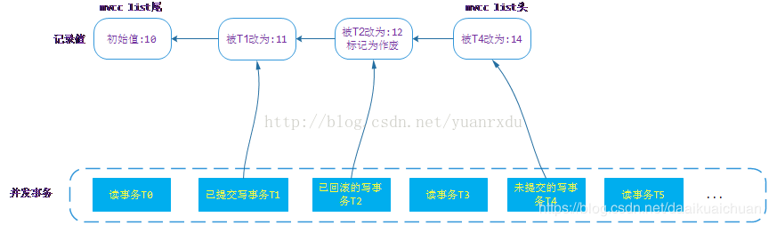
  上图中，事务T0发生的时刻最早，T5发生的时刻最晚。T1/T2/T4是对记录做了修改。那么在mvcc list当中就会增加3个版本的数据，分别是11/12/14。如果事务都是基于snapshot级别的隔离，T0只能看到T0之前提交的值10，读事务T3访问记录时它能看到的值是11，T5读事务在访问记录时，由于T4未提交，它也只能看到11这个版本的值。这就是WT 的MVCC基本原理。

## 3、WT事务snapshot

  上面多次提及事务的**snapshot【提供可见性】**，那到底什么是事务的snapshot呢？**其实就是事务开始或者进行操作之前对整个WT引擎内部正在执行或者将要执行的事务进行一次截屏，保存当时整个引擎所有事务的状态，确定哪些事务是对自己见的，哪些事务都自己是不可见**。说白了就是一些列事务ID区间。WT引擎整个事务并发区间示意图如下：
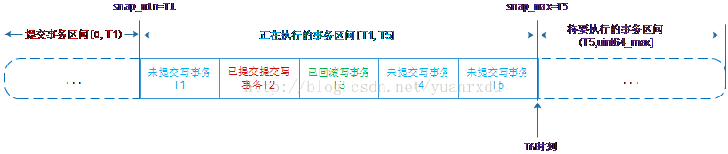
  WT引擎中的snapshot_oject是有一个**最小执行事务snap_min、一个最大事务snap max和一个处于[snap_min, snap_max]区间之中所有正在执行的写事务序列组成**。如果上图在T6时刻对系统中的事务做一次snapshot，那么产生的：

```
snapshot_object = {
    snap_min=T1,
    snap_max=T5,
	snap_array={T1, T4, T5},
};
12345
```

那么T6能访问的事务修改有两个区间：所有小于T1事务的修改[0, T1)和[snap_min,snap_max]区间已经提交的事务T2的修改。换句话说，**凡是出现在snap_array中或者事务ID大于snap_max的事务的修改对事务T6是不可见的**。如果T1在建立snapshot之后提交了，T6也是不能访问到T1的修改。这个就是snapshot方式隔离的基本原理。

## 4、全局事务管理器

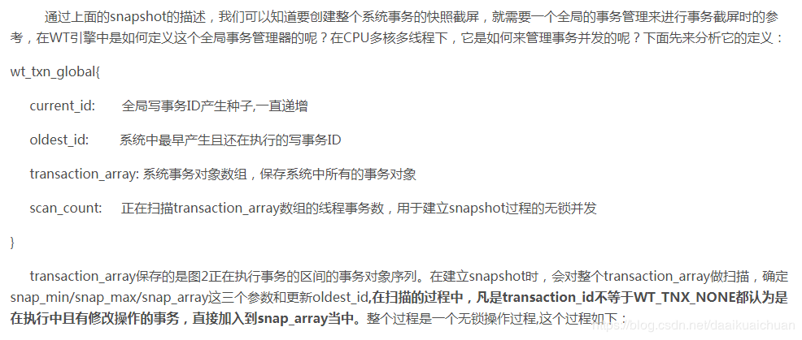
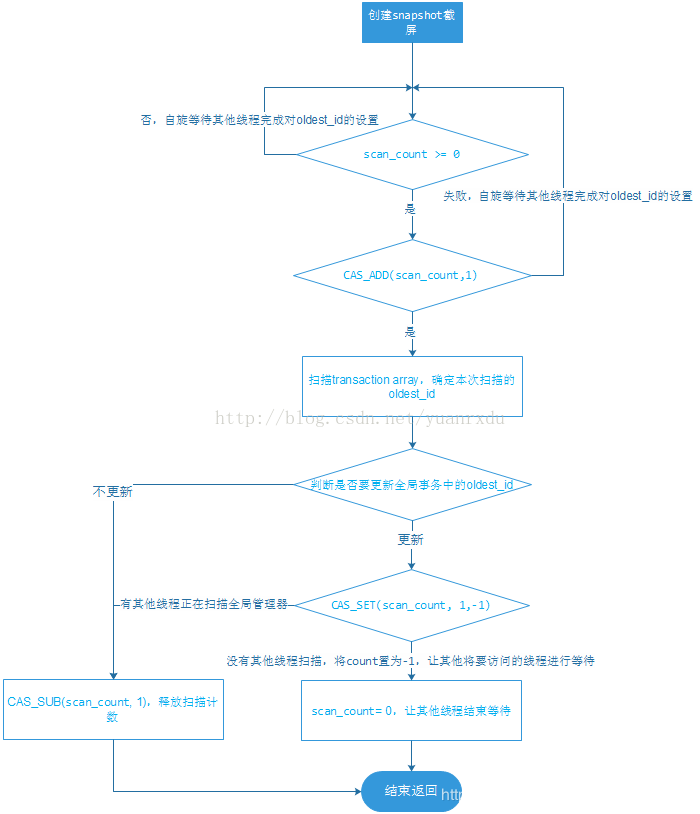
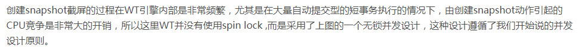

## 5、事务ID

  从WT引擎创建事务snapshot的过程中现在可以确定，**snapshot的对象是有写操作的事务，纯读事务是不会被snapshot的，因为snapshot的目的是隔离mvcc list中的记录，通过MVCC中value的事务ID与读事务的snapshot进行版本读取，与读事务本身的ID是没有关系**。在WT引擎中，开启事务时，引擎会将一个WT_TNX_NONE( = 0)的事务ID设置给开启的事务，当它第一次对事务进行写时，会在数据修改前通过全局事务管理器中的current_id来分配一个全局唯一的事务ID。这个过程也是通过CPU的CAS_ADD原子操作完成的无锁过程。

# 四、WiredTiger事务过程

  一般事务是两个阶段：**事务执行和事务提交。在事务执行前，我们需要先创建事务对象并开启它，然后才开始执行，如果执行遇到冲突和或者执行失败，我们需要回滚事务(rollback)。如果执行都正常完成，最后只需要提交(commit)它即可**。从上面的描述可以知道事务过程有：创建开启、执行、提交和回滚。那么从这几个过程中来分析WT是怎么实现这几个过程的。
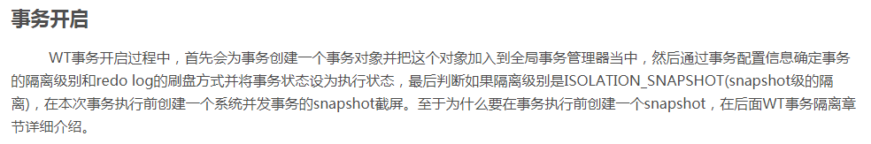
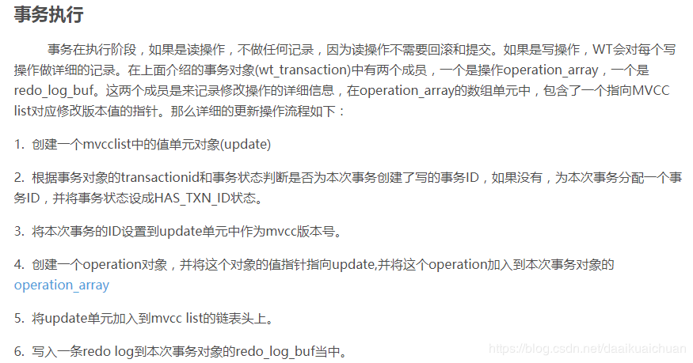
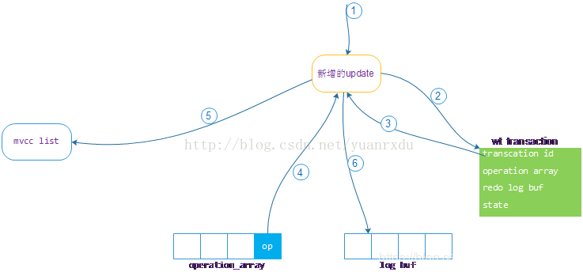
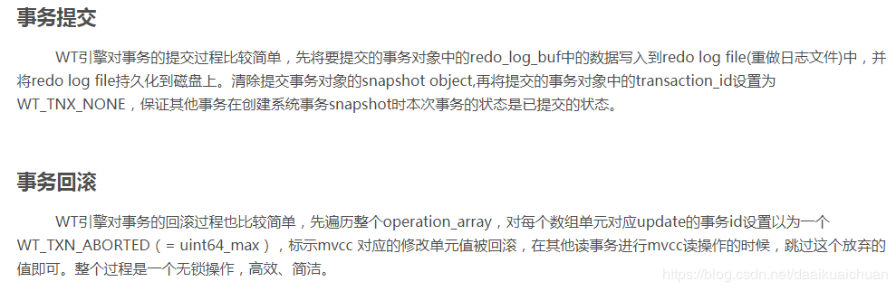

# 五、WiredTiger的事务隔离

  传统的数据库事务隔离分为:Read-Uncommited(未提交读)、Read-Commited(提交读)、Repeatable-Read(可重复读)和Serializable(串行化)，WT引擎并没有按照传统的事务隔离实现这四个等级，而是基于snapshot的特点实现了自己的Read-Uncommited、Read-Commited和一种叫做snapshot-Isolation(快照隔离)的事务隔离方式。在WT中不管是选用的是那种事务隔离方式，它都是基于系统中执行事务的快照截屏来实现的。那来看看WT是怎么实现上面三种方式的。
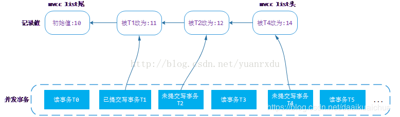

## 1、Read-Uncommited

  **Read-Uncommited(未提交读)隔离方式的事务在读取数据时总是读取到系统中最新的修改，哪怕是这个修改事务还没有提交一样读取，这其实就是一种脏读**。WT引擎在实现这个隔方式时，就是**将事务对象中的snap_object.snap_array置为空即可，那么在读取MVCC list中的版本值时，总是读取到MVCC list链表头上的第一个版本数据**。举例说明，在上图中，如果T0/T3/T5的事务隔离级别设置成Read-Uncommited的话，那么T1/T3/T5在T5时刻之后读取系统的值时，读取到的都是14。一般数据库不会设置成这种隔离方式，它违反了事务的ACID特性。可能在一些注重性能且对脏读不敏感的场景会采用，例如网页cache。

## 2、Read-Commited

  **Read-Commited(提交读)隔离方式的事务在读取数据时总是读取到系统中最新提交的数据修改，这个修改事务一定是提交状态。这种隔离级别可能在一个长事务多次读取一个值的时候前后读到的值可能不一样，这就是经常提到的“幻象读”**。在WT引擎实现Read-Commited隔离方式就是事务在执行每个操作前都对系统中的事务做一次截屏，然后在这个截屏上做读写。还是来看上图，T5事务在T4事务提交之前它进行读取前做事务：

```
snapshot={
	snap_min=T2,
	snap_max=T4,
	snap_array={T2,T4},
};
12345
```

在读取MVCC list时，12和14修个对应的事务T2/T4都出现在snap_array中，只能再向前读取11，11是T1的修改，而且T1 没有出现在snap_array，说明T1已经提交，那么就返回11这个值给T5。

  之后事务T2提交，T5在它提交之后再次读取这个值，会再做一次：

```
snapshot={
	snap_min=T4,
    snap_max=T4,
    snap_array={T4},
};
12345
```

这时在读取MVCC list中的版本时，就会读取到最新的提交修改12。

## 3、Snapshot- Isolation

  **Snapshot-Isolation（快照隔离）隔离方式是读事务开始时看到的最后提交的值版本修改，这个值在整个读事务执行过程只会看到这个版本，不管这个值在这个读事务执行过程被其他事务修改了几次，这种隔离方式不会出现“幻象读”**。WT在实现这个隔离方式很简单，在事务开始时对系统中正在执行的事务做一个snapshot,这个snapshot一直沿用到事务提交或者回滚。还是来看图5，T5事务在开始时，对系统中的执行的写事务做：

```
snapshot={
	snap_min=T2,
	snap_max=T4,
	snap_array={T2,T4}
};
12345
```

那么在他读取值时读取到的是11。即使是T2完成了提交，但T5的snapshot执行过程不会更新，T5读取到的依然是11。这种隔离方式的写比较特殊，就是如果有对事务看不见的数据修改，那么本事务尝试修改这个数据时会失败回滚，这样做的目的是防止忽略不可见的数据修改。

  通过上面对三种事务隔离方式的分析，**WT并没有使用传统的事务独占锁和共享访问锁来保证事务隔离**，而是通过对系统中**写事务的snapshot截屏来实现**。这样做的目的是在**保证事务隔离的情况下又能提高系统事务并发的能力**。

# 六、WiredTiger的事务日志

  通过上面的分析可以知道WT在事务的修改都是在内存中完成的，事务提交时也不会将修改的MVCC list当中的数据刷入磁盘，那么WT是怎么保证事务提交的结果永久保存呢？WT引擎在保证事务的持久可靠问题上是通过redo log（重做操作日志）的方式来实现的，在本文的事务执行和事务提交阶段都有提到写操作日志。WT的操作日志是一种基于K/V操作的逻辑日志，它的日志不是基于btree page的物理日志。说的通俗点就是将修改数据的动作记录下来，例如：插入一个key= 10,value= 20的动作记录在成：

```
{
Operation = insert,(动作)
Key = 10,
Value = 20
};
12345
```

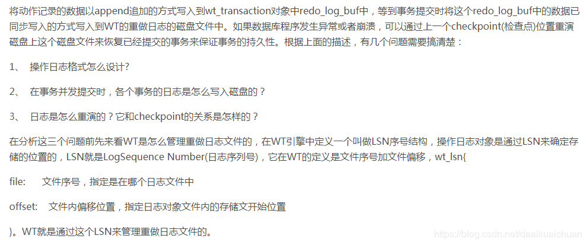

## 1、日志格式

  WT引擎的操作日志对象（以下简称为logrec）对应的是提交的事务，事务的每个操作被记录成一个logop对象，一个logrec包含多个logop，logrec是一个通过精密序列化事务操作动作和参数得到的一个二进制buffer，这个buffer的数据是通过事务和操作类型来确定其格式的。

  WT中的日志分为4类：分别是建立checkpoint的操作日志(LOGREC_CHECKPOINT)、普通事务操作日志(LOGREC_COMMIT)、btree page同步刷盘的操作日志(LOGREC_FILE_SYNC)和提供给引擎外部使用的日志(LOGREC_MESSAGE)。这里介绍和执行事务密切先关的LOGREC_COMMIT，这类日志里面由根据K/V的操作方式分为：LOG_PUT(增加或者修改K/V操作)、LOG_REMOVE(单KEY删除操作)和范围删除日志,这几种操作都会记录操作时的key，根据操作方式填写不同的其他参数，例如：update更新操作，就需要将value填上。除此之外，日志对象还会携带btree的索引文件ID、提交事务的ID等，整个logrec和logop的关系结构图如下：
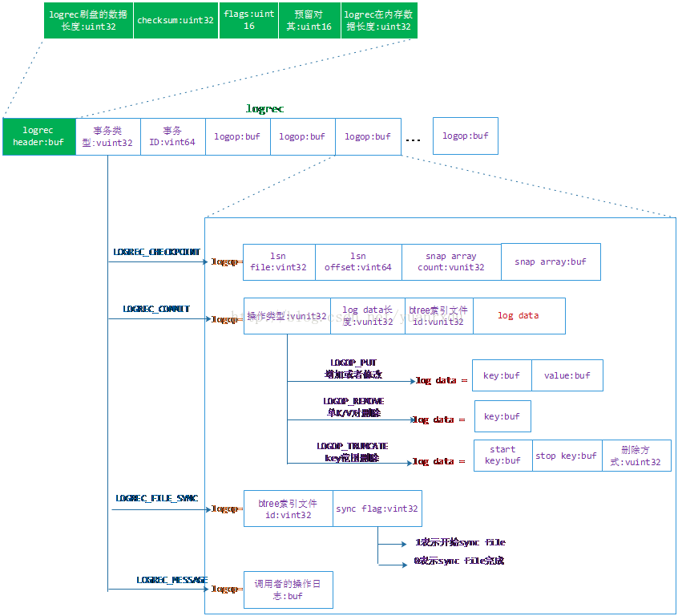

## 2、WAL与日志写并发

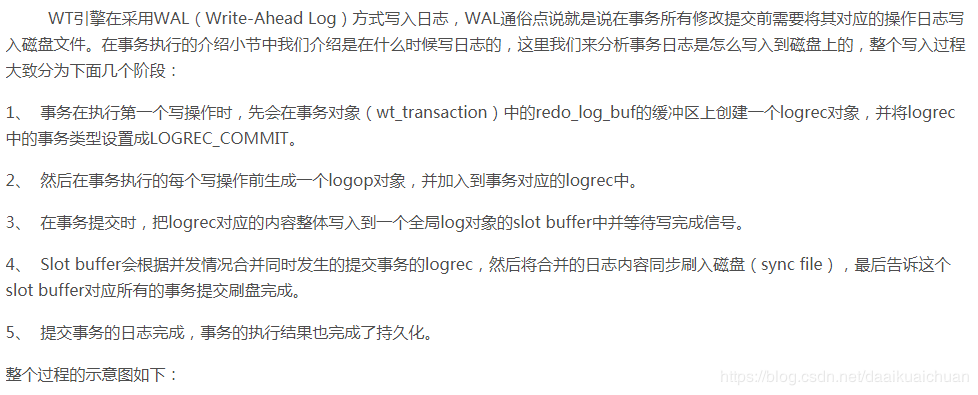
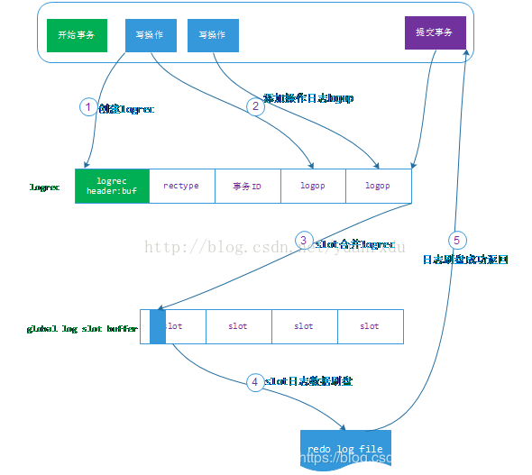
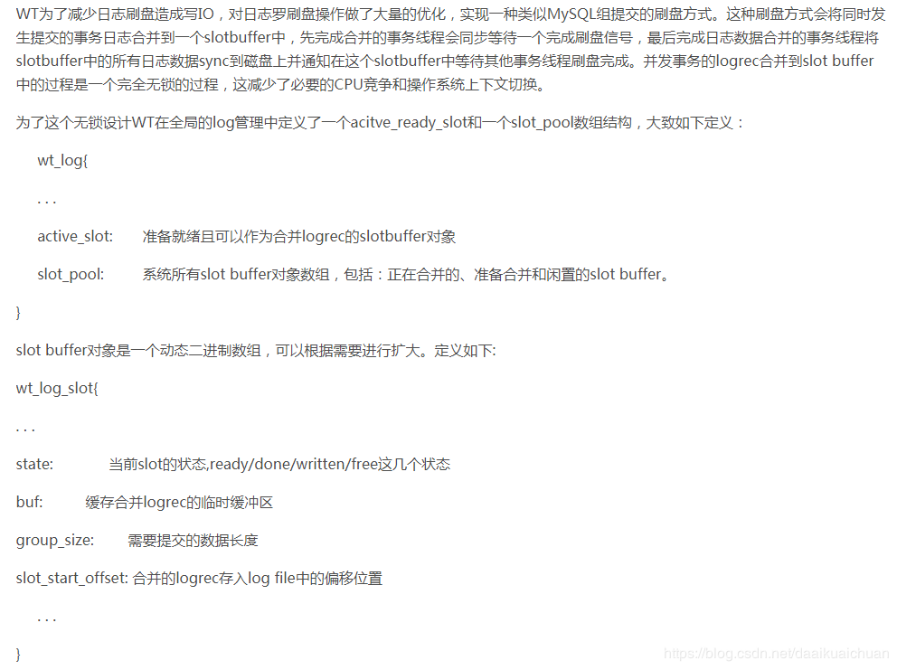

# 七、总结

  **可以说WT在事务的实现上另辟蹊径，整个事务系统的实现没有用繁杂的事务锁，而是使用snapshot和MVCC这两个技术轻松的而实现了事务的ACID，这种实现也大大提高了事务执行的并发性**。除此之外，WT在各个事务模块的实现多采用无锁并发，充分利用CPU的多核能力来减少资源竞争和I/O操作，可以说WT在实现上是有很大创新的。


### 相应容错机制

