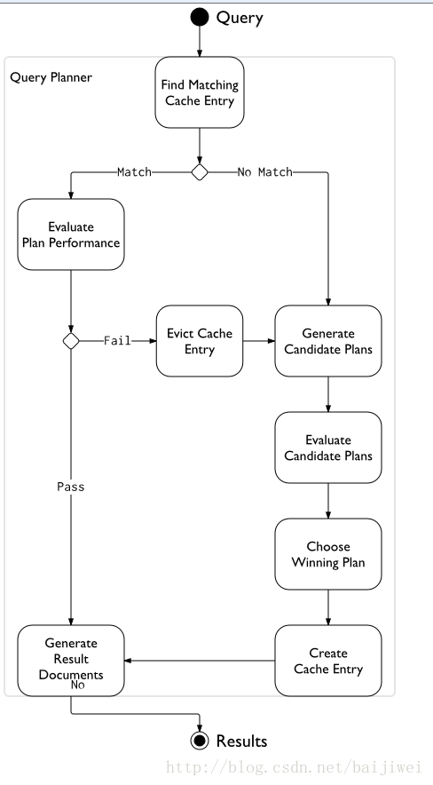
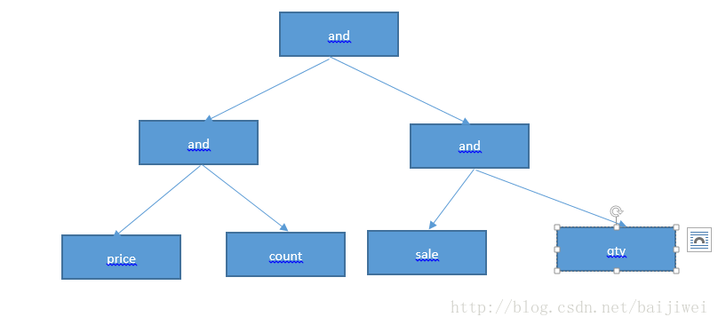
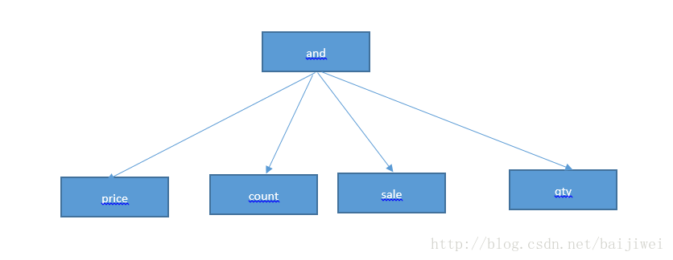
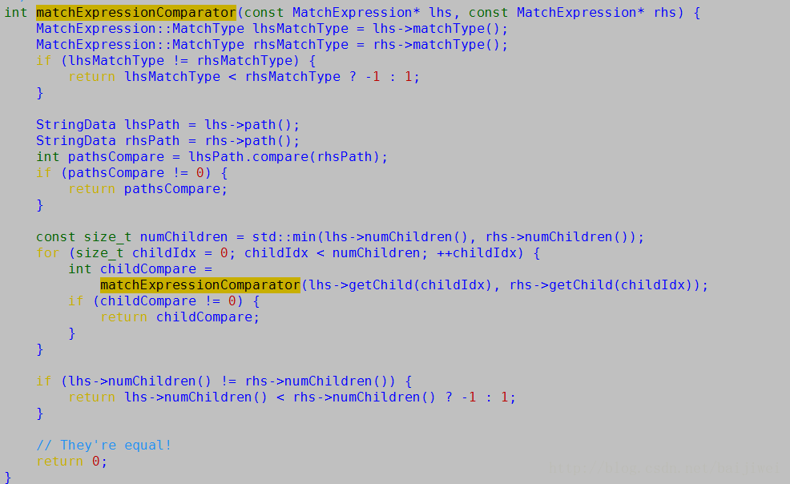

# MongoDB查询过程

[TOC]



## 生成语法树

从一个Bson类型的filter， 生成一个MatcgExpression 树

对于任何query， 输入都会有一个bson类型的filter， MatchExpressionParser的作用就是把Bson对象转换为一个树形的MatchExpression对象。 本节详细介绍这个过程的实现。

MatchExpressionParser 只有一个public的函数：

```
static StatusWithMatchExpression parse(
        const BSONObj& obj, const ExtensionsCallback& extensionsCallback = ExtensionsCallback()) {
        // The 0 initializes the match expression tree depth.
        return MatchExpressionParser(&extensionsCallback)._parse(obj, 0);
    }
123456
```

可以看出， MatchExpressionParser：：_parse()是产生MatchExpression的入口。如下是简化版的_parse()函数， 这里以开头的操作符有好多种，我只保留了开头的操作符有好多种，我只保留了or, 其他的都类似：

```
StatusWithMatchExpression MatchExpressionParser::_parse(const BSONObj& obj, int level) {
    std::unique_ptr<AndMatchExpression> root = stdx::make_unique<AndMatchExpression>();

    bool topLevel = (level == 0);
    level++;

    BSONObjIterator i(obj);
    while (i.more()) {
        BSONElement e = i.next();
        if (e.fieldName()[0] == '$') {
            const char* rest = e.fieldName() + 1;

            // TODO: optimize if block?
            if (mongoutils::str::equals("or", rest)) {
                if (e.type() != Array)
                    return {Status(ErrorCodes::BadValue, "$or needs an array")};
                std::unique_ptr<OrMatchExpression> temp = stdx::make_unique<OrMatchExpression>();
                Status s = _parseTreeList(e.Obj(), temp.get(), level);
                if (!s.isOK())
                    return s;
                root->add(temp.release());
            } 
            ...

            continue;
        }

        if (_isExpressionDocument(e, false)) {
            Status s = _parseSub(e.fieldName(), e.Obj(), root.get(), level);
            if (!s.isOK())
                return s;
            continue;
        }

        if (e.type() == RegEx) {
            StatusWithMatchExpression result = _parseRegexElement(e.fieldName(), e);
            if (!result.isOK())
                return result;
            root->add(result.getValue().release());
            continue;
        }

        std::unique_ptr<ComparisonMatchExpression> eq =
            stdx::make_unique<EqualityMatchExpression>();
        Status s = eq->init(e.fieldName(), e);
        if (!s.isOK())
            return s;

        root->add(eq.release());
    }

    if (root->numChildren() == 1) {
        std::unique_ptr<MatchExpression> real(root->getChild(0));
        root->clearAndRelease();
        return {std::move(real)};
    }

    return {std::move(root)};
}
123456789101112131415161718192021222324252627282930313233343536373839404142434445464748495051525354555657585960
```

在这里处理了4类的filter：
\1. 操作符 or,or,and, not,not,nor, atomic,atomic,isolated, where.where.text, comment,comment,id, $db;
\2. sub-field， 其他的操作符；
\3. regex 正则表达式；
\4. 比较表达式

### 第一种情况

这里是一个递归调用， 首先根据当前节点的类型创建一个XXXMatchExpression节点， 这里是OrMatchExpression，
然后$or 有多个sub-node，通过 MatchExpressionParser::_parseTreeList():

```
Status MatchExpressionParser::_parseTreeList(const BSONObj& arr,
                                             ListOfMatchExpression* out,
                                             int level) {
    if (arr.isEmpty())
        return Status(ErrorCodes::BadValue, "$and/$or/$nor must be a nonempty array");

    BSONObjIterator i(arr);
    while (i.more()) {
        BSONElement e = i.next();

        if (e.type() != Object)
            return Status(ErrorCodes::BadValue, "$or/$and/$nor entries need to be full objects");

        StatusWithMatchExpression sub = _parse(e.Obj(), level);
        if (!sub.isOK())
            return sub.getStatus();

        out->add(sub.getValue().release());
    }
    return Status::OK();
}123456789101112131415161718192021
```

_parseTreeList 会调用 _parse 递归的调用每一个节点的子节点，并且为每个节点生成一个MatchExpression的子节点， 加入到当前
的节点的父节点的子节点里面。 这里， 函数的参数out， 类型是ListOfMatchExpression， 其里面有add函数可以将level层的所有节点
都放在同一个父节点下面；

### 第二种情况

如果， 我们的Node是一个expression，但是operator不是第一种情况的， 就是这里需要处理的。
通过_parseSub 调用_paseSubField来产生一个个MatchExpression的继承类的对象， 并将这一个个对象
添加到其父节点的子节点里面；

### 第三种情况

除了第一， 第二与操作符相关的处理之后， 如果是正则表达式，就产生一个RegexMatchExpression对象；

### 第四种情况

最后的一种filter， 就会产生一个ComparisonMatchExpression对象， 加入其父节点的子节点里面；

经过上述的4种情况的处理， 我们就会产生一个MatchExpression的树型结构， 为后续的查询处理做好准备。

这里， 我们看到有各种各样的操作符、正则表达式、一般的表达式， 在代码实现里面， 为每一种都定义了一个class， 所有的class
都继承自MatchExpression， 这样在所有的parse函数的返回值类型都是 MatchExpression*或者MatchExpression&， 通过C++的多态，
运行的时候绑定到具体的类型上面。

## 逻辑优化过程

通过MatchExpression， 我们可以得到filter的所有的设定， 但是，这个设定可能是散乱的， 效率不高的， 逻辑优化过程的主要作用就是优化filter的设定， 使得在语义保持不变的前提下， 能够更加有效的执行。
该过程主要通过 CanonicalQuery 类来实现。

该过程主要包含三个方面：
1、Normoralize tree；
2、sort tree；
3、 validate tree；

我们分别来看看这3个方面的优化的实现。

### 1. Normoralize tree

```
 该过程主要是针对 AND， OR的子对象的类型也是AND， OR的情况， 把他们从子节点提升到父节点。

 已如下的AND的为例子：
123
db.inventory.find( {
    $and : [
        { $and : [ { price : 0.99 }, { count : 99 } ] },
        { $and : [ { sale : true }, { qty : 20} ] }
    ]
} )123456
```

此时的MatchExpression， 应该为如下的结构：

经过Normalize以后， 应该把AND of AND类型的节点提升到父节点的兄弟节点， 如下：

从上面两幅图的对比， 比较直观的看到， 节点数变少， 层数也变少了。 我们看一下代码：

```
MatchExpression* CanonicalQuery::normalizeTree(MatchExpression* root) {
    // root->isLogical() is true now.  We care about AND, OR, and NOT. NOR currently scares us.
    if (MatchExpression::AND == root->matchType() || MatchExpression::OR == root->matchType()) {
        // We could have AND of AND of AND.  Make sure we clean up our children before merging
        // them.
        // UNITTEST 11738048
        for (size_t i = 0; i < root->getChildVector()->size(); ++i) {
            (*root->getChildVector())[i] = normalizeTree(root->getChild(i));
        }

        // If any of our children are of the same logical operator that we are, we remove the
        // child's children and append them to ourselves after we examine all children.
        std::vector<MatchExpression*> absorbedChildren;

        for (size_t i = 0; i < root->numChildren();) {
            MatchExpression* child = root->getChild(i);
            if (child->matchType() == root->matchType()) {
                // AND of an AND or OR of an OR.  Absorb child's children into ourself.
                for (size_t j = 0; j < child->numChildren(); ++j) {
                    absorbedChildren.push_back(child->getChild(j));
                }
                // TODO(opt): this is possibly n^2-ish
                root->getChildVector()->erase(root->getChildVector()->begin() + i);
                child->getChildVector()->clear();
                // Note that this only works because we cleared the child's children
                delete child;
                // Don't increment 'i' as the current child 'i' used to be child 'i+1'
            } else {
                ++i;
            }
        }

        root->getChildVector()->insert(
            root->getChildVector()->end(), absorbedChildren.begin(), absorbedChildren.end());

        // AND of 1 thing is the thing, OR of 1 thing is the thing.
        if (1 == root->numChildren()) {
            MatchExpression* ret = root->getChild(0);
            root->getChildVector()->clear();
            delete root;
            return ret;
        }
    } else if (MatchExpression::NOT == root->matchType()) {
        // Normalize the rest of the tree hanging off this NOT node.
        NotMatchExpression* nme = static_cast<NotMatchExpression*>(root);
        MatchExpression* child = nme->releaseChild();
        // normalizeTree(...) takes ownership of 'child', and then
        // transfers ownership of its return value to 'nme'.
        nme->resetChild(normalizeTree(child));
    } else if (MatchExpression::ELEM_MATCH_VALUE == root->matchType()) {
        // Just normalize our children.
        for (size_t i = 0; i < root->getChildVector()->size(); ++i) {
            (*root->getChildVector())[i] = normalizeTree(root->getChild(i));
        }
    }

    return root;
}
1234567891011121314151617181920212223242526272829303132333435363738394041424344454647484950515253545556575859
```

这里， 采用了递归的调用方式， 针对and,and,or, not,not,elemMatch 4中操作符进行， not和not和elemMatch 是针对其subnode 调用normalizeTree， and和and和or 递归的吧子节点提升为父节点的兄弟节点。

### 2. sort tree

sort tree 主要是对MatchExpression的各个子树进行排序， 排序之后的好处就是对于index查询， 如果某个字段的index被分成了几段， 我们的查询用到其中的2段， 就可以做到对于索引的查找只需要一次就能完成。其具体的排序的顺序：
1) operator type (MatchExpression::MatchType)
2) path name (MatchExpression::path())
3) sort order of children
4) number of children (MatchExpression::numChildren())
代码的实现就比较简单， 按照上面的4中比较方式以及优先级。


### 3. validate tree

主要是判断由MatchExpression产生的LiteParsedQuery 对象的设定是否有不正确的地方。

## 生成查询计划

通过CanonicalQuery 和MatchExpression， 类PlanEnumerator 罗列MatchExpression的各种可能的组合， （indexScan & collectionScan等）， 生成具体的MatchExpression， 产生出来一个个的QueryPlan。 具体的实现在函数：QueryPlannerAccess::buildIndexedDataAccess， 生成一个树形的QuerySolutionNode树。
如果QuerySolution的个数大于1， 生成一个MultiPlanStage对象， 每个QuerySolution对应于一个PlanStage或者其子对象，planStage对象由函数StageBuilder::build 生成。

## 生成PlanExecutor

如上述的代码片， 前面我们得到了PlanStage， QuerySolution以及CanonicalQuery， 可以生成一个指定的PlanExecutor, 查询计划的最终的执行是由该类的对象处理的。
生成最优的执行计划， MultiPlanStage::pickBestPlan最终选择由该函数实现， 具体的打分过程在PlanRanker::pickBestPlan.

## 执行计划

## 1. 生成PlanExecutor对象

```
 这里采用了工厂模式， PlanExecutor::make产生指定的PlanExecutor对象；
1
```

## 2. 选择最佳计划

```
从上图可见，这里分成4中情况：
SubplanStage, 主要是针对$or 的处理， CachedPlanStage是从Cache里得到的solution的处理阶段， 
MultiPlanStage以及普通的stage， 相关的代码都放在： src/mongo/db/exec 目录， 
根据stage的类型可以找到相关的代码。
1234
Status PlanExecutor::pickBestPlan(YieldPolicy policy) {
    ...

    // First check if we need to do subplanning.
    PlanStage* foundStage = getStageByType(_root.get(), STAGE_SUBPLAN);
    if (foundStage) {
        SubplanStage* subplan = static_cast<SubplanStage*>(foundStage);
        return subplan->pickBestPlan(_yieldPolicy.get());
    }

    // If we didn't have to do subplanning, we might still have to do regular
    // multi plan selection...
    foundStage = getStageByType(_root.get(), STAGE_MULTI_PLAN);
    if (foundStage) {
        MultiPlanStage* mps = static_cast<MultiPlanStage*>(foundStage);
        return mps->pickBestPlan(_yieldPolicy.get());
    }

    foundStage = getStageByType(_root.get(), STAGE_CACHED_PLAN);
    if (foundStage) {
        CachedPlanStage* cachedPlan = static_cast<CachedPlanStage*>(foundStage);
        return cachedPlan->pickBestPlan(_yieldPolicy.get());
    }

    // Either we chose a plan, or no plan selection was required. In both cases,
    // our work has been successfully completed.
    return Status::OK();
}12345678910111213141516171819202122232425262728
我们以MultiPlanStage为例， 通过MultiPlanStage::pickBestPlan的得到最佳的Plan， 
PlanRanker::pickBestPlan会为每一个plan打分， 并且找到分数最高的一个。
12
Status MultiPlanStage::pickBestPlan(PlanYieldPolicy* yieldPolicy) {
    ...
        // 得到Candidate stage
        bool moreToDo = workAllPlans(numResults, yieldPolicy);
    ...


    std::unique_ptr<PlanRankingDecision> ranking(new PlanRankingDecision);
    _bestPlanIdx = PlanRanker::pickBestPlan(_candidates, ranking.get());

    CandidatePlan& bestCandidate = _candidates[_bestPlanIdx];
    std::list<WorkingSetID>& alreadyProduced = bestCandidate.results;
    const auto& bestSolution = bestCandidate.solution;
123456789101112131415
```

## 3. 执行计划的详情查询

每一个stage都会记录一些统计的数据， 包含CommonStats， 和该中类型特定的stats， 例如， FetchStats，记录这些， 主要是为了在explain命令或者stats 命令中使用。例如， 我们可以看到某一次查询的一些详细信息： parsedQuery, winningPlan，executionStats 以及他们的详细信息， 透过这些信息， 我们可以知道当前的查询操作， 我们是否使用索引， 或者使用了那个索引； 我们还可以知道我们最终得到的plan的执行的统计信息， 例如， 执行的时间， 查询的文档， 索引等。

```
"queryPlanner" : {
        "plannerVersion" : 1,
        "namespace" : "test.test",
        "indexFilterSet" : false,
        "parsedQuery" : {
            "key1" : {
                "$eq" : "value1"
            }
        },
        "winningPlan" : {
            "stage" : "FETCH",
            "inputStage" : {
                "stage" : "IXSCAN",
                "keyPattern" : {
                    "key1" : 1
                },
                "indexName" : "key1_1",
                "isMultiKey" : false,
                "isUnique" : false,
                "isSparse" : false,
                "isPartial" : false,
                "indexVersion" : 1,
                "direction" : "forward",
                "indexBounds" : {
                    "key1" : [
                        "[\"value1\", \"value1\"]"
                    ]
                }
            }
        },
        "rejectedPlans" : [ ]
    }，
    "executionStats" : {
        "executionSuccess" : true,
        "nReturned" : 1,
        "executionTimeMillis" : 0,
        "totalKeysExamined" : 1,
        "totalDocsExamined" : 1,
        "executionStages" : {
            "stage" : "FETCH",
            "nReturned" : 1,
            "executionTimeMillisEstimate" : 0,
            "works" : 2,
            "advanced" : 1,
            "needTime" : 0,
            "needYield" : 0,
            "saveState" : 0,
            "restoreState" : 0,
            "isEOF" : 1,
            "invalidates" : 0,
            "docsExamined" : 1,
            "alreadyHasObj" : 0,
            "inputStage" : {
                "stage" : "IXSCAN",
                "nReturned" : 1,
                "executionTimeMillisEstimate" : 0,
                "works" : 2,
                "advanced" : 1,
                "needTime" : 0,
                "needYield" : 0,
                "saveState" : 0,
                "restoreState" : 0,
                "isEOF" : 1,
                "invalidates" : 0,
                "keyPattern" : {
                    "key1" : 1
                },
                "indexName" : "key1_1",
                "isMultiKey" : false,
                "isUnique" : false,
                "isSparse" : false,
                "isPartial" : false,
                "indexVersion" : 1,
                "direction" : "forward",
                "indexBounds" : {
                    "key1" : [
                        "[\"value1\", \"value1\"]"
                    ]
                },
                "keysExamined" : 1,
                "dupsTested" : 0,
                "dupsDropped" : 0,
                "seenInvalidated" : 0
            }
        }
    }
```