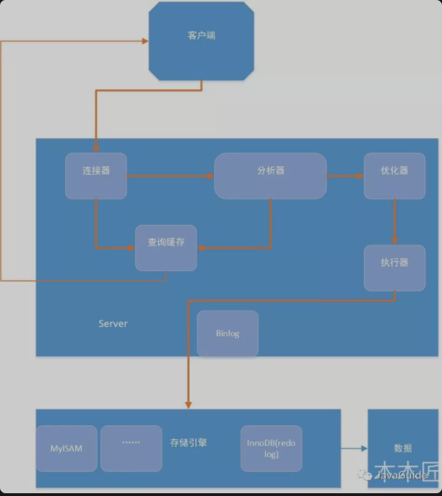

[TOC]

## 存储引擎

InnoDB vs MyISAM

1. InnoDB支持行级锁、MyISAM只支持表级锁

   > InnoDB行锁是加在索引上的，如果没有走索引，行锁退化为表所

2. 崩溃后的安全恢复：MyISAM发生崩溃后恢复慢且损坏概率高(why?)，而InnoDB因为支持事务、外键等功能，所以其具有事务、回滚、崩溃修复能力的事务安全型表

3. MyISAM不支持外键、InnoDB支持

4. InnoDB支持MVCC，在应对高并发事务时，MVCC比单纯的加锁更加高效；MVCC只在READ COMMITED 和 REPEATABLE READ两个隔离级别下工作；**各数据库的MVCC实现并不统一**

   > 多版本控制是一种提高并发的技术，在最早的数据库系统，只有读读之间可以并发，而读写、写读、写写都要阻塞。MVCC之后只有写写之间相互阻塞。InnoDB通过undo log实现MVCC，，通过undo log找回数据历史版本来给用户读，也可以在回滚的时候覆盖数据页上的数据(内部会记录一个全局的活跃读写事务数组，判断事务的可见性)，InnoDB通过在数据库每行数据后面添加三个隐藏的字段来实现（6字节的事务ID(最后一次修改的事务ID))、7字节的回滚指针(重建该行记录被更新前内容)、6字节的DB_ROW_ID）。在repeatable read级别下，事务在第一条select 读操作后会创建一个快照(read view)。在read commited级别下,事务在每一条select操作都会创建。

## REDO & UNDO

undo log不是redo log的逆向过程，其实它们都算是用来恢复的日志：
**1.redo log通常是物理日志，记录的是数据页的物理修改，而不是某一行或某几行修改成怎样怎样，它用来恢复提交后的物理数据页(恢复数据页，且只能恢复到最后一次提交的位置)。**
**2.undo用来回滚行记录到某个版本。undo log一般是逻辑日志，根据每行记录进行记录**

> redo log包括两部分：一是内存中的日志缓冲(redo log buffer)，该部分日志是易失性的；二是磁盘上的重做日志文件(redo log file)，该部分日志是持久的。
>
> 在概念上，innodb通过***force log at commit\***机制实现事务的持久性，即在事务提交的时候，必须先将该事务的所有事务日志写入到磁盘上的redo log file和undo log file中进行持久化。
>
> 为了确保每次日志都能写入到事务日志文件中，在每次将log buffer中的日志写入日志文件的过程中都会调用一次操作系统的fsync操作(即fsync()系统调用)。因为MariaDB/MySQL是工作在用户空间的，MariaDB/MySQL的log buffer处于用户空间的内存中。要写入到磁盘上的log file中(redo:ib_logfileN文件,undo:share tablespace或.ibd文件)，中间还要经过操作系统内核空间的os buffer，调用fsync()的作用就是将OS buffer中的日志刷到磁盘上的log file中。

## 索引

主要是**B+树**和**哈希索引**

### 聚簇索引和非聚簇索引

**聚簇索引**

* 如果表设置了主键，则主键就是聚簇索引
* 如果表没有主键，则会默认第一个NOT NULL，且唯一（UNIQUE）的列作为聚簇索引
* 以上都没有，则会默认创建一个隐藏的row_id作为聚簇索引

> InnoDB的聚簇索引的叶子节点存储的是行记录（其实是页结构，一个页包含多行数据），InnoDB必须要有至少一个聚簇索引。
>
> 由此可见，使用聚簇索引查询会很快，因为可以直接定位到行记录。

**非聚簇索引**

> 普通索引也叫二级索引，除聚簇索引外的索引，即非聚簇索引。
>
> InnoDB的普通索引叶子节点存储的是主键（聚簇索引）的值，而MyISAM的普通索引存储的是记录指针

### Innodb中的B+树结构有什么特点

**MyISAM**

B+Tree叶节点的data域存放的是数据记录的地址。在索引检索的时候，首先按照B+Tree搜索算法搜索索引，如果指定的Key存在，则取出其 data 域的值，然后以 data 域的值为地址读取相应的数据记录。这被称为“非聚簇索引”。

**InnoDB**

其数据文件本身就是索引文件。相比MyISAM，索引文件和数据文件是分离的，其表数据文件本身就是按B+Tree组织的一个索引结构，树的叶节点data域保存了完整的数据记录。这个索引的key是数据表的主键，因此InnoDB表数据文件本身就是主索引。这被称为“聚簇索引（或聚集索引）”，而其余的索引都作为辅助索引，辅助索引的data域存储相应记录主键的值而不是地址，这也是和MyISAM不同的地方。在根据主索引搜索时，直接找到key所在的节点即可取出数据；在根据辅助索引查找时，则需要先取出主键的值，在走一遍主索引。 因此，在设计表的时候，不建议使用过长的字段作为主键，也不建议使用非单调的字段作为主键，这样会造成主索引频繁分裂。 

### 索引查找过程

如果查询条件为主键（聚簇索引），则只需扫描一次B+树即可通过聚簇索引定位到要查找的行记录数据。

如果查询条件为普通索引（非聚簇索引），需要扫描两次B+树，第一次扫描通过普通索引定位到聚簇索引的值，然后第二次扫描通过聚簇索引的值定位到要查找的行记录数据。 如：select * from user where age = 30;（先通过普通索引的值定位聚簇索引值，再通过聚簇索引的值定位行记录数据，需要扫描两次索引B+树，它的性能较扫一遍索引树更低。即所谓的回表）

为了解决回表，采用覆盖索引(联合索引)。只需要在一棵索引树上就能获取SQL所需的所有列数据，无需回表，速度更快。

### 为什么要用B+树

B-树和B+树最重要的一个区别就是B+树只有叶节点存放数据，其余节点用来索引，而B-树是每个索引节点都会有Data域。
这就决定了B+树更适合用来存储外部数据，也就是所谓的磁盘数据。
从Mysql（Inoodb）的角度来看，B+树是用来充当索引的，一般来说索引非常大，尤其是关系性数据库这种数据量大的索引能达到亿级别，所以为了减少内存的占用，索引也会被存储在磁盘上。
那么Mysql如何衡量查询效率呢？磁盘IO次数，B-树（B类树）的特定就是每层节点数目非常多，层数很少，目的就是为了就少磁盘IO次数，当查询数据的时候，最好的情况就是很快找到目标索引，然后读取数据，使用B+树就能很好的完成这个目的，但是B-树的每个节点都有data域（指针），这无疑增大了节点大小，说白了增加了磁盘IO次数（磁盘IO一次读出的数据量大小是固定的，单个数据变大，每次读出的就少，IO次数增多，一次IO多耗时啊！），而B+树除了叶子节点其它节点并不存储数据，节点小，磁盘IO次数就少。这是优点之一。
另一个优点是什么，B+树所有的Data域在叶子节点，一般来说都会进行一个优化，就是将所有的叶子节点用指针串起来。这样遍历叶子节点就能获得全部数据，这样就能进行区间访问啦。

至于MongoDB为什么使用B-树而不是B+树，可以从它的设计角度来考虑，它并不是传统的关系性数据库，而是以Json格式作为存储的nosql，目的就是高性能，高可用，易扩展。首先它摆脱了关系模型，上面所述的优点2需求就没那么强烈了，其次Mysql由于使用B+树，数据都在叶节点上，每次查询都需要访问到叶节点，而MongoDB使用B-树，所有节点都有Data域，只要找到指定索引就可以进行访问，无疑单次查询平均快于Mysql（但侧面来看Mysql至少平均查询耗时差不多）。

总体来说，Mysql选用B+树和MongoDB选用B-树还是以自己的需求来选择的。

## 读写过程

https://www.jianshu.com/p/44bc68c4afe5
https://www.cnblogs.com/drizzle-xu/p/9869406.html

### 读过程

读操作的IO流程

1、查看缓存中是否存在id，(MySQL已去掉)

2、如果有则从内存中访问，否则要访问磁盘，

3、并将索引数据存入内存，利用索引来访问数据,

4、对于数据也会检查数据是否存在于内存，

5、如果没有则访问磁盘获取数据，读入内存。

6、返回结果给用户。

### 写过程

1、先写undo log。

2、在内存更新数据，这步操作就在内存中形成了脏页，如果脏页过多，checkpoint机制进行刷新，innodb_max_dirty_pages_pct决定了刷新脏页比例。innodb_io_capacity参数可以动态调整刷新脏页的数量，innodb_lru_scan_depth这个参数决定了刷新每个innodb_buffer_pool的脏页数量。

> mysql脏页：
>  当内存数据页和磁盘数据页上的内容不一致时，我们称这个内存页为脏页；
>  内存数据写入磁盘后，内存页上的数据和磁盘页上的数据就一致了，我们称这个内存页为干净页。
>
> 刷脏页的时机:
>  (1)redo log写满时，没有看见了，此时需要将checkpoint向前推进，推进的这部分日志对应的脏页刷入到磁盘，此时所有的更新全部阻塞，此时写的性能变为0，必须待刷一部分脏页后才能更新。
>  (2)系统内存不足时，需要将一部分数据页淘汰掉，如果淘汰的是脏页，需要先将脏页同步到磁盘。
>  (3)MySQL认为空闲的时间，这种没有性能问题。
>  (4) mysql正常关闭之前，会把所有脏页刷入磁盘，不存在性能问题。

3、记录变更到redo log，prepare这里会写事务id。innodb_flush_log_at_trx_commit决定了事务的刷盘方式。为0时，log buffer将每秒一次地写入log file中，并且log file的flush(刷到磁盘)操作同时进行。该模式下，在事务提交的时候，不会主动触发写入磁盘的操作。为1，每次事务提交时MySQL都会把log buffer的数据写入log file，并且flush(刷到磁盘)中去.为2，每次事务提交时MySQL都会把log buffer的数据写入log file.但是flush(刷到磁盘)操作并不会同时进行。该模式下，MySQL会每秒执行一次 flush(刷到磁盘)操作。

4、写入binlog这里会写入一个事务id这里有个sync_binlog参数决定多个事务进行一次性提交。

5、redo log第二阶段，这里会进行判断前2步是否成功，成功则默认commit，否则rollback。刷入磁盘操作。这里是先从脏页数据刷入到内存2M大小的doublewrite buffer，然后是一次性从内存的doublewrite buffer刷新到共享表空间的doublewrite buffer，这里产生了一次IO。然后从内存的内存的doublewrite buffer刷新2m数据到磁盘的ibd文件中，这里需要发生128次io。然后校验，如果不一致，就由共享表空间的副本进行修复。这里有个参数innodb_flush_method决定了数据刷新直接刷新到磁盘，绕过os cache。

6、返回给client。

如果有slave，第4步之后经过slave服务线程io_thread写到从库的relay log ，再由sql thread应用relay log到从库中。

## 主从复制

**主从复制原理，简言之，就三步曲，如下：**

- 主数据库有个bin-log二进制文件，纪录了所有增删改Sql语句。（binlog线程）
- 从数据库把主数据库的bin-log文件的sql语句复制过来。（io线程）
- 从数据库的relay-log重做日志文件中再执行一次这些sql语句。（Sql执行线程）

## 事务

默认RR

## 事务更新过程

当事务A更改该行的值，会进行如下操作：

1. 用排他锁锁定该行
2. 记录redo log
3. 把该行修改前的值Copy到undo log
4. 修改当前行的值，填写事务编号，使回滚指针指向undo log中的修改前的行

> 下面看一下在REPEATABLE READ隔离级别下，MVCC具体是如何操作的。
>
> - SELECT
>
>   InnoDB会根据以下两个条件检查每行记录：
>
>   1. InnoDB只查找版本早于当前事务版本的数据行（也就是，行的系统版本号小于或等于事务的系统版本号），这样可以确保事务读取的行，要么是在事务开始前已经存在的，要么是事务自身插入或者修改过的。
>   2. 行的删除版本要么未定义，要么大于当前事务版本号。这可以确保事务读取到的行，在事务开始之前未被删除。
>
>   只有符合上述两个条件的记录，才能返回作为查询结果
>
> - INSERT
>
>   InnoDB为新插入的每一行保存当前系统版本号作为行版本号。
>
> - DELETE
>
>   InnoDB为删除的每一行保存当前系统版本号作为行删除标识。
>
> - UPDATE
>
>   InnoDB为插入一行新记录，保存当前系统版本号作为行版本号，同时保存当前系统版本号到原来的行作为行删除标识。
>    保存这两个额外系统版本号，使大多数读操作都可以不用加锁。这样设计使得读数据操作很简单，性能很好，并且也能保证只会读取到符合标准的行，不足之处是每行记录都需要额外的存储空间，需要做更多的行检查工作，以及一些额外的维护工作

## SQL语句执行过程

### 1.1 MySQL 基本架构概览

下图是 MySQL 的一个简要架构图，从下图你可以很清晰的看到用户的 SQL 语句在 MySQL 内部是如何执行的。

先简单介绍一下下图涉及的一些组件的基本作用帮助大家理解这幅图，在 1.2 节中会详细介绍到这些组件的作用。

•**连接器：** 身份认证和权限相关(登录 MySQL 的时候)。•**查询缓存:** 执行查询语句的时候，会先查询缓存（MySQL 8.0 版本后移除，因为这个功能不太实用）。•**分析器:** 没有命中缓存的话，SQL 语句就会经过分析器，分析器说白了就是要先看你的 SQL 语句要干嘛，再检查你的 SQL 语句语法是否正确。•**优化器：** 按照 MySQL 认为最优的方案去执行。•**执行器:** 执行语句，然后从存储引擎返回数据。



简单来说 MySQL 主要分为 Server 层和存储引擎层：

•**Server 层**：主要包括连接器、查询缓存、分析器、优化器、执行器等，所有跨存储引擎的功能都在这一层实现，比如存储过程、触发器、视图，函数等，还有一个通用的日志模块 binglog 日志模块。

•**存储引擎**： 主要负责数据的存储和读取，采用可以替换的插件式架构，支持 InnoDB、MyISAM、Memory 等多个存储引擎，其中 InnoDB 引擎有自有的日志模块 redolog 模块。**现在最常用的存储引擎是 InnoDB，它从 MySQL 5.5.5 版本开始就被当做默认存储引擎了。**

### 1.2 Server 层基本组件介绍

#### 1) 连接器

连接器主要和身份认证和权限相关的功能相关，就好比一个级别很高的门卫一样。

主要负责用户登录数据库，进行用户的身份认证，包括校验账户密码，权限等操作，如果用户账户密码已通过，连接器会到权限表中查询该用户的所有权限，之后在这个连接里的权限逻辑判断都是会依赖此时读取到的权限数据，也就是说，后续只要这个连接不断开，即时管理员修改了该用户的权限，该用户也是不受影响的。

#### 2) 查询缓存(MySQL 8.0 版本后移除)

查询缓存主要用来缓存我们所执行的 SELECT 语句以及该语句的结果集。

连接建立后，执行查询语句的时候，会先查询缓存，MySQL 会先校验这个 sql 是否执行过，以 Key-Value 的形式缓存在内存中，Key 是查询预计，Value 是结果集。如果缓存 key 被命中，就会直接返回给客户端，如果没有命中，就会执行后续的操作，完成后也会把结果缓存起来，方便下一次调用。当然在真正执行缓存查询的时候还是会校验用户的权限，是否有该表的查询条件。

MySQL 查询不建议使用缓存，因为查询缓存失效在实际业务场景中可能会非常频繁，假如你对一个表更新的话，这个表上的所有的查询缓存都会被清空。对于不经常更新的数据来说，使用缓存还是可以的。

所以，一般在大多数情况下我们都是不推荐去使用查询缓存的。

MySQL 8.0 版本后删除了缓存的功能，官方也是认为该功能在实际的应用场景比较少，所以干脆直接删掉了。

#### 3) 分析器

MySQL 没有命中缓存，那么就会进入分析器，分析器主要是用来分析 SQL 语句是来干嘛的，分析器也会分为几步：

**第一步，词法分析**，一条 SQL 语句有多个字符串组成，首先要提取关键字，比如 select，提出查询的表，提出字段名，提出查询条件等等。做完这些操作后，就会进入第二步。

**第二步，语法分析**，主要就是判断你输入的 sql 是否正确，是否符合 MySQL 的语法。

完成这 2 步之后，MySQL 就准备开始执行了，但是如何执行，怎么执行是最好的结果呢？这个时候就需要优化器上场了。

#### 4) 优化器

优化器的作用就是它认为的最优的执行方案去执行（有时候可能也不是最优，这篇文章涉及对这部分知识的深入讲解），比如多个索引的时候该如何选择索引，多表查询的时候如何选择关联顺序等。

可以说，经过了优化器之后可以说这个语句具体该如何执行就已经定下来。

#### 5) 执行器

当选择了执行方案后，MySQL 就准备开始执行了，首先执行前会校验该用户有没有权限，如果没有权限，就会返回错误信息，如果有权限，就会去调用引擎的接口，返回接口执行的结果。


### 2.1 查询语句

说了以上这么多，那么究竟一条 sql 语句是如何执行的呢？其实我们的 sql 可以分为两种，一种是查询，一种是更新（增加，更新，删除）。我们先分析下查询语句，语句如下：

```
select * from tb_student  A where A.age='18' and A.name=' 张三 ';
```

结合上面的说明，我们分析下这个语句的执行流程：

- 先检查该语句是否有权限，如果没有权限，直接返回错误信息，如果有权限，在 MySQL8.0 版本以前，会先查询缓存，以这条 sql 语句为 key 在内存中查询是否有结果，如果有直接缓存，如果没有，执行下一步。

- 通过分析器进行词法分析，提取 sql 语句的关键元素，比如提取上面这个语句是查询 select，提取需要查询的表名为 tb_student,需要查询所有的列，查询条件是这个表的 id='1'。然后判断这个 sql 语句是否有语法错误，比如关键词是否正确等等，如果检查没问题就执行下一步。

- 接下来就是优化器进行确定执行方案，上面的 sql 语句，可以有两种执行方案：

   a.先查询学生表中姓名为“张三”的学生，然后判断是否年龄是 18。

   b.先找出学生中年龄 18 岁的学生，然后再查询姓名为“张三”的学生。

​    那么优化器根据自己的优化算法进行选择执行效率最好的一个方案（优化器认为，有时候不一定最好）。那么确认了执行计划后就准备开始执行了。

​	进行权限校验，如果没有权限就会返回错误信息，如果有权限就会调用数据库引擎接口，返回引擎的执行结果。


### 2.2 更新语句

以上就是一条查询 sql 的执行流程，那么接下来我们看看一条更新语句如何执行的呢？sql 语句如下：

```
update tb_student A set A.age='19' where A.name=' 张三 ';
```

我们来给张三修改下年龄，在实际数据库肯定不会设置年龄这个字段的，不然要被技术负责人打的。其实条语句也基本上会沿着上一个查询的流程走，只不过执行更新的时候肯定要记录日志啦，这就会引入日志模块了，MySQL 自带的日志模块式 **binlog（归档日志）** ，所有的存储引擎都可以使用，我们常用的 InnoDB 引擎还自带了一个日志模块 **redo log（重做日志）**，我们就以 InnoDB 模式下来探讨这个语句的执行流程。流程如下：

•先查询到张三这一条数据，如果有缓存，也是会用到缓存。

•然后拿到查询的语句，把 age 改为 19，然后调用引擎 API 接口，写入这一行数据，InnoDB 引擎把数据保存在内存中，同时记录 redo log，此时 redo log 进入 prepare 状态，然后告诉执行器，执行完成了，随时可以提交。

•执行器收到通知后记录 binlog，然后调用引擎接口，提交 redo log 为提交状态。

•更新完成。

**这里肯定有同学会问，为什么要用两个日志模块，用一个日志模块不行吗?**

这是因为最开始 MySQL 并没与 InnoDB 引擎( InnoDB 引擎是其他公司以插件形式插入 MySQL 的) ，MySQL 自带的引擎是 MyISAM，但是我们知道 redo log 是 InnoDB 引擎特有的，其他存储引擎都没有，这就导致会没有 crash-safe 的能力(crash-safe 的能力即使数据库发生异常重启，之前提交的记录都不会丢失)，binlog 日志只能用来归档。

并不是说只用一个日志模块不可以，只是 InnoDB 引擎就是通过 redo log 来支持事务的。那么，又会有同学问，我用两个日志模块，但是不要这么复杂行不行，为什么 redo log 要引入 prepare 预提交状态？这里我们用反证法来说明下为什么要这么做？

•**先写 redo log 直接提交，然后写 binlog**，假设写完 redo log 后，机器挂了，binlog 日志没有被写入，那么机器重启后，这台机器会通过 redo log 恢复数据，但是这个时候 bingog 并没有记录该数据，后续进行机器备份的时候，就会丢失这一条数据，同时主从同步也会丢失这一条数据。•**先写 binlog，然后写 redo log**，假设写完了 binlog，机器异常重启了，由于没有 redo log，本机是无法恢复这一条记录的，但是 binlog 又有记录，那么和上面同样的道理，就会产生数据不一致的情况。

如果采用 redo log 两阶段提交的方式就不一样了，写完 binglog 后，然后再提交 redo log 就会防止出现上述的问题，从而保证了数据的一致性。那么问题来了，有没有一个极端的情况呢？假设 redo log 处于预提交状态，binglog 也已经写完了，这个时候发生了异常重启会怎么样呢？ 这个就要依赖于 MySQL 的处理机制了，MySQL 的处理过程如下：

•判断 redo log 是否完整，如果判断是完整的，就立即提交。

•如果 redo log 只是预提交但不是 commit 状态，这个时候就会去判断 binlog 是否完整，如果完整就提交 redo log, 不完整就回滚事务。

这样就解决了数据一致性的问题。

>### redo log和binlog区别
>
>- redo log是属于innoDB层面，binlog属于MySQL Server层面的，这样在数据库用别的存储引擎时可以达到一致性的要求。
>- redo log是物理日志，记录该数据页更新的内容；binlog是逻辑日志，记录的是这个更新语句的原始逻辑
>- redo log是循环写，日志空间大小固定；binlog是追加写，是指一份写到一定大小的时候会更换下一个文件，不会覆盖。
>- binlog可以作为恢复数据使用，主从复制搭建，redo log作为异常宕机或者介质故障后的数据恢复使用。
>
>**Undo+Redo**
>事务的特点
>A.为了保证持久性，必须在事务提交前将
>RedoLog持久化。
>B.数据不需要在事务提交前写入磁盘，而是缓存在内存中。
>C.RedoLog保证事务的持久性。
>D.UndoLog保证事务的原子性。

### 3.1 总结

•MySQL 主要分为 Server 层和引擎层，Server 层主要包括连接器、查询缓存、分析器、优化器、执行器，同时还有一个日志模块（binlog），这个日志模块所有执行引擎都可以共用,redolog 只有 InnoDB 有。

•引擎层是插件式的，目前主要包括，MyISAM,InnoDB,Memory 等。

•SQL 等执行过程分为两类，一类对于查询等过程如下：权限校验---》查询缓存---》分析器---》优化器---》权限校验---》执行器---》引擎

•对于更新等语句执行流程如下：分析器----》权限校验----》执行器---》引擎---redo log prepare---》binlog---》redo log commit

## SQL语句执行很慢的原因

### 1、数据库在刷新脏页（flush）我也无奈啊

当我们要往数据库插入一条数据、或者要更新一条数据的时候，我们知道数据库会在**内存**中把对应字段的数据更新了，但是更新之后，这些更新的字段并不会马上同步持久化到**磁盘**中去，而是把这些更新的记录写入到 redo log 日记中去，等到空闲的时候，在通过 redo log 里的日记把最新的数据同步到**磁盘**中去。

> 当内存数据页跟磁盘数据页内容不一致的时候，我们称这个内存页为“脏页”。内存数据写入到磁盘后，内存和磁盘上的数据页的内容就一致了，称为“干净页”。

**刷脏页有下面4种场景（后两种不用太关注“性能”问题）：**

- **redolog写满了：**redo log 里的容量是有限的，如果数据库一直很忙，更新又很频繁，这个时候 redo log 很快就会被写满了，这个时候就没办法等到空闲的时候再把数据同步到磁盘的，只能暂停其他操作，全身心来把数据同步到磁盘中去的，而这个时候，**就会导致我们平时正常的SQL语句突然执行的很慢**，所以说，数据库在在同步数据到磁盘的时候，就有可能导致我们的SQL语句执行的很慢了。
- **内存不够用了：**如果一次查询较多的数据，恰好碰到所查数据页不在内存中时，需要申请内存，而此时恰好内存不足的时候就需要淘汰一部分内存数据页，如果是干净页，就直接释放，如果恰好是脏页就需要刷脏页。
- **MySQL 认为系统“空闲”的时候：**这时系统没什么压力。
- **MySQL 正常关闭的时候：**这时候，MySQL 会把内存的脏页都 flush 到磁盘上，这样下次 MySQL 启动的时候，就可以直接从磁盘上读数据，启动速度会很快。

### 2、拿不到锁我能怎么办

这个就比较容易想到了，我们要执行的这条语句，刚好这条语句涉及到的**表**，别人在用，并且加锁了，我们拿不到锁，只能慢慢等待别人释放锁了。或者，表没有加锁，但要使用到的某个一行被加锁了，这个时候，我也没办法啊。

如果要判断是否真的在等待锁，我们可以用 **show processlist**这个命令来查看当前的状态哦，这里我要提醒一下，有些命令最好记录一下，反正，我被问了好几个命令，都不知道怎么写，呵呵。

下来我们来访分析下第二种情况，我觉得第二种情况的分析才是最重要的

## SQL语句一直执行很慢的原因

如果在数据量一样大的情况下，这条 SQL 语句每次都执行的这么慢，那就就要好好考虑下你的 SQL 书写了，下面我们来分析下哪些原因会导致我们的 SQL 语句执行的很不理想。

我们先来假设我们有一个表，表里有下面两个字段,分别是主键 id，和两个普通字段 c 和 d。

```
mysql> CREATE TABLE `t` (
  `id` int(11) NOT NULL,
  `c` int(11) DEFAULT NULL,
  `d` int(11) DEFAULT NULL,
  PRIMARY KEY (`id`)
) ENGINE=InnoDB;
```

### 1、扎心了，没用到索引

没有用上索引，我觉得这个原因是很多人都能想到的，例如你要查询这条语句

```
select * from t where 100 <c and c < 100000;
```

**（1）、字段没有索引**

刚好你的 c 字段上没有索引，那么抱歉，只能走全表扫描了，你就体验不会索引带来的乐趣了，所以，这回导致这条查询语句很慢。

**（2）、字段有索引，但却没有用索引**

好吧，这个时候你给 c 这个字段加上了索引，然后又查询了一条语句

```
select * from t where c - 1 = 1000;
```

我想问大家一个问题，这样子在查询的时候会用索引查询吗？

答是不会，如果我们在字段的左边做了运算，那么很抱歉，在查询的时候，就不会用上索引了，所以呢，大家要注意这种**字段上有索引，但由于自己的疏忽，导致系统没有使用索引**的情况了。

正确的查询应该如下

```
select * from t where c = 1000 + 1;
```

有人可能会说，右边有运算就能用上索引？难道数据库就不会自动帮我们优化一下，自动把 c - 1=1000 自动转换为 c = 1000+1。

不好意思，确实不会帮你，所以，你要注意了。

**（3）、函数操作导致没有用上索引**

如果我们在查询的时候，对字段进行了函数操作，也是会导致没有用上索引的，例如

```
select * from t where pow(c,2) = 1000;
```

这里我只是做一个例子，假设函数 pow 是求 c 的 n 次方，实际上可能并没有 pow(c,2)这个函数。其实这个和上面在左边做运算也是很类似的。

所以呢，一条语句执行都很慢的时候，可能是该语句没有用上索引了，不过具体是啥原因导致没有用上索引的呢，你就要会分析了，我上面列举的三个原因，应该是出现的比较多的吧。

### 2、呵呵，数据库自己选错索引了

我们在进行查询操作的时候，例如

```
select * from t where 100 < c and c < 100000;
```

我们知道，主键索引和非主键索引是有区别的，主键索引存放的值是**整行字段的数据**，而非主键索引上存放的值不是整行字段的数据，而且存放**主键字段的值**。不大懂的可以看这篇文章： [【思维导图-索引篇】搞定数据库索引就是这么简单](https://mp.weixin.qq.com/s?__biz=Mzg2OTA0Njk0OA==&mid=2247484848&idx=1&sn=77a0e6e82944ec385f5df17e91ce3bf2&chksm=cea24a7bf9d5c36d4b289cccb017292f9f36da9f3c887fd2b93ecd6af021fcf30121ba09799f&token=1082669959&lang=zh_CN&scene=21#wechat_redirect) 里面有说到主键索引和非主键索引的区别

也就是说，我们如果走 c 这个字段的索引的话，最后会查询到对应主键的值，然后，再根据主键的值走主键索引，查询到整行数据返回。

好吧扯了这么多，其实我就是想告诉你，就算你在 c 字段上有索引，系统也并不一定会走 c 这个字段上的索引，而是有可能会直接扫描扫描全表，找出所有符合 100 < c and c < 100000 的数据。

**为什么会这样呢？**

其实是这样的，系统在执行这条语句的时候，会进行预测：究竟是走 c 索引扫描的行数少，还是直接扫描全表扫描的行数少呢？显然，扫描行数越少当然越好了，因为扫描行数越少，意味着I/O操作的次数越少。

如果是扫描全表的话，那么扫描的次数就是这个表的总行数了，假设为 n；而如果走索引 c 的话，我们通过索引 c 找到主键之后，还得再通过主键索引来找我们整行的数据，也就是说，需要走两次索引。而且，我们也不知道符合 100 c < and c < 10000 这个条件的数据有多少行，万一这个表是全部数据都符合呢？这个时候意味着，走 c 索引不仅扫描的行数是 n，同时还得每行数据走两次索引。

**所以呢，系统是有可能走全表扫描而不走索引的。那系统是怎么判断呢？**

判断来源于系统的预测，也就是说，如果要走 c 字段索引的话，系统会预测走 c 字段索引大概需要扫描多少行。如果预测到要扫描的行数很多，它可能就不走索引而直接扫描全表了。

那么问题来了，**系统是怎么预测判断的呢？**这里我给你讲下系统是怎么判断的吧，虽然这个时候我已经写到脖子有点酸了。

系统是通过**索引的区分度**来判断的，一个索引上不同的值越多，意味着出现相同数值的索引越少，意味着索引的区分度越高。我们也把区分度称之为**基数**，即区分度越高，基数越大。所以呢，基数越大，意味着符合 100 < c and c < 10000 这个条件的行数越少。

所以呢，一个索引的基数越大，意味着走索引查询越有优势。

**那么问题来了，怎么知道这个索引的基数呢？**

系统当然是不会遍历全部来获得一个索引的基数的，代价太大了，索引系统是通过遍历部分数据，也就是通过**采样**的方式，来预测索引的基数的。

**扯了这么多，重点的来了**，居然是采样，那就有可能出现**失误**的情况，也就是说，c 这个索引的基数实际上是很大的，但是采样的时候，却很不幸，把这个索引的基数预测成很小。例如你采样的那一部分数据刚好基数很小，然后就误以为索引的基数很小。**然后就呵呵，系统就不走 c 索引了，直接走全部扫描了**。

所以呢，说了这么多，得出结论：**由于统计的失误，导致系统没有走索引，而是走了全表扫描**，而这，也是导致我们 SQL 语句执行的很慢的原因。

> 这里我声明一下，系统判断是否走索引，扫描行数的预测其实只是原因之一，这条查询语句是否需要使用使用临时表、是否需要排序等也是会影响系统的选择的。

不过呢，我们有时候也可以通过强制走索引的方式来查询，例如

```
select * from t force index(a) where c < 100 and c < 100000;
```

我们也可以通过

```
show index from t;
```

来查询索引的基数和实际是否符合，如果和实际很不符合的话，我们可以重新来统计索引的基数，可以用这条命令

```
analyze table t;
```

来重新统计分析。

**既然会预测错索引的基数，这也意味着，当我们的查询语句有多个索引的时候，系统有可能也会选错索引哦**，这也可能是 SQL 执行的很慢的一个原因。

下面做一个总结。

```
一个 SQL 执行的很慢，我们要分两种情况讨论：

1、大多数情况下很正常，偶尔很慢，则有如下原因

(1)、数据库在刷新脏页，例如 redo log 写满了需要同步到磁盘。

(2)、执行的时候，遇到锁，如表锁、行锁。

2、这条 SQL 语句一直执行的很慢，则有如下原因。

(1)、没有用上索引：例如该字段没有索引；由于对字段进行运算、函数操作导致无法用索引。

(2)、数据库选错了索引。
```


