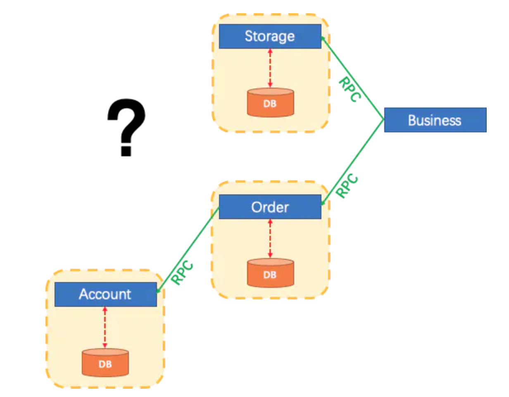
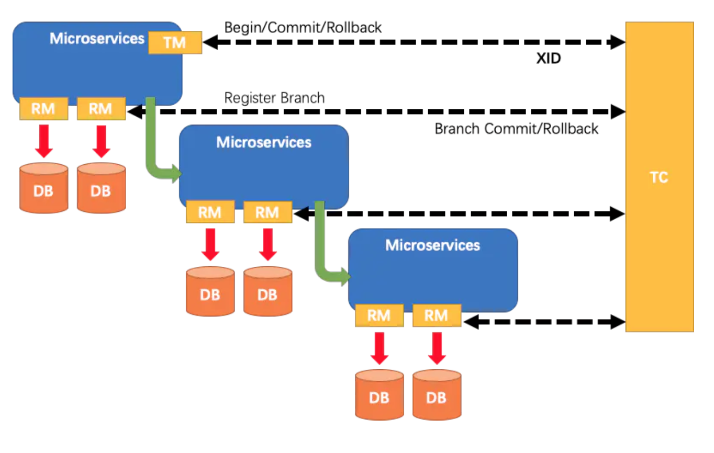

## 一、环境准备

本文涉及软件环境如下：

- SpringBoot 2.1.6.RELEASE
- Dubbo 2.7.1
- Mybatis 3.5.1
- Seata 0.6.1
- Zookeeper 3.4.10

#### 1、业务场景

为了简化流程，我们只需要订单和库存两个服务。创建订单的时候，调用库存服务，扣减库存。

涉及的表设计如下：

```
CREATE TABLE `t_order` (
  `id` int(11) NOT NULL AUTO_INCREMENT,
  `order_no` varchar(255) DEFAULT NULL,
  `user_id` varchar(255) DEFAULT NULL,
  `commodity_code` varchar(255) DEFAULT NULL,
  `count` int(11) DEFAULT '0',
  `amount` double(14,2) DEFAULT '0.00',
  PRIMARY KEY (`id`)
) ENGINE=InnoDB AUTO_INCREMENT=38 DEFAULT CHARSET=utf8;

CREATE TABLE `t_storage` (
  `id` int(11) NOT NULL AUTO_INCREMENT,
  `commodity_code` varchar(255) DEFAULT NULL,
  `name` varchar(255) DEFAULT NULL,
  `count` int(11) DEFAULT '0',
  PRIMARY KEY (`id`),
  UNIQUE KEY `commodity_code` (`commodity_code`)
) ENGINE=InnoDB AUTO_INCREMENT=2 DEFAULT CHARSET=utf8;
复制代码
```

另外还需要一个回滚日志表：

```
CREATE TABLE `undo_log` (
  `id` bigint(20) NOT NULL AUTO_INCREMENT,
  `branch_id` bigint(20) NOT NULL,
  `xid` varchar(100) NOT NULL,
  `rollback_info` longblob NOT NULL,
  `log_status` int(11) NOT NULL,
  `log_created` datetime NOT NULL,
  `log_modified` datetime NOT NULL,
  `ext` varchar(100) DEFAULT NULL,
  `context` varchar(100) DEFAULT NULL,
  PRIMARY KEY (`id`),
  UNIQUE KEY `ux_undo_log` (`xid`,`branch_id`)
) ENGINE=InnoDB AUTO_INCREMENT=67 DEFAULT CHARSET=utf8;
复制代码
```

#### 2、Seata下载安装

打开`https://github.com/seata/seata/releases`，目前最新版本是`v0.6.1`。

下载解压后，到`seata-server-0.6.1\distribution\bin`目录下可以看到`seata-server.bat和seata-server.sh`，选择一个双击执行。

不出意外的话，当你看到`-Server started ...`等字样，就正常启动了。

#### 3、Maven依赖

由于是Dubbo项目，我们先引入Dubbo相关依赖。

```
<dependency>
	<groupId>org.apache.dubbo</groupId>
	<artifactId>dubbo</artifactId>
	<version>2.7.1</version>
</dependency>
<dependency>
	<groupId>org.apache.dubbo</groupId>
	<artifactId>dubbo-spring-boot-starter</artifactId>
	<version>2.7.1</version>
</dependency>
复制代码
```

Dubbo的服务要注册到Zookeeper，引入curator客户端。

```
<dependency>
	<groupId>org.apache.curator</groupId>
	<artifactId>curator-framework</artifactId>
	<version>2.13.0</version>
</dependency>
<dependency>
	<groupId>org.apache.curator</groupId>
	<artifactId>curator-recipes</artifactId>
	<version>2.13.0</version>
</dependency>
复制代码
```

最后，引入Seata。

```
<dependency>
	<groupId>io.seata</groupId>
	<artifactId>seata-all</artifactId>
	<version>0.6.1</version>
</dependency>
复制代码
```

当然了，还有其他的如`Mybatis、mysql-connector`等就不粘了，自行引入即可。

## 二、项目配置

#### 1、application.properties

这里只需要配置数据库连接信息和Dubbo相关信息即可。

```
server.port=8011

spring.datasource.url=jdbc:mysql://127.0.0.1:3306/seata
spring.datasource.username=root
spring.datasource.password=root

dubbo.application.name=order-service
dubbo.registry.address=zookeeper://127.0.0.1:2181
dubbo.protocol.name=dubbo
dubbo.protocol.port=20881
dubbo.consumer.timeout=9999999
dubbo.consumer.check=false
复制代码
```

#### 2、数据源

Seata 是通过代理数据源实现事务分支，所以需要先配置一个数据源的代理，否则事务不会回滚。

```
@Bean
public DataSourceProxy dataSourceProxy(DataSource dataSource) {
	return new DataSourceProxy(dataSource);
}
复制代码
```

注意，这里的`DataSourceProxy`类位于`io.seata.rm.datasource`包内。

#### 3、Seata配置

还需要配置全局事务扫描器。有两个参数，一个是应用名称，一个是事务分组。

```
@Bean
public GlobalTransactionScanner globalTransactionScanner() {
	return new GlobalTransactionScanner("springboot-order", "my_test_tx_group");
}
复制代码
```

事实上，关于Seata事务的一系列初始化工作都在这里完成。

#### 4、配置注册中心

`Seata`连接到服务器的时候需要一些配置项，这时候有一个`registry.conf`文件可以指定注册中心和配置文件是什么。

这里有很多可选性，比如`file、nacos 、apollo、zk、consul`。

后面4个都是业界成熟的配置注册中心产品，为啥还有个file呢？

官方的初衷是在不依赖第三方配置注册中心的基础上快速集成测试`seata`功能，但是`file`类型本身不具备注册中心的动态发现和动态配置功能。

`registry.conf`文件内容如下：

```
registry {
  type = "file"
  file {
    name = "file.conf"
  }
}
config {
  # file、nacos 、apollo、zk、consul
  type = "file"
  file {
    name = "file.conf"
  }
}
复制代码
```

如果你选择了`file`类型，通过name属性指定了`file.conf`，这个文件中指定了客户端或服务器的配置信息。比如传输协议、服务器地址等。

```
service {
  #vgroup->rgroup
  vgroup_mapping.my_test_tx_group = "default"
  #only support single node
  default.grouplist = "127.0.0.1:8091"
  #degrade current not support
  enableDegrade = false
  #disable
  disable = false
}
复制代码
```

## 三、业务代码

#### 1、库存服务

在库存服务中，拿到商品编码和购买总个数，扣减即可。

```
<update id="decreaseStorage">
	update t_storage set count = count-${count} where commodity_code = #{commodityCode}
</update>
复制代码
```

然后用Dubbo将库存服务扣减接口暴露出去。

#### 2、订单服务

在订单服务中，先扣减库存，再创建订单。最后抛出异常，然后去数据库检查事务是否回滚。

```
@GlobalTransactional
public void createOrder(OrderDTO orderDTO) {

	System.out.println("开始全局事务。XID="+RootContext.getXID());
	StorageDTO storageDTO = new StorageDTO();
	storageDTO.setCount(orderDTO.getCount());
	storageDTO.setCommodityCode(orderDTO.getCommodityCode());
	
	//1、扣减库存
	storageDubboService.decreaseStorage(storageDTO);
	
	//2、创建订单
	orderDTO.setId(order_id.incrementAndGet());
	orderDTO.setOrderNo(UUID.randomUUID().toString());
	Order order = new Order();
	BeanUtils.copyProperties(orderDTO,order);
	orderMapper.createOrder(order);

	throw new RuntimeException("分布式事务异常..."+orderDTO.getOrderNo());
}
复制代码
```

值得注意的是，在订单服务事务开始的方法上，需要标注`@GlobalTransactional`。另外，在库存服务的方法里，不需要此注解，事务会通过Dubbo进行传播。

## 四、注意事项

#### 1、数据源

请切记，Seata 是通过代理数据源实现事务分支，一定不要忘记配置数据源代理。

#### 2、主键自增

在数据库中，表里的主键ID字段都是自增的。如果你的字段不是自增的，那么在Mybatis的`insert SQL`中，要将列名写完整。

比如我们可以这样写SQL：

```
INSERT INTO table_name VALUES (值1, 值2,....)
复制代码
```

那么这时候就要写成：

```
INSERT INTO table_name (列1, 列2,...) VALUES (值1, 值2,....)
复制代码
```

#### 3、序列化问题

在订单表中，`amount`字段类型为`double`。在`seata0.6.1`版本中，默认的序列化方式为`fastjson`，但它会将这个字段序列化成`bigdecimal`类型，会导致后面类型不匹配。

但是在后续的`seata0.7.0`版本中(还未发布)，已经将默认的序列化方式改为了`jackson`。

不过无需担心，这个问题一般不会出现。笔者是因为引错了一个包，才导致发现这问题。


-----

## 一、原理

首先，设想一个传统的单体应用，通过 3 个 模块，在同一个数据源上更新数据来完成一项业务。

很自然的，整个业务过程的数据一致性由本地事务来保证。


随着业务需求和架构的变化，单体应用被拆分为微服务。原来的3个模块被拆分为3个独立的服务，分别使用独立的数据。

业务过程将通过RPC的服务调用来完成。





那么这个时候，每一个服务内部的数据一致性仍由本地事务来保证。

而整个业务层面的全局数据一致性和完整性要如何保障呢？这就是微服务架构下面临的，典型的分布式事务需求。

#### 1、原理和设计

`Seata`把一个分布式事务理解成一个包含了若干 **分支事务** 的 **全局事务** 。**全局事务** 的职责是协调其下管辖的 **分支事务** 达成一致，要么一起成功提交，要么一起失败回滚。此外，通常 **分支事务** 本身就是一个满足 ACID 的 本地事务。

`Seata`定义了3个组件来协议分布式事务的处理过程。

- Transaction Coordinator (TC)： 事务协调器，维护全局事务的运行状态，负责协调并驱动全局事务的提交或回滚。
- Transaction Manager (TM)： 控制全局事务的边界，负责开启一个全局事务，并最终发起全局提交或全局回滚的决议。
- Resource Manager (RM)： 控制分支事务，负责分支注册、状态汇报，并接收事务协调器的指令，驱动分支（本地）事务的提交和回滚。

一个典型的分布式事务过程：

1. TM 向 TC 申请开启一个全局事务，全局事务创建成功并生成一个全局唯一的 XID。
2. XID 在微服务调用链路的上下文中传播。
3. RM 向 TC 注册分支事务，将其纳入 XID 对应全局事务的管辖。
4. TM 向 TC 发起针对 XID 的全局提交或回滚决议。
5. TC 调度 XID 下管辖的全部分支事务完成提交或回滚请求。




#### 2、AT模式

Seata有4种分布式事务解决方案，分别是 AT 模式、TCC 模式、Saga 模式和 XA 模式。<后两种实现还在官方计划版本中>

我们的示例项目中，所用到的就是AT模式。在 AT 模式下，用户只需关注自己的“业务 SQL”，用户的 “业务 SQL” 作为一阶段，Seata 框架会自动生成事务的二阶段提交和回滚操作。

- 一阶段：

在一阶段，Seata 会拦截“业务 SQL”，首先解析 SQL 语义，找到“业务 SQL”要更新的业务数据，在业务数据被更新前，将其保存成“before image”，然后执行“业务 SQL”更新业务数据，在业务数据更新之后，再将其保存成“after image”，最后生成行锁。以上操作全部在一个数据库事务内完成，这样保证了一阶段操作的原子性。

- 二阶段提交：

二阶段如果是提交的话，因为“业务 SQL”在一阶段已经提交至数据库，所以Seata 框架只需将一阶段保存的快照数据和行锁删掉，完成数据清理即可。

- 二阶段回滚：

二阶段如果是回滚的话，Seata 就需要回滚一阶段已经执行的“业务 SQL”，还原业务数据。回滚方式便是用“before image”还原业务数据。

下面我们从源码中来看看这整个流程是怎么串起来的。

## 二、本地环境搭建

为了方便看源码，首先就得把调试环境搞起，方便Debug。

Seata 源码：[github.com/seata/seata](https://github.com/seata/seata) 。

目前的版本是`0.7.0-SNAPSHOT`，然后通过`mvn install`将项目打包到本地。

我们的`SpringBoot+Seata`测试项目就可以引入这个依赖。

```
<dependency>
	<groupId>io.seata</groupId>
	<artifactId>seata-all</artifactId>
	<version>0.7.0-SNAPSHOT</version>
</dependency>
复制代码
```

为啥要这样干呢？因为`Seata`不同组件之间的通信都是`Netty`来完成的，在调试的时候，往往会因为超时而断开连接。

引入了本地版本，我们就可以把心跳检测时间加长或者索性去掉，随便搞~

#### 1、服务端启动

找到`io.seata.server.Server`，直接运行`main`方法，就启动了Seata服务，so easy~

我们上面说`Seata`定义了三个组件，其中有一个叫TC的事务协调器，就是指这个服务端。

我们看看它具体干了些啥。

```
public class Server {
	
    public static void main(String[] args) throws IOException {
	
	//初始化参数解析器 
	ParameterParser parameterParser = new ParameterParser(args);
	
	//初始化RpcServer ，设置服务器参数
	RpcServer rpcServer = new RpcServer(WORKING_THREADS);
	rpcServer.setHost(parameterParser.getHost());
	rpcServer.setListenPort(parameterParser.getPort());
	UUIDGenerator.init(1);
	
	//从文件或者数据库中加载Session 
	SessionHolder.init(parameterParser.getStoreMode());
	
	//初始化默认的协调器
	DefaultCoordinator coordinator = new DefaultCoordinator(rpcServer);
	coordinator.init();
	rpcServer.setHandler(coordinator);
	
	//注册钩子程序 清理协调器相关资源
	ShutdownHook.getInstance().addDisposable(coordinator);

	//127.0.0.1 and 0.0.0.0 are not valid here.
	if (NetUtil.isValidIp(parameterParser.getHost(), false)) {
	    XID.setIpAddress(parameterParser.getHost());
	} else {
	    XID.setIpAddress(NetUtil.getLocalIp());
	}
	XID.setPort(rpcServer.getListenPort());
	//启动RPC服务
	rpcServer.init();
	System.exit(0);
    }
}
复制代码
```

这里的`RpcServer`是通过Netty实现的一个RPC服务端，用来接收并处理TM和RM的消息。本文的重点不在服务端，所以我们先有一个大致的印象即可。

## 三、客户端配置

在项目中，我们配置了`SeataConfiguration`，其中的重点是配置全局事务扫描器和数据源代理。所以，我们先来看看为啥要配置它们，它们具体又做了什么事。

#### 1、事务扫描器

```
@Bean
public GlobalTransactionScanner globalTransactionScanner() {
    return new GlobalTransactionScanner("springboot-order", "my_test_tx_group");
}
复制代码
```

按照规矩，我们看一个类，先看它的结构。比如它是谁的儿子，从哪里来，欲往何处去？

```
public class GlobalTransactionScanner extends AbstractAutoProxyCreator
    implements InitializingBean, ApplicationContextAware,DisposableBean {
}
复制代码
```

这里我们看到它是`AbstractAutoProxyCreator`的子类，又实现了`InitializingBean`接口。

这俩哥们都是Spring大家族的成员，一个用于Spring AOP生成代理；一个用于调用Bean的初始化方法。

- InitializingBean

Bean的初始化方法有三种方式，按照先后顺序是，`@PostConstruct、afterPropertiesSet、init-method`。

在这里，它的初始化方法中，主要就干了三件事。

```
private void initClient() {
    if (LOGGER.isInfoEnabled()) {
        LOGGER.info("Initializing Global Transaction Clients ... ");
    }
    //init TM 初始化事务管理器
    TMClient.init(applicationId, txServiceGroup);
    //init RM 初始化资源管理器
    RMClient.init(applicationId, txServiceGroup);
    //注册钩子程序，用于TM、RM的资源清理
    registerSpringShutdownHook();
}
复制代码
```

到目前为止，Seata定义的三个组件都已经浮出水面了。

`TMClient.init`主要是初始化事务管理器的客户端，建立与RPC服务端的连接，同时向事务协调器注册。

`RMClient.init`也是一样过程，初始化资源管理器，建立与RPC服务端的连接，同时向事务协调器注册。

同时，它们都是通过定时任务来完成连接的，所以断线之后可以自动重连。

```
timerExecutor.scheduleAtFixedRate(new Runnable() {
	@Override
	public void run() {
	    clientChannelManager.reconnect(getTransactionServiceGroup());
	}
}, 5, 5, TimeUnit.SECONDS);
复制代码
```

最后，注册钩子程序，用于清理这两个组件中的资源。

- AbstractAutoProxyCreator

它实际上是一个Bean的后置处理器，在Bean初始化之后，调用`postProcessAfterInitialization`方法。

```
public Object postProcessAfterInitialization(@Nullable Object bean, String beanName) {
    if (bean != null) {
    	Object cacheKey = this.getCacheKey(bean.getClass(), beanName);
    	if (this.earlyProxyReferences.remove(cacheKey) != bean) {
    	    return this.wrapIfNecessary(bean, beanName, cacheKey);
    	}
    }
    return bean;
}
复制代码
```

然后在`GlobalTransactionScanner.wrapIfNecessary()`里它干了些什么呢？

就是检查Bean的方法上是否包含`GlobalTransactional`和`GlobalLock`注解，然后生成代理类。

```
protected Object wrapIfNecessary(Object bean, String beanName, Object cacheKey){
    if (disableGlobalTransaction) {
    	return bean;
    }
    //已经生成了代理，直接返回
    if (PROXYED_SET.contains(beanName)) {
	    return bean;
    }
    interceptor = null;
	
    //检查是不是TCC的代理
    if (TCCBeanParserUtils.isTccAutoProxy(bean, beanName, applicationContext)) {
    	//TCC interceptor， proxy bean of sofa:reference/dubbo:reference, and LocalTCC
    	interceptor = new TccActionInterceptor(TCCBeanParserUtils.getRemotingDesc(beanName));
    } else {
    	Class<?> serviceInterface = SpringProxyUtils.findTargetClass(bean);
    	Class<?>[] interfacesIfJdk = SpringProxyUtils.findInterfaces(bean);
    	//判断类方法上是否包含GlobalTransactional注解和GlobalLock注解
    	if (!existsAnnotation(new Class[] {serviceInterface})
    		&& !existsAnnotation(interfacesIfJdk)) {
    		return bean;
    	}
    	//创建拦截器
    	if (interceptor == null) {
    	    interceptor = new GlobalTransactionalInterceptor(failureHandlerHook);
    	}
    }
    //如果不是AOP代理，则创建代理；如果是代理，则将拦截器加入到Advisor
    if (!AopUtils.isAopProxy(bean)) {
    	bean = super.wrapIfNecessary(bean, beanName, cacheKey);
    } else {
    	AdvisedSupport advised = SpringProxyUtils.getAdvisedSupport(bean);
    	Advisor[] advisor = buildAdvisors(beanName, getAdvicesAndAdvisorsForBean(null, null, null));
    	for (Advisor avr : advisor) {
    		advised.addAdvisor(0, avr);
    	}
    }
    PROXYED_SET.add(beanName);
    return bean;
}
复制代码
```

至此，我们已经确定了一件事。我们`ServiceImpl`实现类上带有`GlobalTransactional`注解的方法，会生成一个代理类。

在调用方法时，实际会调用的就是代理类的拦截器方法`invoke()`。

```
public class GlobalTransactionalInterceptor implements MethodInterceptor {
	
    @Override
    public Object invoke(final MethodInvocation methodInvocation) throws Throwable {
    	
    	//获取目标类
    	Class<?> targetClass = AopUtils.getTargetClass(methodInvocation.getThis());
    	//获取调用的方法
    	Method specificMethod = ClassUtils.getMostSpecificMethod(methodInvocation.getMethod(), targetClass);
    	final Method method = BridgeMethodResolver.findBridgedMethod(specificMethod);
    	//获取方法上的注解
    	final GlobalTransactional globalTransactionalAnnotation = getAnnotation(method, GlobalTransactional.class);
    	final GlobalLock globalLockAnnotation = getAnnotation(method, GlobalLock.class);
    	//处理全局事务
    	if (globalTransactionalAnnotation != null) {
    	    return handleGlobalTransaction(methodInvocation, globalTransactionalAnnotation);
    	} else if (globalLockAnnotation != null) {
    	    return handleGlobalLock(methodInvocation);
    	} else {
    	    return methodInvocation.proceed();
    	}
    }
}
复制代码
```

可以看到，这里是开始处理全局事务的地方。这里我们先不深究，接着往下看。

#### 2、数据源代理

除了上面创建方法的代理，还要创建数据源的代理；然后把这个代理对象设置到`SqlSessionFactory`。

```
@Bean
public DataSourceProxy dataSourceProxy(DataSource dataSource) {
    return new DataSourceProxy(dataSource);
}

@Bean
public SqlSessionFactory sqlSessionFactoryBean(DataSourceProxy dataSourceProxy) throws Exception {
    SqlSessionFactoryBean sqlSessionFactoryBean = new SqlSessionFactoryBean();
    sqlSessionFactoryBean.setDataSource(dataSourceProxy);
    sqlSessionFactoryBean.setTransactionFactory(new JdbcTransactionFactory());
    return sqlSessionFactoryBean.getObject();
}
复制代码
```

这里的重点是创建了`DataSourceProxy`，并把它设置到`Mybatis`中的`SqlSessionFactory`。

我们知道，在`Mybatis`执行方法的时候，最终要创建`PreparedStatement`对象，然后执行`ps.execute()`返回SQL结果。

这里有两点我们需要注意：

- PreparedStatement的创建

`PreparedStatement`对象是从`Connection`对象创建而来的，也许我们都写过：

```
PreparedStatement pstmt = conn.prepareStatement(insert ........)
复制代码
```

- Connection的创建

`Connection`又是从哪里来的呢？这个我们不必迟疑，当然从数据源中才能拿到一个连接。

不过我们已经把数据源`DataSource`对象已经被替换成了`Seata`中的`DataSourceProxy`对象。

所以，`Connection和PreparedStatement`在创建的时候，都被搞成了`Seata`中的代理对象。

不信你看嘛：

```
public class DataSourceProxy extends AbstractDataSourceProxy implements Resource {
    public ConnectionProxy getConnection() throws SQLException {
    	Connection targetConnection = targetDataSource.getConnection();
    	return new ConnectionProxy(this, targetConnection);
    }
}
复制代码
```

然后调用`AbstractDataSourceProxy`来创建`PreparedStatement`。

```
public abstract class AbstractConnectionProxy implements Connection {
	
    @Override
    public PreparedStatement prepareStatement(String sql) throws SQLException {
        PreparedStatement targetPreparedStatement = getTargetConnection().prepareStatement(sql);
        return new PreparedStatementProxy(this, targetPreparedStatement, sql);
    }
}
复制代码
```

看到这里，我们应该明白一件事。

在执行`ps.execute()`的时候，则会调用到`PreparedStatementProxy.execute()`。

理清了配置文件后面的逻辑，也许就掌握了它的脉络，再看代码的时候，可以知道从哪里下手。

## 四、方法的执行

上面已经说到，`ServiceImpl`已经是一个代理类，所以我们直接看`GlobalTransactionalInterceptor.invoke()`。

它会调用到`TransactionalTemplate.execute()`，`TransactionalTemplate`是业务逻辑和全局事务的模板。

```
public class TransactionalTemplate {

    public Object execute(TransactionalExecutor business) throws Throwable {
	
    	// 1. 创建一个全局事务
    	GlobalTransaction tx = GlobalTransactionContext.getCurrentOrCreate();
    	// 1.1 获取事务的属性  比如超时时间、事务名称
    	TransactionInfo txInfo = business.getTransactionInfo();
    	if (txInfo == null) {
    	    throw new ShouldNeverHappenException("transactionInfo does not exist");
    	}
    	try {
    	    // 2. 开始事务
    	    beginTransaction(txInfo, tx);
    	    Object rs = null;
    	    try {
    	    	// 执行业务逻辑
    	    	rs = business.execute();
    	    } catch (Throwable ex) {
    	    	// 3.回滚
    	    	completeTransactionAfterThrowing(txInfo,tx,ex);
    	    	throw ex;
    	    }
    	    // 4. 提交
    	    commitTransaction(tx);
    	    return rs;
    	} finally {
    	    //5. 清理资源
    	    triggerAfterCompletion();
    	    cleanUp();
    	}
    }
}
复制代码
```

这里的代码很清晰，事务的流程也一目了然。

1. 创建全局事务，并设置事务属性
2. 开启一个事务
3. 执行业务逻辑
4. 如果发生异常，则回滚事务；否则提交事务
5. 清理资源

下面我们看看具体它是怎么做的。

#### 1、开启事务

从客户端的角度来看，开启事务就是告诉服务器说：我要开启一个全局事务了，请事务协调器TC先生分配一个全局事务ID给我。

TC先生会根据应用名称、事务分组、事务名称等创建全局Session，并生成一个全局事务XID。

然后客户端记录当前的事务状态为`Begin` ，并将XID绑定到当前线程。

#### 2、执行业务逻辑

开启事务之后，开始执行我们自己的业务逻辑。这就涉及到了数据库操作，上面我们说到`Seata`已经将`PreparedStatement`对象做了代理。所以在执行的时候将会调用到`PreparedStatementProxy.execute()`。

```
public class PreparedStatementProxy{
	
    public boolean execute() throws SQLException {
        return ExecuteTemplate.execute(this, new StatementCallback<Boolean, PreparedStatement>() {
            @Override
            public Boolean execute(PreparedStatement statement, Object... args) throws SQLException {
                return statement.execute();
            }
        });
    }
}
复制代码
```

在这里它会先根据SQL的类型生成不同的执行器。比如是一个`INSERT INTO`语句，那么就是`InsertExecutor`执行器。

然后判断是不是自动提交的，执行相应方法。那么接着看`executeAutoCommitFalse()`

```
public abstract class AbstractDMLBaseExecutor{
	
    protected T executeAutoCommitFalse(Object[] args) throws Throwable {
    	TableRecords beforeImage = beforeImage();
    	T result = statementCallback.execute(statementProxy.getTargetStatement(), args);
    	TableRecords afterImage = afterImage(beforeImage);
    	prepareUndoLog(beforeImage, afterImage);
    	return result;
    }
}
复制代码
```

这里就是AT模式一阶段所做的事，拦截业务SQL，在数据保存前将其保存为`beforeImage`;然后执行业务SQL，在数据更新后再将其保存为`afterImage`。这些操作全部在一个本地事务中完成，保证了一阶段操作的原子性。

我们以`INSERT INTO`为例，看看它是怎么做的。

- beforeImage

由于是新增操作，所以在执行之前，这条记录还没有，beforeImage只是一个空表记录。

- 业务SQL

执行原有的SQL语句，比如`INSERT INTO ORDER(ID,NAME)VALUE(?,?)`

- afterImage

它要做的事就是，把刚刚添加的那条记录从数据库中再查出来。

```
protected TableRecords afterImage(TableRecords beforeImage) throws SQLException {
	
    //查找主键ID的值
    List<Object> pkValues = containsPK() ? getPkValuesByColumn() : getPkValuesByAuto();
    //根据主键ID查找记录
    TableRecords afterImage = getTableRecords(pkValues);
    return afterImage;
}
复制代码
```

然后将`beforeImage`和`afterImage`构建成`UndoLog`对象，保存到数据库。重要的是，这些操作都是在同一个本地事务中进行的。我们看它的sqlList也能看出来。


最后，我们看一下`UndoLog`在数据库中的记录是长这样的：

```
{
	"@class": "io.seata.rm.datasource.undo.BranchUndoLog",
	"xid": "192.168.216.1:8091:2016493467",
	"branchId": 2016493468,
	"sqlUndoLogs": ["java.util.ArrayList", [{
		"@class": "io.seata.rm.datasource.undo.SQLUndoLog",
		"sqlType": "INSERT",
		"tableName": "t_order",
		"beforeImage": {
			"@class": "io.seata.rm.datasource.sql.struct.TableRecords$EmptyTableRecords",
			"tableName": "t_order",
			"rows": ["java.util.ArrayList", []]
		},
		"afterImage": {
			"@class": "io.seata.rm.datasource.sql.struct.TableRecords",
			"tableName": "t_order",
			"rows": ["java.util.ArrayList", [{
				"@class": "io.seata.rm.datasource.sql.struct.Row",
				"fields": ["java.util.ArrayList", [{
					"@class": "io.seata.rm.datasource.sql.struct.Field",
					"name": "id",
					"keyType": "PrimaryKey",
					"type": 4,
					"value": 116
				}, {
					"@class": "io.seata.rm.datasource.sql.struct.Field",
					"name": "order_no",
					"keyType": "NULL",
					"type": 12,
					"value": "c233d8fb-5e71-4fc1-bc95-6f3d86312db6"
				}, {
					"@class": "io.seata.rm.datasource.sql.struct.Field",
					"name": "user_id",
					"keyType": "NULL",
					"type": 12,
					"value": "200548"
				}, {
					"@class": "io.seata.rm.datasource.sql.struct.Field",
					"name": "commodity_code",
					"keyType": "NULL",
					"type": 12,
					"value": "HYD5620"
				}, {
					"@class": "io.seata.rm.datasource.sql.struct.Field",
					"name": "count",
					"keyType": "NULL",
					"type": 4,
					"value": 10
				}, {
					"@class": "io.seata.rm.datasource.sql.struct.Field",
					"name": "amount",
					"keyType": "NULL",
					"type": 8,
					"value": 5000.0
				}]]
			}]]
		}
	}]]
}
复制代码
```

#### 3、提交

如果执行业务没有异常，就进入二阶段提交。客户端向服务器发送Commit事件，同时将XID解绑。

服务器端回复确认提交后，客户端将本地UndoLog数据清除。

这里重要在`AsyncWorker.init()`方法，它会启动一个定时任务来执行`doBranchCommits`，来清除Log数据。

#### 4、回滚

如果发生异常，则进行二阶段回滚。

先通过xid和branchId 找到UnDoLog这条记录，然后在解析里面的数据生成反向SQL，将刚才的执行结果给撤销。

这块代码较长，大家自行参考`UndoLogManager.undo()`和`AbstractUndoExecutor.executeOn()`方法。

#### 5、如何关联Dubbo

只有一个事务管理器TM才会开启全局事务，那么其他服务参与者是如何自动纳入到全局事务中去的呢？

首先，`Seata`给Dubbo搞了个Filter过滤器叫做`TransactionPropagationFilter`。

它会在`Dubbo RPC`上下文中设置XID，这样在其他服务中也可以获取这个XID。

然后，我们知道，Seata已经代理了`PreparedStatement`。在执行数据操作的时候，就有个判断。

```
if (!RootContext.inGlobalTransaction() && !RootContext.requireGlobalLock()) {
    //如果不包含XID，就执行原始方法
    return statementCallback.execute(statementProxy.getTargetStatement(), args);
}
复制代码
```

这里的意思就是，如果当前线程不包含XID，就执行原始方法；如果包含呢，就继续往下执行事务方法。

## 五、总结

本文大概阐述了Seata TA模式下，客户端的工作原理。还有一部分Seata服务端的逻辑，本文并没有深入涉及。

原因在于笔者还没有完全的吃透这部分内容，没办法通俗的写出来，等以后再补~

如若文中有不准确的地方，也希望朋友们不吝赐教，谢谢。