[TOC]

## Paxos

### Basic Paxos

#### 是什么

用于达成共识性问题，即对多个节点产生的值，该算法能保证只选出唯一一个值。

主要有三类节点：

l 提议者（Proposer）：提议一个值；

l 接受者（Acceptor）：对每个提议进行投票；

l 告知者（Learner）：被告知投票的结果，不参与投票过程。


5.1 执行过程

规定一个提议包含两个字段：[n, v]，其中 n 为序号（具有唯一性），v 为提议值。

Prepare 阶段

下图演示了两个 Proposer 和三个 Acceptor 的系统中运行该算法的初始过程，每个 Proposer 都会向所有 Acceptor 发送 Prepare 请求。


当 Acceptor 接收到一个 Prepare 请求，包含的提议为 [n1, v1]，并且之前还未接收过 Prepare 请求，那么发送一个 Prepare 响应，设置当前接收到的提议为 [n1, v1]，并且保证以后不会再接受序号小于 n1 的提议。

如下图，Acceptor X 在收到 [n=2, v=8] 的 Prepare 请求时，由于之前没有接收过提议，因此就发送一个 [no previous] 的 Prepare 响应，设置当前接收到的提议为 [n=2, v=8]，并且保证以后不会再接受序号小于 2 的提议。其它的 Acceptor 类似。


如果 Acceptor 接收到一个 Prepare 请求，包含的提议为 [n2, v2]，并且之前已经接收过提议 [n1, v1]。如果 n1 > n2，那么就丢弃该提议请求；否则，发送 Prepare 响应，该 Prepare 响应包含之前已经接收过的提议 [n1, v1]，设置当前接收到的提议为 [n2, v2]，并且保证以后不会再接受序号小于 n2 的提议。

如下图，Acceptor Z 收到 Proposer A 发来的 [n=2, v=8] 的 Prepare 请求，由于之前已经接收过 [n=4, v=5] 的提议，并且 n > 2，因此就抛弃该提议请求；Acceptor X 收到 Proposer B 发来的 [n=4, v=5] 的 Prepare 请求，因为之前接收到的提议为 [n=2, v=8]，并且 2 <= 4，因此就发送 [n=2, v=8] 的 Prepare 响应，设置当前接收到的提议为 [n=4, v=5]，并且保证以后不会再接受序号小于 4 的提议。Acceptor Y 类似。


Accept 阶段

当一个 Proposer 接收到超过一半 Acceptor 的 Prepare 响应时，就可以发送 Accept 请求。

Proposer A 接收到两个 Prepare 响应之后，就发送 [n=2, v=8] Accept 请求。该 Accept 请求会被所有 Acceptor 丢弃，因为此时所有 Acceptor 都保证不接受序号小于 4 的提议。

Proposer B 过后也收到了两个 Prepare 响应，因此也开始发送 Accept 请求。需要注意的是，Accept 请求的 v 需要取它收到的最大提议编号对应的 v 值，也就是 8。因此它发送 [n=4, v=8] 的 Accept 请求。


Learn 阶段

Acceptor 接收到 Accept 请求时，如果序号大于等于该 Acceptor 承诺的最小序号，那么就发送 Learn 提议给所有的 Learner。当 Learner 发现有大多数的 Acceptor 接收了某个提议，那么该提议的提议值就被 Paxos 选择出来。

####有什么问题

**1） Paxos面对的问题：**

Proposer的并发执行 | Acceptor的宕机 | 消息乱序、丢失

**2） Paxos的第一阶段，为什么proposer接收到accepter发来的最大n倡议号的value值，要赋给自己？**

   确保value的一致性。只要有一个value被选定（chosen,即被**多数**的acceptor接受），那么进程最终都能获取到被选定的value。

**3） 第一阶段，为什么acceptor回复proposal的预提案时，需要回复已接受的最大序号提案？**

   同上

**4）Acceptor需要持久化的有哪些？Propose呢?**

   由于Acceptor需要服从两个规则：

l 不应答倡议号小于等于当前请求的倡议号PrepareRequest N；

l 不接受倡议号小于当前请求的AcceptRequest N;

   同时在应答时：返回自己已经 Accept 过的提案中 ProposalID 最大的那个提案的内容，如果没有则返回空值;

因此acceptor需要持久化已接受的最大<N,value>,以及已响应的最大N；

而Propose只需要记住自己提出的最大倡议号N。

**5） Paxos会存在什么问题？如何缓解？选了Leader还要Paxos干什么？**

**1 活锁（并发冲突）**：在第一阶段Pa发起倡议N1获得大多数响应，还没来得及发送<N1,v>，Pb又发起倡议N2同样获得大多数响应。此时Pa发送<N1,v>,Acceptors已经不接受了；紧接着Pa再一次发起N3，获得大多数响应，此时Pb再发送<N2,v>已经不被接受了……如此一来，形成活锁。

   解决：选出一个Leader，只有leader才能够提出倡议，变多写为单写。，首先运行一次完整的paxos选出leader,之后无需prepare阶段，可对多个value达成一致。

**2 性能**：每确定1个值，至少需要2次RTT（2个阶段，2个网络来回） + 2次写盘，性能是个问题。

   解决：multi-paxos

**6） 如何保证倡议编号全局唯一切单调递增？**

例如可以为n个proposers进行编号，每一次提议都将prooser自身已知的最大编号自增后再加上自己的编号；

**7） 重确认机制**

在Paxos协议中，对于决议的读取也是需要执行一轮Paxos过程的，但在实际过程中，这样的代价太大，就引入了confirm机制，即leader持久化一条日志，得到多数派的accept后，就再写一条针对该日志的confirm日志。处于性能考虑，leader的confirm日志通常会成批的给备机，备机才知道哪些日志已被大多数接受可以持久化了。对于已形成多数派但是没有confirm的日志，需要重确认。

这里考虑一个异常，ABC三台主机，A是leader，在AB上持久化了一条日志N，形成大多数，然后B宕机了；另一个场景是仅在A持久化，没有形成大多数，B宕机了。两种情况的最终结果都是A有N，C没有，那么到底N是否已形成决议？我们不能确定，因此需要对这条日志重新执行paxos。假如引入了confirm机制，形成大多数的就添加一条comfirm日志，并发送给备机，那么该日志就不需要重确认了。

**9）使用场景？**

日志同步、多副本数据更新、选leader。

**10）proposer在 prepare阶段或accept阶段宕机怎么处理？**

prepare阶段：本次提案会终止。

accept阶段：提案将被commit。

**11）为什么paxos协议分为三个角色？**

Learner：提议学习者。learner角色的目的是把通过的确定性取值同步给其他未确定的Acceptor（少数未同意的）。

**12）为什么ob选择multi-paxos**

基于Raft的分布式一致性协议实现的局限及其对数据库的风险


普通服务器具有良好的性价比，因此在互联网等行业得到了广泛的应用。但普通服务器也不得不面对2%-4%的年故障率([1])，于是必须高可用的传统数据库只得很悲催地使用性价比低得可怜的高可靠服务器。


分布式一致性协议（distributed consensus protocol）是迄今为止最有效的解决服务器不可靠问题的途径，因为它使得一组服务器形成一个相互协同的系统，从而当其中部分服务器故障后，整个系统也能够继续工作。而Paxos协议([2])则几乎成了分布式一致性协议的代名词。


然而，Paxos协议的难以理解的名声似乎跟它本身一样出名。为此，Stanford大学的博士生Diego Ongaro甚至把对Paxos协议的研究作为了博士课题。他在2014年秋天正式发表了博士论文：“CONSENSUS: BRIDGING THEORY AND PRACTICE”，在这篇博士论文中，他给出了分布式一致性协议的一个实现算法，即Raft。由于这篇博士论文很长（257页），可能是为了便于别人阅读和理解，他在博士论文正式发表之前，即2014年初，把Raft相关的部分摘了出来，形成了一篇十多页的文章：“In Search of an Understandable Consensus Algorithm”，即人们俗称的Raft论文。

Raft算法给出了分布式一致性协议的一个比较简单的实现，到目前为止并没有人挑战这个算法的正确性。然而，OceanBase却没有采用Raft算法，这并非是OceanBase团队同学不懂Raft，而是Raft的一个根本性的局限对数据库的事务有很大的风险。


Raft有一个很强的假设是主（leader）和备（follower）都按顺序投票，为了便于阐述，以数据库事务为例：

·主库按事务顺序发送事务日志

·备库按事务顺序持久化事务和应答主库

·主库按事务顺序提交事务


由于不同的事务可能被不同工作线程处理，事务日志可能被不同的网络线程发送和接收，因为网络抖动和Linux线程调度等原因，一个备库可能会出现接收到了事务日志#5-#9，但没有接收到事务#4，因此#5-#9的所有事务都需要hold住（在内存），不能持久化，也不能应答主库：


\#1-#3为已经持久化和应答的事务日志

\#5-#9为已经收到但却不能持久化和应答的事务日志

\#4为未收到的事务日志。


顺序投票策略对于主库的负面影响比较严重：出于性能提升的原因，数据库的多版本并发控制（MVCC）使得不存在相互关联的事务得以并发处理，但上述顺序投票策略使得事务#5-#9可能被毫不相干的事务#4阻塞，且必须hold在内存。


顺序投票策略对于多表事务的影响很大：设想一个事务涉及到三张表A，B，C，其中一个事务被顺序投票策略阻塞了，那么表A、B、C上的其他单表和多表事务都会被阻塞，假如A又跟表C、表D有多表事务，B和表E、表F有多表事务，C和表D、表G有多表事务，那么很多表上的事务，包括单表和多表的事务，都会被阻塞，形成一个链式反应。


顺序投票策略对于跨服务器的多表事务（分布式事务）的影响极大：由于事务日志需要在多个表相关的多台服务器之间同步，日志发送与接收之间的顺序更加得不到保证，许多的单表和多表的事务都可能被阻塞，包括链式反应的阻塞甚至循环阻塞，不仅增加事务延迟，甚至可能导致内存耗尽。


顺序投票策略的另外一个负面作用是对故障恢复的影响。由于分布式一致性协议必须有多数派才能正常工作，所以一个参与者故障后，系统应该需要补上一个参与者，确保系统不会因为下一个参与者故障致使多数派协议被破坏，从而导致已经应答了客户的事务数据的丢失等非常严重的问题。由于单台服务器通常服务成千上万的表格，对每个表格分别写事务日志（redo log）会导致很低的性能，而从混合在一起的事务日志中提取部分表格的日志有不小的工作量，从而导致新的参与者的延迟。


Raft的上述顺序投票策略，是Raft算法的基础之一，如果抛弃它，则Raft算法的正确性无法得到保证。对于数据库之外的场景，上述缺陷可能没有很大的影响，但对于高峰期每秒钟处理成千上万的事务的数据库，是一个无法忽视的潜在性能和稳定性风险。

### Multi Paxos

#### 是什么

paxos是对一个值达成一致，multi-paxos是运行多个paxos instance来对多个值达成一致，每个paxos instance对一个值达成一致。

Basic Paxos可以用来确定1条日志。而Multi-Paxos就是针对每条日志都执行1个2PC的Paxos协议，从而确定多条日志，也就是一个日志流。有了日志流，就能基于日志流建立一个”复制状态机“模型。

通过Multi-Paxos保证3台机器上的日志流完全一致，那么把日志流apply到各自的状态机上，状态机肯定也就完全一致。这就是所谓的“复制状态机”模型。

#### 有什么问题

**8）multi-paxos的幽灵复现问题**

**幽灵复现问题**

使用Paxos协议处理日志的备份与恢复，可以保证确认形成多数派的日志不丢失，但是无法避免一种被称为“幽灵复现”的现象，如下图所示：

**Leader A B C** 

第一轮 A 1-10 1-5 1-5 

第二轮 B 宕机 1-6,20 1-6,20 

第三轮 A 1-20 1-20 1-20

1. 第一轮中A被选为Leader，写下了1-10号日志，其中1-5号日志形成了多数派，并且已给客户端应答，而对于6-10号日志，客户端超时未能得到应答。
2. 第二轮，A宕机，B被选为Leader，由于B和C的最大的logID都是5，因此B不会去重确认6-10号日志，而是从6开始写新的日志，此时如果客户端来查询的话，是查询不到6-10号日志内容的，此后第二轮又写入了6-20号日志，但是只有6号和20号日志在多数派上持久化成功。
3. 第三轮，A又被选为Leader，从多数派中可以得到最大logID为20，因此要将7-20号日志执行重确认，其中就包括了A上的7-10号日志，之后客户端再来查询的话，会发现上次查询不到的7-10号日志又像幽灵一样重新出现了。

对于将Paxos协议应用在数据库日志同步场景的情况，**幽灵复现**问题是不可接受，一个简单的例子就是转账场景，用户转账时如果返回结果超时，那么往往会查询一下转账是否成功，来决定是否重试一下。如果第一次查询转账结果时，发现未生效而重试，而转账事务日志作为幽灵复现日志重新出现的话，就造成了用户重复转账。

为了处理“幽灵复现”问题，我们在每条日志的内容中保存一个generateID，leader在生成这条日志时以当前的leader ProposalID作为generateID。按logID顺序回放日志时，因为leader在开始服务之前一定会写一条StartWorking日志，所以如果出现generateID相对前一条日志变小的情况，说明这是一条“幽灵复现”日志（它的generateID会小于StartWorking日志），要忽略掉这条日志。


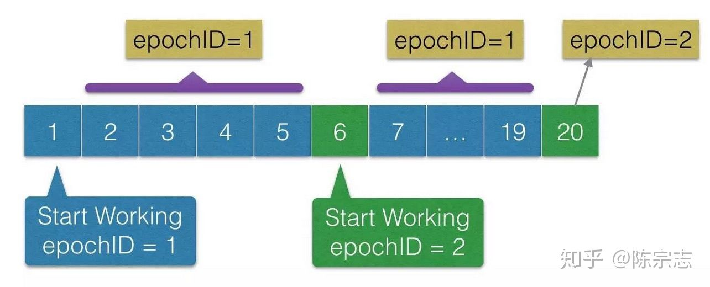


**第三态问题**

第三态问题也是我们之前经常讲的问题, 其实在网络系统里面, 对于一个请求都有三种返回结果

1. 成功
2. 失败
3. 超时未知

前面两种状态由于服务端都有明确的返回结果, 所以非常好处理, 但是如果是第三种状态的返回, 由于是超时状态, 所以服务端可能对于这个命令是请求是执行成功, 也有可能是执行失败的, 所以如果这个请求是一个写入操作, 那么下一次的读取请求可能读到这个结果, 也可能读到的结果是空的

就像在 raft phd 那个论文里面说的, 这个问题其实是和 raft/multi-paxos 协议无关的内容, 只要在分布式系统里面都会存在这个问题, 所以大部分的解决方法是两个

1. 对于每一个请求都加上一个唯一的序列号的标识, 然后server的状态机会记录之前已经执行过序列号. 当一个请求超时的时候, 默认的client 的逻辑会重试这个逻辑, 在收到重试的逻辑以后, 由于server 的状态机记录了之前已经执行过的序列号信息, 因此不会再次执行这条指令, 而是直接返回给客户端
2. 由于上述方法需要在server 端维护序列号的信息, 这个序列号是随着请求的多少递增的, 大小可想而知(当然也可以做一些只维护最近的多少条序列号个数的优化). 常见的工程实现是让client 的操作是幂等的, 直接重试即可, 比如floyd 里面的具体实现


那么对应于raft 中的第三态问题是, 当最后log Index 为4 的请求超时的时候, 状态机中出现的两种场景都是可能的

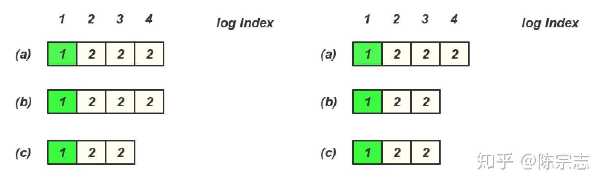


所以下一次读取的时候有可能读到log Index 4 的内容, 也有可能读不到, 所以如果在发生了超时请求以后, 默认client 需要进行重试直到这个操作成功以后, 接下来才可以保证读到的写入结果. 这也是工程实现里面常见的做法


对应于幽灵问题, 其实是由于6-10 的操作产生了超时操作, 由于产生了超时操作以后, client 并没有对这些操作进行确认, 而是接下来去读取这个结果, 那么读取不到这个里面的内容, 由于后续的写入和切主操作有重新能够读取到这个6-10 的内容了, 造成了幽灵复现, 导致这个问题的原因还是因为没有进行对超时操作的重确认.


**回到幽灵复现问题**

那么Raft 有没有可能出现这个幽灵复现问题呢?

其实在早期Raft 没有引入新的Leader 需要写入一个包含自己的空的Entry 的时候也一样会出现这个问题

Log Index 4,5 客户端超时未给用户返回, 存在以下日志场景


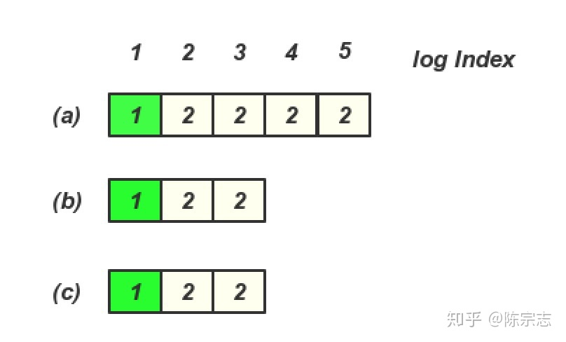


然后 (a) 节点宕机, 这个时候client 是查询不到 Log entry 4, 5 里面的内容


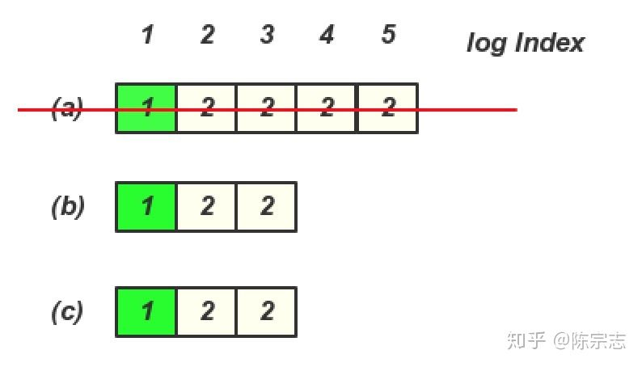


在(b)或(c) 成为Leader 期间, 没有写入任何内容, 然后(a) 又恢复, 并且又重新选主, 那么就存在一下日志, 这个时候client 再查询就查询到Log entry 4,5 里面的内容了


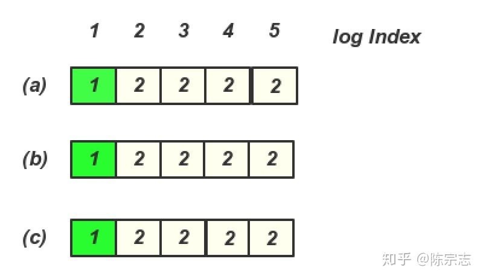


那么Raft 里面加入了新Leader 必须写入一条当前Term 的Log Entry 就可以解决这个问题, 其实和之前郁白提到的写入一个StartWorking 日志是一样的做法, 由于(b), (c) 有一个Term 3的日志, 就算(a) 节点恢复过来, 也无法成了Leader, 那么后续的读也就不会读到Log Entry 4, 5 里面的内容


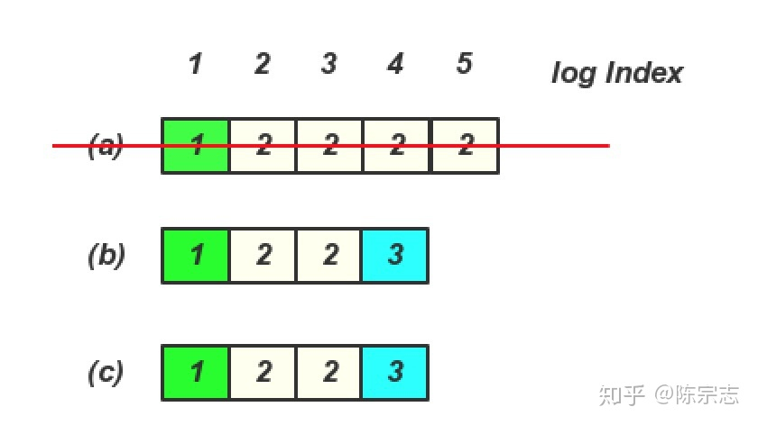


**那么这个问题的本质是什么呢?**

其实这个问题的本质是对于一致性协议在recovery 的不同做法产生的. 关于一致性协议在不同阶段的做法可以看这个文章 [http://baotiao.github.io/2018/01/02/consensus-recovery/](https://link.zhihu.com/?target=http%3A//baotiao.github.io/2018/01/02/consensus-recovery/)


也就是说对于一个在多副本里面未达成一致的Log entry, 在Recovery 需要如何处理这一部分未达成一致的log entry.

对于这一部分log entry 其实可以是提交, 也可以是不提交, 因为会产生这样的log entry, 一定是之前对于这个client 的请求超时返回了.

常见的Multi-Paxos 在对这一部分日志进行重确认的时候, 默认是将这部分的内容提交的, 也就是通过重确认的过程默认去提交这些内容

而Raft 的实现是默认对这部分的内容是不提交的, 也就是增加了一个当前Term 的空的Entry, 来把之前leader 多余的log 默认不提交了, 幽灵复现里面其实也是通过增加一个空的当前Leader 的Proposal ID 来把之前的Log Entry 默认不提交


所以这个问题只是对于返回超时, 未达成一致的Log entry 的不同的处理方法造成的.

在默认去提交这些日志的场景, 在写入超时以后读取不到内容, 但是通过recovery 以后又能够读取到这个内容, 就产生了幽灵复现的问题

但是其实之所以会出现幽灵复现的问题是因为在有了一个超时的第三态的请求以后, 在没有处理好这个第三态请求之前, 出现成功和失败都是有可能的.

所以本质是在Multi-Paxos 实现中, 在recovery 阶段, 将未达成一致的Log entry 提交造成的幽灵复现的问题, 本质是没有处理好这个第三态的请求.

## Raft

### Raft

Raft协议中有三种角色：

l Leader：在通常情况下，系统中只有一个leader，并且其余都是follower

l Candidate：当在election timeout之后，Follower转换为Candidate，发起vote请求

l Follower：被动，不会发送任何请求，只是简单响应来自Candidate或者Leader的请求，Leader负责处理所有请求，如果有client连接到Follower,follower会重定向连接至Leader

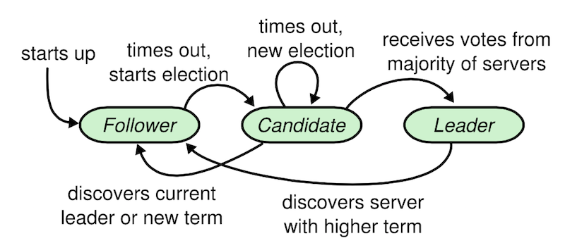

6.1 三个子问题

**领导人选举**

当前的领导人宕机的时候，一个新的领导人需要被选举出来；raft 算法使用随机选举超时的方法来确保很少会发生选票瓜分的情况。同时，投票人会拒绝掉那些日志没有自己新的投票请求，保证候选人包含了所有已经提交（多数派已拥有）的日志条目。

Raft采用心跳机制触发Leader选举。当系统启动时，所有节点初始化为Follower状态，设置任期为0，并启动计时器，计时器超时后，Follower节点转化为Candidate节点，一旦转化为Candidate节点，立即开始以下几件事情：

1. 增加自己的任期数

2. 启动一个新的计时器

3. 给自己投一票

4. 向所有其他节点发送RequestVote RPC请求，并等待其他节点回复。

如果在计时器超时前接收到多数节点的同意投票，则转换为Leader。如果接受到其他节点的AppendEntries心跳RPC，说明其他节点已经被选为Leader, 则转换为Follower。如果计时器超时时还没有接受到以上两种信息中的任何一种，则重复步骤1-4，进行新的选举。

节点在接受到多数节点的投票成为Leader后，会立即向所有节点发送AppendEntries 心跳RPC。所有Candidate收到心跳RPC后，转换为Follower，选举结束。

任何节点都可以发起选举，都能成为Candidate,但是安全性规则对那些Candidate能成为Leader进行了约束，仅有其Log包含了所有已提交的操作命令的那些Candidate才能成为新的Leader。

**日志复制**

领导人必须从客户端接收日志然后复制到集群中的其他节点，并且强制要求其他节点的日志保持和自己相同；日志由有序序号标记的条目组成，每个条目都包含创建时的任期号，和一个状态机需要执行的指令。注意，日志不允许空洞。日志复制需要满足日志匹配原则，即把新日志条目紧接着之前的条目的索引和任期号包含在里面，如果follower没有找到对应的日志，则拒绝新条目，领导者接收到失败返回，会找到follower与它一致的地方，删除之后不一致的日志并将自己条目发送给follower。

一旦领导人创建的一个条目复制到了大多数服务器上，这个条目就是可被提交的，Raft保证可被提交的日志条目时持久化且最终会被应用到所有的状态机执行。领导人跟踪记录他所知道的已提交条目的最大索引值，并且这个索引值会包含在之后的AppendEntries RPC（包括心跳），这样其他追随者都知道这个条目已经提交，那么追随者就可以将该条目应用至本地状态机。

**安全性**

在 Raft 中关键的安全性属性是状态机安全性：如果有任何的服务器节点已经应用了一个确定的日志项到它的状态机中，那么其他服务器节点不能在同一个日志索引位置应用一个不同的指令。

选举限制：只有拥有最新已提交日志的候选者才能赢得选举。Raft通过比较日志的任期号和索引来决定哪个日志更新。若任期号不同，任期号大的更新；若任期号相同，更长的日志更新。

提交之前任期的日志条目：Raft使用间接提交的方式。防止一条存储在大多数服务器上的日志条目仍然被新上任的领导覆盖了。

#### 问题

**1）选举过程讲一下？任何节点都可以发起选举吗？**

Raft采用心跳机制来触发领导者选举，当整个系统启动时，所有服务器处于Follower状态，经过一段时间（选举超时时间）没有接收到任何心跳信息，则认为领导者已经不复存在，便可以启动领导者选举；选举开始前，Follower增加其Term号并转入Candidate状态，然后向集群内其他服务发出选举消息，赢得多数选票则成为Leader；对于Follower来说，如果收到多个相同的Term,仅能向一个投票，对于Canditate来说，如果收到的Term大于自身，则自降为Follower,否则拒绝承认领导者并维持Candidate状态，leader任期间通过周期性的发送心跳宣告自己的领导者地位。

任何节点都可以发起选举，都能成为Candidate,但是安全性规则对那些Candidate能成为Leader进行了约束，仅有其Log包含了所有已提交的操作命令的那些Candidate才能成为新的Leader。

**2）Raft的幽灵复现?**

**3）Paxos和Raft的区别？**

l 将Paxos的P2P模式改造成为了Master-Slave，减低复杂度

l Raft的leader有限制，拥有最新日子的节点才能成为leader;

l 日志按顺序复制，不允许有空洞

l 每一个任期有Term号

**4）Raft的集群出现分区时，少数派的节点由于接收不到leader心跳，不停发起选举又得不到多数派投票，term++，重新加入集群后会带来什么影响？**

为了解决上述问题，节点在正式发起投票前加入一个Prevote请求用于确认是否可获得足够选票，确认后才会把自己的term增加，然后发起真正的投票。其他投票节点同意发起选举的条件是（同时满足下面两个条件）：

l 没有收到有效领导的心跳，至少有一次选举超时。

l Candidate的日志足够新（Term更大，或者Term相同raft index更大）。

PreVote算法解决了网络分区节点在重新加入时，会中断集群的问题。在PreVote算法中，网络分区节点由于无法获得大部分节点的许可，因此无法增加其Term。然后当它重新加入集群时，它仍然无法递增其Term，因为其他服务器将一直收到来自Leader节点的定期心跳信息。一旦该服务器从领导者接收到心跳，它将返回到Follower状态，Term和Leader一致。

### Parallel Raft


**Parallel  Raft 就是 Raft 框架下的 Multi-Paxos [1]。Parallel Raft 通过借鉴 Multi-Paxos（1）乱序确认（2）乱序提交 实现日志复制的性能优化；通过 Raft 大框架保证协议正确性，并根据实际应用场景实现（3）乱序 Apply。**没有颠覆任何理论上的东西，但在工程实现上确实很强。


Parallel Raft 核心就是借鉴了 Multi-Paxos 允许**日志空洞**的特性来解决 Raft 顺序确认和提交**可能**会存在的性能问题。如下图【2】，就是 Raft 和 Multi-Paxos 日志的复制：


图的上半部分为 Raft 的日志复制，典型的顺序确认和提交，下半部分为 Multi-Paxos 的日志复制，**（1）乱序确认**和**（2）乱序提交**（其中黄色的为已经 leader 已经确认 commit 的日志），这里尤其需要注意的是 **Raft 和 Multi-paxos 中提交 commit 的含义是不一样的：**在 Raft 中，commit 的日志就可以 apply，但是 Multi-Paxos 中并不行，以图下半部分的 Multi-paxos  Log 的 acceptor 2 为例，尽管 index=8 的 log 已经 commit 了，但是它并不能 apply，因为其前面还存在空洞，实际上在 multi-paxos 中只有 <= commit index 的 log 才能被 apply，图中 Leader，acceptor 1，acceptor 2 的 commit index 分别为 10，7 和 6。实际上看到这里，你会发现 Multi-paxos 这种允许日志空洞的日志复制是不是很像网络里面的滑动窗口。


日志空洞虽好，但也不是无条件的，一旦 leader 挂了，重启，就需要解决这些空洞的日志，因为 new leader 上面很多日志的状态都是**模拟两可**的，所以 new leader 在提交自己日志之前，需要通过对 commit index 之后的所有日志走一遍完整的 basic paxos 来确定每一条日志之后，并通过提交自己的日志（推进 commit index）来实现**隐式提交**非自己任期的日志，其实这个过程就是 Parallel Raft 里面的 Merge 过程，保证协议的 **Leader Completeness** 特性。所有状态机框架下的一致性协议都需要 new leader 开始服务之前处理模棱两可的日志，保证 Leader Completeness，这里就不展开了，详细可以参考之前的一篇文章 [一致性协议中的“幽灵复现”](https://zhuanlan.zhihu.com/p/47025699)。


还剩下最后一点**（3）乱序 apply**

 观点，通用的共识算法是不可能感知乱序 apply 的，这其实就是一个应用层面的问题，这个锅真不该给 Raft 背，实际上 Multi-paxos 也不能乱序 apply，准确的说，复制状态机框架下的通用共识算法，肯定是不感知乱序 apply 的。Parallel Raft 的思路其实很简单，就是在 log 中记录了应用层日志之间的依赖关系，而 apply 本身是应用层的一个逻辑，所以再加上乱序 commit，就可以实现真正的提前乱序 apply 了，这个算是应用层的一个优化，乱序 apply 其实并不难，任何应用，都可以根据自己的业务场景在 log entry 中加入一些必要的信息是实现不依赖的 Log entry 的乱序 apply。

Parallel Raft 在整个 Raft 框架下去做优化，正确性其实更容易被论证，毕竟 Paxos 实现是那么难，而 Multi-Paxos 连一份完整公认的论文描述都没有。

相比 Parallel Raft 来说，原生的 Raft 也可以实现乱序确认，和一定程度上应用感知的乱序 apply，唯一没有的就是乱序 commit，和乱序commit 下的乱序 Apply，但是 Raft 在 batch，pipeline 和 多复制组增加并发等优化下，性能其实并不会差。

### 加Lease Raft

**问题：**
 当 raft group 发生脑裂的情况下，老的 raft leader 可能在一段时间内并不知道新的 leader 已经被选举出来，这时候客户端在老的 leader 上可能会读取出陈旧的数据（stale read）。
 比如，我们假想一个拥有 5 个节点的 raft group:

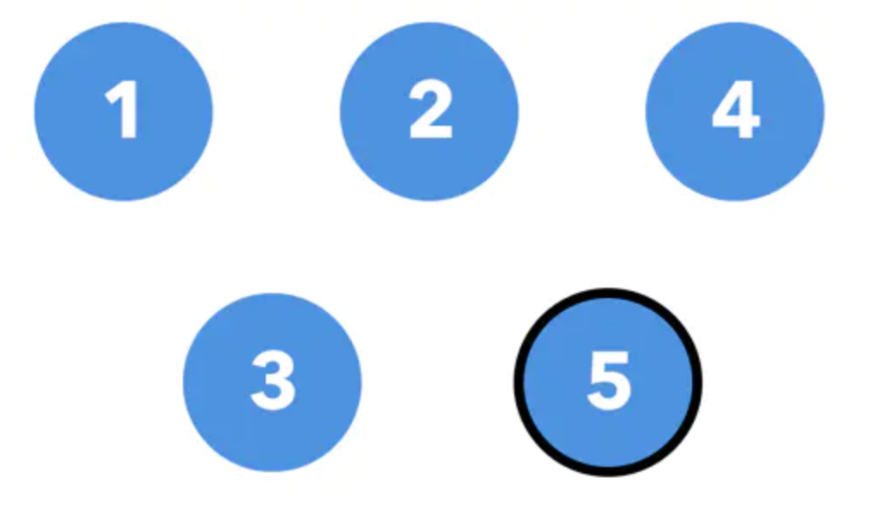

其中 Node 5 是当前的 raft leader，当出现网络分区时，在 Node 5 的 raft lease 任期还没结束的一段时间内，Node 5 仍然认为自己是当前 term 的 leader，但是此时，另外一边分区已经在新的 term 中选出了新的 leader。

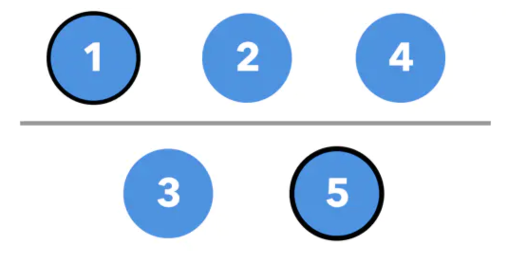

如果此时，客户端在新的 leader 上更新了某个值 x，此时是可以更新成功的（因为还是可以复制到多数派）。但是在分区的另一端，此时一个客户端去读取 x 的值，Node 5 还会返回老的值，这样就发生了 stale read。


**解决方案**

引入一个新的概念, region leader。region leader 是一个逻辑上的概念, 任意时刻对于某一个 region 来说, 一定只拥有一个 region leader, 每个 region leader 在任期之内尝试每隔 t 时间间隔, 在 raft group 内部更新一下 region leader 的 lease. 所有的读写请求都必须通过 region leader 完成，
 但是值得注意的是， region leader 和 raft leader 可能不是一个节点，当 region leader 和 raft leader 不重合的时候，region leader 会将请求转发给当前的 raft leader，当网络出现分区时，会出现以下几种情况：

1. region leader 落在多数派，老 raft leader 在多数派这边
2. region leader 落在多数派，老 raft leader 在少数派这边
3. region leader 落在少数派，老 raft leader 在多数派这边
4. region leader 落在少数派，老 raft leader 在少数派这边

用开篇的例子来分情况讨论：

对于第一种情况，region leader 的 lease 不会过期，因为 region leader 的心跳仍然能更新到多数派的节点上，老的 raft leader 仍然能同步到大多数节点上，少数派这边也不会选举出新的 leader， 这种情况下不会出现 stale read。

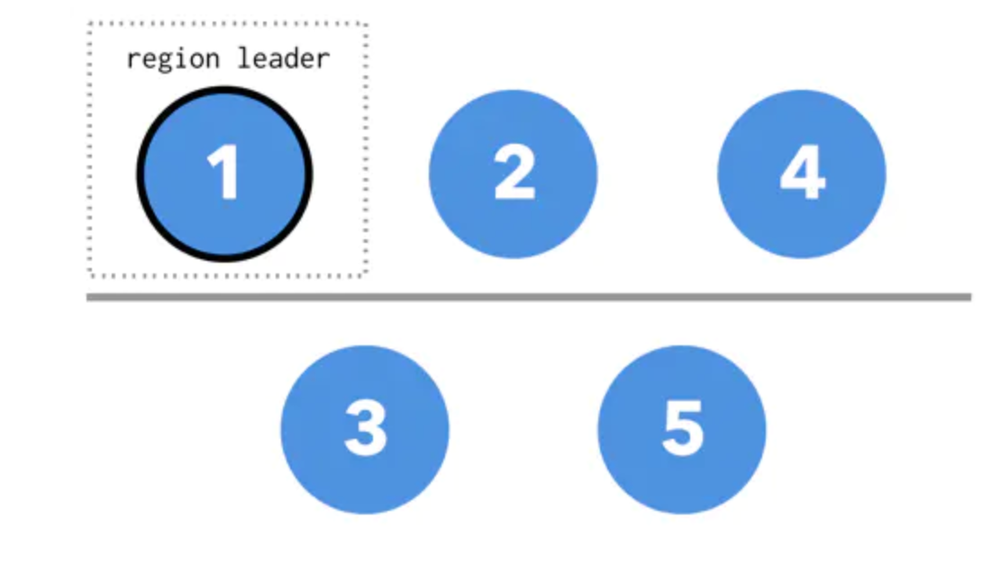

第二种情况，就是开篇提到会出现 stale read 的典型情况，老的 raft leader 被分到了少数派这边，多数派这边选举出了新的 raft leader ，如果此时的 region leader 在多数派这边。

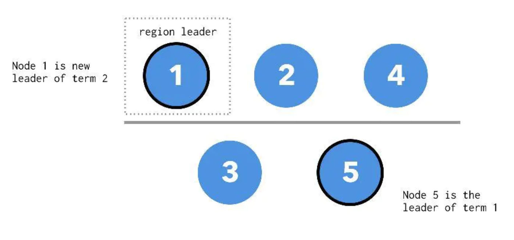

因为所有的读写请求都会找到 region leader 进行，即使在原来没有出现网络分区的情况下，客户端的请求也都是要走 node 1 ，经由 node 1 转发给 node 5，客户端不会直接访问 node 5，所以此时即使网络出现分区，新 leader 也正好在多数派这边，读写直接就打到 node 1 上，皆大欢喜，没有 stale read。

第三种情况，region leader 落在少数派这边，老 raft leader 在多数派这边，这种情况客户端的请求找到 region leader，他发现的无法联系到 leader（因为在少数派这边没有办法选举出新的 leader），请求会失败，直到本次 region leader 的 lease 过期，同时新的 region leader 会在多数派那边产生（因为新的 region leader 需要尝试走一遍 raft 流程）。因为老的 region leader 没办法成功的写入，所以也不会出现 stale read。但是付出的代价是在 region leader lease 期间的系统的可用性。

第四种情况和第三种情况类似，多数派这边会产生新的 raft leader 和 region leader。

总体来说，这种方法牺牲了一定的可用性（在脑裂时部分客户端的可用性）换取了一致性的保证。

### 实现

```
Raft_part1——领导人选举
在这一部分，有关日志复制的部分暂时不会被实现，留到第二部分

框架
Raft这个结构体是每一个服务器持有一个的，作为状态机存在
在这个实验中只有两个RPC，一个是请求投票的ReqestVote，另一个是修改日志(附带心跳)的AppendEntries
每个服务器的功能都一样，只是状态不同而已，状态只能是跟随者、候选人或者领导者的其中一个
每个服务器通过RPC调用sendXXX函数来调用其他服务器的XXX函数
实现步骤
首先根据论文完善Raft结构体中必要的成员
type Raft struct {
	mu        sync.Mutex
	peers     []*labrpc.ClientEnd
	persister *Persister
	me        int // index into peers[]

	// 当前服务器状态
	state int
	// 候选人获得的票数
	voteAcquired int
	// 传播心跳的通道
	heartbeatCh chan interface{}
	// 当候选人赢得了选举就会利用这个通道传送消息
	leaderCh chan interface{}

	/*
	 * 全部服务器上面的可持久化状态:
	 *  currentTerm 	服务器看到的最近Term(第一次启动的时候为0,后面单调递增)
	 *  votedFor     	当前Term收到的投票候选 (如果没有就为null)
	 */
	currentTerm int
	votedFor int
}
每个服务器只可能存在一下三个状态之一：

const (
	STATE_FLLOWER = 0
	STATE_CANDIDATE = 1
	STATE_LEADER = 2
)
继续根据论文完善在RPC之间传递和返回的参数一些结构体
选举相关
type RequestVoteArgs struct {
	// 候选人的term
	Term int
	// 候选人在节点数组中的下标
	CandidateId int
}

type RequestVoteReply struct {
	// currnetTerm，用来给候选人更新term
	Term int
	// true就说明候选人得到了选票
	VoteGranted bool
}
复制日志相关
type AppendEntriesArgs struct {
	// 领导人的term
	Term int
	// 领导人所在的下标
	LeaderId int
}

type AppendEntriesReply struct {
	// currentTerm，用来给领导人更新term
	Term int
	// true，说明和跟随者的日志匹配
	Success bool
}
这一部分的重头戏，实现Make()方法
func Make(peers []*labrpc.ClientEnd, me int,
	persister *Persister, applyCh chan ApplyMsg) *Raft {
	rf := &Raft{}
	rf.peers = peers
	rf.persister = persister
	rf.me = me

	// 初始化
	rf.state = STATE_FLLOWER
	rf.votedFor = -1
	rf.currentTerm = 0
	rf.heartbeatCh = make(chan interface{})
	rf.leaderCh = make(chan interface{})

	// initialize from state persisted before a crash
	rf.readPersist(persister.ReadRaftState())

	// 状态机循环
	go func() {
		for {
			switch rf.state {
			case STATE_FLLOWER:
				select {
				// 接收到心跳或者超时就变为候选者
				case <- rf.heartbeatCh:
				case <- time.After(time.Duration(rand.Int63() % 333 + 550) * time.Millisecond):
					rf.state = STATE_CANDIDATE
				}	

			case STATE_LEADER:
				// 如果是领导人就执行复制日志(携带心跳)的操作
				rf.broadcastAppendEntries()
				time.Sleep(50 * time.Millisecond)

			case STATE_CANDIDATE:
				// 候选人要准备投票选举
				rf.mu.Lock()
				rf.currentTerm++
				// 先投给自己一票
				rf.votedFor = rf.me
				rf.voteAcquired = 1
				rf.mu.Unlock()
				go rf.broadcastRequestVote()
				select {
				// 超时或者接收到心跳(其他节点先成为领导人)就变为跟随者
				case <- time.After(time.Duration(rand.Int63() % 333 + 550) * time.Millisecond):
				case <- rf.heartbeatCh:
					rf.state = STATE_FLLOWER	
				// 从leaderCh通道接收到消息说明赢得选举，成为领导人
				case <- rf.leaderCh:
					rf.state = STATE_LEADER
				}	
			}
		}
	}()

	return rf
}
实现在第3步中使用却没实现的两个操作：领导人选举和日志复制
领导人选举
下面这个是RPC函数，用来给候选人调用的，然后在每个服务器执行

func (rf *Raft) RequestVote(args RequestVoteArgs, reply *RequestVoteReply) {
	// Your code here.
	rf.mu.Lock()
	defer rf.mu.Unlock()

	reply.Term = rf.currentTerm

	// 如果候选人的term比自己的还小，则不给该候选人投票
	if args.Term < rf.currentTerm {
		reply.VoteGranted = false
		return
	} else if args.Term > rf.currentTerm {
		rf.currentTerm = args.Term
		rf.state = STATE_FLLOWER
		reply.VoteGranted = true
	}
}
func (rf *Raft) sendRequestVote(server int, args RequestVoteArgs, reply *RequestVoteReply) bool {
	// 调用RPC
	ok := rf.peers[server].Call("Raft.RequestVote", args, reply)

	rf.mu.Lock()
	defer rf.mu.Unlock()

	if ok {
		term := rf.currentTerm
		if rf.state != STATE_CANDIDATE {
			return ok
		} else if args.Term != term {
			return ok
		}

		// 更新自己的term
		if reply.Term > term {
			rf.currentTerm = reply.Term
			rf.state = STATE_FLLOWER
			rf.votedFor = -1
		}

		// 统计选票
		if reply.VoteGranted == true {
			rf.voteAcquired++
			if rf.voteAcquired > len(rf.peers)/2 {
				rf.state = STATE_FLLOWER
				rf.leaderCh <- true
			}
		}
	}

	return ok
}

func (rf *Raft) broadcastRequestVote() {
	// 遍历整个Raft服务器数组，执行领导人选举
	for i := range rf.peers {
		if i != rf.me {	
			// 初始化要传给RPC调用的函数参数
			var args RequestVoteArgs
			args.Term = rf.currentTerm
			args.CandidateId = rf.me

			go func(i int) {
				var reply RequestVoteReply
				rf.sendRequestVote(i, args, &reply)
			}(i)
		}
	}
}
复制日志(在这一部分只实现简单的心跳)
下面这个是RPC函数，用来给候领导人调用的，然后在每个服务器执行

func (rf *Raft) AppendEntries(args AppendEntriesArgs, reply *AppendEntriesReply) {
	rf.mu.Lock()
	defer rf.mu.Unlock()

	rf.heartbeatCh <- struct{}{}
}
有了之前实现的投票，类似地实现日志复制

func (rf *Raft) sendAppendEntries(server int, args AppendEntriesArgs, reply *AppendEntriesReply) bool {
	ok := rf.peers[server].Call("Raft.AppendEntries", args, reply)
	rf.mu.Lock()
	defer rf.mu.Unlock()

	if ok {
		if rf.state != STATE_LEADER {
			return ok
		} else if args.Term != rf.currentTerm {
			return ok
		}

		// 更新自己的term
		if reply.Term > rf.currentTerm {
			rf.currentTerm = reply.Term
			rf.state = STATE_FLLOWER
			rf.votedFor = -1
			return ok
		}
	}

	return ok
}

func (rf *Raft) broadcastAppendEntries() {
	for i := range rf.peers {
		if i != rf.me && rf.state == STATE_LEADER {
			// 参数初始化
			var args AppendEntriesArgs
			args.Term = rf.currentTerm
			args.LeaderId = rf.me

			go func(i int, args AppendEntriesArgs) {
				var reply AppendEntriesReply
				rf.sendAppendEntries(i, args, &reply)
			}(i, args)
		}
	}
}
测试
只能通过前两个测试点

$ go test
go test
Test: initial election ...
  ... Passed
Test: election after network failure ...
  ... Passed
Test: basic agreement ...
^Csignal: interrupt
FAIL	raft	12.131s
raft_part2——日志的复制
调试错误
怎么也通不过第三个测试basic agreement？ 这个错误找了很久，我以为问题是出在日志复制部分，但是怎么也排查不出来。
最后再重新看整个代码，发现Start()函数这里没修改，因为这个函数是与’客户‘通信的通道，如果是leader就要添加指令

func (rf *Raft) Start(command interface{}) (int, int, bool) {
	rf.mu.Lock()
	defer rf.mu.Unlock()

	index := -1
	term := rf.currentTerm
	isLeader := rf.state == STATE_LEADER

	if isLeader == true {
		index = rf.getLastIndex() + 1
		rf.log = append(rf.log, LogEntry{LogTerm: term, LogCmd: command})
	}
	return index, term, isLeader
}
```


## 过滤器

### Bloom Filter

### Cuckoo Filter

## Quorum

当需要修改数据时，就需要更新**所有**的副本数据，这样才能保证数据的一致性（Consistency）。因此，就需要在 C(Consistency) 和 A(Availability) 之间权衡。

而Quorum机制，就是这样的一种权衡机制，一种将“读写转化”的模型。在介绍Quorum之前，先看一个极端的情况：WARO机制

WARO(Write All Read one)是一种简单的副本控制协议，当Client请求向某副本写数据时(更新数据)，只有当所有的副本都更新成功之后，这次写操作才算成功，否则视为失败。

从这里可以看出两点：①写操作很脆弱，因为只要有一个副本更新失败，此次写操作就视为失败了。②读操作很简单，因为，所有的副本更新成功，才视为更新成功，从而保证所有的副本一致。这样，只需要读任何一个副本上的数据即可。**假设有N个副本，N-1个都宕机了，剩下的那个副本仍能提供读服务；但是只要有一个副本宕机了，写服务就不会成功。**

WARO牺牲了更新服务的可用性，最大程度地增强了读服务的可用性。而Quorum就是更新服务和读服务之间进行一个折衷。

Quorum机制是“抽屉原理”的一个应用。定义如下：假设有N个副本，更新操作wi 在W个副本中更新成功之后，才认为此次更新操作wi 成功。称成功提交的更新操作对应的数据为：“成功提交的数据”。对于读操作而言，至少需要读R个副本才能读到此次更新的数据。**其中，W+R>N ，即W和R有重叠。**一般，W+R=N+1。


假设系统中有5个副本，W=3，R=3。初始时数据为(V1，V1，V1，V1，V1）--成功提交的版本号为1，当某次更新操作在3个副本上成功后，就认为此次更新操作成功。数据变成：(V2，V2，V2，V1，V1）--成功提交后，版本号变成2，因此，最多只需要读3个副本，一定能够读到V2(此次更新成功的数据)。而在后台，可对剩余的V1 同步到V2，而不需要让Client知道。

**Quorum机制分析**

Quorum机制无法保证强一致性

所谓强一致性就是：任何时刻任何用户或节点都可以读到**最近一次成功提交的副本数据**。强一致性是程度最高的一致性要求，也是实践中最难以实现的一致性。

因为，仅仅通过Quorum机制无法确定最新已经成功提交的版本号。

比如，上面的V2 成功提交后（已经写入W=3份），尽管读取3个副本时一定能读到V2，如果刚好读到的是(V2，V2，V2），则此次读取的数据是最新成功提交的数据，因为W=3，而此时刚好读到了3份V2。如果读到的是（V2，V1，V1），则无法确定是一个成功提交的版本，还需要继续再读，直到读到V2的达到3份为止，这时才能确定V2 就是已经成功提交的最新的数据。

如何读取最新的数据？---在已经知道最近成功提交的数据版本号的前提下，最多读R个副本就可以读到最新的数据了。

如何确定 最高版本号 的数据是一个成功提交的数据？---继续读其他的副本，直到读到的 最高版本号副本 出现了W次。

基于Quorum机制选择 primary

中心节点(服务器)读取R个副本，**选择R个副本中版本号最高的副本作为新的primary**。

新选出的primary**不能**立即提供服务，还需要与至少与W个副本*完成同步*后，才能提供服务---为了保证Quorum机制的规则：W+R>N

至于如何处理同步过程中冲突的数据，则需要视情况而定。

比如，(V2，V2，V1，V1，V1），R=3，如果读取的3个副本是：(V1，V1，V1)则高版本的 V2需要丢弃。

如果读取的3个副本是（V2，V1，V1），则低版本的V1需要同步到V2。

**Quorum机制应用实例**

**HDFS高可用性实现**

HDFS的运行依赖于NameNode，如果NameNode挂了，那么整个HDFS就用不了了，因此就存在单点故障(single point of failure)；其次，如果需要升级或者维护停止NameNode，整个HDFS也用不了。为了解决这个问题，采用了QJM机制(Quorum Journal Manager)实现HDFS的HA（High Availability）。

为了实现HA，需要两台NameNode机器，一台是Active NameNode，负责Client请求。另一台是StandBy NameNode，负责与Active NameNode**同步数据**，从而快速 failover。

那么，这里就有个问题，StandBy NameNode是如何同步Active NameNode上的数据的呢？主要同步是哪些数据呢？

数据同步就用到了Quorum机制。同步的数据 主要是[EditLog](https://link.zhihu.com/?target=http%3A//blog.cloudera.com/blog/2014/03/a-guide-to-checkpointing-in-hadoop/)。

数据同步用到了一个第三方”集群“：Journal Nodes。Active NameNode 和 StandBy NameNode 都与JournalNodes通信，从而实现同步。

每次 NameNode 写 EditLog 的时候，除了向本地磁盘写入 EditLog 之外，也会并行地向 JournalNode 集群之中的每一个 JournalNode 发送写请求，只要大多数 (majority) 的 JournalNode 节点返回成功就认为向 JournalNode 集群写入 EditLog 成功。如果有 2N+1 台 JournalNode，那么根据大多数的原则，最多可以容忍有 N 台 JournalNode 节点挂掉。

**这就是：Quorum机制。每次写入JournalNode的机器数目达到大多数(W)时，就认为本次写操作成功了。**

这样，每次对Active NameNode中的元数据进行修改时，都会将该修改写入JournalNode集群的大多数机器中，才认为此次修改成功。

当Active NameNode宕机时，StandBy NameNode 向JournalNode同步EditLog，从而保证了HA。

Active NameNode 向 JournalNode 集群提交 EditLog 是同步的

但 Standby NameNode 采用的是定时从 JournalNode 集群上同步 EditLog 的方式，那么 Standby NameNode 内存中文件系统镜像有很大的可能是落后于 Active NameNode 的，

所以 Standby NameNode 在转换为 Active NameNode 的时候需要把落后的 EditLog 补上来。

此外，为了**实现快速failover**，StandBy NameNode 需要实时地与各个DataNode通信以获得每个**数据块的地址**信息。因为每个数据块的地址信息不属于“元信息”，并没有保存在 FsImage、CheckPoint...，这是因为地址信息变化比较大。比如说，一台DataNode下线了，其上面的数据块地址信息就全无效了，而且为了达到指定的数据块“复制因子”，还需要在其他机器上复制该数据块。

而快速failover，是指Active NameNode宕机后，StandBy NameNode立即就能提供服务。因此，DataNode也需要实时向 StandBy NameNode 发送 block report

另外，还有手动failover 和 自动 failover，自动failover需要Zookeeper的支持。

**如何避免“Split Brain”(脑裂)问题？**

Split Brain 是指在同一时刻有两个认为自己处于 Active 状态的 NameNode。

简单地理解如下：每个NameNode 与 JournalNodes通信时，需要带一个 epoch numbers(epoch numbers 是唯一的且只增不减)。而每个JournalNode 都有一个本地的promised epoch。拥有值大的epoch numbers 的NameNode会使得JournalNode提升自己的 promised epoch，从而占大多数，而epoch numbers较小的那个NameNode就成了少数派(Paxos协议思想)。

从而**epoch number值大的NameNode才是真正的Active NameNode**，拥有写JournalNode的权限。注意：（任何时刻只允许一个NameNode拥有写JournalNode权限） 。

## Gossip


## 一致性Hash && chord


## 2PC&&3PC

缺点：2PC的缺点也很致命：同步阻塞，单点问题，数据不一致，太过保守

  1、同步阻塞问题。执行过程中，所有参与节点都是**事务阻塞型**的。当参与者占有公共资源时，其他**第三方节点访问公共资源处于阻塞状态**，各个参与者在等待协调者发出提交或中断请求时，会一直阻塞，而协调者的发出时间要依赖于所有参与者的响应时间，如果协调者宕机了（单点），那么他就一直阻塞在这，而且无法达成一致（3PC引入了超时提交解决）。（**准备阶段**，事务执行后必须锁定相关资源直到正式提交）

  2、单点故障。由于协调者的重要性，一旦**协调者发生故障**，**参与者会一直阻塞**下去。尤其在第二阶段，协调者发生故障，那么所有的参与者还都处于锁定事务资源的状态中，而无法继续完成事务操作。（如果是协调者挂掉，可以重新选举一个协调者，但是无法解决因为协调者宕机导致的参与者处于阻塞状态的问题）

  3、**数据不一致**。出现分区，或者网络故障。在**提交阶段**，当协调者向参与者发送commit请求之后，发生了局部网络异常或者在发送commit请求过程中协调者发生了故障，这导致只有一部分参与者接受到了commit请求。而在这部分参与者接到commit请求之后就会执行commit操作。但是其他部分未接到commit请求的机器则无法执行事务提交。于是整个分布式系统便出现了数据不一致性的现象。

  4、太过保守：2pc**没有**设计相应的**容错机制**，当任意一个参与者节点宕机，那么协调者超时没收到响应，就会导致整个事务回滚失败。

  5、二阶段无法解决的问题：协调者（在第二阶段）发出commit消息之后宕机，而**唯一接收到这条消息的参与者**同时**也宕机**了。那么即使协调者通过选举协议产生了新的协调者，这条事务的状态也是不确定的，没人知道事务是否被已经提交。

**1）** **讲一下2PC，关注特点，可以提到几个缺点，面试官再追问引出3PC**

2PC是解决分布式事务的常用方法，他可以保证参与分布式事务的所有节点要么都成功提交，要么都终止事务。（保证多个数据分片上事务操作的一致性）

​    … …（简单讲一下两阶段，引出缺点）

但是2PC是一个比较保守的算法，在两阶段过程中，**一旦协调者崩溃**，便会造成**单点问题**，并且**参与节点是事务阻塞型**的，会导致整个算法处于一个完全阻塞的状态，需要做一些优化。除此之外，提交阶段，如果有的进程收到了commit，但是有的进程在超时前都没收到，那么会造成**数据不一致**。

3PC就是基于2PC做了一些改进解决2PC的**单点问题**、**长时间阻塞**（不会锁定资源）问题。它的核心思想就是在2PC的提交阶段再次分为两个阶段：预提交阶段和提交阶段。并引入了**超时机制和互询机制**。

**2）** **讲一下3PC，重点关注3PC克服了2PC哪些问题**

与两阶段提交不同的是，三阶段提交有两个改动点。

l 引入超时机制。同时在协调者和参与者中都引入超时机制。

l 在第一阶段和第二阶段前插入一个准备阶段。

在3PC中，**解决**了2PC的**单点故障问题与长时间阻塞**问题。在can-commit, pre-commit阶段，如果**协调者等待参与者回复超时**，就直接发送ABORT；如果参与者**等待协调者的doCommit超时**，参与者则自主提交。但是，这样的做法没有解决数据不一致的问题。

因为一旦参与者无法及时收到来自协调者的信息之后，他会默认执行commit。而不会一直持有事务资源并处于阻塞状态。

​                                但是这种机制也会导致**数据一致性问题**，**因为**，**由于网络原因，**协调者发送的abort响应没有及时被参与者接收到，那么**参与者在等待超时之后执行了commit操作**。这样就和其他接到abort命令并执行回滚的参与者之间存在数据不一致的情况。）