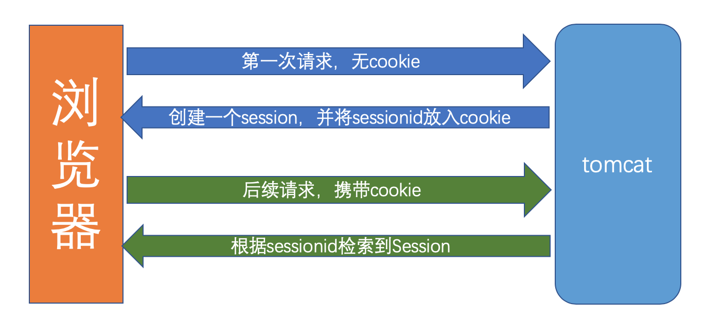

## cookie与session机制

单点登录必备

**Cookie**

1. Cookie是会话存储的键值信息
2. Cookie不可跨域名
3. Cookie有有效期限制
4. path携带Cookie的请求路径(/:表示全部请求)

**Session**

1. Session是服务器端基于内存的缓存技术，用于保存针对每个用户的会话数据

2. 通过sessionID来区分用户，用户只要连接到服务器，服务器就会为之分配一个唯一的sessionID

3. Session也有失效时间

4. Session用法

   > HttpSession session=request.getSession();//取得session
   >
   > sesson.setAttribute(String key,Object value);//将对象存到session中  
   >
   > session.getAttribute(String key);//获取session中存的Object对象  
   >
   > session.removeAttribute(String key);//将键值为key的对象从session中删除

**Cookie与Session的交互**

1、服务器通过response.addCookie(Cookiecookie)向response Header中设置Cookie。

 如:**Set-Cookie:** jsession=08e0456d-afa3-45f3-99ef-a42e2fc977d3; Domain=dev.com; Path=/; 

2、浏览器接受response Header的cookie值并保存。在下次请求的request Header中，携带此cookie信息。

 如：**Cookie:** jsession=08e0456d-afa3-45f3-99ef-a42e2fc977d3

3、sessionid被服务器设置到cookie中，以后浏览器的请求皆携带此sessionid，服务器据此检索对应session

4、当程序请求session时，首先根据cookie中携带的session id检索session（检索不到，会新建一个）



```
1、cookie数据存放在客户的浏览器上，session数据放在服务器上。
2、cookie不是很安全，别人可以分析存放在本地的COOKIE并进行COOKIE欺骗，
	考虑到安全应当使用session。
3、session会在一定时间内保存在服务器上。当访问增多，会比较占用你服务器的性能，
	考虑到减轻服务器性能方面，应当使用COOKIE。
4、单个cookie保存的数据不能超过4K，很多浏览器都限制一个站点最多保存20个cookie。
5、若客户端禁止Cookie：一般使用URL重写，就是把SessionID直接附加到URL后面
```

