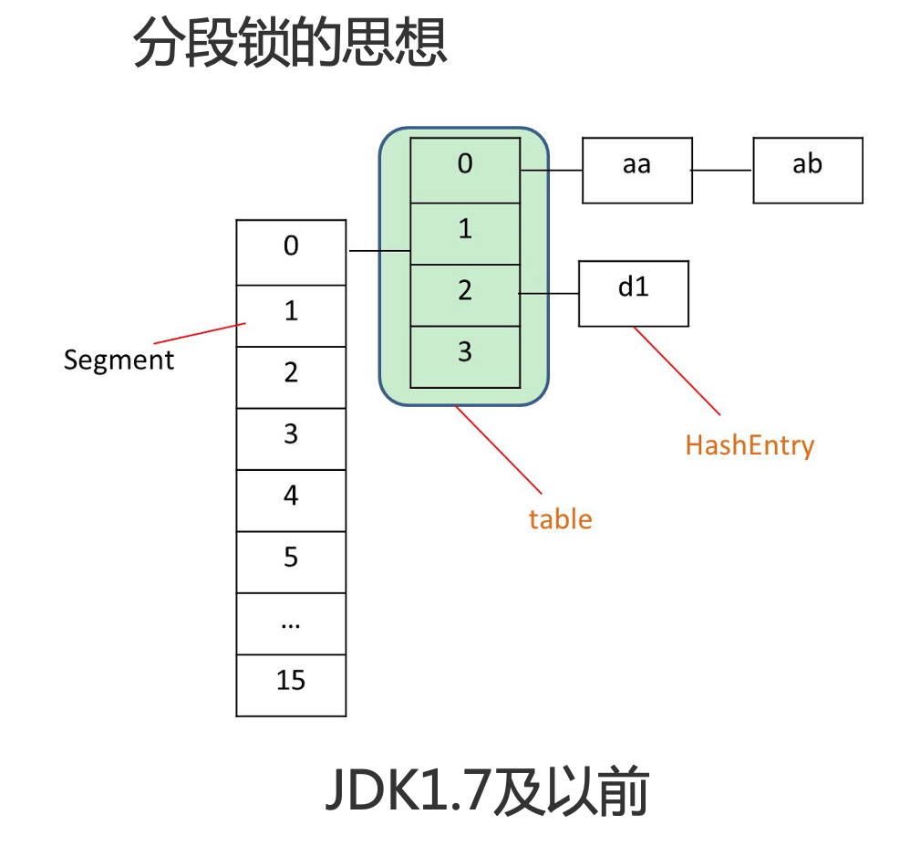
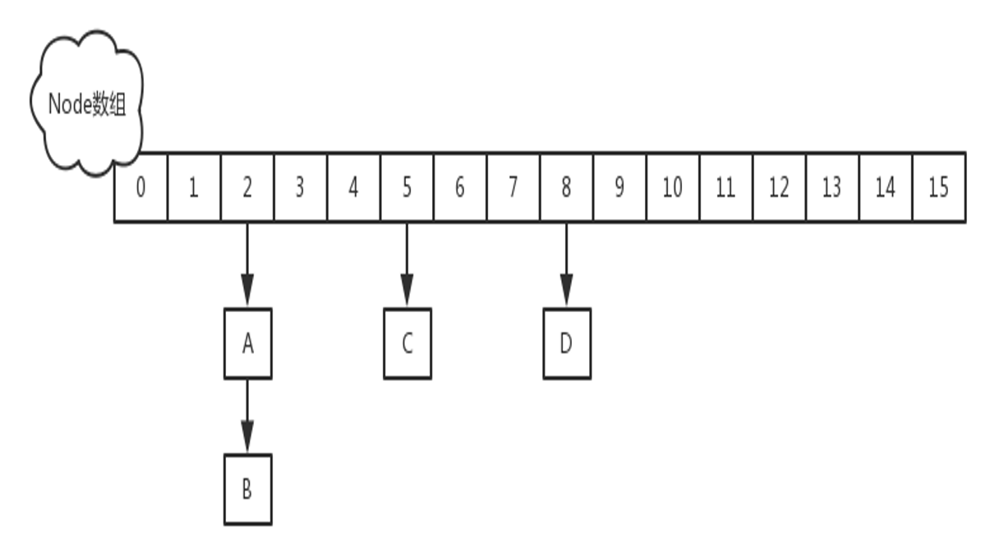

## 相关问题

**未做同步控制时，代码在多线程下是安全吗？**

**HashTable如何实现线程安全?**
 HashTable都进行了加锁，加了synchronized关键字

**为何有了HashTable还要有ConcurrentHashMap?**
当hashtable大小增加到一定的时候，性能会急剧下降，因为迭代的时候需要被锁定很长时间ConcurrentHashMap相比HashTable使用分段锁，不论它变得多么大，仅仅需要锁定map的某个部分，而其它的线程不需要等到迭代完成才能访问map。简而言之，在迭代的过程中，ConcurrentHashMap仅仅锁定map的某个部分，而Hashtable则会锁定整个map。但是HashMap是强一致性，而ConcurrentHashMap是弱一致的。

**ConcurrentHashMap如何实现线程安全?**

分段锁思想

- JDK1.7及以前

- JDK1.8和以后
  

每一个bucket有锁

