垃圾收集器就是内存回收的具体实现。这里讨论的收集器基于JDK 1.7 Update 14之后的HotSpot虚拟机（在这个版本中正式提供了商用的G1收集器，之前G1仍处于实验状态），这个虚拟机包含的所有收集器。

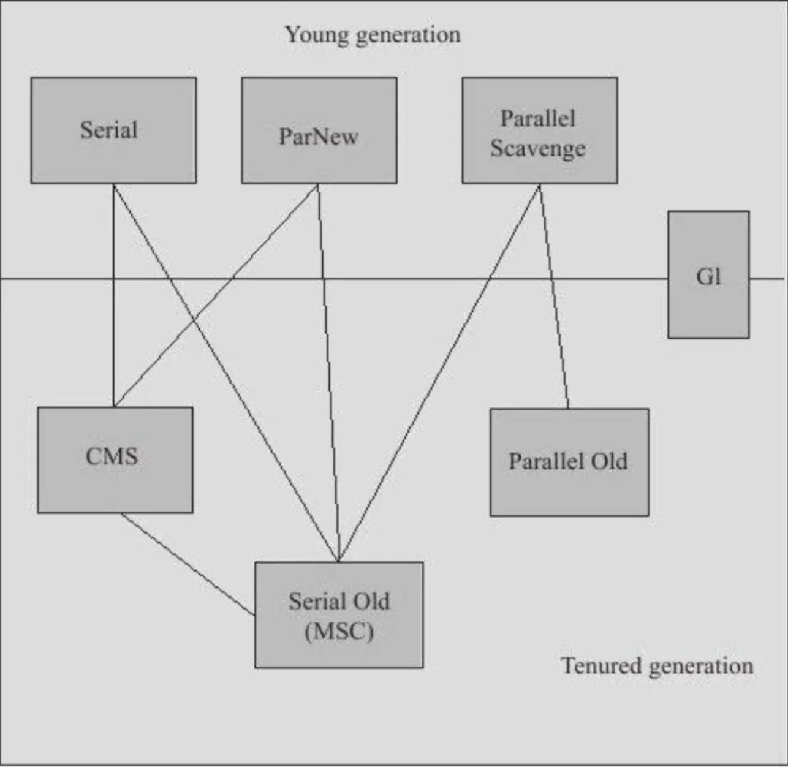

展示了7种作用于不同分代的收集器，如果两个收集器之间存在连线，就说明它们可以搭配使用。虚拟机所处的区域，则表示它是属于新生代收集器还是老年代收集器。


一般来说以下是对应JDK版本的垃圾收集器，绝大多数开发者也不会去重新设置。 jdk1.7 默认垃圾收集器Parallel Scavenge（新生代）+Parallel Old（老年代）

jdk1.8 默认垃圾收集器Parallel Scavenge（新生代）+Parallel Old（老年代）

jdk1.9 默认垃圾收集器G1

如何查看？ cmd执行命令： java -XX:+PrintCommandLineFlags -version

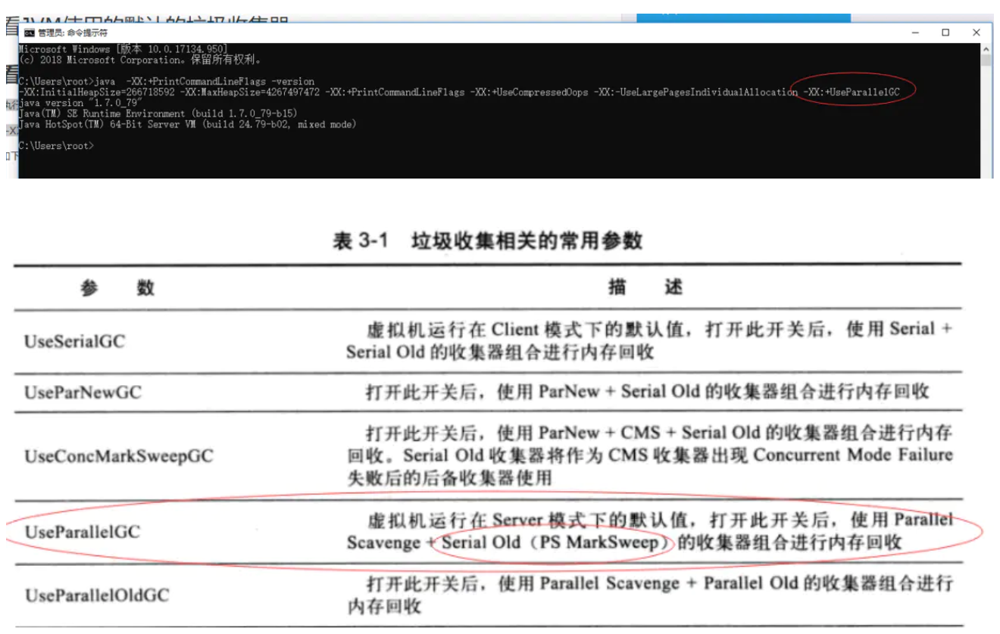

下面来分别对每一个收集器进行一一介绍。

### 1. Serial收集器(jdk1.3之前新生代唯一选择，单线程,Client模式下默认)

Serial收集器是最基本、发展历史最悠久的收集器。这个收集器是一个单线程的收集器，但它的“单线程”的意义并不仅仅说明它只会使用一个CPU或一条收集线程去完成垃圾收集工作，更重要的是在它进行垃圾收集时，必须暂停其他所有的工作线程，直到它收集结束。但这项工作实际上是由虚拟机在后台自动发起和自动完成的，在用户不可见的情况下把用户正常工作的线程全部停掉，这对很多应用来说都是难以接受的。

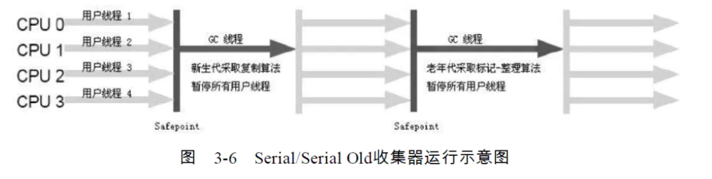

但实际上到现在为止，它依然是虚拟机运行在Client模式下的默认新生代收集器。它也有着优于其他收集器的地方：简单而高效（与其他收集器的单线程比），对于限定单个CPU的环境来说，Serial收集器由于没有线程交互的开销，专心做垃圾收集自然可以获得最高的单线程收集效率。

优点:  简单高效，单线程，独占式的垃圾回收。 缺点: 在内部自发的进行垃圾收集的，一旦开启，必须暂停其他线程。

如何设置:

```
-XX:+UseSerialGC
复制代码
```

### 2、ParNew收集器(新生代,多线程，Server模式默认,配置与第一种几乎相同)

ParNew收集器其实就是Serial收集器的多线程版本，除了使用多条线程进行垃圾收集之外，其余行为包括Serial收集器可用的所有控制参数(例如:-XX:SurvivorRatio、 —XX：PretenureSizeThreshold、-XX：HandlePromotionFailure等）、收集算法、Stop The World、对象分配规则、回收策略等都与Serial收集器完全一样，在实现上，这两种收集器也共用了相当多的代码。

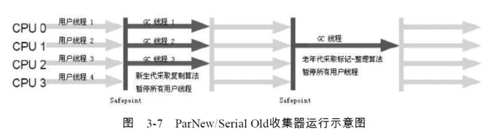

但它却是许多运行在Server模式下的虚拟机中首选的新生代收集器，其中有一个与性能无关但很重要的原因是，除了Serial收集器外，目前只有它能与CMS收集器(JDK1.5推出)配合工作。

(CMS这款收集器是HotSpot虚拟机中第一款真正意义上的并发（Concurrent）收集器，它第一次实现了让垃圾收集线程与用户线程（基本上）同时工作。)后面介绍

ParNew收集器在单CPU的环境中绝对不会有比Serial收集器更好的效果，甚至由于存在线程交互的开销，该收集器在通过多线程技术实现的两个CPU的环境中都不能百分之百地保证可以超越Serial收集器。可以使用-XX：ParallelGCThreads参数来限制垃圾收集的线程数。但是随着CPU数量的变多，对于GC时系统资源的有效利用还是很有好处的。它默认开启的收集线程数与CPU的数量相同。

理解两个概念:

● 并行（Parallel）：指多条垃圾收集线程并行工作，但此时用户线程仍然处于等待状态。

●并发（Concurrent）：指用户线程与垃圾收集线程同时执行（但不一定是并行的，可能会交替执行），用户程序在继续运行，而垃圾收集程序运行于另一个CPU上。

如何设置:

```
-XX:+UseParNewGC
复制代码
```

### 3、Parallel Scavenge收集器(新生代,复制算法,并行的多线程,关注点吞吐量)

Parallel Scavenge收集器的特点是它的关注点与其他收集器不同，CMS等收集器的关注点是尽可能地缩短垃圾收集时用户线程的停顿时间，而Parallel Scavenge收集器的目标则是达到一个可控制的吞吐量（Throughput)。所谓吞吐量就是CPU用于运行用户代码的时间与CPU总消耗时间的比值，即吞吐量=运行用户代码时间/（运行用户代码时间+垃圾收集时间），虚拟机总共运行了100分钟，其中垃圾收集花掉1分钟，那吞吐量就是99%。

**Parallel Scavenge收集器提供了两个参数用于精确控制吞吐量，分别是控制最大垃圾收集停顿时间的-XX：MaxGCPauseMillis参数**

MaxGCPauseMillis参数允许的值是一个大于0的毫秒数，收集器将尽可能地保证内存回收花费的时间不超过设定值。不过大家不要认为如果把这个参数的值设置得稍小一点就能使得系统的垃圾收集速度变得更快，GC停顿时间缩短是以牺牲吞吐量和新生代空间来换取的：系统把新生代调小一些，收集300MB新生代肯定比收集500MB快吧，这也直接导致垃圾收集发生得更频繁一些，原来10秒收集一次、每次停顿100毫秒，现在变成5秒收集一次、每次停顿70毫秒。停顿时间的确在下降，但吞吐量也降下来了。

**直接设置吞吐量大小的-XX：GCTimeRatio参数。**

GCTimeRatio参数的值应当是一个大于0且小于100的整数，也就是垃圾收集时间占总时间的比率，相当于是吞吐量的倒数。如果把此参数设置为19，那允许的最大GC时间就占总时间的5%（即1/（1+19）），默认值为99，就是允许最大1%（即1/（1+99））的垃圾收集时间。

Parallel Scavenge收集器还有一个参数-XX：+UseAdaptiveSizePolicy值得关注。这是一个开关参数，当这个参数打开之后，就不需要手工指定新生代的大小（-Xmn）、Eden与Survivor区的比例（-XX：SurvivorRatio）、晋升老年代对象年龄（-XX：PretenureSizeThreshold）等细节参数了，虚拟机会根据当前系统的运行情况收集性能监控信息，动态调整这些参数以提供最合适的停顿时间或者最大的吞吐量，这种调节方式称为GC自适应的调节策略。

注:如果读者对于收集器运作原来不太了解，手工优化存在困难的时候，使用Parallel Scavenge收集器配合自适应调节策略，把内存管理的调优任务交给虚拟机去完成将是一个不错的选择。只需要把基本的内存数据设置好（如-Xmx设置最大堆），然后使用MaxGCPauseMillis参数（更关注最大停顿时间）或GCTimeRatio（更关注吞吐量）参数给虚拟机设立一个优化目标，那具体细节参数的调节工作就由虚拟机完成了。 如何设置:

```
-XX:+UseParallelGC  
复制代码
```

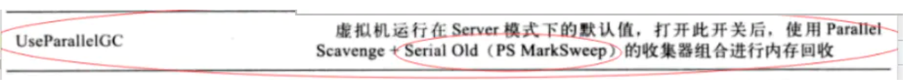


### 4 Serial Old收集器(Serial收集器的老年代版本标记-整理算法,Client模式)

这个收集器的主要意义也是在于给Client模式下的虚拟机使用。如果在Server模式下，那么它主要还有两大用途：一种用途是在JDK 1.5以及之前的版本中与Parallel Scavenge收集器搭配使用[1]，另一种用途就是作为CMS收集器的后备预案，在并发收集发生ConcurrentMode Failure时使用。

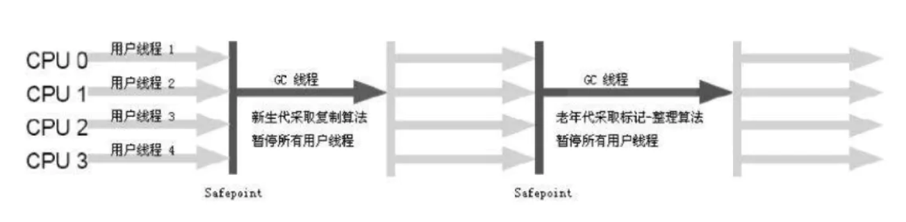

如何设置: 跟上一个一样

### 5、Parallel Old收集器(Parallel Scavenge的老年版,标记-整理”算法)

Parallel Old是Parallel Scavenge收集器的老年代版本，使用多线程和“标记-整理”算法。这个收集器是在JDK 1.6中才开始提供的。

在此之前，新生代的Parallel Scavenge收集器一直处于比较尴尬的状态。原因是，如果新生代选择了Parallel Scavenge收集器，老年代除了Serial Old（PS MarkSweep）收集器外别无选择（还记得上面说过Parallel Scavenge收集器无法与CMS收集器配合工作吗？）。由于老年代Serial Old收集器在服务端应用性能上的“拖累”，使用了Parallel Scavenge收集器也未必能在整体应用上获得吞吐量最大化的效果，由于单线程的老年代收集中无法充分利用服务器多CPU的处理能力，在老年代很大而且硬件比较高级的环境中，这种组合的吞吐量甚至还不一定有ParNew加CMS的组合“给力”。

直到Parallel Old收集器出现后，“吞吐量优先”收集器终于有了比较名副其实的应用组 合，在注重吞吐量以及CPU资源敏感的场合，都可以优先考虑Parallel Scavenge加Parallel Old收集器。

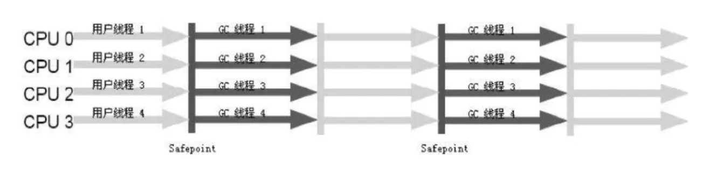


如何设置:

```
-XX:+UseParallelOldGC
复制代码
```


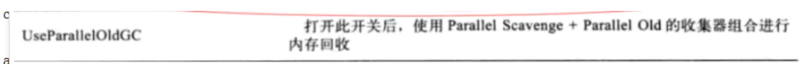


### 6、CMS收集器(以获取最短回收停顿时间为目标,并发收集、基于标记清除算法)

CMS（Concurrent Mark Sweep）收集器是一种以获取最短回收停顿时间为目标的收集器。目前很大一部分的Java应用集中在互联网站或者B/S系统的服务端上，这类应用尤其重视服务的响应速度，希望系统停顿时间最短，以给用户带来较好的体验。CMS收集器就非常符合这类应用的需求。从名字（包含“Mark Sweep”）上就可以看出，CMS收集器是基于“标记—清除”算法实现的，它的运作过程相对于前面几种收集器来说更复杂一些，整个过程分为4个步骤，包括：

- 初始标记（CMS initial mark）

- 并发标记（CMS concurrent mark）

- 预清理

- 重新标记（CMS remark） 
- 并发清除（CMS concurrent sweep）
- 并发重置

​	其中，初始标记、重新标记这两个步骤仍然需要“Stop The World”。初始标记仅仅只是标记一下GC Roots能直接关联到的对象，速度很快，并发标记阶段就是进行GC RootsTracing的过程，而重新标记阶段则是为了修正并发标记期间因用户程序继续运作而导致标记产生变动的那一部分对象的标记记录，这个阶段的停顿时间一般会比初始标记阶段稍长一些，但远比并发标记的时间短。

由于整个过程中耗时最长的并发标记和并发清除过程收集器线程都可以与用户线程一起工作，所以，从总体上来说，CMS收集器的内存回收过程是与用户线程一起并发执行的。


主要优点在名字上已经体现出来了：并发收集、低停顿。是一个并行垃圾处理器，用户线程与垃圾回收线程一起运行(不包括前两个标记)。

缺点: 1.CMS收集器无法处理浮动垃圾 	2.使用的是“标记—清除”算法实现的收集器，容易产生大量空间碎片。 3.对CPU资源比较敏感，，面向并发设计的程序对CPU资源都非常敏感的，受CPU的数量影响会比较大。数量越小，影响越大。

如何设置开启

```
-XX:+UseConcMarkSweepGC  //使用cms垃圾处理器

-XX:-CMSPrecleaningEnabled //不进行预处理

-XX:ConcGCThreads 或者  -XX:ParallelCMSThreads  参数手工预定并发线程数

-XX:CMSInitiatingOccupancyFraction  控制达到一定阙值后，进行CMS回收，默认是68.
如果应用程序内存增长很快，则需要，应该降低这个阙值。
如果增长很慢，则需要设置一个较大的值。大的阙值可以有效降低触发垃圾回收的频率

由于CMS是使用标记清楚算法，每次清楚后会造成大量的内存碎片，离散的可用空间无法分配到较大的对象，
这种情况下，即使对内存有较大剩余空间，也有可能被迫进行一次垃圾回收，因此可以使用以下参数
-XX:+UseCMSCompactAtFullCollection 开关可以使CMS在垃圾回收完成后进行一次内存碎片整理，压缩整理

-XX:CMSFullGCsBeforeCompaction  可以用于设定多少次垃圾回收后，进行一次内存整理。
复制代码
```

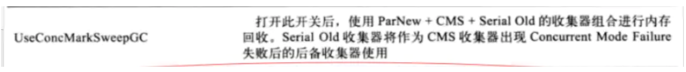


#### CMS日志分析

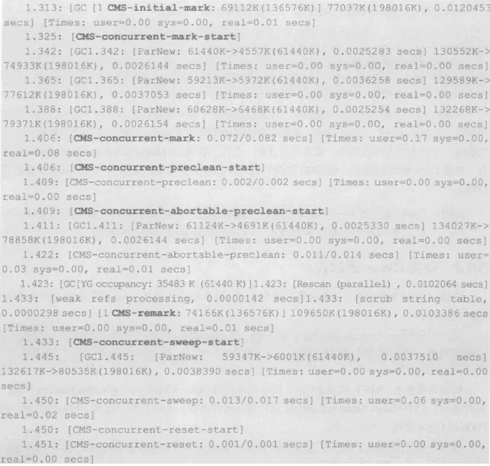

可以看到包含了初识化标记、并发标记、预处理、重新标记、并发清理、重置等几个重要阶段。


在使用CMS回收时，如果需要使用Perm区，那么默认情况下，还是需要触发一次fullGC

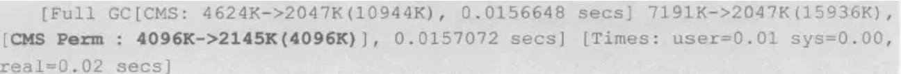

可以使用以下参数:


```
-XX:+CMSClassUnloadingEnabled 开关 使用后，如果条件允许，系统会使用CMS的机制回收Perm区的class日志。
复制代码
```

### 7 G1收集器(最高效)可以慢慢看，慢慢理解(主流)

**问题点:**

1. 减少停顿时间
2. 防止碎片而导致大对象无法找到连续内存空间而触发GC
3. 吞吐

G1是一款面向服务端应用的垃圾收集器。HotSpot开发团队赋予它的使命是（在比较长期的）未来可以替换掉JDK 1.5中发布的CMS收集器。与其他GC收集器相比，G1具备如下特点。

并行与并发、分代收集的垃圾收集算法、可预测的停顿、空间整合。

​	并行与并发：G1能充分利用多CPU、多核环境下的硬件优势，使用多CPU（CPU或者CPU核心）来缩短Stop-The-World停顿的时间，部分其他收集器原本需要停顿Java线程执行的GC动作，G1收集器仍然可以通过并发的方式让Java程序继续执行。

​	分代收集：与其他收集器一样，分代概念在G1中依然得以保留。虽然G1可以不需要其他收集器配合就能独立管理整个GC堆，但它能够采用不同的方式去处理新创建的对象和已经存活了一段时间、熬过多次GC的旧对象以获取更好的收集效果。

​	空间整合：与CMS的“标记—清理”算法不同，G1从整体来看是基于“标记—整理”算法实现的收集器，从局部（两个Region之间）上来看是基于“复制”算法实现的，但无论如何，这两种算法都意味着G1运作期间不会产生内存空间碎片，收集后能提供规整的可用内存。这种特性有利于程序长时间运行，分配大对象时不会因为无法找到连续内存空间而提前触发下一次GC。

​	可预测的停顿：这是G1相对于CMS的另一大优势，降低停顿时间是G1和CMS共同的关注点，但G1除了追求低停顿外，还能建立可预测的停顿时间模型，能让使用者明确指定在一个长度为M毫秒的时间片段内，消耗在垃圾收集上的时间不得超过N毫秒，这几乎已经是实时Java（RTSJ）的垃圾收集器的特征了。

### 特点

从分代来看，G1依然属于分代垃圾收集器，她会区分年轻代和老年代，依然有eden区和survivor区，但从堆的结构来看，它并不要求整个eden、年轻代或者老年代都连续，它使用了分区算法。

**并行性: 在回收期间，可以由多个GC线程同时工作，有效利用多核计算能力。**

井发性： GI 拥有与应用程序交替执行的能力，部分工作可以和应用程序同时执行，因此一 般来说，不会在整个回收期间完全阻塞应用程序。

**分代 GC : Gl 依然是一个分代收集器，但是和之前回收器不同，它同时兼顾年轻代和老年代。对比其他回收器，它们或者工作在年轻代，或者工作在老年代。因此，这里是一个很大的不同。**

**空间整理： Gl 在回收过程中，会进行适当的对象移动，不像CMS,只是简单地标记清理对象，在若干次 GC 后，CMS 必须进行一次碎片整理。而Gl不同，它每次回收都会有效地复制对象，减少空间碎片。**

G1把内存“化整为零”的思路，理解起来似乎很容易，但其中的实现细节却远远没有想象中那样简单，否则也不会从2004年Sun实验室发表第一篇G1的论文开始直到今天（将近10年时间）才开发出G1的商用版。

笔者以一个细节为例：把Java堆分为多个Region后，垃圾收集是否就真的能以Region为单位进行了？听起来顺理成章，再仔细想想就很容易发现问题所在：Region不可能是孤立的。一个对象分配在某个Region中，它并非只能被本Region中的其他对象引用，而是可以与整个Java堆任意的对象发生引用关系。那在做可达性判定确定对象是否存活的时候，岂不是还得扫描整个Java堆才能保证准确性？这个问题其实并非在G1中才有，只是在G1中更加突出而已。在以前的分代收集中，新生代的规模一般都比老年代要小许多，新生代的收集也比老年代要频繁许多，那回收新生代中的对象时也面临相同的问题，如果回收新生代时也不得不同时扫描老年代的话，那么Minor GC的效率可能下降不少。

​	在G1收集器中，Region之间的对象引用以及其他收集器中的新生代与老年代之间的对象引用，虚拟机都是使用Remembered Set来避免全堆扫描的。G1中每个Region都有一个与之对应的Remembered Set，虚拟机发现程序在对Reference类型的数据进行写操作时，会产生一个Write Barrier暂时中断写操作，检查Reference引用的对象是否处于不同的Region之中（在分代的例子中就是检查是否老年代中的对象引用了新生代中的对象），如果是，便通过CardTable把相关引用信息记录到被引用对象所属的Region的RememberedSet之中。当进行内存回收时，在GC根节点的枚举范围中加入Remembered Set即可保证不对全堆扫描也不会有遗漏。

### G1的内存划分和主要收集过程

G1收集器讲堆进行分区，划分为一个个区域，每次收集时，只收集其中几个区域，以此来控制垃圾回收产生的一次停顿时间。

G1收集过程四个阶段:

新生代GC(YGC) 并发标记周期 混合收集 如果需要进行full GC

#### G1的新生代GC

新生代GC的主要工作是回收eden区和survivor区。 一旦eden 区被占满，新生代GC就会启动。新生代GC收集前后的堆数据如图5.6所示，其中E表示eden区，S表示survivor区， o表示老年代。可以看到，新生代GC只处理eden和survivor区，回收后，所有的eden区都应该被消空，而survivor区会被收集一 部分数据，但是应该至少仍然存在一 个 survivor 区，类比其他的新生代收集器，这一 点似乎并没有太大变化。另一 个亟要的变化是老年代的区域增多，因为部分survivor区或者eden区的对象可能会晋升到老年代。


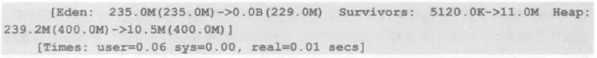

从日志中可以看到，eden区原本占用235MB空间，回收后被清空，survivor区从5MB增长到了11MB, 这是因为部分对象从eden区复制到survivor区，整个堆合计为400MB, 从回收前的239MB下降到10.5MB。


#### G1的井发标记周期

G1的并发阶段与CMS有点类似，他们都是为了降低一次停顿时间，而将可以和应用程序并发的部分单独提取出来执行。

并发标记周期可以分为以下几步。如果不计算维护RememberedSet的操作，G1收集器的运作大致可划分为以下几个步骤：

```
初始标记（Initial Marking）
根区域扫描
并发标记（Concurrent Marking）
最终标记（Final Marking）
独占清理 
筛选回收（Live Data Counting and Evacuation）
复制代码
```

初始标记: 标记从根节点直接可达的对象。这个阶段会伴随一次新生代GC，它会产生全局停顿。

根区域扫描: 由于初始标记必然会伴随一次新生代的GC，所以在初始化标记后，eden被清空，并且存活对象被移入survivor区。这个阶段，将扫面survivor区直接可达的老年代对象，并标记这些直接可达的对象。根区域扫描不能和新生代GC同时执行。

并发标记:  和CMS类似，扫面查找整个对存活的对象，这是一个并发的过程，可以被一次新生代GC打断。

重新标记: 由于并发标记过程中，应用仍在执行，因此标记结果需要修正，所以对上一次的标记结果进行补充，在G1中，这个过程使用STAB算法完成。即G1会在标记之初为存活对象创建一个快照，有助于加速重新标记速度。

独占清理: 这个阶段会引起停顿。

并发清理阶段: 识别并清理完全空闲的区域。它是并发的清理，不会引起停顿。

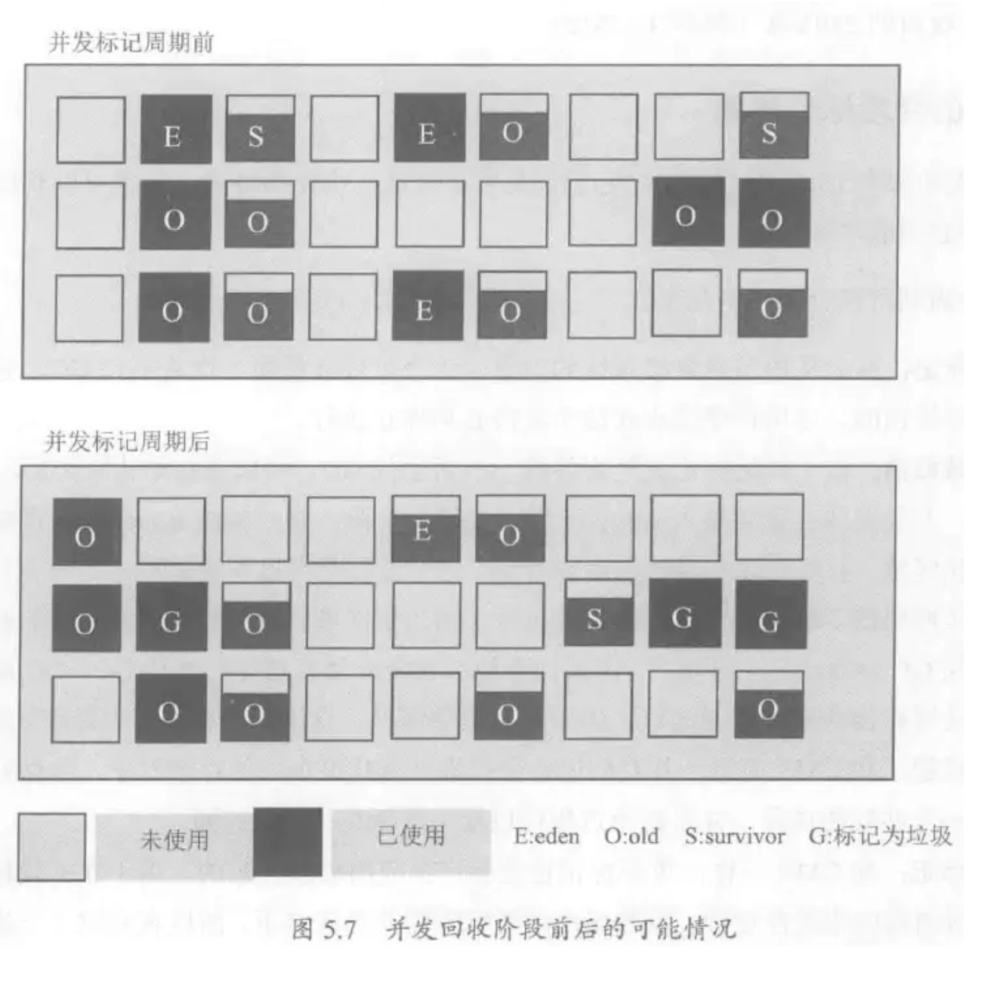


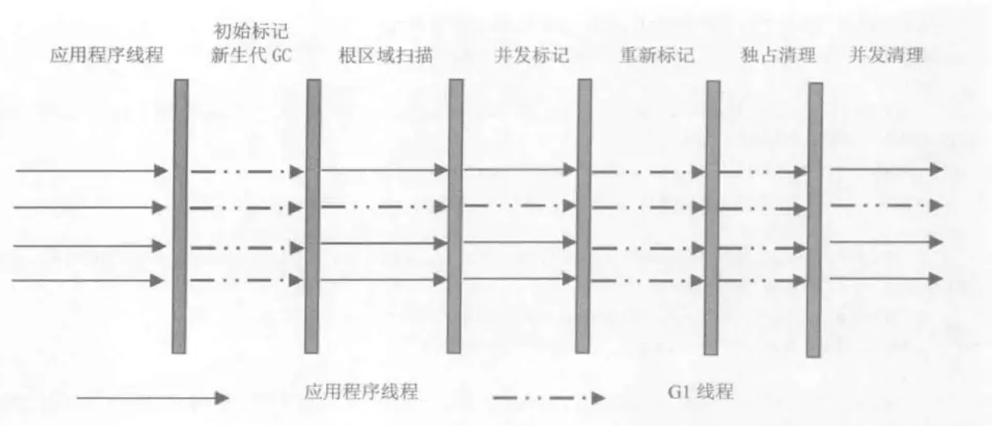


在并发标记周期时，G1会产生如下日志:

(1)、初始标记，伴随一次新生代GC

```
[GC pause (G1 Humongous Allocation) (young) (initial-mark), 0.0117414 secs]
    ...
   [Eden: 1024.0K(4096.0K)->0.0B(2048.0K) Survivors: 2048.0K->1024.0K Heap: 9581.8K(20.0M)->12.3M(20.0M)]
 [Times: user=0.11 sys=0.00, real=0.01 secs] 

```

可以看到初始化标记时，eden被清空，并部分复制到survivor区

（2）、这是一次并发的根区域扫描，并发扫面过程中，不能被新生代GC打断。

```
[GC concurrent-root-region-scan-start]
[GC concurrent-root-region-scan-end, 0.0007368 secs]
复制代码
```

(3)、下面这个是指并发标记

```
[GC concurrent-mark-start]
[GC pause (G1 Evacuation Pause) (young) (to-space exhausted), 0.0427113 secs]
    .....
   [Eden: 2048.0K(2048.0K)->0.0B(1024.0K) Survivors: 1024.0K->1024.0K Heap: 16.4M(20.0M)->18.0M(20.0M)]
 [Times: user=0.05 sys=0.02, real=0.04 secs] 
 ...
 [GC concurrent-mark-abort]
复制代码
```

（4）、重新标记引起全局停顿

```
 [Ref Proc: 0.3 ms]
复制代码
```

(5)、重新标记后进行独占清理

```
4.088: [GC cleanup 117M->106M(138M), 0.0015198 secs]
复制代码
```

(6)、并发清理是并发执行的，会根据独占清理阶段计算出的每个区域的存活对象数量，直接回收已经不包含存活对象的区域。

```
4.090: [GC concurrent-cleanup-start]

并发清理阶段开始，它释放被发现为空的区域(不包含任何的活跃数据的区域)，在上一个stop-the-world阶段期间。

4.091: [GC concurrent-cleanup-end, 0.0002721]

并发清理阶段清理空的区域用时0.0002721秒。
复制代码
```

关于G1日志，想要知道所有内容的，可以看这篇文章，适合查询: [blog.csdn.net/zhanggang80…](https://blog.csdn.net/zhanggang807/article/details/46011341)

### 混合回收

在并发标记周期中，虽然有部分对象被回收，但是从整体上来说，回收的比例是相当低的。但是在并发标记周期后，G1已经明确知道哪些区域含有比较多的垃圾对象了，在混合阶段，就是对这些区域进行回收的。当然，会优先回收垃圾比例比较高的区域。因为回收这些区域的性价比比较高。

G1是指垃圾优先的垃圾回收器，全称"Garbage First Garbage Collector".

在混合回收中，即会执行正常年轻代GC，也会选取被标记的老年代区域进行回收，它同时处理了新生代和老年代。因为新生代GC的原因，eden区域必然被清空，此外，如下图，有两块区域被标记为G的垃圾回收比例最高的区域被清理。被清理区域的存活对象会被移动到其他区域，这样的好处是可以减少空间碎片。

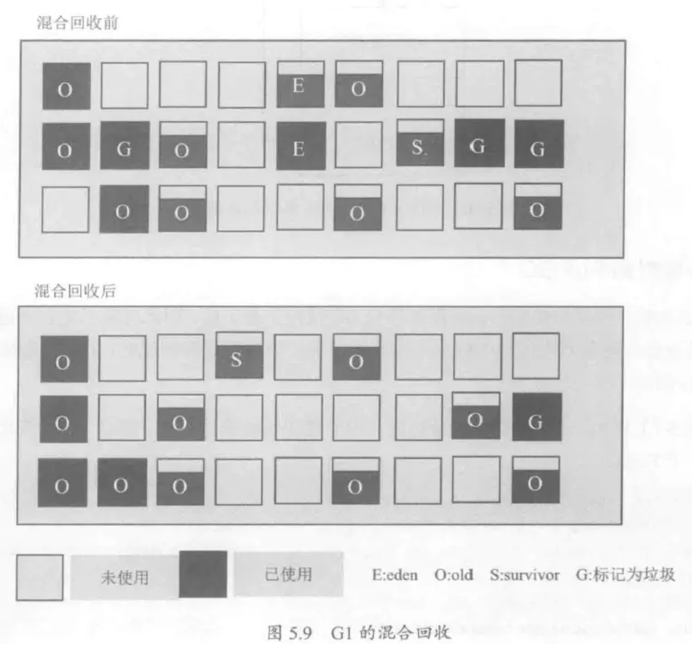


混合GC产生如下日志:

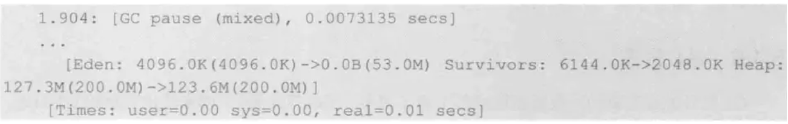

混合GC执行多次，直到回收了足够多的内存空间，触发一次新生代GC。新生代GC后，有可能会发生一次并发标记周期的清理，最后又引起混合GC。整个流程见下图:

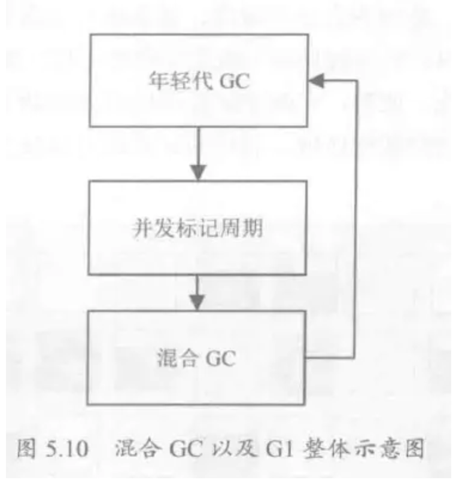


#### 必要时的Full GC

与CMS类似，并发收集由于让应用和GC线程交替工作，因此总是不能避免在特别的繁忙场合在回收过程导致内存不足，此时，G1也会执行一个Full GC回收。

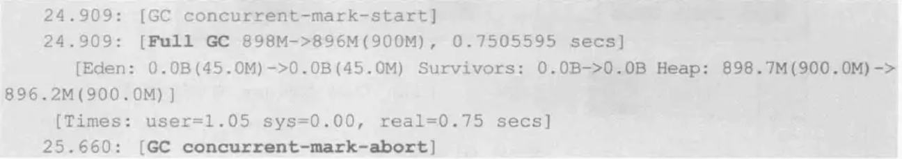

此外，在混合GC和新生代GC时，survivor与老年代无法无法容纳幸存对象，都会导致Full GC产生


#### G1 的相关参数

对于Gl收集器，可以使用-XX:+UseGIGC标记打开Gl收集器开关，对Gt收集器进行设置时，最重要的一 个参数就是-XX :MaxGCPauseMillis,它用于指定目标最大停顿时间。如果任何一次停顿超过这个设置值时，Gl就会尝试调整新生代和老年代的比例、调整堆大小、调整晋升年龄等手段，试图达到预设目标。对于性能调优来说，

有时候，总是鱼和熊掌不可兼得的，如果停顿时间缩短，对千新生代来说，这意味着很可能要增加新生代GC的次数，GC反而会变得更加频繁。对于老年代区域来说，为了获得更短的停顿时间，那么在混合GC收集时，一次收集的区域数量也会变少，这样无疑增加了进行FullGC的可能性。另外一个重要的参数是-XX :ParallelGCThreads, 它用于设置并行回收时，GC的工作线程数量。

此外，-XX:InitiatingHeapOccupancyPercent参数可以指定当整个堆使用率达到多少时，触发并发标记周期的执行。默认值是45, 即当整个堆占用率达到45%时，执行并发标记周期。 InitiatingHeapOccupancyPercent 一 旦设置，始终都不会被G l收集器修改，这意味着G I收集器不会试图改变这个值，来满足MaxGCPause汕His的目标。如果InitiatingHeapOccupancyPercent值设置偏大，会导致并发周期迟迟得不到启动，那么引起Full GC的可能性也大大增加，反之，一 个过小的 InitiatingHeapOccupancyPercent值，会使得并发周期非常频繁，大整 GC 线程抢占CPU, 会导致应用程序的性能有所下降。


## 1、JDK1.8 之前默认的垃圾收集器

JDK1.8 之前（包括 1.8），默认的垃圾收集器是 Parallel Scavenge（新生代）+Parallel Old（老年代）。

Parallel Scavenge 是一款基于复制算法的新生代垃圾处理器，它的设计目标是吞吐量优先。所谓吞吐量就是指：用户运行时间/(用户运行时间+垃圾回收时间)。很显然吞吐量越大越好。用户需要给 Parallel Scavenge 设置一个吞吐量的目标，然后 Parallel Scavenge 会自动控制每一次垃圾回收的时间。另外 Parallel Scavenge 还有自适应调节策略，只要打开-XX:+UseAdaptiveSizePolicy，它就会动态调整新生代大小、Eden 与 Survivor 的比例、晋升老年代对象大小等参数，以达到最大的吞吐量。

> AdaptiveSizePolicy 有三个目标：
>
> 1. Pause goal：应用达到预期的 GC 暂停时间。
> 2. Throughput goal：应用达到预期的吞吐量，即应用正常运行时间 / (正常运行时间 + GC 耗时)。
> 3. Minimum footprint：尽可能小的内存占用量。
>
> AdaptiveSizePolicy 为了达到三个预期目标，涉及以下操作：
>
> 1. 如果 GC 停顿时间超过了预期值，会减小内存大小。理论上，减小内存，可以减少垃圾标记等操作的耗时，以此达到预期停顿时间。
> 2. 如果应用吞吐量小于预期，会增加内存大小。理论上，增大内存，可以降低 GC 的频率，以此达到预期吞吐量。
> 3. 如果应用达到了前两个目标，则尝试减小内存，以减少内存消耗。

和 Parallel Scavenge 配套使用的老年代收集器是 Parallel Old，这是一款基于标记-整理算法的垃圾处理器。

**为什么不用 CMS 作为老年代收集器？**

> 这是因为 Parallel Scavenge 的作者没有使用 HotSpot VM 给定的代码框架，而是自己独立实现了一个。这就导致 Parallel Scavenge 和当时大部分收集器都不兼容，其中就包括 CMS。所以在 1.8 时代，比较流行的有两套收集器，一套是 Parallel Scavenge（新生代）+Parallel Old（老年代），另一套是 ParNew（使用复制算法，新生代）+ CMS（老年代）

## 2、低停顿的 CMS

CMS，Concurrent Mark Sweep，是一款老年代的收集器，它关注的是垃圾回收最短的停顿时间。命名中 Concurrent 说明这个收集器是有与工作执行并发的能力的，Mark Sweep 则代表算法用的是标记-清除算法。

CMS 的工作原理分为四步：

- 初始标记：单线程执行，仅仅把 GC Roots 的直接关联可达的对象标记一下，速度很快，需要停顿。
- 并发标记：对于初始标记过程所标记的初始对象，进行并发追踪标记，不需要停顿。
- 重新标记：为了修正并发标记期间因用户程序继续运作而导致标记产生变动的那一部分对象的标记记录，需要停顿。
- 并发清除：清除之前标记的垃圾，不需要停顿。


由于最耗费时间的并发标记与并发清除阶段都不需要暂停工作，所以整体的回收是低停顿的。

由于 CMS 以上特性，缺点也是比较明显的：

- 标记-清除算法会导致内存碎片比较多。
- CMS 的并发能力依赖于 CPU 资源，所以在 CPU 数少和 CPU 资源紧张的情况下，性能较差。
- 无法处理浮动垃圾。浮动垃圾是指在并发清除阶段用户线程继续运行而产生的垃圾，这部分垃圾只能等下次 GC 时处理。由于浮动垃圾的存在，CMS 不能等待内存耗尽的时候才进行 GC，而要预留一部分内存空间给用户线程。这里会浪费一些空间。

**为什么不用标记-整理？**

> 因为在并发清除阶段，其它用户线程还在工作，要保证它们运行的资源不受影响。而标记-整理算法会移动对象，所以不能使用标记-整理。

## 3、停顿可控的 G1

G1 是一款可以掌管所有堆内存空间的收集器。G1 把堆划分成多个大小相等的独立区域（Region），新生代和老年代不再物理隔离。


通过引入 Region 的概念，将原来的一整块内存空间划分成多个的小空间，使得每个小空间可以单独进行垃圾回收。这种划分方法避免了空间碎片化，也提高了回收的灵活性——G1 会根据平均每个 Region 回收需要的时间（经验预测）和各个 Region 的回收收益，制定回收计划。

每个 Region 都有一个 Remembered Set，Remembered Set 记录了其他 Region 中的对象引用本 Region 中对象的关系（准确的说是老年代的 Region 到年轻代 Region 中对象的引用）。为什么要有 Remembered Set 呢？这是因为在分代收集器中，老年代的对象有可能会引用年轻代的对象，这就导致在收集器进行年轻代回收时，为了判断对象的存活性，不得不也扫描一次老年代，这个代价是非常大的。而有了 Remembered Set 之后，在进行年轻代回收时，可以根据 Remembered Set 检查老年代对该对象的引用，不需要再扫描整个老年代，大大减少了 GC 的工作量。（G1 在进行年轻代回收时不会回收被老年代引用的对象，这可能会导致有些可以被回收的对象没有被回收，但为了效率这是可以接受的）

**其它收集器是否也有 Remembered Set？**

> 在 CMS 中，也有 RSet 的概念，在老年代中有一块区域用来记录指向新生代的引用。这是一种 point-out（我引用了谁），在进行 Young GC 时，根扫描仅仅需要扫描这一块区域，而不需要扫描整个老年代。G1 中使用了 point-in（谁引用了我），point-in 会比 point-out 更高效，但也会占用更多的空间。CMS 中没有 Region 的概念，所以只能用 point-out（除非为每个对象维护一份 RSet，这样显然不能接受），而 G1 以 Region 为单位记录引用关系，在空间上就可以接受了。

**为什么不记录新生代的引用？**

> G1 在每次进行 GC 时，所有新生代都会被扫描，所以只需要记录老年代到新生代之间的引用即可。

三种 GC 模式：

- Young GC，发生于新生代空间不足时，回收全部新生代，可以通过控制新生代 Region 的个数来控制 Young GC 的时间开销。
- Mixed GC，当堆中内存使用超过整个堆大小的 InitiatingHeapOccupancyPercent（默认 45）时启动。 回收全部新生代，并根据预期停顿时间回收部分收益较高的老年代。
- Full GC（JDK 9 引入），发生于老年代空间不足时，相当于执行一次 STW 的 full gc。

整体的执行流程：

- 初始标记：标记了从 GC Root 开始直接关联可达的对象，速度很快，单线程，需停顿。
- 并发标记：对于初始标记过程所标记的初始对象，进行并发追踪标记，并记录下每个 Region 中的存活对象信息用于计算收益，不需要停顿。
- 最终标记：为了修正并发标记期间因用户程序继续运作而导致标记产生变动的那一部分对象的标记记录，需要停顿。
- 筛选回收：根据 GC 模式、回收时间和回收收益确定回收计划，回收后的空 Region 会加入到空闲列表，需要停顿。


由于 G1 会把存活的对象集中起来放到 Survivor Region 中，并通过空闲列表整理所有的空 Region，所以整体来看是基于“标记 - 整理”算法实现的收集器；但从局部（两个 Region 之间）上来看又是基于“复制”算法实现的。但不论如何，这两种算法都需要移动对象，所以 G1 的回收阶段是需要停顿的。

## 4、几乎无停顿的 ZGC

在 JDK 11 当中，加入了实验性质的 ZGC。它的回收耗时平均不到 2 毫秒。它是一款低停顿高并发的收集器。ZGC 几乎在所有地方并发执行的，除了初始标记的是 STW 的。所以停顿时间几乎就耗费在初始标记上，这部分的实际是非常少的。那么其他阶段是怎么做到可以并发执行的呢？ZGC 主要新增了两项技术，一个是着色指针 Colored Pointer，另一个是读屏障 Load Barrier。

**着色指针 Colored Pointer**

ZGC 利用指针的 64 位中的几位表示 Finalizable、Remapped、Marked1、Marked0（ZGC 仅支持 64 位平台），以标记该指向内存的存储状态。相当于在对象的指针上标注了对象的信息。注意，这里的指针相当于 Java 术语当中的引用。

在这个被指向的内存发生变化的时候（内存在整理时被移动），颜色就会发生变化。

**读屏障 Load Barrier**

由于着色指针的存在，在程序运行时访问对象的时候，可以轻易知道对象在内存的存储状态（通过指针访问对象），若请求读的内存在被着色了。那么则会触发读屏障。读屏障会更新指针再返回结果，此过程有一定的耗费，从而达到与用户线程并发的效果。

把这两项技术联合下理解，引用 R 大（RednaxelaFX）的话

> 与标记对象的传统算法相比，ZGC 在指针上做标记，在访问指针时加入 Load Barrier（读屏障），比如当对象正被 GC 移动，指针上的颜色就会不对，这个屏障就会先把指针更新为有效地址再返回，也就是，永远只有单个对象读取时有概率被减速，而不存在为了保持应用与 GC 一致而粗暴整体的 Stop The World。

ZGC 和 G1 一样将堆划分为 Region 来清理、移动，稍有不同的是 ZGC 中 Region 的大小是会动态变化的。


ZGC 的回收流程如下：

**1、初始停顿标记**

停顿 JVM 地标记 Root 对象，1，2，4 三个被标为 live。

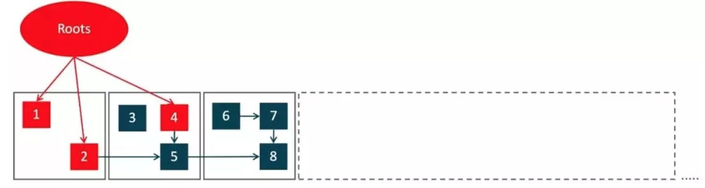

**2、并发标记**

并发地递归标记其他对象，5 和 8 也被标记为 live。

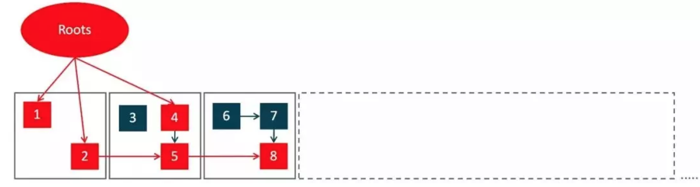

**3、移动对象**

对比发现 3、6、7 是过期对象，也就是中间的两个灰色 region 需要被压缩清理，所以陆续将 4、5、8 对象移动到最右边的新 Region。移动过程中，有个 forward table 纪录这种转向。

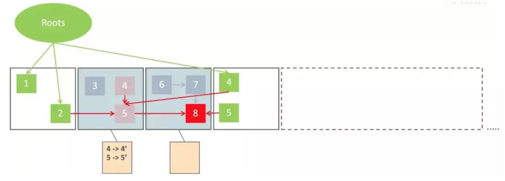

活的对象都移走之后，这个 region 可以立即释放掉，并且用来当作下一个要扫描的 region 的 to region。所以理论上要收集整个堆，只需要有一个空 region 就 OK 了。

**4、修正指针**

最后将指针都妥帖地更新指向新地址。

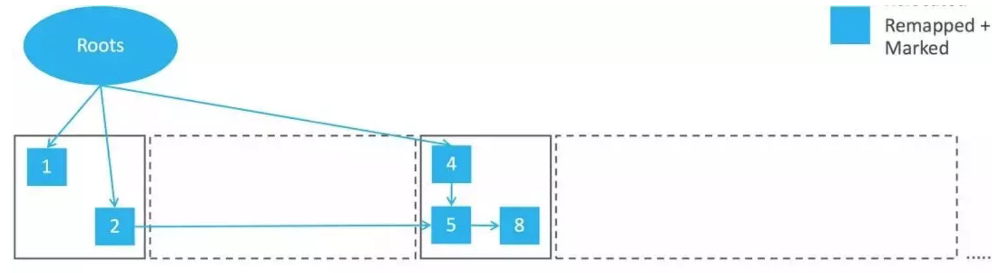

ZGC 虽然目前还在 JDK 11 还在实验阶段，但由于算法与思想是一个非常大的提升，相信在未来不久会成为主流的 GC 收集器使用。