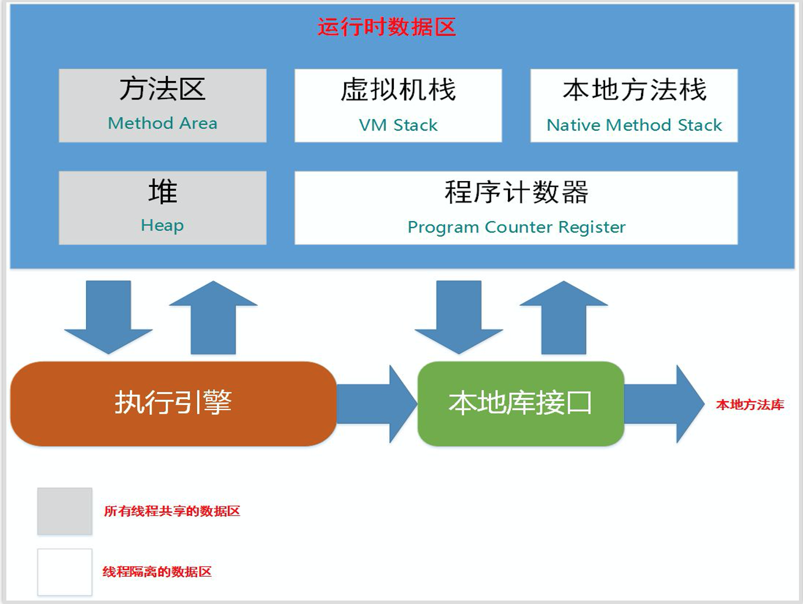

## JVM内存布局

虚拟机不会把所有数据一股脑弄进来而是会对数据进行一个分类，即运行时数据区

- Java虚拟机栈

  每个方法在被调用时就会创建一个栈帧，每一个方法从调用直至执行完成的过程，就对应着一个栈帧在虚拟机栈中入栈到出栈的过程

- Java堆

  Java虚拟机所管理的内存中最大的一块。Java堆是被所有线程共享的一块内存区域，对象实例在这里分配内存。是垃圾收集器（GC）管理的主要区域