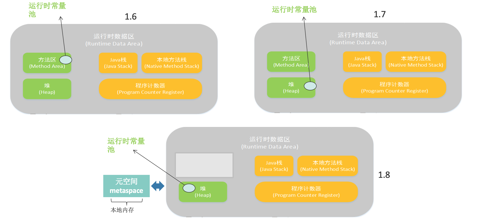
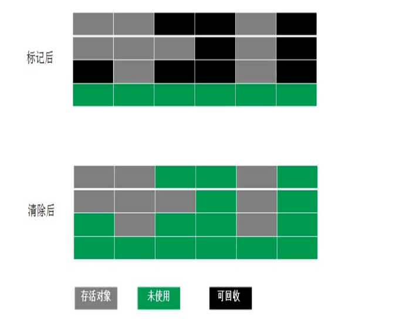
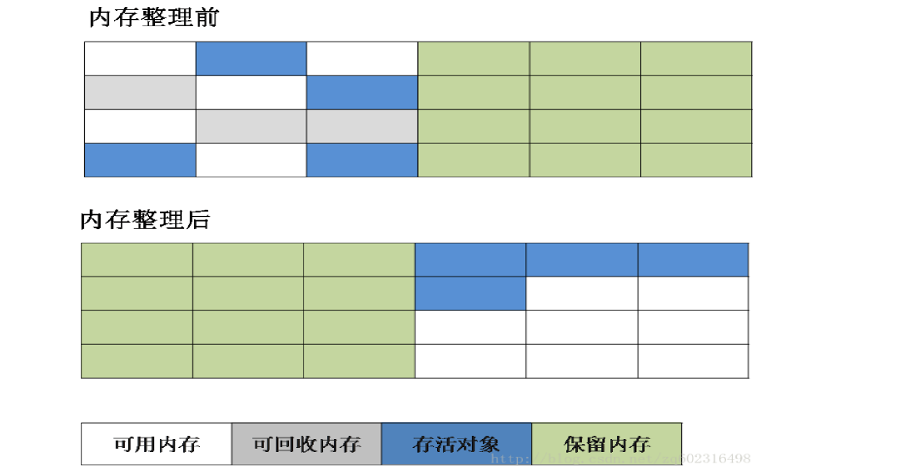
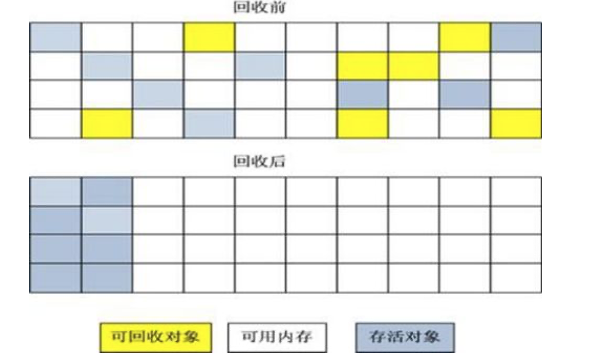
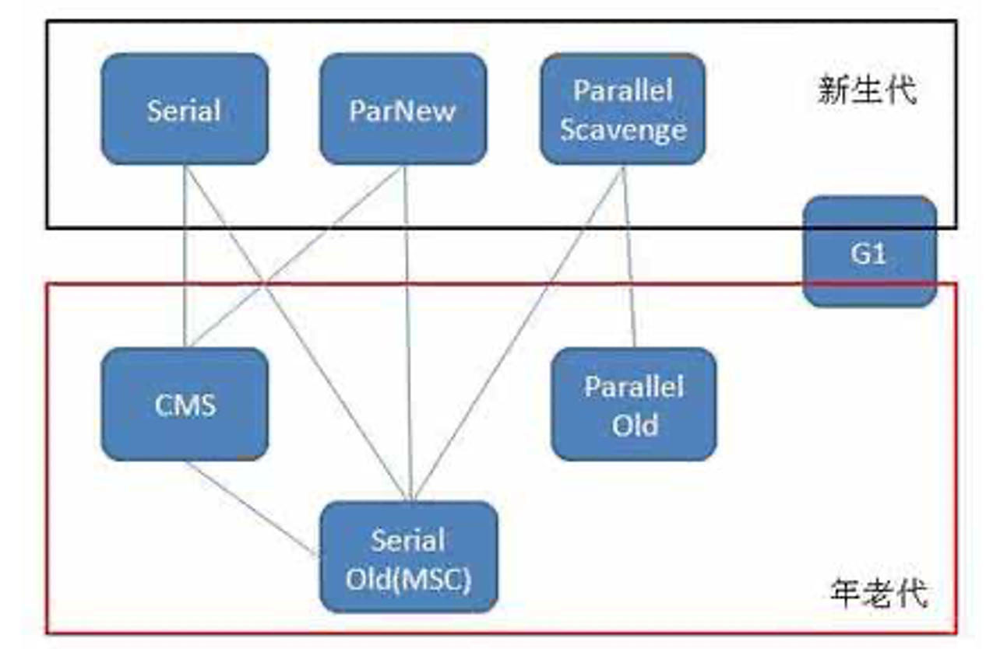

## JVM内存布局

虚拟机不会把所有数据一股脑弄进来而是会对数据进行一个分类，即运行时数据区

- Java虚拟机栈

  每个方法在被调用时就会创建一个栈帧，每一个方法从调用直至执行完成的过程，就对应着一个栈帧在虚拟机栈中入栈到出栈的过程

- Java堆

  Java虚拟机所管理的内存中最大的一块。Java堆是被所有线程共享的一块内存区域，对象实例在这里分配内存。是垃圾收集器（GC）管理的主要区域

- 方法区

  存储已被虚拟机加载的类信息、常量、静态变量、即时编译器编译后的代码等数据，运行时常量池是方法区的一部分

- 直接内存

  直接内存不是虚拟机运行时数据区的一部分，也不是Java虚拟机规范中定义的内存区域

**运行时常量池** 中保存着一些 class 文件中描述的符号引用，同时还会将这些符号引用所翻译出来的直接引用存储在 **运行时常量池** 中。

**垃圾回收机制算法**

- 标记-清除算法(Mark-Sweep)

  

  带来内存碎片，内存不规整

- 复制算法(Copying)

  为解决内存碎片，引入复制算法

  把内存区域分成两个部分，每次只用一半。

  当然发生GC时，把左边存活对象移到右边，按照顺序摆好，然后一次性把左边的数据回收。但是这样总有一半的区域是没有使用上的，浪费内存空间

  

- 标记-整理算法(Mark-Compact)

  把可回收对象进行标记，然后把存活的区域进行移动，按照某种顺序把它在内存区域内放好，放好后把需要回收的一次性回收掉。存在内存取块移动对内存会有影响

  

在实际GC中使用`分代收集`概念，对数据进行分代，对于大部分马上可以回收的命名为新生代，新生代一般使用复制算法。新生代中活过了一定次数后就会变成老年代，老年代可能使用标记清除也可能使用垃圾整理算法。

多个线程进行垃圾回收称为并行式垃圾回收。而现在提出G1的概念同样有新生老年代的区别，但是相比早期GC，内存区域是从逻辑上分成两块，而G1中内存区域不是严格区分，G1把内存区域分成一个个小块，可能给新生用可能给老年用。这样可以有很多性能上的提升。

