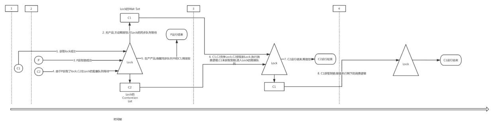

### 什么是线程虚假唤醒

在不同的语言，甚至不同的操作系统上，条件锁都会产生虚假唤醒现象。所有语言的条件锁库都推荐用户把wait()放进循环里,参见[为什么条件锁会产生虚假唤醒现象（spurious wakeup）](https://www.zhihu.com/question/271521213)

```
while (!cond) {
    lock.wait();
}
复制代码
```

摘选wikipedia的解释:

> This means that when you wait on a condition variable, the wait may (occasionally) return when no thread specifically broadcast or signaled that condition variable. Spurious wakeups may sound strange, but on some multiprocessor systems, making condition wakeup completely predictable might substantially slow all condition variable operations. The race conditions that cause spurious wakeups should be considered rare.

简单翻译一下: 当线程在某个条件变量下等待时,即使其他线程没有broadcast or signaled 这个条件变量,该线程仍然可能被唤醒,在多核处理器系统下,使条件变量完全可以预测会降低系统的性能,而导致虚假唤醒的几率又很小

综合我所了解到相关知识. 在操作系统底层"唤醒"的实现机制就注定虚假唤醒的存在,设计者们不解决这个问题的原因是

1. **修复这个问题会导致系统性能下降,性价比太低**
2. **即使修复了这个问题,由于同步问题的存在,仍然要将wait()放进循环里**.

对于1不过多追究,对于2,下面以Java中的真实场景做演示

### 模拟场景

一个典型的生产者消费者场景,现有 2个consumer线程,一个producer线程,consumer和producer都是一次性的,它们都只会消费/生产一个产品,初始时产品数量为0,三个线程(近似)同时启动

```
/**
 * @description: 参考了 https://www.jianshu.com/p/da312eee4ac4
 * @author: alonwang
 * @create: 2019-07-19 15:54
 **/
public class SpuriousWakeUp {
    private final Object lock = new Object();
    private int product = 0;
		//如果没有产品,在lock对象上等待唤醒,如果有产品,消费.
    private Runnable consumer = () -> {
        System.out.println(Thread.currentThread().getName() + " prepare consume");
        synchronized (lock) {
            if (product <= 0) {//替换为while解决线程虚假唤醒问题
                try {
                    System.out.println(Thread.currentThread().getName() + " wait");
                    lock.wait();
                } catch (InterruptedException e) {
                    e.printStackTrace();
                }
                System.out.println(Thread.currentThread().getName() + " wakeup");
            }
            product--;
            System.out.println(Thread.currentThread().getName() + " consumed product:" + product);
            if (product < 0) {
                System.err.println(Thread.currentThread().getName() + " spurious lock happend, product: " + product);
            }
        }
    };
		//生产一个产品然后唤醒一个在lock对象上等待的consumer
    private Runnable producer = () -> {
        System.out.println(Thread.currentThread().getName() + " prepare produce");
        synchronized (lock) {
            product += 1;
            System.out.println(Thread.currentThread().getName() + "produced product: " + product);
            lock.notify();
        }
    };

    public void producerAndConsumer() {
				// 启动2个consumer,1个producer
        Thread c1 = new Thread(consumer);
        Thread c2 = new Thread(consumer);
        Thread p = new Thread(producer);
        c1.start();
        c2.start();
        p.start();

    }

    public static void main(String[] args) {
				//运行100次,以便触发异常现象
        for (int i = 0; i < 100; i++) {
            new SpuriousWakeUp().producerAndConsumer();
        }

        try {
            Thread.sleep(5000);
        } catch (InterruptedException e) {
            e.printStackTrace();
        }
        System.exit(0);
    }
}
复制代码
```

### 现象

预期现象: **不考虑三个线程的执行顺序,由于生产者只有一个,初始时又没有产品.而consumer线程有两个,那么一定会有一个consumer线程由于无法消费被永久阻塞.**

实际现象: 某些情况下,应该被永久阻塞的那个consumer线程被异常唤醒,并消费一个产品导致产品数量为-1.

截取的带有异常现象的输出如下:

```
Thread-100 prepare consume
Thread-100 consumed product:0
Thread-99 wakeup
Thread-99 consumed product:-1
Thread-99 spurious lock happend, product: -1
Thread-108 prepare consume
Thread-108 wait
Thread-112 prepare consume
复制代码
```

### 原理解释

设两个consumer为C1,C2,producer为P.上面出现异常的时序如下:





要理解问题所在,需要了解以下知识

1. 线程获取不到锁被阻塞,会在Contention List上等待
2. 获取到锁的线程调用wait后,会主动放弃锁,并在Wait Set中等待唤醒
3. 线程调用notify后,在退出Synchronized块释放锁后才会执行唤醒操作(暂时没有搞清楚唤醒和释放锁的顺序)

具体请参考[Java锁Synchronized之阻塞线程](http://blog.sina.com.cn/s/blog_c038e9930102v2i0.html)

上面问题的核心是: C1被唤醒后,仍然需要先获取锁再**继续执行逻辑**,而唤醒-获取锁并不是原子性的,唤醒之后锁可能被其他线程获取,这时C1再次获取到锁时,产品已经没了,由于是**继续执行**,就没有再检查产品数量,导致异常情况的出现

### 解决办法—**将if替换为while**

替换为while后,即使被唤醒,仍然会再检查一遍限制条件,保证逻辑的正确性.

