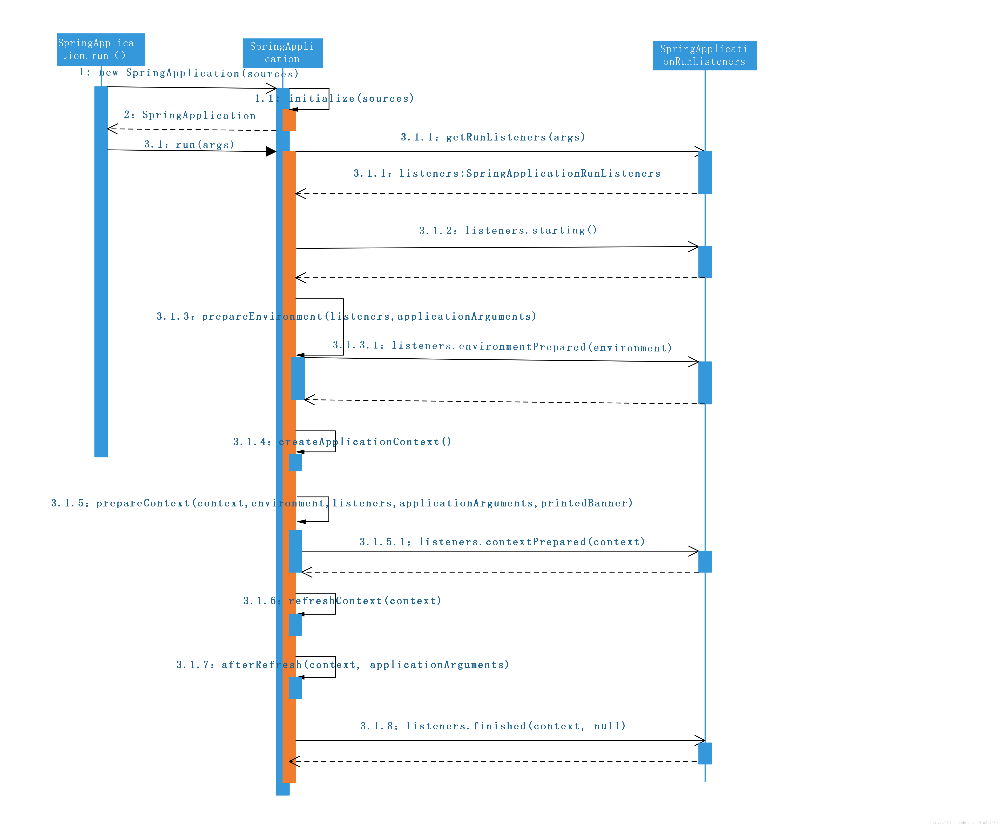

## SpringBoot启动机制

- 怎么整合第三方依赖？

  maven父集成

- 怎么做到无配置文件集成的SpringMVC

  @SpringBootApplication组成

  - @SpringBootConfiguration

    本质就是@Configuration，其实就是一个Spring容器的配置类

  - @ComponentScan

    自动扫描并加载符合条件的组件或者bean定义，最终将这些定义

  - @EnableAutoConfiguration

    借助@Import的支持，收集和注册特定场景相关的bean定义(重点)

  使用@EnableWebMvc集成SpringMVC功能

- Tomcat是怎么启动的

  通过@EnableAutoConfiguration中Import注解加载(spring-boot-autoconfiguration spring.factories)，位于EmbeddedWebServerFactoryCustomizerAutoConfiguration中引入Tomcat.class

## 1.1 Springboot启动：

```java
@SpringBootApplication
public class ServerApplication {
    public static void main(String[] args) {
        SpringApplication.run(ServerApplication.class,args);
    }
}
```

从上面代码看，调用了SpringApplication的静态方法run。这个run方法会构造一个SpringApplication的实例，然后再调用这里实例的run方法就表示启动SpringBoot。具体对象处理流程看下边时序图：

***概述：***

- 构造SpringApplication的实例（时序图步骤1-2）
- 调用SpringApplication.run()方法（时序图步骤3）
  - 构造SpringApplicationRunListeners 实例（时序图步骤3.1.1）
  - 发布ApplicationStartedEvent事件（时序图步骤3.1.2）
  - SpringApplicationRunListeners 实例准备环境信息（时序图步骤3.1.3）
  - 创建ApplicationContext对象（时序图步骤3.1.4）
  - ApplicationContext实例准备环境信息（时序图步骤3.1.5）
  - 刷新的上下文（时序图步骤3.1.6）

注：文章按照该顺序讲解【1.2 启动加载过程分析】

***时序图：***


## 1.2 启动加载过程分析

### 1.2.1 构造SpringApplication的实例（时序图步骤1-2）

***代码***

```java
public static ConfigurableApplicationContext run(Object[] sources, String[] args) {
	// 步骤1
	return new SpringApplication(sources).run(args);
}
public SpringApplication(Object... sources) {
	// 步骤1.1
	initialize(sources);
}
@SuppressWarnings({ "unchecked", "rawtypes" })
private void initialize(Object[] sources) {
	if (sources != null && sources.length > 0) {
		this.sources.addAll(Arrays.asList(sources));
	}
	this.webEnvironment = deduceWebEnvironment();
	//加载META-INF/spring.factories路径ApplicationContextInitializer.class
	getSpringFactoriesInstances(
			ApplicationContextInitializer.class));
	setListeners((Collection) 
	//加载META-INF/spring.factories路径ApplicationListener.class
	getSpringFactoriesInstances(ApplicationListener.class));
	this.mainApplicationClass = deduceMainApplicationClass();
}
12345678910111213141516171819202122
```

***分析***
⑴.通过ClassLoader.getResources加载META-INF/spring.factories路径下的
文件信息，从中找key为ApplicationContextInitializer.class，并实例化。
⑵.通过ClassLoader.getResources加载META-INF/spring.factories路径下的
文件信息ApplicationListener.class对应类，并实例化。

### 1.2.2 调用SpringApplication.run()方法（时序图步骤3）

***代码：***

```java
public ConfigurableApplicationContext run(String... args) {
	StopWatch stopWatch = new StopWatch();
	stopWatch.start();
	ConfigurableApplicationContext context = null;
	FailureAnalyzers analyzers = null;
	configureHeadlessProperty();
	//  步骤3.1.1
	SpringApplicationRunListeners listeners = getRunListeners(args);
	// 步骤3.1.2
	listeners.starting();
	try {
		ApplicationArguments applicationArguments = new DefaultApplicationArguments(args);
		// 步骤 3.1.3
		ConfigurableEnvironment environment = prepareEnvironment(listeners,applicationArguments);
		configureIgnoreBeanInfo(environment);
		Banner printedBanner = printBanner(environment);
		// 步骤3.1.4
		context = createApplicationContext();
		exceptionReporters = getSpringFactoriesInstances(
					SpringBootExceptionReporter.class,
					new Class[] { ConfigurableApplicationContext.class }, context);
		// 步骤3.1.5
		prepareContext(context, environment, listeners, applicationArguments,printedBanner);
		// 步骤3.1.6
		refreshContext(context);
		// 步骤3.1.7
		afterRefresh(context, applicationArguments);
		// 步骤3.1.8
		listeners.finished(context, null);
		stopWatch.stop();
		if (this.logStartupInfo) {
			new StartupInfoLogger(this.mainApplicationClass).logStarted(getApplicationLog(), stopWatch);
		}
		return context;
	}
	catch (Throwable ex) {
		handleRunFailure(context, listeners, analyzers, ex);
		throw new IllegalStateException(ex);
	}
}
12345678910111213141516171819202122232425262728293031323334353637383940
```

##### 1.2.2 步骤3.1.1:

***代码***

```java
private SpringApplicationRunListeners getRunListeners(String[] args) {
		Class<?>[] types = new Class<?>[] { SpringApplication.class, String[].class };
		// (1)
		return new SpringApplicationRunListeners(logger, getSpringFactoriesInstances(
				SpringApplicationRunListener.class, types, this, args));
	}
123456
```

***分析***
(1). 通过ClassLoader.getResources加载META-INF/spring.factories路径下的
文件信息，从中找key为SpringApplicationRunListener对应类，并实例化。

##### 1.2.3 步骤3.1.2：

***代码***

```java
public void starting() {
	for (SpringApplicationRunListener listener : this.listeners) {
		listener.starting();
	}
}
@Override
@SuppressWarnings("deprecation")
public void starting() {
	this.initialMulticaster.multicastEvent(new ApplicationStartedEvent(this.application, this.args));
}
12345678910
```

***分析***
发布ApplicationStartedEvent事件。

##### 1.2.4 步骤3.1.3：

***代码***

```java
private ConfigurableEnvironment prepareEnvironment(
		SpringApplicationRunListeners listeners,
		ApplicationArguments applicationArguments) {
	// Create and configure the environment
	// ⑴. 得到环境对象ConfigurableEnvironment，没有则创建一个StandardServletEnvironment
	ConfigurableEnvironment environment = getOrCreateEnvironment();
	// ⑵. 配置环境信息（激活环境，通过从系统环境变量里取）
	configureEnvironment(environment, applicationArguments.getSourceArgs());
	// ⑶. 发布ApplicationEnvironmentPreparedEvent事件，加载配置文件，具体请看（ConfigFileApplicationListener）。
	listeners.environmentPrepared(environment);
	if (isWebEnvironment(environment) && !this.webEnvironment) {
		environment = convertToStandardEnvironment(environment);
	}
	return environment;
}

protected void configureEnvironment(ConfigurableEnvironment environment,String[] args) {
	configurePropertySources(environment, args);
	// 配置ConfigurableEnvironment中的激活属性
	configureProfiles(environment, args);
}
protected void configureProfiles(ConfigurableEnvironment environment, String[] args) {
	environment.getActiveProfiles(); // ensure they are initialized
	// additionalProfiles是项目启动时在main中SpringApplication.setAdditionalProfiles("")配置的
	Set<String> profiles = new LinkedHashSet<>(this.additionalProfiles);
	// 获取环境变量中设置的spring.profiles.active属性
	profiles.addAll(Arrays.asList(environment.getActiveProfiles()));
	// 赋值 activeProfiles
	environment.setActiveProfiles(StringUtils.toStringArray(profiles));
}
123456789101112131415161718192021222324252627282930
```

***分析***
⑴. 得到环境对象ConfigurableEnvironment，没有则创建一个StandardServletEnvironment
⑵. 配置激活环境信息，通过从系统环境变量里取或启动时通过SpringApplication.setAdditionalProfiles("")添加进来的
⑶. 发布ApplicationEnvironmentPreparedEvent事件，加载Spring配置文件信息，例如application.properties等。具体请看[Spring Boot 属性文件（三）](https://blog.csdn.net/u010811939/article/details/84992767)

##### 步骤3.1.4：

***分析***
创建ApplicationContext对象 ，本文启动的是SERVLET所以会创建AnnotationConfigServletWebServerApplicationContext对象

```java
protected ConfigurableApplicationContext createApplicationContext() {
	Class<?> contextClass = this.applicationContextClass;
	if (contextClass == null) {
		try {
			switch (this.webApplicationType) {
			case SERVLET:
				contextClass = Class.forName(DEFAULT_SERVLET_WEB_CONTEXT_CLASS);
				break;
			case REACTIVE:
				contextClass = Class.forName(DEFAULT_REACTIVE_WEB_CONTEXT_CLASS);
				break;
			default:
				contextClass = Class.forName(DEFAULT_CONTEXT_CLASS);
			}
		}
		catch (ClassNotFoundException ex) {
			throw new IllegalStateException(
						"Unable create a default ApplicationContext, "
								+ "please specify an ApplicationContextClass",ex);
		}
	}
	return (ConfigurableApplicationContext) BeanUtils.instantiateClass(contextClass);
}

public AnnotationConfigServletWebServerApplicationContext() {
		this.reader = new AnnotatedBeanDefinitionReader(this);
		this.scanner = new ClassPathBeanDefinitionScanner(this);
}

1234567891011121314151617181920212223242526272829
```

会创建AnnotatedBeanDefinitionReader对象检测是否需要将一下对象放到Spring上下文中

```
// 用户配置Configuration注解，实现了BeanDefinitionRegistryPostProcessor接口，在容器刷新时，处理后置工厂处理器用来扫描Spring，注册Bean
ConfigurationClassPostProcessor
// 用于配置Autowired注解，实现了MergedBeanDefinitionPostProcessor接口
AutowiredAnnotationBeanPostProcessor
// 用于配置Required注解，实现了MergedBeanDefinitionPostProcessor接口
RequiredAnnotationBeanPostProcessor
// 用于配置JSR-250注解，实现了InstantiationAwareBeanPostProcessor接口
CommonAnnotationBeanPostProcessor
// 用于配置JPA注解
PersistenceAnnotationBeanPostProcessor
// 用于配置EventListener注解，实现了SmartInitializingSingleton接口
EventListenerMethodProcessor
// EventListener工厂
DefaultEventListenerFactory
1234567891011121314
```

##### 步骤3.1.5：

***代码***

```java
private void prepareContext(ConfigurableApplicationContext context,
			ConfigurableEnvironment environment, SpringApplicationRunListeners listeners,
			ApplicationArguments applicationArguments, Banner printedBanner) {
	// ⑴.对ApplicationContext设置环境变量；
	context.setEnvironment(environment);
	// ⑵.配置属性ResourceLoader和ClassLoader属性；
	postProcessApplicationContext(context);
	// ⑶.循环初始化继承ApplicationContextInitializer接口的类
	applyInitializers(context);
	listeners.contextPrepared(context);
	if (this.logStartupInfo) {
		logStartupInfo(context.getParent() == null);
		logStartupProfileInfo(context);
	}

	// Add boot specific singleton beans
	context.getBeanFactory().registerSingleton("springApplicationArguments",
			applicationArguments);
	if (printedBanner != null) {
		context.getBeanFactory().registerSingleton("springBootBanner", printedBanner);
	}

	// Load the sources
	Set<Object> sources = getSources();
	Assert.notEmpty(sources, "Sources must not be empty");
	load(context, sources.toArray(new Object[sources.size()]));
	listeners.contextLoaded(context);
}

@Override
public void setEnvironment(ConfigurableEnvironment environment) {
	super.setEnvironment(environment);
	this.reader.setEnvironment(environment);
	this.scanner.setEnvironment(environment);
}
1234567891011121314151617181920212223242526272829303132333435
```

***分析：***
⑴.对ApplicationContext设置环境变量；
⑵.配置属性ResourceLoader和ClassLoader属性；
⑶.调用***步骤1***查询出来ApplicationContextInitializer子类，循环调用initialize()方法。

```
@SuppressWarnings({ "rawtypes", "unchecked" })
	protected void applyInitializers(ConfigurableApplicationContext context) {
		for (ApplicationContextInitializer initializer : getInitializers()) {
			Class<?> requiredType = GenericTypeResolver.resolveTypeArgument(
					initializer.getClass(), ApplicationContextInitializer.class);
			Assert.isInstanceOf(requiredType, context, "Unable to call initializer.");
			initializer.initialize(context);
		}
	}
123456789
```

⑷.发布ApplicationPreparedEvent事件。

##### 步骤3.1.6

***代码：***

```java
@Override
public void refresh() throws BeansException, IllegalStateException {
	synchronized (this.startupShutdownMonitor) {
		// ⑴.准备刷新的上下文环境
		prepareRefresh();
		
		// ⑵.初始化BeanFactory
		ConfigurableListableBeanFactory beanFactory = obtainFreshBeanFactory();
		
		// ⑶.对BeanFactory进行各种功能填充
		prepareBeanFactory(beanFactory);

		try {
			// ⑷.子类覆盖方法做额外的处理
			postProcessBeanFactory(beanFactory);

			// ⑸.激活各种BeanFactory处理器
			invokeBeanFactoryPostProcessors(beanFactory);

			// ⑹.注册拦截Bean创建的Bean处理，这里只是注册，真正调用是再拿去Bean的时候
			registerBeanPostProcessors(beanFactory);

			// ⑺.为上下文初始化Message源，即不同语言的消息体，国际化处理
			initMessageSource();

			// ⑻.初始化应用消息广播器，并放到applicationEventMulticaster bean中
			initApplicationEventMulticaster();

			// ⑼.留给子类来初始化其他bean
			onRefresh();

			// ⑽.在所有注册的bean中查找Listener bean，注册到消息广播中
			registerListeners();

			// ⑾.初始化剩下的单实例（非惰性）
			finishBeanFactoryInitialization(beanFactory);

			// ⑿.完成刷新过程，通知生命周期处理器lifecycleProcessor刷新过程，同时发出ContextRefreshEvent通知别人
			finishRefresh();
		}

		catch (BeansException ex) {
			if (logger.isWarnEnabled()) {
				logger.warn("Exception encountered during context initialization - " +
						"cancelling refresh attempt: " + ex);
			}

			// Destroy already created singletons to avoid dangling resources.
			destroyBeans();

			// Reset 'active' flag.
			cancelRefresh(ex);

			// Propagate exception to caller.
			throw ex;
		}

		finally {
			// Reset common introspection caches in Spring's core, since we
			// might not ever need metadata for singleton beans anymore...
			resetCommonCaches();
		}
	}
}


123456789101112131415161718192021222324252627282930313233343536373839404142434445464748495051525354555657585960616263646566
```

***分析：***

⑴.准备刷新的上下文环境
⑵.初始化BeanFactory
⑶.对BeanFactory进行各种功能填充
⑷.子类覆盖方法做额外的处理，这里会调用子类AnnotationConfigServletWebServerApplicationContext注入
⑸.激活各种BeanFactory处理器
⑹.注册拦截Bean创建的Bean处理，这里只是注册，真正调用是再拿去Bean的时候
⑺.为上下文初始化Message源，即不同语言的消息体，国际化处理
⑻.初始化事件派发器，并放到applicationEventMulticaster bean中
⑼.留给子类来初始化其他bean
⑽.在所有注册的bean中查找Listener bean，注册到事件派发器中
⑾.初始化剩下的单实例（非惰性）
⑿.完成刷新过程，通知生命周期处理器lifecycleProcessor刷新过程，同时发出ContextRefreshEvent通知别人

###### ⑷.子类覆盖方法做额外的处理

```java
@Override
protected void postProcessBeanFactory(ConfigurableListableBeanFactory beanFactory) {
	super.postProcessBeanFactory(beanFactory);
	if (this.basePackages != null && this.basePackages.length > 0) {
		this.scanner.scan(this.basePackages);
	}
	if (!this.annotatedClasses.isEmpty()) {
		this.reader.register(ClassUtils.toClassArray(this.annotatedClasses));
	}
}

@Override
protected void postProcessBeanFactory(ConfigurableListableBeanFactory beanFactory) {
	// 添加后置处理器，在创建Tomcat时会利用这个后置处理器来初始化Tomcat Server类
	beanFactory.addBeanPostProcessor(
			new WebApplicationContextServletContextAwareProcessor(this));
	beanFactory.ignoreDependencyInterface(ServletContextAware.class);
	registerWebApplicationScopes();
}
12345678910111213141516171819
```

添加后置处理器，在创建Tomcat时会利用这个后置处理器来初始化Tomcat Server类

###### ⑸.激活各种BeanFactory处理器

主要利用**步骤3.1.4：**创建AnnotatedBeanDefinitionReader对象往Spring容器中注入的ConfigurationClassPostProcessor来处理组件的注入

具体请看[容器刷新](https://blog.csdn.net/u010811939/article/details/80594434)，

###### ⑺.为上下文初始化Message源，即不同语言的消息体，国际化处理

```java
protected void initMessageSource() {
	ConfigurableListableBeanFactory beanFactory = getBeanFactory();
	if (beanFactory.containsLocalBean(MESSAGE_SOURCE_BEAN_NAME)) {
		this.messageSource = beanFactory.getBean(MESSAGE_SOURCE_BEAN_NAME, MessageSource.class);
		// Make MessageSource aware of parent MessageSource.
		if (this.parent != null && this.messageSource instanceof HierarchicalMessageSource) {
			HierarchicalMessageSource hms = (HierarchicalMessageSource) this.messageSource;
			if (hms.getParentMessageSource() == null) {
				// Only set parent context as parent MessageSource if no parent MessageSource
				// registered already.
				hms.setParentMessageSource(getInternalParentMessageSource());
			}
		}
		if (logger.isDebugEnabled()) {
			logger.debug("Using MessageSource [" + this.messageSource + "]");
		}
	}
	else {
	// 
		// Use empty MessageSource to be able to accept getMessage calls.
		DelegatingMessageSource dms = new DelegatingMessageSource();
		dms.setParentMessageSource(getInternalParentMessageSource());
		this.messageSource = dms;
		beanFactory.registerSingleton(MESSAGE_SOURCE_BEAN_NAME, this.messageSource);
		if (logger.isDebugEnabled()) {
			logger.debug("Unable to locate MessageSource with name '" + MESSAGE_SOURCE_BEAN_NAME +
					"': using default [" + this.messageSource + "]");
		}
	}
}
123456789101112131415161718192021222324252627282930
```

如果容器中没有则创建一个DelegatingMessageSource国际化，并将它注册到Spring容器中

###### ⑻.初始化事件派发器，并放到applicationEventMulticaster bean中

```java
protected void initApplicationEventMulticaster() {
	ConfigurableListableBeanFactory beanFactory = getBeanFactory();
	if (beanFactory.containsLocalBean(APPLICATION_EVENT_MULTICASTER_BEAN_NAME)) {
		this.applicationEventMulticaster =
				beanFactory.getBean(APPLICATION_EVENT_MULTICASTER_BEAN_NAME, ApplicationEventMulticaster.class);
		if (logger.isDebugEnabled()) {
			logger.debug("Using ApplicationEventMulticaster [" + this.applicationEventMulticaster + "]");
		}
	}
	else {
		this.applicationEventMulticaster = new SimpleApplicationEventMulticaster(beanFactory);
		beanFactory.registerSingleton(APPLICATION_EVENT_MULTICASTER_BEAN_NAME, this.applicationEventMulticaster);
		if (logger.isDebugEnabled()) {
			logger.debug("Unable to locate ApplicationEventMulticaster with name '" +
					APPLICATION_EVENT_MULTICASTER_BEAN_NAME +
					"': using default [" + this.applicationEventMulticaster + "]");
		}
	}
}
12345678910111213141516171819
```

如果容器中没有则创建一个SimpleApplicationEventMulticaster事件派发器，并将它注册到Spring容器中

###### ⑼.留给子类来初始化其他bean

主要目的是初始化Tomcat等内置服务器

[SpingBoot启动过程二](https://blog.csdn.net/u010811939/article/details/88720084)

###### ⑽.在所有注册的bean中查找Listener bean，注册到事件派发器中

```java
protected void registerListeners() {
		// Register statically specified listeners first.
		for (ApplicationListener<?> listener : getApplicationListeners()) {
			getApplicationEventMulticaster().addApplicationListener(listener);
		}

		// Do not initialize FactoryBeans here: We need to leave all regular beans
		// uninitialized to let post-processors apply to them!
		// 从容器中获取所有的事件监听器，添加到事件派发器
		String[] listenerBeanNames = getBeanNamesForType(ApplicationListener.class, true, false);
		for (String listenerBeanName : listenerBeanNames) {
			getApplicationEventMulticaster().addApplicationListenerBean(listenerBeanName);
		}

		// Publish early application events now that we finally have a multicaster...
		// 如果早期有些事件，则在此将其派发出去
		Set<ApplicationEvent> earlyEventsToProcess = this.earlyApplicationEvents;
		this.earlyApplicationEvents = null;
		if (earlyEventsToProcess != null) {
			for (ApplicationEvent earlyEvent : earlyEventsToProcess) {
				getApplicationEventMulticaster().multicastEvent(earlyEvent);
			}
		}
	}
123456789101112131415161718192021222324
```

###### ⑾.初始化剩下的单实例（非惰性）