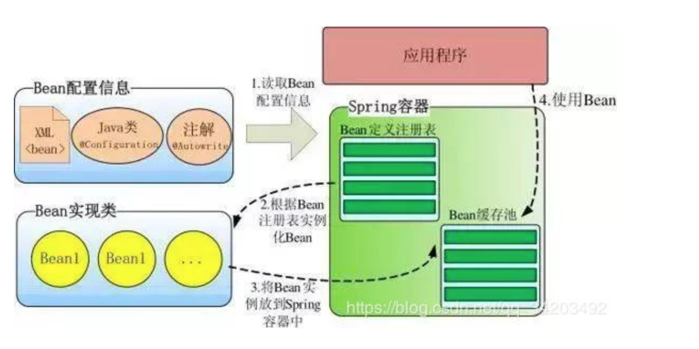

## Spring的IOC容器初始化流程

IOC容器：bean... newOrderServiceImpl()

HASHMAP对象： Map<String,Object> map = new HashMap<>;

Map.put(“orderServiceImpl”,new OrderServiceImpl())

IOC容器map.get(“orderServiceImpl”);

BeanFactory.getBean(“orderServiceImpl”) ----->map.get(“orderServiceImpl”);

Controller{

   OrderServiceImpl orderServiceImpl; //map.get(“orderServiceImpl”);

```
instanceWrapper = createBeanInstance(beanName, mbd, args);

1,Person person = new Person();
2,populateBean(beanName, mbd, instanceWrapper);
  Person.setName();
3,bean的初始化－－〉IOC  MAP

```



定位：这个过程最终会返回一个resoure类来代表bean定义的位置之类的信息；

加载：然后又一个reader类来根据这个位置信息读取bean的定义到内存；

注册：最后用一个map存储所有的bean名字和定义的映射关系