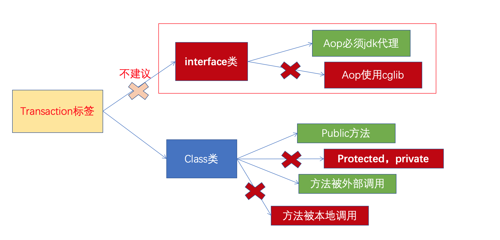
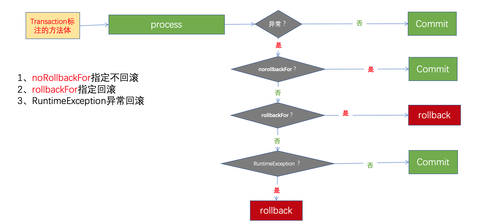

## Transaction注解

默认情况下，数据库处于自动提交模式。每条sql处于一个单独的事务中，成功则提交，失败则回滚。事务管理，就是将一组相关的sql放于一个事务中，因此必须关闭数据库的自动提交模式。

使用位置：

1、用在接口或接口方法上，*AOP必须是接口代理方式*。**不推荐* 

2、*可以使用在类以及类方法上。**推荐*

3、注解应该只被应用到* *public* *方法**上。其它级别（* **protected** ，***private***无效）*

4、只有来自外部的方法调用，事务才生效。（不**能由本地方法直接调用**）*

*回滚控制：*

1、默认配置下，方法体只有在抛出RuntimeException或其子类时，才回滚事务*。*

2、可以指定哪些异常回滚： @Transactional(rollbackFor=XxxException.class)

3、可以指定哪些异常不回滚： @Transactional(noRollbackFor=XxxException.class)

1. @Transaction注解写在什么位置？

   

   本地调用即this.xxx形式，这种事务也不能生效

2. 如何控制其回滚？

