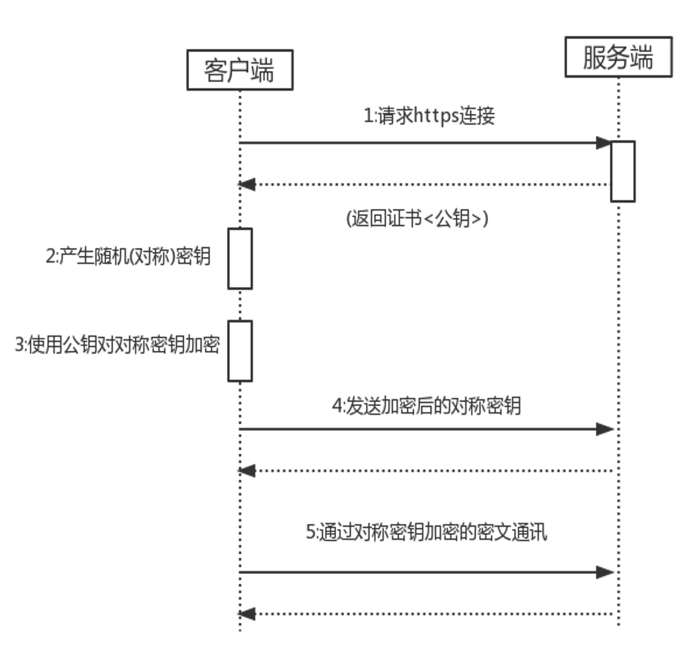

## Http与Https

主要在于**安全问题**

Http不安全：数据拦截、篡改、攻击

Https相对安全：数据加密、身份验证、数据完整性

> **对称加密**
>
> 对称加密就是一个密钥，可以加密也可以解密
>
> 
>
> 但是如果再网络传输过程中将密文也告诉对方，这样黑客同样可以破解

> **非对称加密**
>
> 非对称加密就是公钥加密的内容，必须用私钥才能解密，私钥加密的内容，必须用公钥才能解密
>
> 

**HTTPS比HTTP多出的S的事情**

1.请求https连接获取证书(公钥)

2.客户端给服务器发送（对称加密<公钥>）：随机数 的密文。

3.客户端同时给发服务发送：（对称加密<公钥>)：随机数+私钥 的密文

4.服务器根据公钥解密出随机数，同时解密出私钥.

5.客户端使用非对称加密进行数据传输，客户端使用公钥加密，服务器使用私钥解密



```
-> 客户端向服务端发送请求 
   -> 服务端返回数字证书 
	-> 客户端用自己的CA[主流的CA机构证书一般都内置在各个主流浏览器中]公钥去解密证书,如果证书有问题会提示风险 
	    -> 如果证书没问题客户端会生成一个对称加密的随机秘钥然后再和刚刚解密的服务器端的公钥对数据进行加密,然后发送给服务器端 
		  -> 服务器端收到以后会用自己的私钥对客户端发来的对称秘钥进行解密 
			-> 之后双方就拿着这个对称加密秘钥来进行正常的通信
```


### 密钥协商机制

即使有攻击者在偷窥你与服务器的网络传输，客户端（client）依然可以利用“密钥协商机制”与服务器端（server）协商出一个用来加密应用层数据的密钥（也称“会话密钥”）。

- RSA(非对称加密)：拿到公钥的一方先生成随机的会话密钥，然后利用公钥加密它；再把加密结果发给对方，对方用私钥解密；于是双方都得到了会话密钥。

  ```tex
  1. 客户端连上服务端
  2. 服务端发送 CA 证书给客户端
  3. 客户端验证该证书的可靠性 
  4. 客户端从 CA 证书中取出公钥
  5. 客户端生成一个随机密钥 k，并用这个公钥加密得到 k’
  6. 客户端把 k’ 发送给服务端
  7. 服务端收到 k’ 后用自己的私钥解密得到 k
  8. 此时双方都得到了密钥 k，协商完成。
  
  
  ◇如何防范偷窥（嗅探）
  攻击方式1
  攻击者虽然可以监视网络流量并拿到公钥，但是【无法】通过公钥推算出私钥（这点由 RSA 算法保证）
  
  攻击方式2
  攻击者虽然可以监视网络流量并拿到 k’，但是攻击者没有私钥，【无法解密】 k’，因此也就无法得到 k
  
  ◇如何防范篡改（假冒身份）
  攻击方式1
  如果攻击者在第2步篡改数据，伪造了证书，那么客户端在第3步会发现（这点由证书体系保证）
  
  攻击方式2
  如果攻击者在第6步篡改数据，伪造了k’，那么服务端收到假的k’之后，解密会失败（这点由 RSA 算法保证）。服务端就知道被攻击了。
  
  注：
  1、证书是否是信任的有效证书。所谓信任：浏览器内置了信任的根证书，就是看看web服务器的证书是不是这些信任根发的或者信任根的二级证书机构颁发的。所谓有效，就是看看web服务器证书是否在有效期，是否被吊销了。
  2、对方是不是上述证书的合法持有者。简单来说证明对方是否持有证书的对应私钥。验证方法两种，一种是对方签个名，我用证书验证签名；另外一种是用证书做个信封，看对方是否能解开。以上的所有验证，除了验证证书是否吊销需要和CA关联，其他都可以自己完成。验证正式是否吊销可以采用黑名单方式或者OCSP方式。黑名单就是定期从CA下载一个名单列表，里面有吊销的证书序列号，自己在本地比对一下就行。优点是效率高。缺点是不实时。OCSP是实时连接CA去验证，优点是实时，缺点是效率不高。
  3. 数字签名的制作过程：
  
  CA拥有非对称加密的私钥和公钥。
  CA对证书明文信息进行hash。
  对hash后的值用私钥加密，得到数字签名。
  明文和数字签名共同组成了数字证书，这样一份数字证书就可以颁发给网站了。
  那浏览器拿到服务器传来的数字证书后，如何验证它是不是真的？（有没有被篡改、掉包）
  
  浏览器验证过程：
  
  拿到证书，得到明文T，数字签名S。
  用CA机构的公钥对S解密（由于是浏览器信任的机构，所以浏览器保有它的公钥。详情见下文），得到S’。
  用证书里说明的hash算法对明文T进行hash得到T’。
  比较S’是否等于T’，等于则表明证书可信。
  
  ```

- 依靠专门的密钥算法:DH

  ```
  1. 客户端先连上服务端
  2. 服务端生成一个随机数 s 作为自己的私钥，然后根据算法参数计算出公钥 S（算法参数通常是固定的）
  3. 服务端使用某种签名算法把“算法参数（模数p，基数g）和服务端公钥S”作为一个整体进行签名
  4. 服务端把“算法参数（模数p，基数g）、服务端公钥S、签名”发送给客户端
  5. 客户端收到后验证签名是否有效
  6. 客户端生成一个随机数 c 作为自己的私钥，然后根据算法参数计算出公钥 C
  7. 客户端把 C 发送给服务端
  8. 客户端和服务端（根据上述 DH 算法）各自计算出 k 作为会话密钥
  
  ◇如何防范偷窥（嗅探）
  嗅探者可以通过监视网络传输，得到算法参数（模数p，基数g）以及双方的公钥，但是【无法】推算出双方的私钥，也【无法】推算出会话密钥（这是由 DH 算法在数学上保证的）
  ◇如何防范篡改（假冒身份）
  攻击方式1
  攻击者可以第4步篡改数据（修改算法参数或服务端公钥）。但因为这些信息已经进行过数字签名。篡改之后会被客户端发现。
  
  攻击方式2
  攻击者可以在第7步篡改客户端公钥。这步没有签名，服务端收到数据后不会发现被篡改。但是，攻击者篡改之后会导致“服务端与客户端生成的会话密钥【不一致】”。在后续的通讯步骤中会发现这点，并导致通讯终止。
  （下一篇讲具体协议的时候会提到：协议初始化/握手阶段的末尾，双方都会向对方发送一段“验证性的密文”，这段密文用各自的会话密钥进行【对称】加密，如果双方的会话密钥不一致，这一步就会失败，进而导致握手失败，连接终止）
  ```

  

- 通信双方事先共享的秘密：既然双方已经有共享的秘密（这个“秘密”可能已经是一个密钥，也可能只是某个密码/password），只需要根据某种生成算法，就可以让双方产生相同的密钥（并且密钥长度可以任意指定）(SRP、PSK)

  ```
  PSK:pre-shared key
  在通讯【之前】，通讯双方已经预先部署了若干个共享的密钥。
  为了标识多个密钥，给每一个密钥定义一个唯一的 ID
  协商的过程很简单：客户端把自己选好的密钥的 ID 告诉服务端。
  如果服务端在自己的密钥池子中找到这个 ID，就用对应的密钥与客户端通讯；否则就报错并中断连接。
  
  ◇如何防范偷窥（嗅探）
  使用这种算法，在协商密钥的过程中交换的是密钥的标识（ID）而【不是】密钥本身。
  就算攻击者监视了全过程，也无法知晓密钥啥。
  ◇如何防范篡改（假冒身份）
  PSK 可以单独使用，也可以搭配签名算法一起使用。
  对于单独使用
  如果攻击者篡改了协商过程中传送的密钥 ID，要么服务端发现 ID 无效（协商失败），要么服务端得到的 ID 与客户端不一致，在后续的通讯步骤中也会发现，并导致通讯终止。
  （下一篇讲具体协议的时候会提到：协议初始化/握手阶段的末尾，双方都会向对方发送一段“验证性的密文”，这段密文用各自的会话密钥进行【对称】加密，如果双方的会话密钥不一致，这一步就会失败，进而导致握手失败，连接终止）
  
  对于搭配签名算法
  如果攻击者篡改了协商过程中传送的密钥 ID，验证签名会失败
  ```

### HTTP1.0与1.1的区别

HTTP1.0最早在网页中使用是在1996年，那个时候只是使用一些较为简单的网页上和网络请求上，而HTTP1.1则在1999年才开始广泛应用于现在的各大浏览器网络请求中，同时HTTP1.1也是当前使用最为广泛的HTTP协议。 主要区别主要体现在：

1. **缓存处理**，在HTTP1.0中主要使用header里的If-Modified-Since,Expires来做为缓存判断的标准，HTTP1.1则引入了更多的缓存控制策略例如Entity tag，If-Unmodified-Since, If-Match, If-None-Match等更多可供选择的缓存头来控制缓存策略。
2. **带宽优化及网络连接的使用**，HTTP1.0中，存在一些浪费带宽的现象，例如客户端只是需要某个对象的一部分，而服务器却将整个对象送过来了，并且不支持断点续传功能，HTTP1.1则在请求头引入了range头域，它允许只请求资源的某个部分，即返回码是206（Partial Content），这样就方便了开发者自由的选择以便于充分利用带宽和连接。
3. **错误通知的管理**，在HTTP1.1中新增了24个错误状态响应码，如409（Conflict）表示请求的资源与资源的当前状态发生冲突；410（Gone）表示服务器上的某个资源被永久性的删除。
4. **Host头处理**，在HTTP1.0中认为每台服务器都绑定一个唯一的IP地址，因此，请求消息中的URL并没有传递主机名（hostname）。但随着虚拟主机技术的发展，在一台物理服务器上可以存在多个虚拟主机（Multi-homed Web Servers），并且它们共享一个IP地址。HTTP1.1的请求消息和响应消息都应支持Host头域，且请求消息中如果没有Host头域会报告一个错误（400 Bad Request）。
   5. **长连接**，HTTP 1.1支持长连接（PersistentConnection）和 请求的流水线（Pipelining）处理，在一个TCP连接上可以传送多个HTTP请求和响应，减少了建立和关闭连接的消耗和延迟，在HTTP1.1中默认开启Connection： keep-alive，一定程度上弥补了HTTP1.0每次请求都要创建连接的缺点。

### HTTP2.0与1.x区别

- **新的二进制格式**（Binary Format），HTTP1.x的解析是基于文本。基于文本协议的格式解析存在天然缺陷，文本的表现形式有多样性，要做到健壮性考虑的场景必然很多，二进制则不同，只认0和1的组合。基于这种考虑HTTP2.0的协议解析决定采用二进制格式，实现方便且健壮。

- **多路复用**（MultiPlexing），即连接共享，即每一个request都是是用作连接共享机制的。一个request对应一个id，这样一个连接上可以有多个request，每个连接的request可以随机的混杂在一起，接收方可以根据request的 id将request再归属到各自不同的服务端请求里面。

  > 建立一个TCP连接多个文件传输，并且不限制文件个数。实现了资源的并行传输。
  >
  > HTTP2.0多路复用有多好？**HTTP 性能优化的关键并不在于高带宽，而是低延迟。TCP 连接会随着时间进行自我「调谐」，起初会限制连接的最大速度，如果数据成功传输，会随着时间的推移提高传输的速度。这种调谐则被称为 TCP 慢启动。由于这种原因，让原本就具有突发性和短时性的 HTTP 连接变的十分低效。HTTP/2 通过让所有数据流共用同一个连接，可以更有效地使用 TCP 连接，让高带宽也能真正的服务于 HTTP 的性能提升。

- **header压缩**，如上文中所言，对前面提到过HTTP1.x的header带有大量信息，而且每次都要重复发送，HTTP2.0使用encoder来减少需要传输的header大小，通讯双方各自cache一份header fields表，既避免了重复header的传输，又减小了需要传输的大小。

  > HTTP 2.0使用了首部压缩技术，压缩算法使用HPACK。可让报头更紧凑，更快速传输。HPACK 协议，其中原理是哈夫曼编码及索引表（数据结构内容）。

- **服务端推送**（server push），同SPDY一样，HTTP2.0也具有server push功能。

  > 服务器推送到底是什么？服务端推送能把客户端所需要的资源伴随着index.html一起发送到客户端，省去了客户端重复请求的步骤。正因为没有发起请求，建立连接等操作，所以静态资源通过服务端推送的方式可以极大地提升速度。