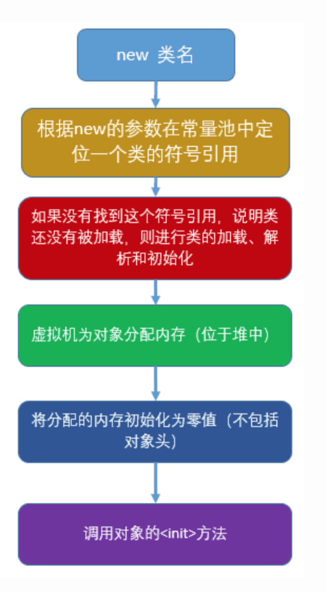
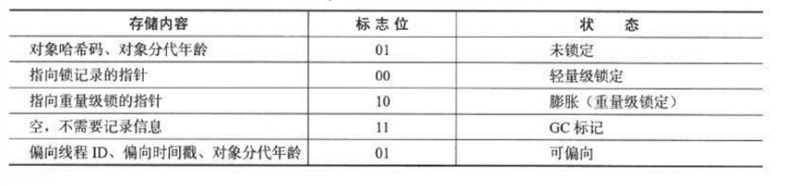
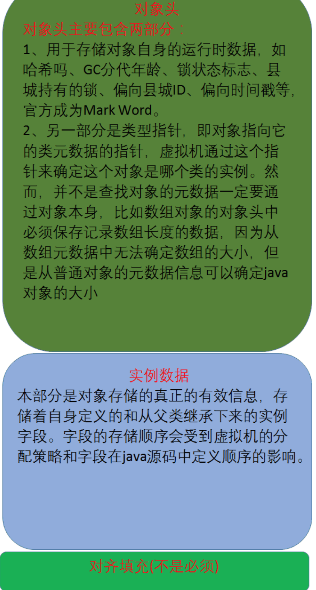
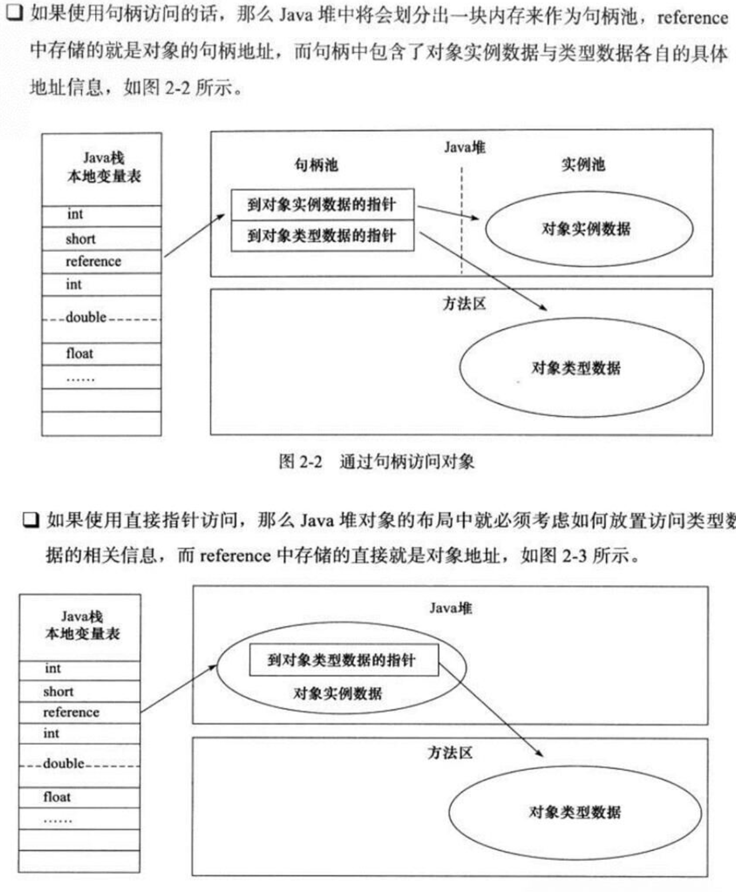

关于对象的创建过程一般是从new指令(我说的是JVM的层面)开始的(具体请看图1)，

​	JVM首先对符号引用进行解析，如果找不到对应的符号引用，那么这个类还没有被加载，因此JVM便会进行类加载过程。符号引用解析完毕之后，JVM会为对象在堆中分配内存，HotSpot虚拟机实现的JAVA对象包括三个部分：对象头、实例字段和对齐填充字段（具体内容请看图2）

​	其中要注意的是，实例字段包括自身定义的和从父类继承下来的（即使父类的实例字段被子类覆盖或者被private修饰，都照样为其分配内存）。相信很多人在刚接触面向对象语言时，总把继承看成简单的“复制”，这其实是完全错误的。JAVA中的继承仅仅是类之间的一种逻辑关系（具体如何保存记录这种逻辑关系，则设计到Class文件格式的知识，具体请看我的另一篇博文），唯有创建对象时的实例字段，可以简单的看成“复制”。

​	为对象分配完堆内存之后，JVM会将该内存（除了对象头区域）进行零值初始化，这也就解释了为什么JAVA的属性字段无需显示初始化就可以被使用，而方法的局部变量却必须要显示初始化后才可以访问。最后，JVM会调用对象的构造函数，当然，调用顺序会一直上溯到Object类。

  至此，一个对象就被创建完毕，此时，一般会有一个引用指向这个对象。在JAVA中，存在两种数据类型，一种就是诸如int、double等基本类型，另一种就是引用类型，比如类、接口、内部类、枚举类、数组类型的引用等。引用的实现方式一般有两种，具体请看图3。

​	此处说一句题外话，经常用人拿C++中的引用和JAVA的引用作对比，其实他们两个只是“名称”一样，本质并没什么关系，C++中的引用只是给现存变量起了一个别名(引用变量只是一个符号引用而已，编译器并不会给引用分配新的内存)，而JAVA中的引用变量却是真真正正的变量，具有自己的内存空间，只是不同的引用变量可以“指向”同一个对象而已。因此，如果要拿C++和JAVA引用对象的方式相对比，C++中的指针倒和JAVA中的引用如出一辙，毕竟，JAVA中的引用其实就是对指针的封装。