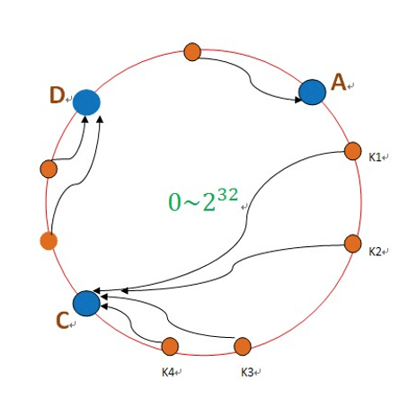

## 一致性HASH算法

比如像mongoDB的那种哈希分片方式

如果我增加了一台服务器，就需要对所有数据重新计算分片，需要遍历所有数据，代价很高

----

- Hash环

  一致性Hash算法是对2^32取模，对服务器确定此数据在环上的位置

- 数据存放

  数据进来后对2^32取模，得到一个值K1，在Hash环中顺时针找到服务器节点

**使用场景**

B服务器失效：如果是B失效了,将B的数据迁移至C即可，对于原本散列在A和D的数据，不需要做任何改变。

普通的一致性Hash有一个很致命的缺点就是无法保证C节点的负载均衡

所有提出了改进版一致性Hash，加入虚拟节点来进行控制

>使用**虚拟节点**（virtual nodes）。上面 md5 哈希表实际可以分为两段：
>
>1. 通过 md5 将 key 哈希出一个 32 位的 16 进制哈希值
>2. 将这个哈希值映射到某个物理节点
>
>当使用虚拟节点时，我们保持第一段不变，但会在第二段将哈希值映射到物理节点的过程中再插入一个虚拟节点中间件，从而将过程变为：
>
>1. 通过 md5 将 key 哈希出一个 32 位的 16 进制哈希值
>2. 将这个哈希值映射到一个虚拟节点
>3. 将这个虚拟节点映射到一个物理节点
>
>新哈希表的关键之处在于虚拟节点的数量比物理节点数多得多，甚至很多时候会将虚拟节点的数量设置为 “尽可能多”。这样新哈希表的前两段就固定不变了，当增删物理节点时，只是对虚拟节点进行必要的重新分配的过程。
>
>依 md5 值的首位划分了 16 个虚拟节点，然后将它们映射到 4 个物理节点。（实际应用中，即使你当下只有 10 个物理节点，也大可以按 md5 的前三位划分出 4096 个虚拟节点）当我们增加物理 “节点 5” 的时候，就从节点 1、2、3 处各拿一个虚拟节点放到 “节点 5” 中。这个过程，“节点 5” 既可以使用 100% 的网络带宽来接收数据；新的哈希表也实现了负载均衡。当然一致性也得到了保证。

**总结**

一致性hash算法（DHT）通过减少影响范围的方式解决了增减服务器导致的数据散列问题，从而解决了分布式环境下负载均衡问题。