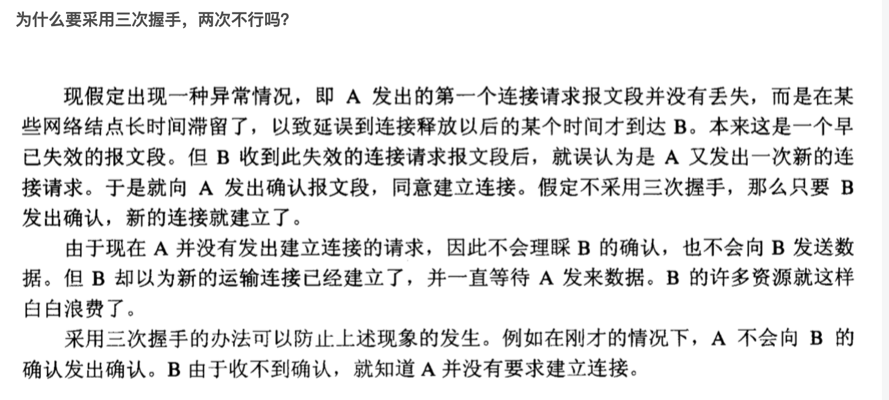

第一次握手：建立连接时，客户端发送syn包（syn=j）到服务器，并进入SYN_SENT状态，等待服务器确认；SYN：同步序列编号（Synchronize Sequence Numbers）。

第二次握手：服务器收到syn包，必须确认客户的SYN（ack=j+1），同时自己也发送一个SYN包（syn=k），即SYN+ACK包，此时服务器进入SYN_RECV状态；

第三次握手：客户端收到服务器的SYN+ACK包，向服务器发送确认包ACK(ack=k+1），此包发送完毕，客户端和服务器进入ESTABLISHED（TCP连接成功）状态，完成三次握手。

完成三次握手，客户端与服务器开始传送数据，在上述过程中，还有一些重要的概念：

未连接队列

在三次握手协议中，服务器维护一个未连接队列，该队列为每个客户端的SYN包（syn=j）开设一个条目，该条目表明服务器已收到SYN包，并向客户发出确认，正在等待客户的确认包。这些条目所标识的连接在服务器处于SYN_RECV状态，当服务器收到客户的确认包时，删除该条目，服务器进入ESTABLISHED状态。

 

关闭TCP连接：改进的三次握手

对于一个已经建立的连接，TCP使用改进的三次握手来释放连接（使用一个带有FIN附加标记的报文段）。TCP关闭连接的步骤如下：

第一步，当主机A的应用程序通知TCP数据已经发送完毕时，TCP向主机B发送一个带有FIN附加标记的报文段（FIN表示英文finish）。

第二步，主机B收到这个FIN报文段之后，并不立即用FIN报文段回复主机A，而是先向主机A发送一个确认序号ACK，同时通知自己相应的应用程序：对方要求关闭连接（先发送ACK的目的是为了防止在这段时间内，对方重传FIN报文段）。

第三步，主机B的应用程序告诉TCP：我要彻底的关闭连接，TCP向主机A送一个FIN报文段。

第四步，主机A收到这个FIN报文段后，向主机B发送一个ACK表示连接彻底释放。

为什么要采用三次握手，两次不行吗？

 

 

 

保活计时器：

设想有这样的情况：客户端已主动与服务器建立了TCP连接，但后来客户端的主机突然出现故障。

通常设为2小时。若2小时没有收到客户端的数据，服务器就发送一个探测报文段，以后则每隔75分钟发送一次。若一连发送10个探测报文段后仍无客户端的响应，服务器就认为客户端出现了故障，接着就关闭这个连接。

 

 

 

 

为什么连接的时候是三次握手，关闭的时候却是四次握手？

答：因为当Server端收到Client端的SYN连接请求报文后，可以直接发送SYN+ACK报文。其中ACK报文是用来应答的，SYN报文是用来同步的。但是关闭连接时，当Server端收到FIN报文时，很可能并不会立即关闭SOCKET，所以只能先回复一个ACK报文，告诉Client端，"你发的FIN报文我收到了"。只有等到我Server端所有的报文都发送完了，我才能发送FIN报文，因此不能一起发送。故需要四步握手。

 

为什么TIME_WAIT状态需要经过2MSL(最大报文段生存时间)才能返回到CLOSE状态？

答：虽然按道理，四个报文都发送完毕，我们可以直接进入CLOSE状态了，但是我们必须假象网络是不可靠的，有可以最后一个ACK丢失。所以TIME_WAIT状态就是用来重发可能丢失的ACK报文
