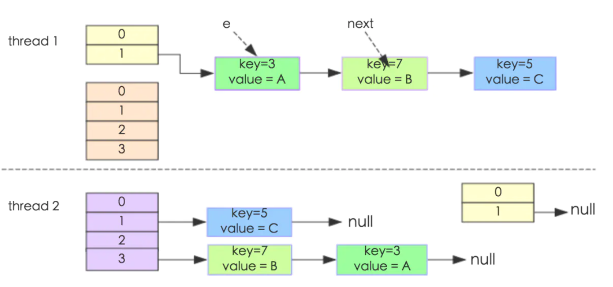

**为什么HashMap线程不安全**

1、put的时候导致的多线程数据不一致。
 这个问题比较好想象，比如有两个线程A和B，首先A希望插入一个key-value对到HashMap中，首先计算记录所要落到的桶的索引坐标，然后获取到该桶里面的链表头结点，此时线程A的时间片用完了，而此时线程B被调度得以执行，和线程A一样执行，只不过线程B成功将记录插到了桶里面，假设线程A插入的记录计算出来的桶索引和线程B要插入的记录计算出来的桶索引是一样的，那么当线程B成功插入之后，线程A再次被调度运行时，它依然持有过期的链表头但是它对此一无所知，以至于它认为它应该这样做，如此一来就覆盖了线程B插入的记录，这样线程B插入的记录就凭空消失了，造成了数据不一致的行为。

2、另外一个比较明显的线程不安全的问题是HashMap的get操作可能因为resize而引起死循环（cpu100%），具体分析如下：

下面的代码是resize的核心内容：


```java
void transfer(Entry[] newTable, boolean rehash) {  
        int newCapacity = newTable.length;  
        for (Entry<K,V> e : table) {  
  
            while(null != e) {  
                Entry<K,V> next = e.next;           
                if (rehash) {  
                    e.hash = null == e.key ? 0 : hash(e.key);  
                }  
                int i = indexFor(e.hash, newCapacity);   
                e.next = newTable[i];  
                newTable[i] = e;  
                e = next;  
            } 
        }  
    }  
```

这个方法的功能是将原来的记录重新计算在新桶的位置，然后迁移过去。



多线程HashMap的resize

我们假设有两个线程同时需要执行resize操作，我们原来的桶数量为2，记录数为3，需要resize桶到4，原来的记录分别为：[3,A],[7,B],[5,C]，在原来的map里面，我们发现这三个entry都落到了第二个桶里面。
 假设线程thread1执行到了transfer方法的Entry next = e.next这一句，然后时间片用完了，此时的e = [3,A], next = [7,B]。线程thread2被调度执行并且顺利完成了resize操作，需要注意的是，此时的[7,B]的next为[3,A]。此时线程thread1重新被调度运行，此时的thread1持有的引用是已经被thread2 resize之后的结果。线程thread1首先将[3,A]迁移到新的数组上，然后再处理[7,B]，而[7,B]被链接到了[3,A]的后面，处理完[7,B]之后，就需要处理[7,B]的next了啊，而通过thread2的resize之后，[7,B]的next变为了[3,A]，此时，[3,A]和[7,B]形成了环形链表，在get的时候，如果get的key的桶索引和[3,A]和[7,B]一样，那么就会陷入死循环。

如果在取链表的时候从头开始取（现在是从尾部开始取）的话，则可以保证节点之间的顺序，那样就不存在这样的问题了。

综合上面两点，可以说明HashMap是线程不安全的。