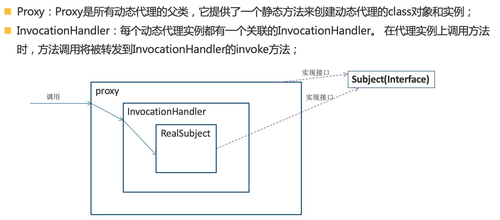
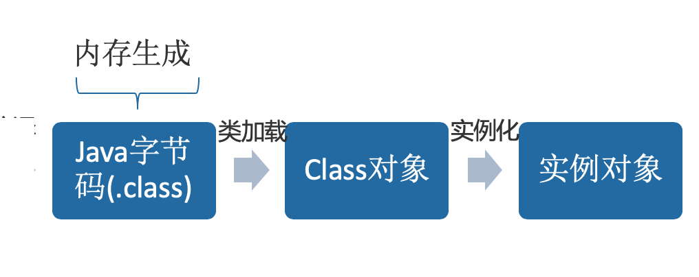
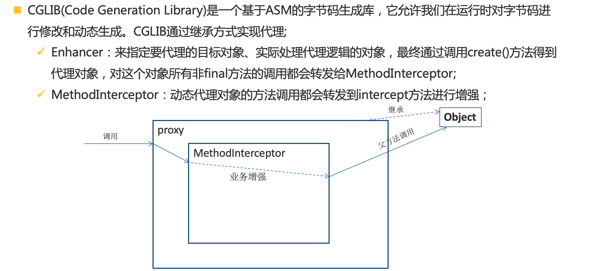

## 动态代理的几种实现方式

**动态代理：**使用反射和字节码的技术，在运行期创建指定接口或类的子类(动态代理)以及其实例对象的技术，通过这个技术可以无侵入性的为代码进行增强

转一个比较好的例子

> 微商代理，简单地说就是代替厂家卖商品，厂家“委托”代理为其销售商品。关于微商代理，首先我们从他们那里买东西时通常不知道背后的厂家究竟是谁，也就是说，“委托者”对我们来说是不可见的;其次，微商代理主要以朋友圈的人为目标客户，这就相当于为厂家做了一次对客户群体的“过滤”。我们把微商代理和厂家进一步抽象，前者可抽象为代理类，后者可抽象为委托类(被代理类)。
>
> 优点一：可以隐藏委托类的实现
>
> 优点二：可以实现客户与委托类间的解耦，在不修改委托类代码的情况下能够做一些额外的处理
>
> 通过静态代理实现我们的需求需要我们在每个方法中都添加相应的逻辑，这里只存在两个方法所以工作量还不算大，假如Sell接口中包含上百个方法呢?这时候使用静态代理就会编写许多冗余代码。通过使用动态代理，我们可以做一个“统一指示”，从而对所有代理类的方法进行统一处理，而不用逐一修改每个方法。(无侵入性增强过滤能力)
>
> https://juejin.im/post/5ad3e6b36fb9a028ba1fee6a

- JDK原生动态代理

  

  

  通过内存生成Java字节码(newProxyInstence)，然后直接创建对象，通过对象来实现增强(实现接口)

- CGLIB动态代理

  

  继承，调用父类方法

JDK原生动态代理是Java原生支持的，不需要任何外部依赖，但是它只能基于接口进行代理；

CGLIB通过继承的方式进行代理，无论目标对象有没有实现接口都可以代理，但是无法处理final的情况(加final子类不能去重写)