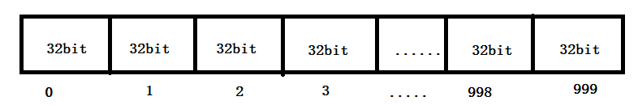
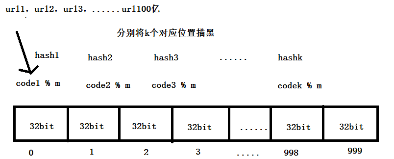
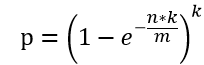

# 过滤100亿黑名单

## 题目

假设有100亿个URL的黑名单，每个URL最多占用64B，设计一个过滤系统，判断某条URL是否在黑名单里。

## 要求

不高于万分之一的判断失误率；额外内存不超过30GB

## 答案

不理想的是：

1.使用哈希表来查（要使用非常大的空间）

2.改进：使用哈希分流，然后将使用多个计算机处理（浪费机器，代价高）

 

理想的是使用**布隆过滤器**（一种集合，但是有**失误率**，不属于黑名单的url可能会被认为在黑名单中，误报）：

使用的是基本数据类型的数组

然后使用数组中的bit位

如 int 型 数据 4个字节，32bit，int [] array = new int[1000];可以表示**32\*1000**个位置

例：将某个位置描黑index：

1.这个bit位来自哪个整数：intIndex = index / 32

2.这个位置是这个整数的具体哪个bit：bitIndex = index % 32

3.描黑操作（找到相应的bit位）：array[intIndex] = (array[intIndex] | (1 << bitIndex)); 

 

 也可以用long类型的（64bit），

long [] array = new long[1000] 1000*64 个位置

long[][] array = new long[1000][1000] 1000*1000*64 个位置

 

每个url经过**k个哈希函数**（相互独立的），对应相应位置上描黑，所有黑名单中每个url都描黑之后，整个布隆过滤器的数组相应位置就被描黑了

**当检查url时，计算k个哈希函数的位置，当所有的位置都是黑的的情况下，就认为在过滤器中，否则就不在**

 

 

**样本量 n:100亿， 失误率 p：0.0001万分之一**

**1.需要开的空间大小m  大小为bit：**

**     m = 1,879,591,836,735 bit**

**其中n 为样本量，p为预期失误率**

 

**实际的字节 m / 8    \**1,879,591,836,735 bit\** \**/ 8 = 234948979591字节\****  ***\*=23.3G（向上取整） 内存\****

 

**2.哈希函数的个数k：**

**  k = 13 （向上取整）**

**注：m和k向上取整**

**3.根据m和k向上取整之后，真实的失误率：**

**  p=6/十万**

# 20亿个数中出现最多的数

## 问题

包含20亿个全是32位整数的大文件，在其中找出出现次数最多的数。

## 要求

内存限制：2GB

## 答案

将20亿个数用hash函数分成16个文件。然后统计每个小文件中，哪个数字出现次数最多。最后再比较每个小文件的次数最多的数。（本题分成16个也是根据题目来的。考虑最极端情况。20亿个数都不同）32位的整数要占4b,key占4b，value占4b。共8b。内存只有2G。所以大概每个小文件存2亿条。就需要10个小文件。但是hash函数必须2的n次方。所以2的4次方。16个

# 40亿个数找没出现的数

## 问题

有一个包含40亿个无符号整数的文件，最多使用1GB内存，找到所有没出现的数

## 分析

最差情况，40亿个数都不同，哈希表保存出现过的数，需要内存4B*40亿，大约16GB内存。

## 答案

使用bitmap，申请一个长度为4294967295bit类型的bitArray，每个位置只表示0或1，该数组占用空间约500MB。遍历这20亿个数，例如遇到7000，就将bitArray[7000]置1。遍历完成后，再依次遍历bitArray，哪个位置没有置1，哪个数就不在40亿个数中。

# 40亿个数找第一个没出现的数 。内存只有10M

## 答案

具体的，第一次遍历，申请长度64的整形数组countArr[0...63]，统计每个区间计数增加。例如，当前数是34225522090，34225522090/67108864=51，countArr[51]++。遍历完之后，必定有一个countArr[i]小于67108864，表示i区间内至少有一个数没出现过。此时countArr[]使用的内存是64*4B。

假设在37区间有一个数没出现，申请一个长度为67108864的bitmap，内存大约8MB，记为bitArr[0~67108863]。再一次遍历40亿个数，只关心37区间的数，记为num。将bitAry[num-67108864*37]的值置位1。遍历完之后，bitArr必然有没有置1的位置，记为i，则67108864*37+i就是没出现过的数。

# 找出100亿个重复URL以及搜索词汇topK问题

## 问题

有一个包含100亿URL的大文件，每个URL占64B，找出重复URL；补充，找出top100搜索词汇

## 常规答案

1. 大文件通过哈希函数分配到不同机器
2. 哈希函数将大文件拆分成小文件。

对于每一个小文件，利用哈希表遍历，找出重复的URL，或者分给机器或拆分文件完之后，进行排序，看是否有重复的URL。

补充问题的思路也是通过哈希函数分流，对于每个小文件，简历词频哈希表，建一个大小为100的小根堆，选出每个小文件的top100.每个小文件的top100进行外排序或者接着使用小根堆，就能得到100亿数据的top100.

# 出现两次的数以及中位数问题

## 问题

有40亿个无符号32位整数，最多可以使用1GB内存，找出所有出现了两次的数；补充问题，最多使用10MB内存，找到40亿个数的中位数

## 答案

第一个问题可以用bitmap做，申请长度为2?232bit的bitArr，2个bit表示一个数出现的词频。遍历40亿个数，假设出现num，将bitArr[2*num]和bitArr[2*num+1]设置为01，第二次出现，设置为10，第三次，设置为11。以后再遇到11的，就不做处理。遍历完成后，再遍历一次，若发现bitArr[2*num]和bitArr[2*num+1]是10，则num是出现了两次的数。

第二个问题，分区间讨论。长度为2MB的unsigned int数组占用8MB，将区间数目定位232/2M，取整为2148个区间，第0区间0~2M-1，第i区间2M*i~2M*（i+1）-1

申请一个长度为2148的unsigned int整数数组arr[0..2147],arr[i]表示i区间有多少个数，arr占用内存小于10MB。遍历40亿个数，当前数num为num，落在区间(num/2M)，对应arr[num/2M]++。累加统计每个区间的累计数目，就能找到40亿个数的中位数。例如0~K-1区间数目个数为19.998亿，加上第K个区间就超过了20亿，说要中位数一定在K区间中，并且一定是第K区间的第0.002亿个数。

接着申请长度2M的unsigned int数组countArr[0..2M-1]，占用8MB。遍历40亿个数，只关心第K区间的数numi，countArr[numi-K*2M]++。统计完之后在第K区间找地0.002亿个数字即可。

# 一致性哈希

分布式数据库集群缓存，例如memcached，将数据的id通过哈希函数转换为key，假设有N个机器，计算key%N，得到及其所属编号，增删改查都在这台机器上。一致性哈希能在机器扩容（N发生变化），使得不用重新计算一遍key%N

三台机器处于哈希环，id通过哈希映射为key，在哈希环中顺时针找距离最近的机器。

机器较少的时候可能会出现负载不均衡，如图所示：

## 答案

引入虚拟节点，增加结点数