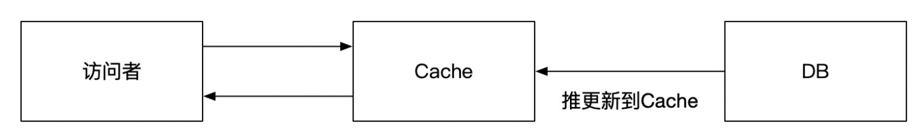
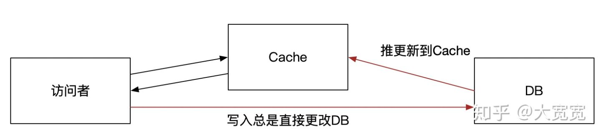

这实际上是个“如果要做的足够精致是非常难的“问题。缓存失效被称为计算机科学里最难的两个问题之一（另外一个是起名字）。

先对本题一致性做个说明。这里的不一致是指：假如一个数据访问者同时读取Redis和DB，他能在一段时间里发现二者不一样。

不错，如果一份数据放在DB，然后copy到Redis，然后改DB，那么Redis是不会自己魔幻般同步变更的。必须有某种机制告诉Redis该变了。这些机制包括（但不仅仅限于）：

\1. Redis里的数据不立刻更新，等redis里数据自然过期。然后去DB里取，顺带重新set redis。这种用法被称作“Cache Aside”。好处是代码比较简单，坏处是会有一段时间DB和Redis里的数据不一致。这个不一致的时间取决于redis里数据设定的有效期，比如10min。但如果Redis里数据没设置有效期，这招就不灵了。

\2. 更新DB时总是不直接触碰DB，而是通过代码。而代码做的显式更新DB，然后马上del掉redis里的数据。在下次取数据时，模式就恢复到了上一条说的方式。这也算是一种Cache Aside的变体。这要做的好处是，数据的一致性会比较好，一般正常情况下，数据不一致的时间会在1s以下，对于绝大部分的场景是足够了。但是有极少几率，由于更新时序，下Redis数据会和DB不一致（这个有文章解释，这里不展开）。

Cache Aside，就是“Cache”在DB访问的主流程上帮个忙

**1和2的做法常规上被称为“Cache“**。而且因为1有更新不及时的问题，2有极端情况下数据会不一致的问题，所以常规Cache代码会把1+2组合起来，要求Redis里的数据必须有过期时间，并且不能太长，这样即便是不一致也能混过去。同时如果是主动对数据进行更新，Cache的数据更新也会比较及时。

并且2并不一定总是行得通。比如OLTP的服务在前面是Cache+DB的模式，而数据是由后台管理系统来更新的，总是不会触碰OLTP服务，更不会动Cache。这时将Redis看作是存储也算是一种方案。就是：

\3. Redis里的数据总是不过期，但是有个背景更新任务（“定时执行的代码” 或者 “被队列驱动的代码）读取db，把最新的数据塞给Redis。**这种做法将Redis看作是“存储”。**访问者不知道背后的实际数据源，只知道Redis是唯一可以取的数据的地方。当实际数据源更新时，背景更新任务来将数据更新到Redis。这时还是会存在Redis和实际数据源不一致的问题。如果是定时任务，最长的不一致时长就是更新任务的执行间隔；如果是用类似于队列的方式来更新，那么不一致时间取决于队列产生和消费的延迟。常用的队列（或等价物）有Redis（怎么还是Redis），Kafka，AMQ，RMQ，binglog，log文件，阿里的canal等。

Cache当作“存储”来用，访问者只看得到Cache

这种做法还有一种变体Write Through，写入时直接写DB，DB把数据更新Cache，而读取时读Cache。

Write Through + Cache当存储

**以上方式无论如何都会有一段时间Redis和DB会不一致**。实践上，这个不一致时间短则几十ms，长可以到几十分钟。**这种程度的一致性对于很多业务场景都已经足够了。**很多时候，用户无法区分自己读取的是Redis还是DB，只能读取到其中的一个。这时数据看起来直觉上是没问题的就可以接受了。只要不出现，用户先看见了数据是A，然后看到数据是B，之后一刷新，又看到A的尴尬场景就行了。（这也可以部份解释为啥用经常使用共享式的Cache而不是本地Cache方案）。

但对于有些业务，比如协作文档编辑，电商秒杀的扣库存，银行转账等，以上的做法就不够用了。解决办法也有两大类。第一种是不要用Redis，只用DB。或者更直接点说是“只要一个单点的数据源”。这样肯定就没有一致性问题，代价就是CAP中因为CP被满足，因此A被牺牲掉。这就是为啥银行一系统升级就要停服务的原因。

> 当然实际上也有CAP兼顾，但是C要的强一点，A就得弱一点，但不至于完全牺牲掉的做法。这里不展开。

另外一种保证一致性的做法就是用某种分布式协议一致性来做，大致可以归结到

1. SAGA或者TCC - 这两种需要业务代码的大量配合。通过业务代码来补偿一致性。
2. 2PC, 3PC - 现实当中有XA协议。比如Ehcache是支持XA协议的。但是性能表现不佳，运维也麻烦，我比较少见到实际这么干的。
3. 基于Paxos或者Raft的分布式锁，然后对Redis和DB进行双写，但是除非客户端和服务器么次都去访问分布式锁，也会有一点点不一致的问题。这实际上相当于将多个地方的一致性控制交给了分布式锁的集中维护。

这些做法实施复杂度和运维复杂度太高，以至于对于像Redis + DB这种场景基本上没人这么干。本质上大家用Redis一般也就是想做个Cache而已。这些方案通常被用到比如多数据中心数据一致性维护的系统中。

综上，除了单点DB存储之外的方案，其一致性面临的窘境是

- 要么，接受“最终一致”，但到底多久之后一致，不一致时表现怎么样，有很多种做法。分布式一致性有各种各样的模型，比如线性一致性、顺序一致性等。他们都是在“不一致”和“强一致”之间提供某种折衷。这些折衷大量应用于我们常见的诸多业务之中、如社交、IM、电商不触及钱的地方等
- 要么，要求必须强一致。那么在分布式条件下就要牺牲A。比如访问一个Cache，Cache知道自己的数据不是最新的，就要和DB去Sync，Sync的过程中DB的数据还不能改。期间访问者要不收到一个错误“数据不同步，不能访问”，要不就卡在那里等着同步完成。个人以为，这还不如干脆就不要Cache，在维护强一致的同时，用其他方式来优化访问性能。

最最后提醒下，本文有很多不严谨的地方，包括对Cache的形式总结其实只有典型的几种，实际可能的要多得多；再比如对一致性的介绍也非常粗浅，原因是为了让初学者有一点点概念，能看得进去（就这样，已经很长了，评论区里也有人表示接受不了）。