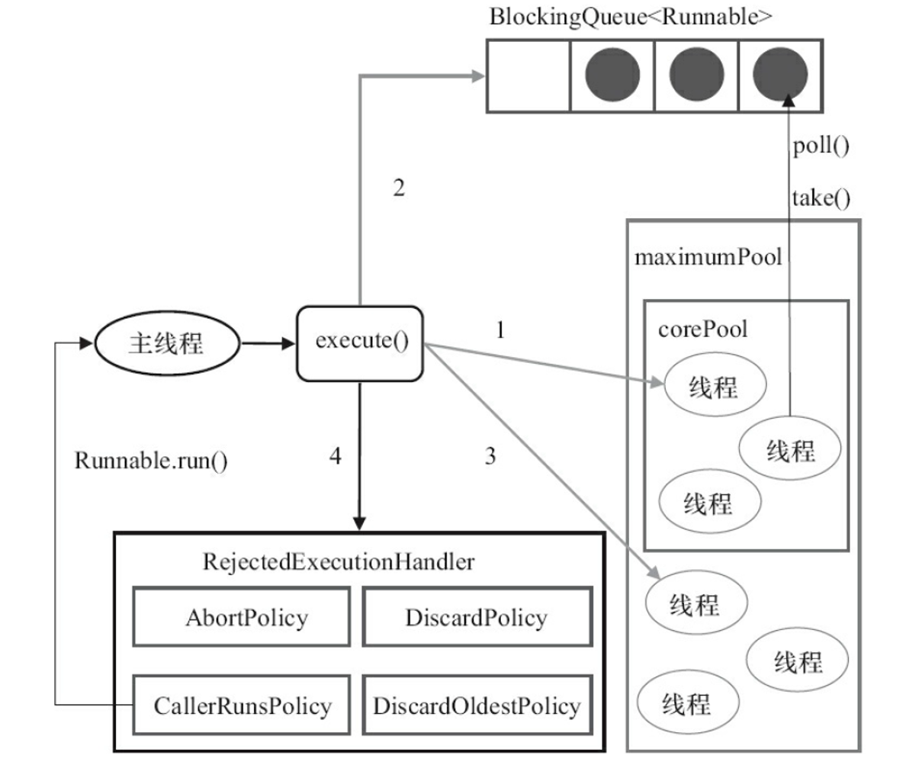

## 按线程池内部实现，当提交新任务时线程池是如何处理的

**为什么要用线程池**

1. 降低资源消耗(创建销毁耗费)
2. 提高响应速度(线程执行任务的时间包括：T1 创建线程时间 T2 线程中执行任务的时间 T3 销毁线程时间，相当于没有T1 T3)
3. 

- 线程池的创建

  - 各个参数含义(ThreadPoolExecutor.java)

    int corePoolSize(线程池的最小数量)

    int maximumPoolSize(线程池允许的最大线程数)

    long keepAliveTime(线程空闲的存活时间)

    TimeUnit unit(存活时间的时间单位)

    BlockingQueue<Runnable> workQueue(存放提交的任务，将来执行线程)

    ThreadFactory threadFactory(设置具有识别度的线程)

    handler(处理错误信息)

- 提交任务

用更少的线程做更多的任务