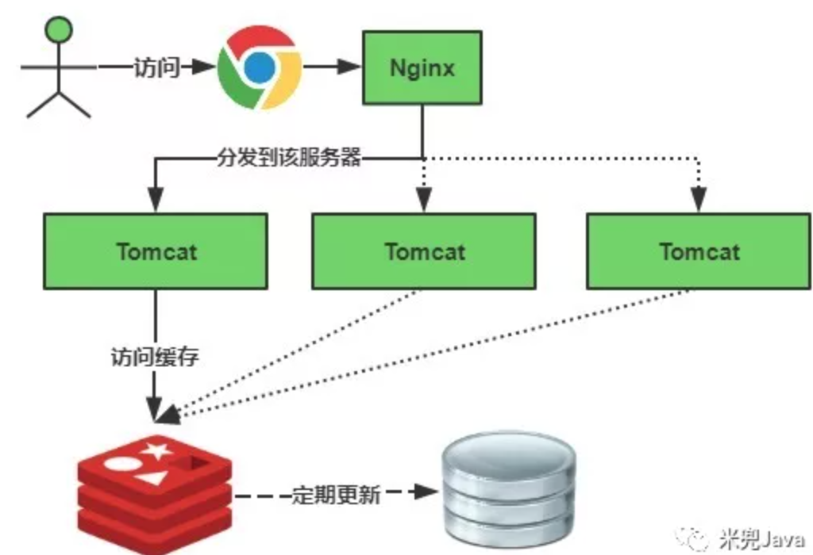
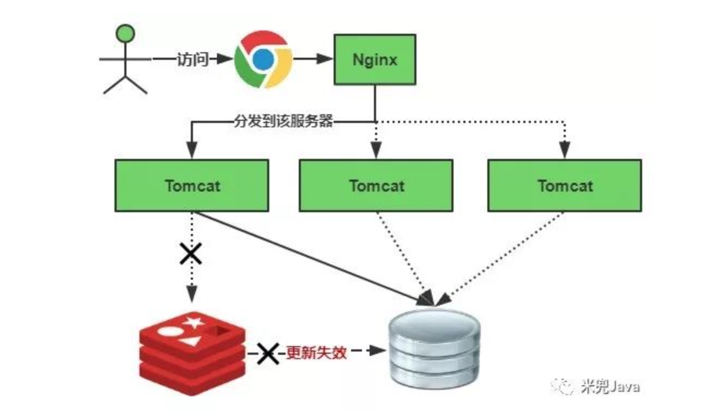

根据缓存的存储情况可以分为：集中式缓存，本地缓存，分布式缓存。

集中式缓存：所有的缓存都统一在一个地方管理。

优点：数据集中容易管理，一致性好，实时性好，只要修改一处地方可以立即看到效果。

缺点：集中式缓存通常都存放在系统的外部，高并发请求下带宽很容易成为瓶颈。

优化：减少不必要的数据，只存储真正需要的数据。对放进缓存的数据进行压缩，取出来之后再进行解压。目的都是为了减少数据传输对带完的占用。

本地缓存：又叫localCache，每个应用的本地都留着一份完整的缓存副本。

优点：性能好，相对于集中式缓存不需要访问外部并且没有带宽的压力。

缺点：数据分散，不容易管理。数据一致性差，多个副本之间数据同步有延时。

优化：必须给本地缓存加上一个过期失效时间，并且建立一套相对实时数据更新机制，保证副本的数据能够有效及时更新。

分布式缓存：以集群的方式搭建缓存，比如redis集群。

优点：高性能，支持动态扩展，支持高可用

分布式缓存集群都是以分片的形式数据分散到多台机器上面去存储，分片的形式有客户端分片(memcahed),服务端分片(redis),分片用的hash算法通常采用一致性hash。这一块涉及的内容比较多，有时间的话后面打算专门独立讨论。

### 二、初认识

- 缓存穿透：key对应的数据在数据源并不存在，每次针对此key的请求从缓存获取不到，请求都会到数据源，从而可能压垮数据源。比如用一个不存在的用户id获取用户信息，不论缓存还是数据库都没有，若黑客利用此漏洞进行攻击可能压垮数据库。
- 缓存击穿：key对应的数据存在，但在redis中过期，此时若有大量并发请求过来，这些请求发现缓存过期一般都会从后端DB加载数据并回设到缓存，这个时候大并发的请求可能会瞬间把后端DB压垮。
- 缓存雪崩：当缓存服务器重启或者大量缓存集中在某一个时间段失效，这样在失效的时候，也会给后端系统(比如DB)带来很大压力。

### 三、缓存穿透解决方案

一个一定不存在缓存及查询不到的数据，由于缓存是不命中时被动写的，并且出于容错考虑，如果从存储层查不到数据则不写入缓存，这将导致这个不存在的数据每次请求都要到存储层去查询，失去了缓存的意义。

**有很多种方法可以有效地解决缓存穿透问题**，**最常见**的则是采用布隆过滤器，将所有可能存在的数据哈希到一个足够大的bitmap中，一个一定不存在的数据会被 这个bitmap拦截掉，从而避免了对底层存储系统的查询压力。**另外也有一个**更为简单粗暴的方法（我们采用的就是这种），如果一个查询返回的数据为空（不管是数据不存在，还是系统故障），我们仍然把这个空结果进行缓存，但它的过期时间会很短，最长不超过五分钟。

**粗暴方式伪代码：**

```text
//伪代码
public object GetProductListNew() {
    int cacheTime = 30;
    String cacheKey = "product_list";

    String cacheValue = CacheHelper.Get(cacheKey);
    if (cacheValue != null) {
        return cacheValue;
    }

    cacheValue = CacheHelper.Get(cacheKey);
    if (cacheValue != null) {
        return cacheValue;
    } else {
        //数据库查询不到，为空
        cacheValue = GetProductListFromDB();
        if (cacheValue == null) {
            //如果发现为空，设置个默认值，也缓存起来
            cacheValue = string.Empty;
        }
        CacheHelper.Add(cacheKey, cacheValue, cacheTime);
        return cacheValue;
    }
}
```

### 四、缓存击穿解决方案

key可能会在某些时间点被超高并发地访问，是一种非常“热点”的数据。这个时候，需要考虑一个问题：缓存被“击穿”的问题。

**使用互斥锁(mutex key)**

业界比较常用的做法，是使用mutex。简单地来说，就是在缓存失效的时候（判断拿出来的值为空），不是立即去load db，而是先使用缓存工具的某些带成功操作返回值的操作（比如Redis的SETNX或者Memcache的ADD）去set一个mutex key，当操作返回成功时，再进行load db的操作并回设缓存；否则，就重试整个get缓存的方法。

SETNX，是「SET if Not eXists」的缩写，也就是只有不存在的时候才设置，可以利用它来实现锁的效果。

```text
public String get(key) {
      String value = redis.get(key);
      if (value == null) { //代表缓存值过期
          //设置3min的超时，防止del操作失败的时候，下次缓存过期一直不能load db
      if (redis.setnx(key_mutex, 1, 3 * 60) == 1) {  //代表设置成功
               value = db.get(key);
                      redis.set(key, value, expire_secs);
                      redis.del(key_mutex);
              } else {  //这个时候代表同时候的其他线程已经load db并回设到缓存了，这时候重试获取缓存值即可
                      sleep(50);
                      get(key);  //重试
              }
          } else {
              return value;      
          }
 }
```

memcache代码：

```text
if (memcache.get(key) == null) {  
    // 3 min timeout to avoid mutex holder crash  
    if (memcache.add(key_mutex, 3 * 60 * 1000) == true) {  
        value = db.get(key);  
        memcache.set(key, value);  
        memcache.delete(key_mutex);  
    } else {  
        sleep(50);  
        retry();  
    }  
}
```

**其它方案：待各位补充。**

## 五、缓存雪崩解决方案

与缓存击穿的区别在于这里针对很多key缓存，前者则是某一个key。

缓存正常从Redis中获取，示意图如下：




缓存失效瞬间示意图如下：




缓存失效时的雪崩效应对底层系统的冲击非常可怕！大多数系统设计者考虑用加锁或者队列的方式保证来保证不会有大量的线程对数据库一次性进行读写，从而避免失效时大量的并发请求落到底层存储系统上。还有一个简单方案就时讲缓存失效时间分散开，比如我们可以在原有的失效时间基础上增加一个随机值，比如1-5分钟随机，这样每一个缓存的过期时间的重复率就会降低，就很难引发集体失效的事件。

**加锁排队，伪代码如下：**

```text
//伪代码
public object GetProductListNew() {
    int cacheTime = 30;
    String cacheKey = "product_list";
    String lockKey = cacheKey;

    String cacheValue = CacheHelper.get(cacheKey);
    if (cacheValue != null) {
        return cacheValue;
    } else {
        synchronized(lockKey) {
            cacheValue = CacheHelper.get(cacheKey);
            if (cacheValue != null) {
                return cacheValue;
            } else {
              //这里一般是sql查询数据
                cacheValue = GetProductListFromDB(); 
                CacheHelper.Add(cacheKey, cacheValue, cacheTime);
            }
        }
        return cacheValue;
    }
}
```

加锁排队只是为了减轻数据库的压力，并没有提高系统吞吐量。假设在高并发下，缓存重建期间key是锁着的，这是过来1000个请求999个都在阻塞的。同样会导致用户等待超时，这是个治标不治本的方法！

注意：加锁排队的解决方式分布式环境的并发问题，有可能还要解决分布式锁的问题；线程还会被阻塞，用户体验很差！因此，在真正的高并发场景下很少使用！

**随机值伪代码：**

```text
//伪代码
public object GetProductListNew() {
    int cacheTime = 30;
    String cacheKey = "product_list";
    //缓存标记
    String cacheSign = cacheKey + "_sign";

    String sign = CacheHelper.Get(cacheSign);
    //获取缓存值
    String cacheValue = CacheHelper.Get(cacheKey);
    if (sign != null) {
        return cacheValue; //未过期，直接返回
    } else {
        CacheHelper.Add(cacheSign, "1", cacheTime);
        ThreadPool.QueueUserWorkItem((arg) -> {
      //这里一般是 sql查询数据
            cacheValue = GetProductListFromDB(); 
          //日期设缓存时间的2倍，用于脏读
          CacheHelper.Add(cacheKey, cacheValue, cacheTime * 2);                 
        });
        return cacheValue;
    }
} 
```

**解释说明：**

- 缓存标记：记录缓存数据是否过期，如果过期会触发通知另外的线程在后台去更新实际key的缓存；
- 缓存数据：它的过期时间比缓存标记的时间延长1倍，例：标记缓存时间30分钟，数据缓存设置为60分钟。这样，当缓存标记key过期后，实际缓存还能把旧数据返回给调用端，直到另外的线程在后台更新完成后，才会返回新缓存。

关于缓存崩溃的解决方法，这里提出了三种方案：使用锁或队列、设置过期标志更新缓存、为key设置不同的缓存失效时间，还有一种被称为“二级缓存”的解决方法。