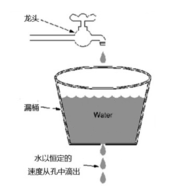
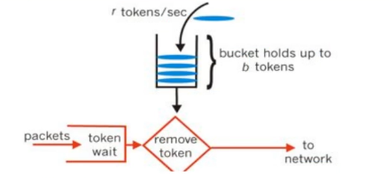

## 如何做限流策略，令牌桶和漏斗算法的使用场景

A---请求<限流>-->B接口(1000/s)

**漏斗算法**

请求先进入漏斗，以一定的速度出水，当水请求大，会溢出，能强行限制调用的速度

声明一个队列用来保存请求，这个队列相当于漏斗，当队列容量满了之后就放弃新来的请求，然后重新声明一个线程定期从任务队列中获取一个或者多个任务进行执行(cl.throttle)

**令牌桶算法**

拿不到令牌就会拒绝

突发流量的令牌保证

令牌桶算法会以恒定的速度往令牌池放令牌，当池子中没有令牌时，拒绝服务

