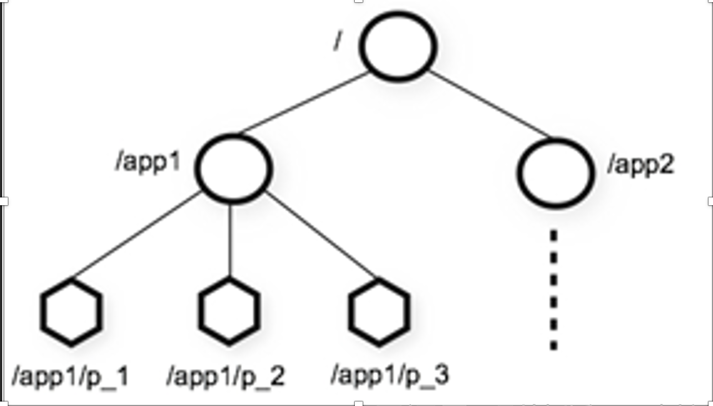
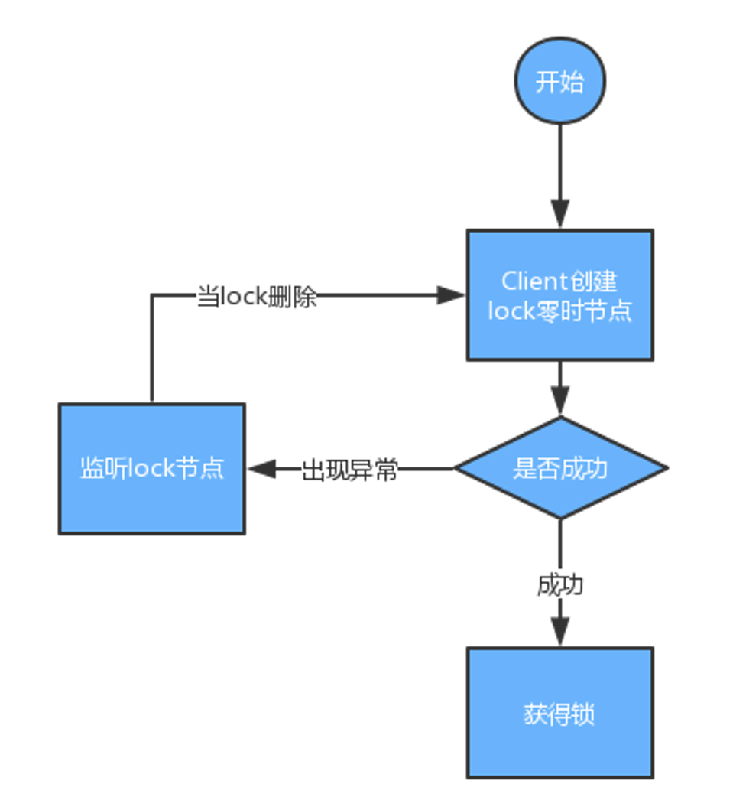
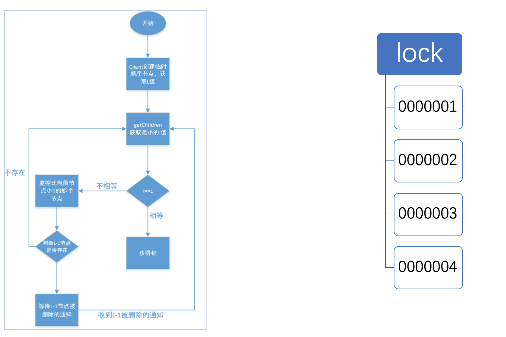

## 高并发下保证安全修改同一行数据

题意就是高并发下数据线程安全的问题

解决线程安全：

- JVM

  加synchronized同步方式解决

  lock方式解决

  （JVM锁解决不了分布式环境多任务对共享资源竞争的协同操作问题，分布式多线程多进程）

- 分布式环境

  分布式锁

  - 数据库

    性能差，SQL超时

    **方法1：**创建一张锁表，然后通过操作表中数据实现。要锁住某方法或资源的时候，就在表中增加一条记录，想释放锁的时候就删除这条记录(对字段进行唯一性约束)

    1、这把锁依赖数据库的可用性，数据库是一个单点，一旦数据库挂掉，会导致业务系统不可用。
    2、这把锁没有失效时间，一旦解决操作失败，就会导致记录一直在数据库中，其他线程无法在获得锁。
    3、这把锁只能是非阻塞的，因为数据的insert操作，一旦插入失败就会直接报错。没有获得锁的线程并不会进入排队队列，要想再次获得锁就要再次触发获得锁的操作。
    4、这把锁是非重入的，同一个线程在没有释放锁之前无法再次获得该锁。因为数据库表中数据已经存在了。

    **方法2：**在查询语句后面增加for update，数据库会在查询过程中给数据库表增加排他锁，当某条记录被加上排他锁之后，其他线程无法在该行记录增加排他锁。其他没有获取到的锁就会阻塞在select语句上，从而有两种可能的结果：在超时之前获取到了锁和在超时之前没有获取到锁。获得排他锁的线程即可获取分布式锁，当获取到锁之后，可以执行方法的业务逻辑，执行完方法之后，释放锁connection.commit()。存在的问题主要是性能不高和sql超时的异常。

  - redis

    采用jedis.setnx()和jedis.expire()组合实现加锁。setnx()方法作用就是SET IF NOT EXIST，expire方法就是给锁加一个过期时间。由于这是两条Redis命令，不具有原子性，如果程序在执行完setnx()之后突然崩溃，导致锁没有设置过期时间。那么就会发生死锁。

  - zookeeper

    每个客户端对某个方法加锁时，在Zookeeper上与该方法对应的指定节点的目录下，生成一个唯一的瞬时有序节点。

    - 判断是否获取锁的方式只需要判断有序节点中的序号最小的一个。当释放锁的时候，只需将这个瞬时节点删除即可。同时，其可以避免服务宕机导致的锁无法释放，而产生的死锁问题(如果用lua控制原子性，中途出错不会回滚，并且可能会有性能问题)。

    Zookeeper数据结构类似Linux，每个节点都有值

    

    **Zookeeper在底层提供了两个功能**

    - 管理(存储，读取)用户程序提交的数据
    - 并为用户程序提供数据节点监听服务(触发器)

    **Zookeeper节点类型**

    - **PERSISTENT-持久化目录节点**

        客户端与zookeeper断开连接后，该节点依旧存在 

    - **PERSISTENT_SEQUENTIAL-持久化顺序编号目录节点** 

        客户端与zookeeper断开连接后，该节点依旧存在，只是  Zookeeper给该节点名称 进行顺序编号 

    - **EPHEMERAL-临时目录节点** 

      客户端与zookeeper断开连接后，该节点被删除 

    - **EPHEMERAL_SEQUENTIAL-临时顺序编号目录节点**

      客户端与zookeeper断开连接后，该节点被删除，只是Zookeeper给该节点名称进行顺序编号 

    方法一：使用异常方式处理，创建不带序号的节点(零时节点)

    

    方法二：Zookeeper相互监听（性能高(只监听前面一个)，占用资源(每个线程连接上的时候都会产生一个新节点)，零时且带序号）

    

