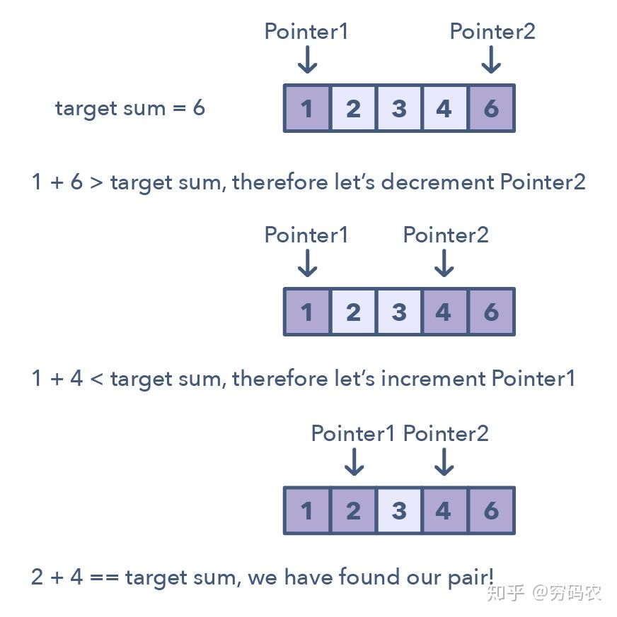
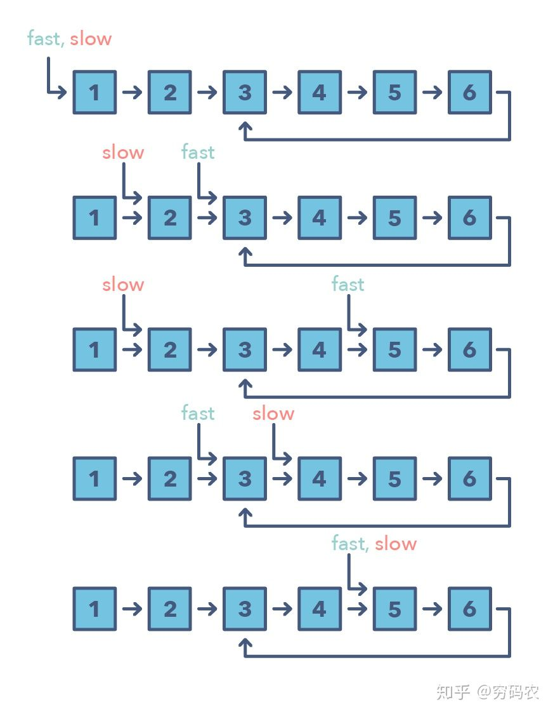
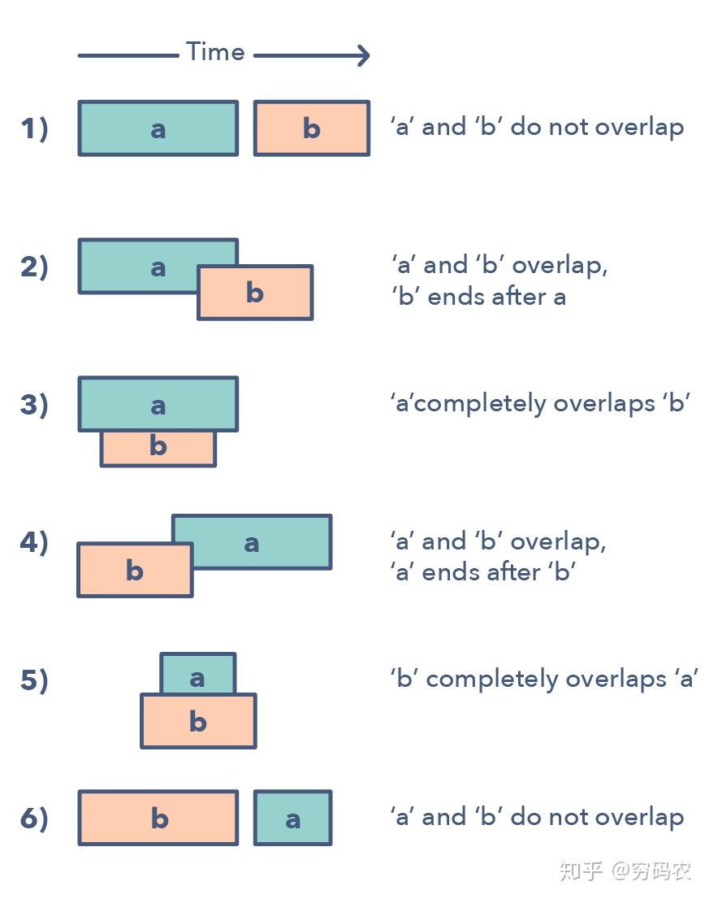
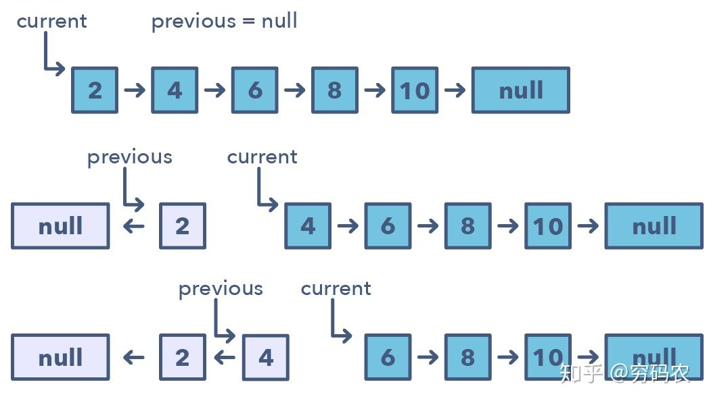

1. Pattern: Sliding window，滑动窗口类型

经典题目：

Maximum Sum Subarray of Size K (easy)

Smallest Subarray with a given sum (easy)

Longest Substring with K Distinct Characters (medium)

Fruits into Baskets (medium)

No-repeat Substring (hard)

Longest Substring with Same Letters after Replacement (hard)

Longest Subarray with Ones after Replacement (hard)

2. Pattern: two points, 双指针类型

双指针是这样的模式：
两个指针朝着左右方向移动（双指针分为同向双指针和异向双指针），直到他们有一个或是两个都满足某种条件。
双指针通常用在排好序的数组或是链表中寻找对子。比如，你需要去比较数组中每个元素和其他元素的关系时，你就需要用到双指针了。

我们需要双指针的原因是：如果你只用一个指针的话，你得来回跑才能在数组中找到你需要的答案。
这一个指针来来回回的过程就很耗时和浪费空间了 — 这是考虑算法的复杂度分析的时候的重要概念。虽然brute force一个指针的解法可能会奏效，但时间复杂度一般会是O(n²)。在很多情况下，双指针能帮助我们找到空间或是时间复杂度更低的解。

识别双指针：
- 一般来说，数组或是链表是排好序的，你得在里头找一些组合满足某种限制条件
- 这种组合可能是一对数，三个数，或是一个子数组

经典题目：

Pair with Target Sum (easy)

Remove Duplicates (easy)

Squaring a Sorted Array (easy)

Triplet Sum to Zero (medium)

Triplet Sum Close to Target (medium)

Triplets with Smaller Sum (medium)

Subarrays with Product Less than a Target (medium)

Dutch National Flag Problem (medium)

3. Pattern: Fast & Slow pointers, 快慢指针类型

<b>这种模式，有一个非常出门的名字，叫龟兔赛跑。</b>咱们肯定都知道龟兔赛跑啦。但还是再解释一下快慢指针：这种算法的两个指针的在数组上（或是链表上，序列上）的移动速度不一样。还别说，<b>这种方法在解决有环的链表和数组时特别有用</b>。

通过控制指针不同的移动速度（比如在环形链表上），这种算法证明了他们肯定会相遇的。快的一个指针肯定会追上慢的一个（可以想象成跑道上面跑得快的人套圈跑得慢的人）。

咋知道需要用快慢指针模式勒？
- 问题需要处理环上的问题，比如环形链表和环形数组 
- 当你需要知道链表的长度或是某个特别位置的信息的时候 

那啥时候用快慢指针而不是上面的双指针呢？ 
有些情形下，咱们不应该用双指针，比如我们在单链表上不能往回移动的时候。一个典型的需要用到快慢指针的模式的是当你需要去判断一个链表是否是回文的时候。

经典题目：

LinkedList Cycle (easy)

Start of LinkedList Cycle (medium)

Happy Number (medium)

Middle of the LinkedList (easy)

4. Pattern: Merge Intervals，区间合并类型

区间合并模式是一个用来处理有区间重叠的很高效的技术。在设计到区间的很多问题中，通常咱们需要要么判断是否有重叠，要么合并区间，如果他们重叠的话。这个模式是这么起作用的： 给两个区间，一个是a，另外一个是b。别小看就两个区间，他们之间的关系能跑出来6种情况。详细的就看图啦。

理解和识别这六种情况，灰常重要。因为这能帮你解决一大堆问题。
这些问题从插入区间到优化区间合并都有。

怎么识别啥时候用合并区间模式呀？ 
- 当你需要产生一堆相互之间没有交集的区间的时候
- 当你听到重叠区间的时候

经典题目：

Merge Intervals (medium)

Insert Interval (medium)

Intervals Intersection (medium)

Conflicting Appointments (medium)

5. Pattern: Cyclic Sort，循环排序

这种模式讲述的是一直很好玩的方法：可以用来处理数组中的数值限定在一定的区间的问题。这种模式一个个遍历数组中的元素，如果当前这个数它不在其应该在的位置的话，咱们就把它和它应该在的那个位置上的数交换一下。你可以尝试将该数放到其正确的位置上，但这复杂度就会是O(n^2)。这样的话，可能就不是最优解了。因此循环排序的优势就体现出来了。

咋鉴别这种模式？
- 这些问题一般设计到排序好的数组，而且数值一般满足于一定的区间
- 如果问题让你需要在排好序/翻转过的数组中，寻找丢失的/重复的/最小的元素

经典题目：

Cyclic Sort (easy)

Find the Missing Number (easy)

Find all Missing Numbers (easy)

Find the Duplicate Number (easy)

Find all Duplicate Numbers (easy)

6. Pattern: In-place Reversal of a LinkedList，链表翻转

在众多问题中，题目可能需要你去翻转链表中某一段的节点。通常，要求都是你得原地翻转，就是重复使用这些已经建好的节点，而不使用额外的空间。这个时候，原地翻转模式就要发挥威力了。
这种模式每次就翻转一个节点。一般需要用到多个变量，一个变量指向头结点（下图中的current），另外一个（previous）则指向咱们刚刚处理完的那个节点。在这种固定步长的方式下，你需要先将当前节点（current）指向前一个节点（previous），再移动到下一个。同时，你需要将previous总是更新到你刚刚新鲜处理完的节点，以保证正确性。

咱们怎么去甄别这种模式呢？
- 如果你被问到需要去翻转链表，要求不能使用额外空间的时候

经典题目：

Reverse a LinkedList (easy)

Reverse a Sub-list (medium)

Reverse every K-element Sub-list (medium)

7. Pattern: Tree Breadth First Search，树上的BFS
经典题目：

Binary Tree Level Order Traversal (easy)

Reverse Level Order Traversal (easy)

Zigzag Traversal (medium)

Level Averages in a Binary Tree (easy)

Minimum Depth of a Binary Tree (easy)

Level Order Successor (easy)

Connect Level Order Siblings (medium)

8. Pattern: Tree Depth First Search，树上的DFS
经典题目：

Binary Tree Path Sum (easy)

All Paths for a Sum (medium)

Sum of Path Numbers (medium)

Path With Given Sequence (medium)

Count Paths for a Sum (medium)

9. Pattern: Two Heaps，双堆类型
经典题目：

Find the Median of a Number Stream (medium)

Sliding Window Median (hard)

Maximize Capital (hard)

10. Pattern: Subsets，子集类型，一般都是使用多重DFS
经典题目：

Subsets (easy)

Subsets With Duplicates (easy)

Permutations (medium)

String Permutations by changing case (medium)

Balanced Parentheses (hard)

Unique Generalized Abbreviations (hard)

11. Pattern: Modified Binary Search，改造过的二分
经典题目：

Order-agnostic Binary Search (easy)

Ceiling of a Number (medium)

Next Letter (medium)

Number Range (medium)

Search in a Sorted Infinite Array (medium)

Minimum Difference Element (medium)

Bitonic Array Maximum (easy)

12. Pattern: Top ‘K’ Elements，前K个系列
经典题目：

Top ‘K’ Numbers (easy)

Kth Smallest Number (easy)

‘K’ Closest Points to the Origin (easy)

Connect Ropes (easy)

Top ‘K’ Frequent Numbers (medium)

Frequency Sort (medium)

Kth Largest Number in a Stream (medium)

‘K’ Closest Numbers (medium)

Maximum Distinct Elements (medium)

Sum of Elements (medium)

Rearrange String (hard)

13. Pattern: K-way merge，多路归并
经典题目：

Merge K Sorted Lists (medium)

Kth Smallest Number in M Sorted Lists (Medium)

Kth Smallest Number in a Sorted Matrix (Hard)

Smallest Number Range (Hard)

14. Pattern: 0/1 Knapsack (Dynamic Programming)，0/1背包类型
经典题目：

0/1 Knapsack (medium)

Equal Subset Sum Partition (medium)

Subset Sum (medium)

Minimum Subset Sum Difference (hard)

15. Pattern: Topological Sort (Graph)，拓扑排序类型
经典题目：

Topological Sort (medium)

Tasks Scheduling (medium)

Tasks Scheduling Order (medium)

All Tasks Scheduling Orders (hard)

Alien Dictionary (hard)