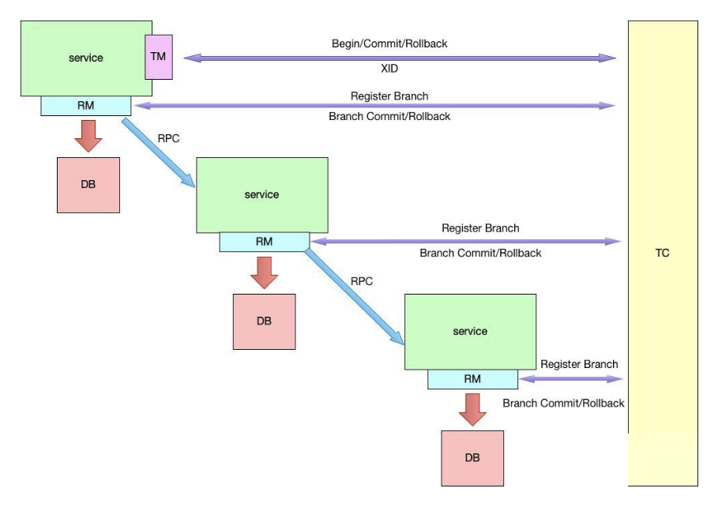
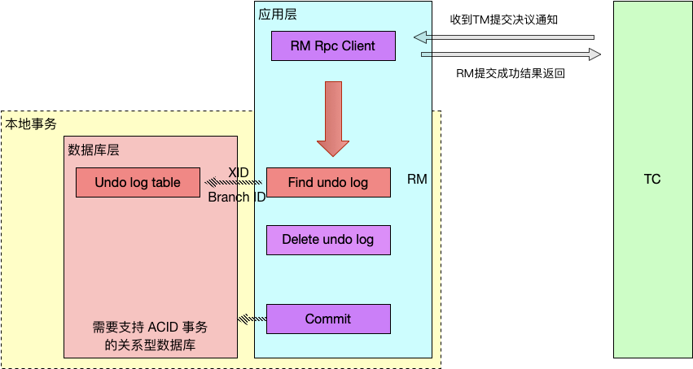
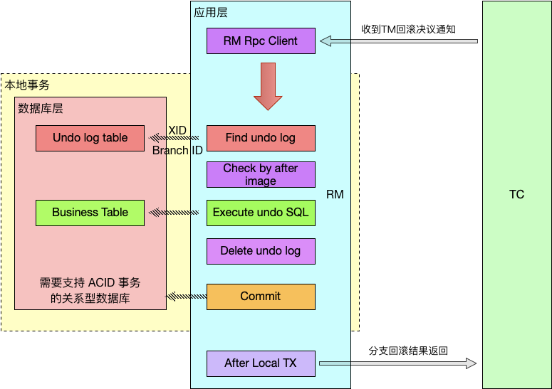

为了解决这个问题，就出来了很多业务层面的实现二阶段的提交方案，如：很出名的 TCC 方案，基于 TCC 也有很多成熟的框架，如 ByteTCC、tcc-transaction。

另一种就是最终一致性的方案，如：rocketmq事务消息。

但上面的**TCC方案、或者最终一致性方案都会涉及到业务代码的改造，对业务有侵入。**

下面我们来介绍一下今天的主角。

**Seata**

Seata的分布式事务解决方案是**业务层面的解决方案**，业务层上无需关心分布式事务机制的约束，它将给我们的微服务架构带来质的提升，只依赖于**单台数据库的事务**能力。

Seata 的设计思路是将一个分布式事务可以理解成一个全局事务，下面挂了若干个分支事务，而一个分支事务是一个满足 ACID 的本地事务，因此我们可以操作分布式事务像操作本地事务一样。

Seata 内部定义了 3个模块来处理全局事务和分支事务的关系和处理过程，这三个组件分别是：

1、Transaction Coordinator (TC)：事务协调器，维护全局事务的运行状态，负责协调并驱动全局事务的提交或回滚。

2、Transaction Manager (TM)：控制全局事务的边界，负责开启一个全局事务，并最终发起全局提交或全局回滚的决议。

3、Resource Manager (RM)：控制分支事务，负责分支注册、状态汇报，并接收事务协调器的指令，驱动分支（本地）事务的提交和回滚。

其中，TM是一个分布式事务的发起者和终结者，TC负责维护分布式事务的运行状态，而RM则负责本地事务的运行。如下图所示：



下面是一个分布式事务在Seata中的执行流程：

1）TM 向 TC 申请开启一个全局事务，全局事务创建成功并生成一个全局唯一的 XID。

2）XID 在微服务调用链路的上下文中传播。

3）RM 向 TC 注册分支事务，接着执行这个分支事务并提交（重点：RM在第一阶段就已经执行了本地事务的提交/回滚），最后将执行结果汇报给TC。

4）TM 根据 TC 中所有的分支事务的执行情况，发起全局提交或回滚决议。

5）TC 调度 XID 下管辖的全部分支事务完成提交或回滚请求。

**分支事务为什么能直接提交？**

Seata能够在第一阶段直接提交事务，是因为Seata框架为每一个RM维护了一张UNDO_LOG表（这张表需要客户端自行创建），其中保存了每一次本地事务的回滚数据。因此，二阶段的回滚并不依赖于本地数据库事务的回滚，而是RM直接读取这张UNDO_LOG表，并将数据库中的数据更新为UNDO_LOG中存储的历史数据。

如果第二阶段是提交命令，那么RM事实上并不会对数据进行提交（因为一阶段已经提交了），而实发起一个异步请求删除UNDO_LOG中关于本事务的记录。

原理就是先保存之前的老数据，一旦出现异常，就是把老数据再更新回去。

**Seata执行流程**

下面是一个Seata中一个分布式事务执行的详细过程：

1）首先TM 向 TC 申请开启一个全局事务，**全局事务创建成功并生成一个全局唯一的 XID。**

2）**XID 在微服务调用链路的上下文中传播**。

3）RM 开始执行这个分支事务，RM首先解析这条SQL语句，生成对应的UNDO_LOG记录。下面是一条UNDO_LOG中的记录：

```
{    "branchId": 641789253,    "undoItems": [{        "afterImage": {            "rows": [{                "fields": [{                    "name": "id",                    "type": 4,                    "value": 1                }, {                    "name": "name",                    "type": 12,                    "value": "GTS"                }, {                    "name": "since",                    "type": 12,                    "value": "2014"                }]            }],            "tableName": "product"        },        "beforeImage": {            "rows": [{                "fields": [{                    "name": "id",                    "type": 4,                    "value": 1                }, {                    "name": "name",                    "type": 12,                    "value": "TXC"                }, {                    "name": "since",                    "type": 12,                    "value": "2014"                }]            }],            "tableName": "product"        },        "sqlType": "UPDATE"    }],    "xid": "xid:xxx"}
```

可以看到，UNDO_LOG表中记录了分支ID，全局事务ID，以及事务执行的redo和undo数据以供二阶段恢复。

4）RM**在同一个本地事务中执行业务SQL和UNDO_LOG数据的插入**。在提交这个本地事务前，RM会**向TC申请关于这条记录的全局锁。**如果申请不到，则说明有**其他事务也在对这条记录进行操作**，因此它会在一段时间内重试，**重试失败则回滚本地事务，**并向TC汇报本地事务执行失败。如下图所示：


5）RM在事务提交前，申请到了**相关记录的全局锁**，因此直接提交本地事务，并向TC汇报本地事务执行成功。此时**全局锁并没有释放**，全局锁的释放取决于二阶段是提交命令还是回滚命令。

6）TC根据所有的分支事务执行结果，向RM下发提交或回滚命令。

7）**RM如果收到TC的提交命令，首先立即释放相关记录的全局锁**，然后把提交请求放入一个异步任务的队列中，马上返回提交成功的结果给 TC。异步队列中的提交请求真正执行时，只是删除相应UNDO LOG 记录而已。



8）**RM如果收到TC的回滚命令，则会开启一个本地事务**，通过 XID 和 Branch ID 查找到相应的 UNDO LOG 记录。**将 UNDO LOG 中的后镜与当前数据进行比较**：

**如果有不同**，说明数据被当前全局事务之外的动作做了修改。这种情况，需要根据配置策略来做处理。

**否则**，根据 UNDO LOG 中的前镜像和业务 SQL 的相关信息生成并执行回滚的语句并执行，然后提交本地事务达到回滚的目的。

**最后释放相关记录的全局锁。**



**方案补充**

上面的方案是Seata的默认模式，称为**AT模式**，它是类似于 XA 方案的两段式提交方案，并且是对业务无侵入，**但是这种机制依然是需要依赖数据库本地事务的 ACID 特性**。

小伙伴们有没有发现，整个流程的基础必须是支持 ACID 特性的关系型数据库，那么问题就来了，**非关系型或者不支持 ACID 的数据库就无法使用 Seata 了？**

Seata 现阶段为我们准备了另外一种模式，叫 **MT 模式**，它是一种对业务有入侵的方案，提交回滚等操作需要我们自行定义，业务逻辑需要被分解为 Prepare/Commit/Rollback 3 部分，形成一个 MT 分支，加入全局事务，其本质就是TCC方案。

不过MT模式，它不是 Seata “主打”的模式，它的存在仅仅作为补充的方案，从以上官方的发展远景就可以看出来，Seata 的目标是始终是对业务无入侵的方案。

