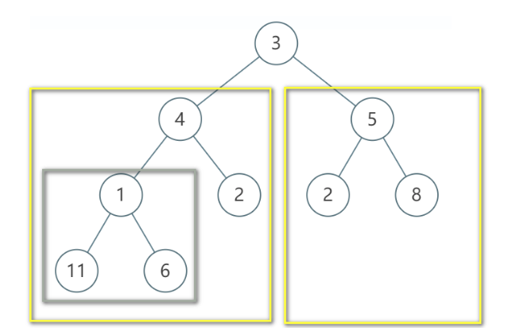

**题目描述**
输入两棵二叉树A, B,判断B是不是A的子结构。（ps：我们约定空树不是任意一个树的子结构）

**题解**
第一次做这种题时思路不清晰，并且对于子结构和子树概念混淆

反正树一般都是递归,还是对于递归的思维方式不是很掌握

基本就是遍历，然后找结构相同的进行比较

这里转载一个题解

-----
**子树**
一棵大树 A，一棵小树 B，若 B 是 A 的子树，则：

B 和 A 的结点值完全相同，它们俩的左子树、右子树所有结点的值也完全相同
或者 B 的左孩子和 A 的结点值完全相同，它们俩的左子树、右子树所有结点的值也完全相同
或者 B 的右孩子和 A 的结点值完全相同，它们俩的左子树、右子树所有结点的值也完全相同



理解后可以写代码了，如果子树先达到 null ，那么一定是其子树

那么，判断 root2 是否是 root1 的子树如下：

```
public class IsSubTree {
    public boolean HasSubtree(TreeNode root1, TreeNode root2) {
        if (root1 == null || root2 == null) {
            return false;
        }
        return judgeSubTree(root1, root2) ||
               judgeSubTree(root1.left, root2) ||
               judgeSubTree(root1.right, root2);
    }
 
    private boolean judgeSubTree(TreeNode root1, TreeNode root2) {
        if (root2 == null) {
            return true;
        }
        if (root1 == null) {
            return false;
        }
        if (root1.val != root2.val) {
            return false;
        }
        return judgeSubTree(root1.left, root2.left) &&
               judgeSubTree(root1.right, root2.right);
    }
}
```
**子结构**
子结构就是不用那么严格，图中的小框就是整棵树的子结构，图中的黄色大框也是整棵树的子结构，所以只要找到符合树的一部分树结点即可

那么，则有以下代码：
```
public class Solution {
    public boolean HasSubtree(TreeNode root1, TreeNode root2) {
        if (root1 == null || root2 == null) {
            return false;
        }
        return judgeSubTree(root1, root2) ||
               judgeSubTree(root1.left, root2) ||
               judgeSubTree(root1.right, root2);
    }

    private boolean judgeSubTree(TreeNode root1, TreeNode root2) {
        if (root2 == null) {
            return true;
        }
        if (root1 == null) {
            return false;
        }
        if (root1.val != root2.val) {
            return judgeSubTree(root1.left, root2) ||
                   judgeSubTree(root1.right, root2);
        }
        return judgeSubTree(root1.left, root2.left) &&
               judgeSubTree(root1.right, root2.right);
    }
}
```
可以看到，子结构的判断就是 “没那么严格” 了，和判断子树的写法就是一行代码不同而已，值不想等的时候不直接返回 false，继续往树的右结点和左结点找，找的一个相等值的结点就好，但如果你一旦找到了结点值是相等的，那么久要保证这两个数的结点值要一一对应上了！
----
